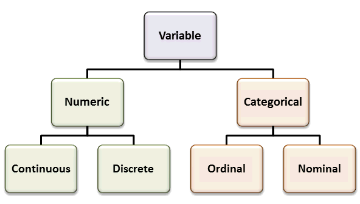

# Exploratory Data Analysis 


## Shot Logs Basketball Data 
We load a data set (originally downloaded from kaggle.com) which has every shot taken during the 2014-2015 NBA season. This can be done by giving the commands:

```{r readdata, warning=FALSE, message=FALSE}
library(HannayIntroStats)
data("shot_logs_2014")
```
We can see what the columns of the data frame are using the colnames command:
```{r exploredata, warning=FALSE, message=FALSE}
colnames(shot_logs_2014)
```
We can access each of these columns using ```shot_logs_2014$COL_NAME```, for example ```shot_logs_2014$TOUCH_TIME``` gives the data for how long each player had the ball before taking the shot. 

You can also look-up the help page for that data set using the command:

```{r eval=FALSE}
?shot_logs_2014
```


## Principal Types of Statistical Data

Data comes into two principle types in statistics, and it is crucial that we recognize the differences between these two types of data.

1. **Categorical Variables**: These are data points that take on a finite number of values, *AND* whose values do not have a numerical interpretation. For example, "Male" or "Female", the position of an NBA player, the species of a toad, the color of a mushroom, etc. Each of these examples take on a finite number of possibilities, and it doesn't make sense to add the colors or mushrooms, the species of toads, etc. Many times these variables will have non-numerical names, however this is *NOT* the way to tell. For example, smoker versus non-smoker could be encoded in our data as S versus NS, or it could be 1 versus 0. The context of the data is the only sure way to tell whether a variable is categorical or not. Categorical variables may be divided into two sub-groups called ordinal and nominal variables:

    + **Ordinal categorical variable** takes on values which can be logically ordered. For example, the reviews for an product which are given as 0-5 stars. We can say that 4 stars is closer to 5 stars then 1 star is. Academic grades A,B,C,D,F provide another example of ordinal categorical variables. 

    + **Nominal categorical variables** cannot be put in any logical order. Examples of this would be the gender, toad species, race, etc. 

2. **Numerical Variables**: These are variables which are numerical in nature, so adding them together makes mathematical sense. They can come in two principle subcategories, either discrete or continuous. 

    + **Continious Variables**: Take on a continious values (no breaks). For example, height, weight, reaction time for a chemical reaction, profits from a stock transaction, etc are examples of continuous numerical variables. 
    
    + **Discrete numerical variables** take on a set of values which can be counted. For example, goals scored by a soccer team, assists in a game for an NBA player, number of leaves on a spinach plant, etc. 

Here is a handy flow chart to help you keep these variable types straight:


```{r addVariablesDiagram, echo=FALSE}

```


We will develop different statistical approaches based on whether the data are numerical (discrete/continuous) or categorical in nature. `R` knows about this important distinction and we can let `R` know that a variable should be treated as a categorical variable by using the command `as.factor`. 

```{r}
shot_logs_2014$W=as.factor(shot_logs_2014$W) ##make sure that the wins column is treated as a categorical variable (factor)
class(shot_logs_2014$W) ##check the type of data stored in this column
levels(shot_logs_2014$W) ##give the options for a categorical variable
```

The `levels` command tells us how many different categories are in the categorical variable. 

#### Exercises

```{exercise}
Consider the PTS_TYPE column of the shot logs data set. Should this be considered a continuous or categorical variable? 
```

```{exercise}
How many levels does the Location variable have? What are they? Is this variable ordinal or nominal?
```

```{exercise}
What type of variable is the SHOT_CLOCK variable in the shot logs data set?
```

```{exercise}
How many shots are in the data set for away games? (Practice Filtering data sets in R)
```


## The Distribution of a Data Set


The most crucial step to exploratory data analysis is estimating the **distribution** of a variable. We begin with continuous variables and the histogram plot. 

#### Histograms (Continuous Variables)

First let us consider the distance measurements for every shot taken during the NBA season. This is over 128,000 distance measurements so just staring at these numbers won't give us much insight into the data. 

We may be interested in the number of shots which are taken from a given distance. If we define bins for our data then we can count the number of shots between say 12-15 feet and compare this with the number in the other bins. This is called a histogram of the data. Luckily R has a built-in function for this. 
```{r morley}
hist(shot_logs_2014$SHOT_DIST, freq=TRUE, main="Distances of NBA Shots 2015", xlab='Distance (ft)', ylab='Number of Shots', col="light blue")
```

The histogram tells us that nba players tend to either try to shoot from very close to the basket or from 3-pt shots. In fact we can compute that ```r length(shot_logs_2014$SHOT_DIST[shot_logs_2014$PTS_TYPE==3])/length(shot_logs_2014$SHOT_DIST)*100```% of the shots taken were 3pt shots and ```r length(shot_logs_2014$SHOT_DIST[shot_logs_2014$SHOT_CLOCK<=12.0])/length(shot_logs_2014$SHOT_DIST)*100```% were taken from less than 12 feet. 


Notice that histograms can be very sensitive to the number of bins that you use. By default R will choose the number to bins used to be somewhat appropriate. However lets see what happens if we choose only a few bins for our histogram. 
```{r}
hist(shot_logs_2014$SHOT_DIST, freq=TRUE, breaks=3, main="Distances of NBA Shots 2015 (bad bins)", xlab='Distance (ft)', ylab='Number of Shots', col='cyan')
```

The conclusions for our data is entirely different! With these large bins it looks like NBA players just try and get as close as possible to the basket.

```{block2, type='fallacy'}
Always question the bin sizes for a histogram to see whether they are appropriate for the plot being presented. If you see a histogram with illogically large or small bin sizes and/or uneven bin sizes beware of the results being presented! 
```

For the purposes of this class you can usually just use the default number of bins in R, unless you have some special reason to change the number of bins. 


From our data we can also pull out individual players shot-chart for the 2015 season. For example, Steph Curry's distribution of shot distances is given by,
```{r}
sc_data<-subset(shot_logs_2014, shot_logs_2014$player_id==201939) ##get only those rows (shots which were taken by Steph Curry)
hist(sc_data$SHOT_DIST, freq=TRUE, main='Steph Curry Shot Distances', xlab='Distance (ft)', ylab='Number of Shots', col='lightblue', breaks=20)
```

#### Tables (Categorical Variables)

To investigate the distribution of categorical variables we will use the powerful `table` command to generate bar plots and/or pie charts. For example, if we use the `table` command on the LOCATION column of the the shot logs data set we get a count of the number of shots taken for home teams and away teams in the data set. 

```{r}
table(shot_logs_2014$LOCATION)
```

To get a graphical representation we can use the output from the table command to make a bar plot. Here I have added the command prop.table outside the table command. This changes our table from raw counts to the proportion of the data in each category. 

```{r}
barplot(prop.table(table(shot_logs_2014$LOCATION)), main='Location of the Game')
```

Another way to represent the proportions in each category is to use a pie chart. This is also easily done in `R`.

```{r}
pie(prop.table(table(shot_logs_2014$LOCATION)), main='Location of the Game')
```

```{block2, type='note'}
Pie charts should not be used to categorical variables with many levels (options) or to present data where some levels are very rare. Pie charts can give a sense of the relative size but small differences in the proportions are hard to see. These data are better presented using a barchart.
```

```{block2, type='fallacy'}
A common way of creating a misleading statistical plot is to make a pie chart where it is unclear what the whole pie represents. 
```

The table command can also be used to create an two-dimensional table based on the values of two categorical variables. For example, within the nba shot logs data set we could make a table:

```{r}
table(shot_logs_2014$LOCATION, shot_logs_2014$SHOT_RESULT)
```
We could then use statistical analysis we will learn in this class to examine whether NBA teams shot a higher percentage on shots during home games versus away games. 

We can also make this into a proportion table using the `prop.table` command.

```{r}
prop.table(table(shot_logs_2014$LOCATION, shot_logs_2014$SHOT_RESULT))
```


```{exercise}
For the nba shot logs data what is the appropriate way to plot the distribution of the column (variable) FINAL_MARGIN? Make the appropriate plot of this column. 
```

```{exercise}
Load the mushrooms data set `data(mushrooms)`. The `class` column tells us if the mushroom species is edible or poison. Make the appropriate plot of the distribution of this data. What proportion of the mushroom species in the data set are edible?
```


## Numerical Measures for Central Tendency

When examining data sets we will very often find *mound* shaped histograms. This mound shaped data tells us that the values tend to cluster about the central values. In describing data of this type it is useful to have a numerical method for finding the location of this central cluster. 
```{r, echo=FALSE}
ms<-rnorm(10000)
hist(ms, col="light blue", xlab='x', ylab='y', main='Mound Shaped Dist', breaks=100, freq=FALSE)
d<-density(ms)
lines(d, col='red', lwd=2.0)
text(x=mean(ms)+3*sd(ms), y=max(d$y), labels='Center of Mound', col='blue')
arrows(x0=mean(ms)+1.8*sd(ms), y0=max(d$y), x1=mean(ms), y1=max(d$y), col='blue', length=0.1, lwd=3)
```

#### Sample Mean and Median

Within our NBA data set if we look at the time remaining on the shot clock when a shot was taken we find a mound shaped distribution. A histogram of this data is shown below:

```{r}
all_shot_clock<-na.omit(subset(shot_logs_2014$SHOT_CLOCK, shot_logs_2014$SHOT_CLOCK<24.0))
hist(all_shot_clock, freq=FALSE, breaks=24, main='Time left on the shot clock', xlab='Time (sec)', col='light blue')
```

Notice that unlike the shot distance data, this data has a single peak located around 12 seconds. This type of single hump distribution is very common in statistics and we would like a good measure for the location of the "hump". 

Perhaps the most popular choice to measure this quantity is the sample mean: $$\bar{x}=\frac{1}{N}\sum_{j=1}^N x_j$$ where $x_j$ is the value of each data point in the sample. 

The sample mean $\bar{x}$ can be computed in R using:

```{r}
mean(all_shot_clock)
```

Another measure for the central tendency in a data set is given by the **median**. The median is the middle number when the entries are sorted in ascending (or descending) order. If the data set has an even number of entries then we average the two middle most entries. 

```{r}
median(all_shot_clock)
```

For this data set the median and the mean are very close to one another. This will be the case when the distribution of data values is  has few extreme values (outliers) and the mound is symmetric. In this case the choice of the sample mean or median doesn't matter much although we will see the mean is usually the better choice as it is easier to work with. 

However, lets pretend that out data set has one outlier. If we add one large point to our data set and recompute the mean and median we get:

```{r collapse=TRUE}
sc_new<-c(all_shot_clock, 12000*60)
mean(sc_new)
median(sc_new)
```
In this case the median is not effected by much, but the mean is strongly effected by the outlier. Therefore, the median is often used when a data set has outlier points. 

```{block2, type='fallacy'}
Imagine you are considering taking a job at a company. As part of your research you find the average (mean) salary of employees at this company is 931,818.2 dollars! However, the actual salaries for the ten normal workers at this company are all 25000 dollars, and the CEO makes 10 million a year. Therefore the average salary is quite high due to the CEOs enormous salary, although the median salary is only 25k. 

Beware of the mean of a data set being pulled very far away from the *typical* value by large outliers. 
```

#### Skewness

The difference between the mean and the median can also tell you about the **skewness** of the data. A data set is said to be skewed of one tail of the distribution is more extreme then the other tail. 

```{r, echo=FALSE}
rs<-rbeta(20000,2,5)
d<-density(rs)
plot(d, lwd=2.0, col='red', xlab='x', main='Right Skewed')
abline(v=mean(rs), col='blue', lwd=3.0)
abline(v=median(rs), lwd=3.0)
```

For a right skewed graph the median (black line) is typically **less** than the mean (blue line).


```{r, echo=FALSE}
ls<-rbeta(20000,5,2)
d<-density(ls)
plot(d, lwd=2.0, col='red', main='Left Skewed', xlab='x')
abline(v=mean(ls), col='blue', lwd=3.0)
abline(v=median(ls), lwd=3.0)
```

For a left skewed graph the median (black line) is typically **more** than the mean (blue line).

#### Mode

The final method we will discuss for determining the "central tendency" of a data set is to use the **mode**. The mode is the value which appears most often in the data set. For example, in the data set [2,3,5,4,3,2,1,1,5,5,5,0] the mode is 5 as it appears four times. 

It might seem that the mode is a very good measure for the central clustering in a data set. However, it has a few problems. First, it is hard to define for continuous variables, for example the data set ```r rnorm(8)+5.0``` technically has no mode as no value is repeated. We could try and get around this by binning the data as we did to make histograms. Then we can talk about the "modal class (bin)" instead of the raw value. However, now the value of the mode depends on how we decided to bin the data. This makes the mode subjective. 

Also, the mode is more sensitive to the size of the data set used to find it than our other measures. Thus, we will avoid using the mode as a measure of the peak of the hump in a distribution whenever possible. However, in some applications using the mode may be the best choice. 

#### The Dangers of these Measures

Be aware than anytime you try and reduce a data set to a single number summarizing it, information is lost! This is a bit like reading a one sentence summary of a thousand page novel. For example, a one sentence summary of the Harry Potter series is "Every summer, an evil sorcerer suddenly gets the urge to kill a young wizard." For any Harry Potter fans out there this is about as good as I can do in a single sentence but I wouldn't say that does a great job in getting across the whole message of the books. 

So looking at only the mean, median, mode, etc for a data set at best gives you only a rough idea about the trends in the data. At worst these summary statistics can be grossly misleading. 

For example, if we look again at the distribution of shot-distances in the 2015 NBA season:
```{r echo=FALSE}
hist(shot_logs_2014$SHOT_DIST, freq=TRUE, main="Distances of NBA Shots 2015", xlab='Distance (ft)', ylab='Number of Shots', col="light blue")
```

As noted before this distribution shows two "humps" one corresponding to short distance shots and one for three-point shots. If we blithely ignore this and take the mean= ```r mean(shot_logs_2014$SHOT_DIST)``` as the typical distance of a shot we miss this trend entirely! Likewise, with the median=```r median(shot_logs_2014$SHOT_DIST)```. Clearly, the **typical value** for the shot distance variable is not either the mean or the median. 

```{block2, type='note'}
Always use graphical presentations of the data before choosing a summary statistic for the data. 
```


```{exercise}
Find the mean and median of the FINAL_MARGIN column of the shot logs data set. Is this a mound shaped distribution?
````

```{exercise}
Load the Employee_Data data set, for the Performance.Score column what is the best measure of the central tendency of this variable?
```


## Numerical Measures of Variability

#### Variance and Standard Deviation

If we know where the center of the mound is located in a mound-shaped distribution we still don't know how wide the mound is about that point. For example the two plots below have the same mean but a very different width!


```{r, echo=FALSE}
ms<-rnorm(30000)*1.0
hist(ms, col="light blue", xlab='x', ylab='y', main='Mound Shaped Dist', breaks=100, freq=FALSE, xlim = c(-5,5))
d<-density(ms)
lines(d, col='red', lwd=2.0)
text(x=mean(ms)+2.0*sd(ms), y=max(d$y)/2.0, labels='Variability', col='black')
arrows(x0=mean(ms)+1.16*sd(ms), y0=max(d$y)/2.0, x1=mean(ms)-1.16*sd(ms), y1=max(d$y)/2.0, col='black', length=0.1, lwd=3, code=3)
text(x=mean(ms)+3*sd(ms), y=max(d$y), labels='Center of Mound', col='blue')
arrows(x0=mean(ms)+1.8*sd(ms), y0=max(d$y), x1=mean(ms), y1=max(d$y), col='blue', length=0.1, lwd=3)
```

```{r echo=FALSE}
ms<-ms*2.0
hist(ms, col="light blue", xlab='x', ylab='y', main='Mound Shaped Dist', breaks=100, freq=FALSE, xlim = c(-5,5))
d<-density(ms)
lines(d, col='red', lwd=2.0)
text(x=mean(ms)+2.0*sd(ms), y=max(d$y)/2.0, labels='Variability', col='black')
arrows(x0=mean(ms)+1.16*sd(ms), y0=max(d$y)/2.0, x1=mean(ms)-1.16*sd(ms), y1=max(d$y)/2.0, col='black', length=0.1, lwd=3, code=3)
text(x=mean(ms)+2*sd(ms), y=max(d$y), labels='Center of Mound', col='blue')
arrows(x0=mean(ms)+0.8*sd(ms), y0=max(d$y), x1=mean(ms), y1=max(d$y), col='blue', length=0.1, lwd=3)
```


Therefore, we need an additional numerical measure to describe mound shaped distributions. The most intuitive measurements for the spread of data is the **range** given by the difference between the largest and smallest values in the data set. 
```{r}
max(ms)-min(ms) ##range of a data set in R
```

The range is a good thing to know about a data set, but it has a critical flaw. It can change drastically (even for large data sets) if we introduce one very large or small data point. Ideally, we want our summary statistics to be relatively unaffected by changes to a small percentage of the data points. 

Generally a better measure of the variability of data is given by the **sample variance**. Here we add up the squares of the differences between the data values and the sample mean $\bar{x}$. We then normalize this value by the number of data points $N-1$ so that the sample variance doesn't grow with the number of data points. 
$$s^2=\frac{1}{N-1}\sum_{j=1}^N (x_j-\bar{x})^2$$
Notice if we have constant values for our data $d=[1,1,1,...1]$ then $\bar{x}=1$ and $s^2=0$ as this distribution has no width at all.  


In `R` we can compute the sample variance using the command `var()`. For the shot clock data we find the sample variance is:

```{r}
var(all_shot_clock)
```
Notice that since the variance is defined as the sum of squares it has *weird units*. For example if the data is measurements of tadpole tail lengths in inches, the variance will have units of inches^2^. 

To put things back in the original units of the data we can consider the sample standard deviation $s=\sqrt{s^2}$. The sample standard deviation is given by the square root of the variance. In `R` we can just use the command:
```{r}
sd(all_shot_clock)
```
which gives us the same result as using:
```{r}
sqrt(var(all_shot_clock))
```

#### Understanding Data with the Standard Deviation

If we know both the mean and the standard deviation of a data set we can use a couple of rules to help us get an idea of the whole distribution of values. In cases where we have the full data set we don't really need to use these, but in the real world we often are given only the summary statistics (mean and standard deviation) for a data set. 

Our first rule works no matter what the underlying data distribution (histogram) is. 

__Chebyshev's Rule__:

* We can't say anything about how much data is within one standard deviation for **general** data sets. 
* For **any** data set at least $\frac{3}{4}$ of data points will lie within two standard deviations of the mean.
* At least $\frac{8}{9}$ of observations fall within three standard deviations of the mean. 
* In general for any $k>1$ at least $1-\frac{1}{k^2}$ of the observations will fall within $k$ standard deviations of the mean. 

###### Example Chebyshev's Rule:
As an example of using Chebyshev's Rule lets consider the data set of NBA shot distances again. The rule tells us that without knowing anything about the data other than the sample mean $\bar{x}=$```r mean(shot_logs_2014$SHOT_DIST)``` and the standard deviation s=```r sd(shot_logs_2014$SHOT_DIST)```. We still know that at least $3/4$ of nba shots were taken from $(\bar{x}-2s, \bar{x}+2s)$ or (```r mean(shot_logs_2014$SHOT_DIST)-2.0*sd(shot_logs_2014$SHOT_DIST)```, ```r mean(shot_logs_2014$SHOT_DIST)+2.0*sd(shot_logs_2014$SHOT_DIST)```).  Since the distances for the shots can't be negative we could tighten this to (0.0, ```r mean(shot_logs_2014$SHOT_DIST)+2.0*sd(shot_logs_2014$SHOT_DIST)```). 

Since we have the full data set we can check to see how well Chebyshev is doing. This code finds fraction of shots taken from less than 31.34 feet. 
```{r}
length(subset(shot_logs_2014$SHOT_DIST, shot_logs_2014$SHOT_DIST<31.34))/length(shot_logs_2014$SHOT_DIST)
```

Well, ```r length(subset(shot_logs_2014$SHOT_DIST, shot_logs_2014$SHOT_DIST<31.34))/length(shot_logs_2014$SHOT_DIST)```> 0.75 for sure. However, since Chebyshev has to be true for **ANY** data set it has to be pretty conservative in its estimates. 

If we think the data set shows a mound-shape symmetrical distribution then we can do better than Chebyshev estimates. However, unlike Cheby we no longer have an iron clad mathematical guarantee. 

**Empirical Rule**

* About 68% of measurements will lie within one standard deviation of the mean $(\bar{x}-s, \bar{x}+s)$.
* About 95% of measurements will lie within two standard deviations of the mean $(\bar{x}-2s, \bar{x}+2s)$.
* About 99.7% of measurements will lie within three standard deviations of the mean $(\bar{x}-3s, \bar{x}+3s)$.

###### Example Empirical Rule:

Lets consider the shot clock data set again:
```{r}
hist(all_shot_clock, freq=FALSE, breaks=24, main='Time left on the shot clock', xlab='Time (sec)', col='light blue')
```

If we apply the empirical rule to the shot clock data set we get the prediction that 68% of shots were taken with between (```r mean(all_shot_clock)-1*sd(all_shot_clock)```, ```r mean(all_shot_clock)+1*sd(all_shot_clock)```) seconds on the shot clock. Using $(\bar{x}-2s, \bar{x}+2s)$ the empirical rule tells us to expect 95% of shots were taken with between (```r mean(all_shot_clock)-2*sd(all_shot_clock)```, ```r mean(all_shot_clock)+2*sd(all_shot_clock)```) seconds on the shot clock. 


```{block2, type="note"}
It might not seem like it now, but the empirical rule will play a big role later in this class. We will see later in the class that mound shaped distributions are the norm rather than the exception in statistics. Therefore, it is worth your time to commit the 68,95,99 rules to memory. 
```

```{r}
mean(all_shot_clock)-2*sd(all_shot_clock)
```

```{exercise}
Which rule (Cheby or Empirical) would you use to form a prediction interval for the Performace.Score column of the Employee_Data data set? What is the standard deviation of this variable?
```

```{exercise}
Considering the FINAL_MARGIN column of the shot logs data set, is it accurate to say that about 68% of NBA games ended with teams within 14 points of one another for the 2014 NBA season?
```


## Numerical Measures for Relative Standing

#### Quantiles, Percentiles, etc

Lets consider another basketball data set, this one has the per game averages for all the NBA players who appeared in an NBA game in 2016-2017. We will look the points scored per game of the players (PPG), for only those players who appeared in more than 50 games .
```{r}
data("nba_pgs_all_players_2016")
PPG<-subset(nba_pgs_all_players_2016$PPG, nba_pgs_all_players_2016$G>50) ##Get the PPG for only those players who appeared in more than 50 games
```
This leaves a total of ```r length(PPG)``` players in our data set. We can make a histogram of the PPG averages of the NBA players:
```{r}
hist(PPG, col='coral', main='NBA PPG 2016-2017', xlab='PPG', freq=TRUE, breaks=20)
```

If we sort this list and choose the middle entry (or average the two closest to the middle) we have the **median** value (median=```r median(PPG)```). The definition of the median means that 50% of the players in the NBA scored less than ```r median(PPG)``` PPG in 2016-2017, and 50% scored more. 

In the same way we could find the PPG average where 75% of players scored less than that (it is ```r quantile(PPG, 0.75)```). 
These more general "median" type numbers are known as the quantiles of the data. In R we can find quantiles for any percentage we are interested in using:
```{r}
quantile(PPG,0.90)
```
This command tells us that 90% of NBA players score less than ```r quantile(PPG, 0.90)``` points per game. 

Quantiles are useful because like the median they are resistance to the effect of outliers and non-symmetric distributions. The default quantile command in R gives the quantiles at 25% increments:
```{r}
quantile(PPG)
```
These are some of the most common quantiles to consider. The difference between the 25% and 75% quantile is known as the inter-quartile range $$IQR=Q_{0.75}-Q_{0.25}.$$
The R command for this is given by:
```{r collapse=TRUE}
IQR(PPG)
```
The IQR gives a measure for the spread of the data which is resistance to the presence of outliers (extreme values) in the data. Therefore, it is often used as a criteria for identifying outliers in the data.

**Outlier: Tukey's Rule of Thumb**

*  Any value is greater that $Q_{0.75}+\frac{3}{2} IQR$ can be considered an outlier
*  Any value less than $Q_{0.25}-\frac{3}{2} IQR$ can be considered an outlier

If this already seems like to much information you are in good company. The box plot or (box and whisker plot) was invented to summarize the quantile information about a data set graphically. 

Box plots are very easy to make in R:
```{r}
boxplot(PPG, main='Box Plot of PPG', ylab='PPG', col='bisque')
```


**How to read Box Plots:**

* The thick line in the middle of the box gives the median value. 
* The top of the box shows $Q_{0.75}$
* The bottom of the box shows $Q_{0.25}$
* So the height of the box in the IQR
* The top whisker ---| shows $Q_{0.75}+1.5*IQR$, the upper cutoff for outliers using Tukey's rule
* The bottom whisker ---| shows $Q_{0.25}-1.5*IQR$, the lower cutoff for outliers using Tukey's rule
* Any data points (circles) show outlier values

Actually, `R` only goes to the full length of the whiskers if there are outlier points in that direction for the data set, otherwise the whisker will stop at the most extreme data point in that direction. This is why the lower whiskers in the above data set stop at zero. 

If you are curious here are the players which are considered 'outliers' in our analysis:

```{r}
nba_pgs_all_players_2016$Player<- as.character(nba_pgs_all_players_2016$Player)
upper.outlier.bd <-quantile(PPG,0.75)+1.5*IQR(PPG)
subset(nba_pgs_all_players_2016$Player, nba_pgs_all_players_2016$PPG>upper.outlier.bd)
```

If you are a basketball fan you will know these outliers make sense because they are the best players in the league .

#### Z-scores
For mound shaped and symmetric distributions another method of detecting outliers and computing percentiles is commonly used. This method relies on computing **z-scores** and for a data point $X$ the z-score is given by: $$Z=\frac{X-\bar{x}}{s}$$ where $\bar{x}$ is the sample mean of the distribution and $s$ is the sample standard deviation. The z-score measures the distance of a data point from the mean in units of the standard deviation. So a $Z=2.0$ means the data point is two standard deviations above the mean, $Z=-1.0$ means the data point is one standard deviation below the mean, etc. You might guess that z-scores are nicely paired with the **empirical rule**. Using Z-scores we can rephrase the empirical rule for mound-shaped distributions as:

* About 68% of data points in a mound shaped distribution will have $|Z|<1.0$
* About 95% of data points in a mound shaped distribution will have $|Z|<2.0$
* About 99.7% of data points in a mound shaped distribution will have $|Z|< 3.0$

To learn more about z-scores let's load a new data set into `R`:
```{r}
data("hkhw")
colnames(hkhw)
hist(hkhw$Height.in, col='light blue', xlab='Height Inches', main='Heights of Hong Kong Children in Inches', breaks=30)
```

This data set has the heights and weights of 200 children in Hong Kong and is downloaded from the UCLA stats wiki (http://wiki.stat.ucla.edu/socr/index.php/SOCR_Data_Dinov_020108_HeightsWeights). 


In R we can easily compute the z-scores for each data point in a data set using the ```scale``` command:
```{r }
hkhw$Z_heights <- scale(hkhw$Height.in)
```
I created a new column, called Z_heights,  in our height data frame to store the z-scores for each child. 
```{r}
hist(hkhw$Z_heights, col='coral', main='Z-score Distribution of Heights', xlab='Z', breaks=30)
```

The distribution of z-scores will always have a mean of zero and a standard deviation of one. Using the empirical rule we know that about 68% of a mound-shaped distribution will have z-scores in the range [-1,1], 95% will be in the range [-2,2], etc. 

The z-score is sometimes used to detect outliers in a data set. For example, about 99% of the data should have z-scores in the range of [-3,3], for data points with $|Z|>3$ may be classified as outliers. Data points with $|Z|>2$ are possible outliers. 

Using the $|Z|>3$ criteria we can see two outliers in the height data:
```{r}
outliers_height<-subset(hkhw$Height.in, abs(hkhw$Z_heights)>3.0)
outliers_height
```

We can estimate the percentile of a data point from the z-score in R using the ```pnorm``` command:
```{r}
hkhw$height.percentiles=pnorm(hkhw$Z_heights)*100
head(hkhw)
```
From this we can see that the about 97% of hong kong children are shorter than the child who is 71.52 inches tall. As a warning using z-scores to estimate percentiles can give **very poor results** if the distribution is not mound shaped and symmetric! See the homework for an example of this. 

#### Exercises

```{exercise}
Find the number of weight outliers using the z-score rule ($|Z|>3$) in the hkhw data set.
```

```{exercise}
Create a weight percentile column on the hkhw data frame, and find the percentile of the third child's weight. 
```


## Relation between Continuous and Categorical Variables: Boxplot

Box plots are especially useful when we want to compare the values of a continuous variable for different values of a categorical value. In fact `R`, has a shortcut for this to make this easier. Suppose for example we want to compare the points per game averages for the different positions in our per game NBA statistics. The position of each player is stored in the `Pos` column of our data set. To get an idea about this categorical (ordinal) variable we can make a table of the values:
```{r}
table(nba_pgs_all_players_2016$Pos)
```

Notice we have a good amount of players at each position except for the one player who is listed as `PF-C`. We may want to remove this category from consideration because it is impossible to perform statistical analysis on a single data point. 

```{r}
PosColNumber=which(colnames(nba_pgs_all_players_2016)=='Pos') ##find the column number for the Position
nba_pgs_all_players_2016=dropLowFactors(nba_pgs_all_players_2016, factor.column = PosColNumber, threshold = 10) ##drop the PF-C player
```

We can check this using another table command:

```{r}
table(nba_pgs_all_players_2016$Pos)
```

Now we visualize the PPG data for each position using a special boxplot:

```{r}
boxplot(nba_pgs_all_players_2016$PPG~nba_pgs_all_players_2016$Pos, col='coral', main='Points Per Game for Different Positions', xlab='Position', ylab='PPG')
```

This is the first demonstration of the **magical** tilde `~` operator in `R`. It may be used to split up data in one column using the values of a categorical variable. 

```{exercise}
Make a boxplot comparing the assists per game by position in the nba_pgs_all_players_2016 data set. How many outliers are there using Tukey's rule at the `SG` position? 
```

## Relation between Continuous Variables: Scatter Plots
The final type of plot we will examine is the scatter plot. A scatter plot is best used when you are trying to look for a relationship **between two continuous variables**. For example, we could make a scatter plot of the height versus the weight of the Hong Kong children.

```{r}
plot(hkhw$Height.in, hkhw$Weight.lbs, main='Height versus Weight in Hong Kong Children', xlab='Height Inches', ylab='Weight (lbs)')
```

This graph shows the expected trend that taller children tend to weigh more. The scatter plot is very often used when a box plot is a better choice. Box plots should be used when the x-axis is a categorical variable and the y-axis is a numerical (continuous) variable. If you make a scatter plot with a categorical variable on either axis the points will all lie on top of one another and the plot will give very little information to the reader. 

```{block2, type='warning'}
In your projects using a scatter plot where a box plot is a better choice will result in zero points for that component. You have been warned!
```

Here is an example of a **POOR** choice for a scatter plot

```{r}
data(mtcars)
plot(mtcars$cyl, mtcars$mpg, xlab='Cylinders in the Engine', ylab='Miles Per Gallon', main='Poor Choice for a Scatter Plot')
```

Here cylinders is a categorical variable and mpg is a continuous variable. It is better to make a boxplot of this data:

```{r}
boxplot(mtcars$mpg~mtcars$cyl, xlab='Cylinders in the Engine', ylab='Miles Per Gallon', main='Box Plot is Better: MPG of Cars', col='lightblue')
```

Notice is used the magical tilde `~` to automatically split up the mpg data into the cylinder categories. 


```{exercise}
For the mtcars data set should we make a boxplot or a scatter plot to look for a relationship between the `mpg` column and the `disp` column?
```

```{exercise}
Load the `PlantGrowth` data set using the command `data(PlantGrowth)`. Should we use a boxplot or a scatter plot to look for a relationship between the weight column and the `group` column?
```


## Relationship between Categorical Variables: Contingency Tables

We have seen that looking for a relationship between a numeric and categorical variable should lead to a `boxplot`. A comparison of two numeric (continuous) variables should be done with a scatter plot (`plot` command.) The final comparison we might want to make is a comparison between two categorical variables. 

As an example of this lets consider the relationship between the down (1,2,3,4) and the type of play (Pass versus Rush) in the `nflplays` data set. 
```{r}
data(nflplays)
```
This data set has data for over 275 thousands plays during NFL (football) games from 2009-2017 we will be using the PlayType and down columns (each categorical).

We have seen that we can use the `table` command to build what is called a contingency table. Lets begin with that:

```{r}
table(nflplays$PlayType, nflplays$down)
```

This table counts up the number of pass/run plays for each down in the data set. However, it is difficult to look at these large numbers and get and idea about how likely the two play types are. To look at this we can put a prop.table command outside. 

```{r}
prop.table(table(nflplays$PlayType, nflplays$down))
```

This tells us that for example 21.23% of the plays in our data set were first down running plays. However, this isn't really what we want either. We would like to look at the percentage of Pass/Run plays for each down. We can use the `margin` keyword in the `prop.table` command to compute this. 

```{r}
prop.table(table(nflplays$PlayType, nflplays$down), margin=2)
```

Selecting margin=1 divides each row by its total, margin=2 divides each column by its sum.

Now we can actually see that pass plays becomes more likely for downs 1-3 before falling slightly for 4th downs. We can make a graphical representation of this using the barplot command:

```{r}
down.table=prop.table(table(nflplays$PlayType, nflplays$down), margin=2)
barplot(down.table, legend=rownames(down.table))
```

By default `R` will make what is called a stacked bar chart. This shows the percentage in each category as the high of the colored part of the bar. I can't say I am a huge fan of stacked bar charts. I prefer to put the bars beside one another:

```{r}
barplot(down.table, legend=rownames(down.table), beside=TRUE)
```

You can do this with the `beside=TRUE` keyword. The below shows you how to make a pretty version of this plot:

```{r}
barplot(down.table, beside=TRUE, xlab='down', ylab='Probability', main='Play Choice by Down', col=c('coral', 'lightblue'), legend=rownames(down.table), ylim=c(0,1))
```


## Tips and Tricks

Now that we have learned all about exploratory data analysis (EDA), here are a few tips and tricks for doing EDA in R.

* Use the summary command:
```{r}
summary(PPG)
```
It also works for multiple columns or our data set. Here we get a summary of the 15-18 columns in the NBA per game stats data set. 
```{r}
summary(nba_pgs_all_players_2016[15:18])
```
If your run this for a the whole data frame you will get a separate summary of each column in the data frame.  

## Homework

#### Concept Questions:
1.) What is the goal of exploratory data analysis? Is it subjective?

2.) What should one consider when looking at a histogram of a data set, i.e. what is subjective about a histogram plot?

3.) What does it mean to say that a data distribution is skewed? How can we detect skewness?

4.) Give an example for when the median should be used instead of the sample mean as a measure of central tendency.

5.) When should one use Chebyshev's Rule versus the Empirical Rule?

6.) When can Z-scores be used for detecting outliers versus Tukey's Rule?

7.) What are some dangers in leaving ``outlier'' data points out of your data set? 

8.) Which plot would you use to look for a relationship between the location of a basketball game (Home or Away) and the number of passes in the game?


#### Practice Problems:

1. It has been asserted that income inequality is on the rise in the United States and around the world. How might we be able to capture this trend with our summary statistics? In particular, if only the top 1\% richest people in the US have seen their wages increase how will this effect the median of the income distribution? How would the mean of the income distribution be affected by the wealthy getting wealthier? Which measure would you use?

2. Make a histogram and box plot for the rebounds per game in the NBA Players Stats 2016-2017 data set (nba_pgs_all_players_2016). Are there any outliers? What is the IQR? 

3. Make a box plot to compare the rebounds per game by position in the NBA per game stats data set (nba_pgs_all_players_2016) 


#### Advanced Problems:

1. **Mushrooms** Load the mushroom data set in `R` using the command `data(mushrooms)`. Use the help page for this data set to look at what each of the columns tells you `?mushrooms`. The mushrooms$class variable is a categorical variable with two levels e and p standing for edible and poisonous. Make a bar chart of the fraction of edible and poisonous mushrooms in the data set. How many poisonous mushrooms have cap.shape of `b` for bell?  

2. **Geese Flocks** Load the geese_flocks data set (same procedure as the mushroom data set). Make a histogram of the geese flocks sizes. Is this a mound shaped distribution? What is the largest goose flock observed? On how many days were geese observed in the fields?

3. **Credit Card Fraud Detection:** You are setting up alerts for your credit card and need to tell the bank when you should be notified via text message that a purchase has been made. Most of your purchases are small and let us assume you don't want the bank blowing up your cell phone every time you buy a coke. From your back records you see that your average purchase is 5 dollars with a standard deviation of 5 dollars. 

    + Is this distribution of your purchase amounts likely to be symmetric?
    + If you want to be notified for \underline{no more} than 25\% of the purchases what should you set your threshold?


4. **Gerrymandering:** Imagine that we have ten voters where three vote for Steve and seven vote for Amanda \{A,A,A,A,A,A,A,S,S,S\}. If we look at the whole set together then the Amanda has won the election. However, imagine that you can place these votes into three districts however you want. Whoever has the majority in the district collects 1 pt and the loser gets 0 pts. If they tie in the district then both get 0 points. Whoever has the most points wins the election. 
For example, you could group the entries \{A,A,A\}, \{A,A,A\}, \{A,S,S,S\}, then the Amanda gets two points and Steve gets one point, thus,  Amanda wins the election. 

    + Can you come up with a grouping where Steve wins the election?
    + If Amanda received 8 votes, and Steve only 2, can you find a grouping (with 3 districts) where Steve wins?

5. **Curving Grades**: Lets, say that a professor wants to curve the grades on his exam because the mean score is only a $\mu=50.91$ with a standard deviation of $\sigma=15.92$. Without looking at the distribution of scores, he assumes that it will be a symmetric ``mound-like'' distribution. He curves the scores by saying that anyone who scored better than $\mu+\sigma$ will receive an A, those with scores in the interval $(\mu-\sigma, \mu+\sigma)$ we receive a B and those in the region $(\mu-2\sigma, \mu-\sigma)$ will get a C. Any students with scores in the region $(0, \mu-2\sigma)$ will get an F. 

    + If the professor's assumption is correct that the distribution in mound-like and symmetric, then about how many students will receive each letter grade?
    + The grade distribution, z scores and assigned letter grades for the imaginary class are given in GradeCurveHW. This can be loaded by typing `data(GradeCurveHW)`. Make a histogram of the raw exam scores. 
    + Take a look at the letter grades assigned by the professors grade curve scheme using z-scores. How many B's and C's were given?
    + Given this information about the class can you discover what went wrong in this grade curving scheme?
    + Describe a better way of curving the grades, which will give 25\% A's, 50\% B's and 25\% C's. 


