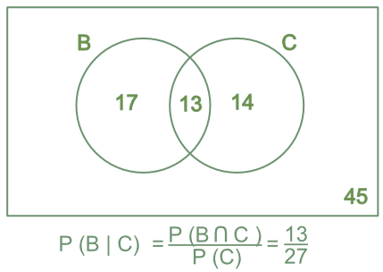

# (PART) Probability Theory {-} 

# Probability 

## Sample Spaces and Events

### Introduction
Now is the time to take a slight detour from the study of statistics into the sister field of probability theory. Probability theory provides much of the theoretical backbone for the study of statistics. The origins of probability theory come from gambling. In particular, the first person to apply the analysis given here was Geralamo Cardano and Italian gambler in the 1500's. Cardano was the first person to analyze the outcomes of ``games of chance'' in a structured and mathematical way. This gave him a tremendous advantage over his competitors in 1500's Italy. However, he was never able to fully capitalize on his advances as his family life was a 1500's version of the Jerry Springer show. 

### Sample Spaces
Cardano's great idea was the concept of the **sample space** which will denote as $\Omega$. To determine the probability on a event occurring, Cardano's idea is to make a list of all the possible outcomes from a random event. For example, a random event might be flipping a coin in which case the set of possible outcomes (the sample space $\Omega$) is given by $\Omega=\{H,T\}$. If the random event is rolling a six-sided dice the sample space is $\Omega=\{1,2,3,4,5,6\}$. In blackjack the sample space is $\Omega=\{2,3,4,...21, B\}$, where the $B$ stands for busting. 

```{exercise}
List out the possible outcomes from flipping a coin twice.

```

```{exercise}
List out the possible outcomes for random event of choosing two finalists for an award with four applicants Ann, Jerry, Tom and Andy. 
```

### Law of Sample Spaces
 
 For the special case where all events from a random event are equally likely we can use the **Law of Sample Spaces** to calculate the probability of an event. 
 
```{definition, name="Law of Sample Spaces (LSS)"}
 If all the outcomes of a random event are equally likely then $$\prob{A}=\frac{|A|}{|\Omega|}=\text{ Probability of event A occurring. }$$ Where $|A|$ is the number of outcomes in $A$ and $|\Omega|$ is the total number of events in the sample space. 
```
 
 
 Use the Law of Samples Spaces to Calculate the probabilities below:
 
```{exercise}
Probability a fair coin flip is heads
```


```{exercise}
Probability a fair dice roll is greater than 3?
```


```{exercise}
You are in a class with only four students. If you have to do a project with a partner what are the chances you are paired with your best friend. Assume the assignments are made entirely randomly.
```


```{exercise}
If you know that someones pin is 4 digits (0-9) long, what are your chances of guessing it?
```


```{exercise}
What are the odds that the sum of the rolls from two six-sided dice is 8?
```


We can already see that the LSS turns probability calculations into a problem of counting stuff. As the numbers get larger it quickly becomes untenable to count things by hand. For example, if we try and list out all possible ways outcomes from flipping a coin ten times this would take about 84 days working for 12 hours a day! (over 3 million possibilities). In order to make better use of the LSS we need better techniques to count things. 


## Combinatorics


### Basic Principle of Counting


Combinatorics just means the mathematics of counting things. 

```{definition, name='Basic Principle of Counting'}
If two experiments are performed such that experiment 1 has $N_1$ possible outcomes and experiment 2 has $N_2$ possible outcomes then taken together we have $N_1 \times N_2$ possible outcomes. 
```

Use the basic principle of counting to find the number of outcomes for the following random experiments:

```{exercise}
Two rolls of a six-sided dice.
```

```{exercise}
Flipping a coin three times.
```

```{exercise}
How many DNA sequences are their which are 10 base pairs long? Hint: DNA has found bases $A,T,C,G$ 
```
```{exercise}
For a 100 meter dash final with 5 runners how many ways can the runners finish?
```

### Permutations
In the last exercise above we had to figure out how many ways we could order the five runners. Our logic for solving this generalizes to how many ways we can order any $N$ distinct objects. 

```{theorem, name='Permutations'}
The number of ways to order $N$ distinct objects is given by: $$N \times N-1 \times N-2 \times ... \times 2 \times 1=N!$$
```
We can use R to calculate permutations $N!$ using the command:
```{r, eval=FALSE}
factorial(N) #calculate N!
```


```{exercise}
If you bought ten cans of soup, each different types, and loaded them into the grocery bag randomly. What are the odds that when you pull them out of the grocery bag they come out in alphabetical order?
```

```{exercise}
How many ways can the cards in a standard deck (52 cards) be ordered?
```

```{exercise}
How many orders can 8 French nobles be executed in, if they are drawn randomly from a holding cell with 8 occupants?
```

In some cases we may want to know how many ways we can order a subset of elements. For example, how many four digit pins are possible if we can't repeat the same digit more than once? Well, we have 10 choice for the first digit, 9 for the second, 8 for the third and 7 for the fourth. Therefore $N=10\times9\times8\times7$. Notice we can also write this as $N=10!/6!$

```{theorem, name="Permutations of Subsets"}
The number of ways to order $r$ distinct objects taken from a set of $n$ distinct objects is: $$P(n,r)=\frac{n!}{(n-r)!}.$$
```

```{exercise}
How many orders can 8 French nobles be executed in, if they are drawn randomly from a holding cell with 18 occupants?
```

### Combinations
We now want to consider the problem of counting outcomes for the case where the order doesn't matter. For example, we may want to find the total number of five card poker hands. Perhaps our first instinct is to use the permutations formulas from the last section. We have 52 distinct objects and we want to know how many ways we can draw five of them. This gives: $$P(52,5)=52!/47!=52\times 51\times50\times49\times48=5,997,600.$$ However, their is a subtle error in our calculation. Using the permutation formula means that we care about the order the cards appear in! For example, the permutation way of counting means that the two hands:
$$ 
2 \heartsuit, 3 \spadesuit, 8 \clubsuit, 2 \spadesuit, \text{Ace} \diamondsuit \qquad \qquad \qquad \text{Ace} \diamondsuit, 2 \heartsuit, 3 \spadesuit, 8 \clubsuit, 2 \spadesuit
$$

are being counted as separate hands! This isn't what we really want to count as these two hands are entirely equivalent in a game of poker. 

To correct this over counting, we just need to divide by the *number of equivalent entries* in our count. In this case we have $5!$ poker hands which are equilvalent. Therefore, we have the total number of five card poker hands is:
$$ P_5=\frac{52!}{5! 47!}=2,598,960 $$
So just about 2.6 million unique five card hands. As usual we can generalize our poker analysis to hold for general collections of objects. 
```{theorem, name='Combinations'}
The number of ways to draw k distinct objects from a set of $N$ distinct objects  is given by: $$ C(N,k)=\binom{N}{k}=\frac{N!}{(N-k)!k!}$$
```
In R we can calculate $C(N,k)=\binom{N}{k}$ using the command:
```{r, eval=FALSE}
choose(N,k) #calculate C(N,k) 
```

```{exercise}
How many ways can a jury of 12 people be chosen from a pool of 30 candidates?
```

```{exercise}
A fire team of 4 junior Marines must be chosen from a platoon with junior 36 Marines for a patrol. Also a sergeant must be chosen to lead the fire team from a pool of 5 candidates. How many ways can the patrol be chosen with four juniors and one leader?
```


## Axioms of Probability

### Beyond the Law of Sample Spaces
The LSS tells us that $$\prob{E}=\frac{\text{outcomes in E}}{\text{total outcomes}},$$ but we have seen that the LSS doesn't apply when the outcomes are not all equally likely. Outside of gambling scenarios not all outcomes are equally likely and the Law of Sample Spaces does not apply.

```{block2, type='fallacy'}
Keep a lookout for the law of sample spaces being applied to scenarios where the outcomes are not all equally likely. My favorite example of this is the protests of the opening of the Large Hadron Collider where one of the chief protestors argued that the LHC would either create a blackhole or not. Therefore, the chances that the earth would be swallowed up by a man-made blackhole were roughly 50/50. 
```


To continue to make progress we need to move beyond the Law of Sample Spaces. 

### Set Theory
To go much further we need to learn a bit of *set theory.* A set is just a collection of *unique* objects. For example, coin flip outcomes {H,T}, dice roll outcomes $\{1,2,3,4,5,6\}$. Now lets consider the different ways we can combine sets. 

1. **Union of Sets:**  Given two sets $A$ and $B$ the union of $A$ and $B$ which we write as $A \cup B$ consists of all the elements in $A$ and all the elements in $B$. For example, let $A=\{1,2,3\}$ and $B=\{3,4,5\}$ then $A \cup B=\{1,2,3,4,5\}$. 
2. **Intersection of Sets:** Given two sets $A$ and $B$ the intersection of $A$ and $B$ which we write as $A \cap B$ consists of those elements which are in BOTH A and B. For example, let $A=\{1,2,3\}$ and $B=\{3,4,5\}$ then $A \cap B=\{3\}$. 

3. **Difference of Sets:** Given two sets $A$ and $B$ the A minus B written $A\setminus B$ consists of those elements in A which are NOT also in B. For example, let $A=\{1,2,3\}$ and $B=\{3,4,5\}$ then $A \setminus B=\{1,2\}$.

4. **Subsets:** We say that the set A is a subset of B written as $A \subseteq B$ if every element of A is also in B. The symbol  $A \subseteq B$ is similair to the less than or equal to $(\leq)$ sign. It means that $A$ is contained in $B$ but the two sets may in fact be equal. The symbol $A \subset B$ means that $A$ is a proper subset of B. Meaning that there is some element of $B$ which is not in $A$. 

5. **Empty Set:** Occasionally it is useful to have a notation for a set which has no elements in it at all. This is called the empty set and is denoted by $\emptyset$. For example, we could say that $\{1,2\} \cap \{9,10\}=\emptyset$

```{r SetOpsDiagram2, echo=FALSE}

```


```{exercise}
Let $\Omega$ be the set of all students at Schreiner, and $\mathbb{A}$ be the set of students in this class and let $\mathbb{M}$ be the set of music majors at Schreiner. 

1. Is it true that $\mathbb{A} \subset \Omega$?
2. What does the set $\Omega \setminus \mathbb{M}$ contain?
3. What does the set $\mathbb{A} \cup \mathbb{M}$ contain?

```

### The Axioms of Probability 
The axioms of probability are sort of like the mathematical version of the declaration of independence statement: We hold these truths to be self-evident.... We can't *prove* them but without agreeing on them it is impossible for us to have a productive conversation about probability theory. 

1. The probability of any event $E$ in the sample space $\Omega$ [$E \subseteq \Omega$] is between 0 and 1: $$ 0 \leq \prob{E} \leq 1.$$
2. The probability that at least one of the elemental events in the sample space occurs is 1: $$\prob{\Omega}=1.$$ This means that the sample space must contain at all possible outcomes. 
3. The probability of the union of two events occurring is given by: $$\prob{E_1 \cup E_2}=\prob{E_1}+\prob{E_2}-\prob{E_1 \cap E_2}$$


### The OR Rule
The last axiom of probability actually can be very useful in calculations, I call it the **OR** rule of probability. Let's break it down in some more detail.
$$\prob{E_1 \cup E_2}=\prob{E_1}+\prob{E_2}-\prob{E_1 \cap E_2}$$
This tells us that the probability of the event $E_1$ OR the event $E_2$ occurring is the sum of the probabilities that $E_1$ and $E_2$ occur minus the probability that both $E_1$ and $E_2$ occur. 


Perhaps it is best to make sense of this using a simple example. Suppose we are rolling a six sided dice. Then the sample space $\Omega=\{1,2,3,4,5,6\}$ and each outcome is equally likely. Let $E_1=\{2,4,6\}$ be the event and even number is rolled and let $E_2=\{1,2,3\}$ be the event that an number less than or equal to three is rolled. Then $\prob{E_1\cup E_2)}=\prob{\{1,2,3,4,6\}}=5/6$ finding this directly. Now the OR rule tells us we could also find this as $\prob{E_1}+\prob{E_2}-\prob{E_1 \cap E_2}=\prob{\{2,4,6\}}+\prob{\{1,2,3\}}-\prob{\{2\}}=3/6+3/6-1/6=5/6$. 

Why does this work? Notice that when we break up the set $E_1 \cup E_2$ we end up counting the event that a two is rolled twice! It appears in both $E_1$ and $E_2$. Therefore, to correct for this we need to subtract off this double counting. 

The OR rule is especially simple and useful when $E_1$ and $E_2$ have no overlap, i.e $E_1 \cap E_2=\emptyset$. Sets with this property of no overlap are called **disjointed sets**. Then we have the following simple rule:

```{theorem, name="Simple OR Rule"}
Let $E_1$ and $E_2$ be disjoint events ($E_1 \cap E_2=\emptyset$) within some sample space $\Omega$. Then we have that $$\prob{E_1 \cup E_2}=\prob{E_1}+\prob{E_2}$$
```

```{exercise}
Suppose 80% of the wizarding world supports restrictions on underage magic, and 55% support the use of dementors as guards at the wizarding prison Azkaban. If 50% support both dementors and underage magic restrictions, what percentage support either underage restrictions or dementors?
```

```{exercise}
A card is drawn randomly from a deck of ordinary playing cards. You win 10 dollars if the card is a spade or an ace. What is the probability that you will win the game?
```

### The AND Rule
We are now ready to discuss the powerful **AND** rule. This will allow us to find $\prob{A \cap B}$ easily under the special circumstances that the events $A$ and $B$ are ``independent''.  

```{theorem, name='AND Rule'}
Let $A$ and $B$ be independent events within some sample space $\Omega$ then $$\prob{A \cap B}=\prob{A} \times \prob{B}.$$
```

We will give a mathematical definition for independence in the next section of the notes. For now we will use the intuitive definition that two events $A$ and $B$ are independent if the occurrence of $A$ has no effect whatsoever on the likelihood of $B$ occurring and vice-versa. For example, my hair color has nothing to do with the probability I am eaten by a shark. Rolls of a dice, spins of a roulette wheel and many other gambling events are independent events. 

```{example}
If 100 people are on a dating site. If 30% of people are attractive to the user, then removing 70% leaves 30 candidates. If only 10% are honest then this leaves only 3 people who are both honest and attractive to the user. Using the AND rule the probability of finding an honest and attractive date on the site is: $$\prob{H \cap A}=\prob{H}\times \prob{A}=30/100 \times 10/100=300/10000=0.03$$  
```

```{example}
If 10% of people are scared of flying and 20% of people have brown hair then what is the probability of finding a brown-haired person who is scared of flying? We expect that hair color will have no effect on a persons feelings about flying. Therefore, we can apply the AND rule. $$\prob{B \cap S}=\prob{B} \times \prob{S}=1/10 \times 2 /10=2/100$$
```

#### Exercise

1. **People vs Collins:** In 1968 an old lady in Los Angeles, California was mugged and her purse was stolen. She didn't get a good look at her assailants but the police did find one eye witness. Unfortunately, this witness didn't get a good look at the mugger either. However, the witness did report seeing a black man with a beard/mustache running back to a yellow car with a blond haired white woman with her hair in a pony tail. This was very little to go on, however the police did find a couple which matched his description. Amazingly, using just this evidence they were brought to trial. At the trial a mathematics professor was brought in to testify for the prosecution. The professor presented the below table to the jury:

Characteristic | Probability
---------------|-----------------
Black man with beard | 1/10 
Man with mustache | 1/4 
White woman with pony tail | 1/10 
White woman with blonde hair | 1/3 
Yellow car | 1/10  
Interracial couple | 1/1000 


The fact that this was presented by a math professor brings me great shame (for many reasons). Let's examine the argument made by the professor. 

1. Using the AND rule what are the odds assuming these numbers are accurate in 1968 that a couple would match these all these characteristics?
2. What is wrong with applying the AND rule to this data?
3. If there were 60 million couples in the LA area at the time, about how many couples will match this description?
4. What is the probability that the couple that was arrested actually committed the crime? (Given your calculations above)

This poor couple was convicted and it took years of appeals before the conviction was overturned. This is called the prosecutors fallacy. You will see another tragic case of this in your homework (Sally Clark Case). 


### The Complement Rule
 One last rule to introduce for calculating probabilities. This is called the complement rule. The idea here is that sometimes it is easier to calculate the odds that an event *does NOT* happen, then to calculate the probability directly. 
 
```{theorem, name="Complement Rule"}
 Let $A$ be an event in a sample space, and let $A^c=\Omega \setminus A$ be the collection of all outcomes not in $A$. Then we have that $$\prob{A}=1-\prob{A^c}.$$
```
 
 As an example if your doctor tells you that there is a 25% chance that you have a rare disorder based on your test results. Then you could also phrase this as a 75% chance you **do NOT** have the disorder. I would prefer the doctor tell me this way! 
 
```{exercise}
You have purchases a mortgage backed security, where you lose your money if at least one of the mortgages in the bundle fails. If each mortgage has a 5% chance of failing, independent of the rest, what is the probability you lose your money if you bundle 10 mortgages together?
```

## Conditional Probability and Independence


### Introduction
Conditional probabilities allow us to include additional information into our calculation of probabilities. Let's begin with some examples:
```{example}
What is the probability of a psychic being able to guess my birthday?
  + Call the event that the psychic guesses my birthday correctly B, then $$\prob{B}=\frac{1}{365}=\frac{\text{Number of Correct Guesses}}{\text{Number of Total Possibilities}}.$$
```

```{example}  
What about if the psychic knows that I was born in December? 
  + Well this information limits the number of choices down to the 31 days in December. Now we have that 
$$\prob{B|M}=\frac{1}{31}.$$
```

This is much better odds of guessing the correct day. The notation $\prob{B|M}$ should be read The probability of $B$   given $M$. In the psychic problem B is the event of guessing my birthday correctly and $M$ is the event that the month I was born in is December. 

In practical situations we deal with this type of situation, where we wish to calculate the odds of something we have partial knowledge of. For example,

  1. What is the probability your spouse is cheating on you, given the new information that you found strange text messages on their phone?
  
  2. What is the probability of someone living past the age of 70? What about if you are given the added information that they smoke?
  
  3. What is the probability of that you have the flu, given that you have a slight fever?


### Mathematical Definition

```{definition, name="Conditional Probability"}
The conditional probability of some event $A$ given the information that $B$ has occurred is given by: $$\prob{A|B}=\frac{\prob{A \cap B}}{\prob{B}}$$
```
We can get an idea for why this formula works by looking at a Venn diagram for conditional probability (Figure.~\ref{Fig:CondProb}). 

```{r addCondDiagram, echo=FALSE, fig.cap="Venn Diagram of a conditional probability calculation. The numbers indicate the number of outcomes in each category. Knowledge that $C$ has occurred limits the possibilities down to 27 possible outcomes, and means only 13=B intersect C of the outcomes in $B$ are possible", out.width='50%'}

```


#### Examples
1. What is the probability of rolling a three with a dice, given that we know that an odd number was rolled? 
Let $\mathcal{O}=\{1,3,5\}$ be the event an odd number is rolled and $\mathcal{T}=\{3\}$ the event a three is rolled. Then by our conditional probability formula we have
$$
\prob{\mathcal{T}|\mathcal{O}}=\frac{\prob{\mathcal{T} \cap \mathcal{O}}}{\prob{\mathcal{O}}}=\frac{|\{3\} \cap \{1,3,5\} |}{| \{1,3,5\}|}=\frac{1}{3}
$$
Note that $\prob{\mathcal{O}|\mathcal{T}}=\frac{\prob{\mathcal{T} \cap \mathcal{O}}}{\prob{\mathcal{T}}}=\frac{1/6}{1/6}=1$.  This leads us to the important discovery:
```{theorem, name="Order Matters"}
In general for two events $A$ and $B$: $$\prob{A|B}\neq\prob{B|A}$$ that is probability of A given B is not the same as the probability of B given A. 
```
As another example of this non-equality, let $A$ be the event that someone is an professional basketball player and $B$ be the event that someone is taller than 5.5 feet. Then the probability of B given A,  $\prob{B|A}$,  is quite large because most professional basketball players are much taller than 5.5. That is if someone is a professional basketball player you would be very surprised if they were shorter than 5.5 feet tall. However, if we consider the probability that someone in a professional basketball player given that they are taller then 5.5ft, that is $\prob{A|B}$, we can see it is quite small. This is because there are very few professional basketball players and many people taller than 5.5ft. Therefore,  concluding every above average height person you meet is on the San Antonio Spurs is going to be wrong most of the time. The lesson here is that knowledge of $A$ can tell us much more about $B$ then vice versa. 

```{block2, type='fallacy'}
Forgetting that the order matters in conditional probability statements is a classic mistake in probability. It has been named the **inverse fallacy**. This is very commonly applied in political and legal arguments. The proper way to reverse the order of a conditional probability is to use **Bayes Law** discussed at the end of this chapter.   
```

2. Say 5% of a particular emergency room patient arrive with pain in their lower right abdomen and must be rushed to surgery, and 1% of the people arriving have appendicitis and pain in their lower right abdomen. If a new patient comes with pain in their lower right abdomen what is the probability they have appendicitis? 
Let $A$ be the event they have appendicitis, and $P$ be the event they have abdominal pain. Then we want to compute the probability $$\condprob{A}{P}=\frac{0.01}{0.05}=\frac{1}{5}=20\%$$


```{exercise}
In 2016 the Cleveland Cavaliers had the following record in home and away games:

Outcome| Home | Away
-----|-----|------
Wins | 31 | 20 
Losses | 10 | 21

Using this table find the probability of the Cavaliers winning a game $\prob{W}$ in 2016. Then find the conditional probabilities $\prob{W|H}$, the probability of winning given the game is a home game, and $\prob{W|A}$ the probability of them winning a game given it is an away game. 
```


### Independence
Now that we have a knowledge of conditional probability we can return to the question of independence of random events. 

```{definition, name="Indepedence"}
We say two events $A$ and $B$ are independent if and only if: $$\prob{A|B}=\prob{A}$$ or $$\prob{B|A}=\prob{B}.$$
```

Practically this means that the probability of $A$ occurring is not changed whatsoever by the knowledge that $B$ has occured. For example, the probability of me being struck by lightning is is no way effected by the color of my hair. 

If two events are independent then using the definition of conditional probability gives:
$$ \prob{A}=\condprob{A}{B} $$
$$ \prob{A\cap B}=\prob{A} \times \prob{B} $$

This is called the **AND** rule of calculating probabilities because if $A$ and $B$ are independent events then the probability of $A$ AND $B$ occurring $\prob{A \cap B}$ is the product of the probabilities.


### Multiplicative Rule
If $A$ and $B$ are dependent (that is not independent) then we can use the multiplicative rule of probabilities to find $\prob{A \cap B}$. This is a more general AND rule. 
```{theorem, name='Multiplicative rule of probabilities'}
For two events $A$ and $B$ which may be dependent we have that $$\prob{A \cap B}=\prob{B|A} \prob{A}=\prob{A|B} \prob{B}$$
```
 
 ```{example}
 Suppose you have 6 white socks, 4 red socks and 2 blue socks in a drawer. What is the probability that the first two socks you draw out of the drawer in the dark are white socks?
 ```
 
 Let $W_1$ be the event the first sock is white and $W_2$ the event the second sock is white. We want $$\prob{W_1 \cap W_2}=\prob{W_2|W_1} \prob{W_1}, $$ using the multiplicative rule for probabilties. Now, $\prob{W_1}=6/12=0.50$,  but $\prob{W_2|W_1}=5/11$ because after drawing the first sock out we keep it. Therefore, their are only 11 socks left in the drawer, 5 of which are white. Therefore, we have
$$
 \prob{W_1 \cap W_2}=\prob{W_2|W_1} \prob{W_1}=6/12 \times 5/11= 0.227
$$
Notice that $\prob{W_1 \cap W_2} \neq \prob{W_1} \times \prob{W_2}=1/4$, this tells us that drawing the socks are not independent events. This is because we keep the first sock in our hand before drawing the second. This is called sampling *without replacement* and this can often break independence between events. 


```{block2, type="warning"}
Be on the watch for sampling *without* replacement as this is a common way to break independence between events. 
```
 
 
### Law of Total Probability
 The law of total probability allows us to use break down a complex probability calculation into a series of simpler calculations using conditional probabilities. To use the Law of Total Probability we need to form what is called a *partition* of our sample space. 
 
```{definition name='Partition'}
 A partition of the sample space $\omega$ is a collection of disjoint events (no overlap) $B_1, B_2, ... B_N$ whose union is $\Omega$. Such a partition divides any set $A$ into $N$ disjoint pieces. 
```
 
 The Venn diagram of a partition is shown in Fig~\ref{Fig:Partition}. 
 
```{r addPartitionDiagram, echo=FALSE, fig.cap='Here we partition the sample space into 6 disjoint components $B_1, B_2, .... B_6$', out.width='50%'}

```

 
 
 ```{theorem, name='Law of Total Probability'}
 Suppose we have a sample space $\Omega$ which can be broken into $N$ subsets $B_k$ each of which are disjoint (no overlap) and the union of these subsets gives the entire sample space (i.e $\cup_{k=1}^N B_k=\Omega$). Then if we want to find the probability of an event $\prob{A}$ we have: $$\prob{A}=\prob{A|B_1}\prob{B_1}+\prob{A|B_2}\prob{B_2}+...+\prob{A|B_N}\prob{B_N}$$
```
 
 The law of total probability tells us we can compute the probability of an event by breaking it into a series of disjoint slices then adding up the contributions of these slices to get the total back. This will come in useful when the slices have probabilities which are easy to find. 
 
```{example}
Suppose we have a well shuffled deck of cards what is the probability that the second card drawn is an ace? 
```
  
 Let $A$ be the event that the first card is an Ace and $A^c$ the event that the first card is not an ace. These two events are a partition of our sample space as the first card is either an Ace or not an Ace and it cannot be both. Therefore, we can use the Law of Total Probability to find the probability the second card is an Ace, call this event $S$. We have that,
$$
  \prob{S}=\prob{S|A} \prob{A}+\prob{S|A^c}\prob{A^c}  
$$
 We can find each of these probabilities easily:
 
$$
 \begin{aligned}
 &\prob{A}=\frac{4}{52}=\text{Probability the first card is an Ace}  \\
 &\prob{A^c}=\frac{48}{52}=\text{Probability the first card not an Ace}    \\
 &\prob{S|A}=\frac{3}{51}=\text{Probability the second card is an Ace, when the first was an Ace}    \\
 &\prob{S|A^c}\frac{4}{51}=\text{Probability the second card is an Ace, when the first card isn not an Ace}   
 \end{aligned}
$$

 Now plugging these back into our law of total probability
 
$$\prob{S}=\frac{3}{51}\times \frac{4}{52} + \frac{4}{51}\times \frac{48}{52} =\frac{4}{52} $$


```{example}
   Lets say that Chick-Fil-B has two chicken supply providers: Old McDonalds Chicken Inc and Sick Chickens Inc. Old McDonalds provides 70% of the chicken and Sick Chickens Inc provides the other 30% of the chicken. Unsurprisingly, Sick Chickens Inc has a spotty record and 40% of their chickens give people food poisoning. Old McDonalds has a much better record with only 5% of their chickens making people sick. If you eat at Chick-Fil-B what are the chances you get sick?  
```
   
 Let $S$ be the event the chicken makes you sick. Let $M$ be the event the chicken came from Old MacDonalds Chicken Inc and $SC$ be the event it came from Sick Chicken Inc. Since the chicken had to come from one of those two suppliers, and can not have come from both we have a partition of our sample space. Then the law of total probability tells us that:
 $$ \prob{S}=\prob{S|M}\prob{M}+\prob{S|SC}\prob{SC}=0.05 \times 0.70 + 0.40 \times 0.30=0.155=15.5\% $$
 

 
```{exercise}
 Fred has never had MATH 2330 and thinks its a good idea to join a underground game of Russian roulette. To make things more interesting he has two pistols to choose from. Each of the guns has six chambers (six places to insert a bullet), although you know that one of the guns has two bullets loaded and the other only has a single bullet. Assuming he has to choose between the guns randomly what is the probability he survives?
```


## Bayes Rule

From our knowledge of conditional probability we know that $$\prob{D|M}\prob{M}=\prob{M \cap D}=\prob{M|D}\prob{D}.$$ From this observation we can get a rule for reversing a conditional probability order. This is called **Bayes Law** or **Bayes Rule**. 

```{theorem, name="Bayes Law"}
$$\prob{M|D}=\frac{\prob{D|M}\prob{M}}{\prob{D}}=\frac{\prob{D|M}\prob{M}}{\sum \prob{D|M_i}\prob{M_i}}$$
```
Notice I used the law of total probability to write $\prob{D}=\sum \prob{D|M_i}\prob{M_i}$. This is the most common way to use Bayes law. 

You may have noticed I switched from using the notation A and B for events to using M and D for Bayes rule. This change was intentional as we can think of the M as the *model* and D as the *data*. In this way we may update our belief in a model (scientific theory, business conclusion) as we add additional data (D). In this way Bayes rule encompasses the scientific method by allowing us to measure the strength of evidence for a particular theory against the available evidence. 

For example, lets suppose that I have a been handed a coin which was randomly chosen from a bag with contains 1/2 fair coins and 1/2 biased coins. The fair coins will come up heads 50% of the time. The biased coins will come up heads 55% of the time. I am trying to figure out which type of coin I have been handed. 

To investigate this I will collect data by flipping the coin say 5 times and recording the outcomes. Let's say I flip this coin 5 times and I find that it comes up heads *all five times*. Let F be the event the coin is fair and B the event it is biased. D represents the data we have collected (five heads). 

We may use Bayes rule to calculate the probability $\prob{F|D}$:
$$
\prob{F|D}=\frac{\prob{D|F}\prob{F}}{\prob{D|F}\prob{F}+\prob{D|B}\prob{B}}
$$

We can fill in this data:

  + $\prob{D|F}$ is the probability of observed the data given the model (fair coin) this is given by $(1/2)^5=1/32$.
  + $\prob{F}$ this is the probability the coin we were handed is fair. Since we know the bag with the coins in it has a        50/50 mix of fair/biased coins we can say this equals $\prob{F}=0.50$, For the same reasons we have that $\prob{B}=0.50$
  + The only remaining entry to find is the $\prob{D|B}$ term. This is the probability we get 5 heads in a row using the  
    biased coin thus $\prob{D|B}=0.55^{10}$
    
$$
\prob{F|D}=\frac{\prob{D|F}\prob{F}}{\prob{D|F}\prob{F}+\prob{D|B}\prob{B}}=\frac{0.50^5\times 0.50}{0.50^5 \times 0.50+0.55^5\times 0.50}=0.383=38.3\%
$$
Likewise we can find $\prob{B|D}$ as:
$$
\prob{B|D}=\frac{\prob{D|B}\prob{B}}{\prob{D|F}\prob{F}+\prob{D|B}\prob{B}}=\frac{0.55^5\times 0.50}{0.50^5 \times 0.50+0.55^5\times 0.50}=0.617=61.7\%
$$
Given this data Bayes law tells us it is more likely that we have a biased coin. Notice that if we flipped the coin 10 times and found heads everytime then we would find:

$$
\prob{B|D}=\frac{\prob{D|B}\prob{B}}{\prob{D|F}\prob{F}+\prob{D|B}\prob{B}}=\frac{0.55^{10}\times 0.50}{0.50^{10} \times 0.50+0.55^{10}\times 0.50}=0.721=72.1\%
$$

This should make sense the more heads we find in collecting our data the more likely it is that the coin is biased towards heads. 


## Homework

### Concept Questions
1. What is the Law of Sample Spaces and when does it apply?
2. What is the condition for applying the OR rule of probabilities?
3. What is the condition for applying the AND rule of probabilities?
4. Is it true that $\prob{A \cap B} \leq \prob{A}$?
5. Is it true that $\prob{A \cup B} \geq \prob{A}$?
6. For conditional probabilities does $\prob{A|B}=\prob{B|A}$?

### Practice Problems
1. How many 7-place license plates are possible if the first two places are letters and the last 5 places are numbers?
2. Twenty workers are assigned to 20 different jobs, how many different assignments are possible?
3. How many ways can a wedding table of 5 people be selected from a wedding party of 12 people?
4. Two fair dice are thrown and let E be the event that the sum of the dice is odd and F be the event the sum is less than 6

    + Define $E$ and $F$ and the sample space $\Omega$. 
    + Are $E$ and $F$ disjoint sets? 
    + Find $\prob{E}$ and $\prob{F}$
    + Find $E \cup F$ and $\prob{E\cup F}$
    + Find $\prob{E \cap F}$
    + Are $E$ and $F$ independent events? 

### Advanced Problems
1. **Advertising Decisions:** You are trying to decide how effective your product advertisements are. You find that 61% of your customers are on Facebook, and 32% are on Twitter with 16% on both Facebook and Twitter. If you decide to pay for advertising on both Facebook and twitter what percentage of customers do you expect to reach? 

2. **DNA Evidence:** In a murder trial and expert witness is called to testify about DNA evidence found at the crime scene. They say that the probability of a person randomly matching the DNA fragment found at the crime scene is approximately 1 in a million. In the cross examination the defense attorney asks what the probability of a lab mistake is during the processing of the evidence (contamination, human error, etc), to which the expert witness replies about 5\% of the time. 

    + If we are a juror, we are interested in the probability the DNA evidence linking the defendant to the crime scene is        false. Lets call this event $F$. Call the event that the defendant is unluckily enough to share the DNA sequence with       the real killer $R$, and call the event that the lab screwed up and the match is false $L$. How can we express $F$ in       terms of $R$ and $L$?
    + Using the numbers given by the expert witness find $\prob{F}$ in this case.
    + Is this beyond your reasonable doubt? How would you explain this to your fellow jurors who aren't skilled in                probability theory?

3. **The Simpson Trial:** During the O.J. Simpson trial the prosecution argued that the history of domestic abuse by O.J. towards his ex-wife Nicole Brown showed a pattern of escalating violence which culminated in her murder. To make the point the chief prosecutor famously used the line ``A slap is a prelude to homicide''. Predictably, the defense argued this history of domestic abuse meant nothing. The defense used the following statistics to make their argument: over 4 million women were victims of domestic abuse in 1992 and only 1,432 of these were killed by their significant others. Therefore the probability, in 1992, that an abuser murders their spouse is less than $1/2500$. Therefore, they argued that very few wife beaters actually go on to murder their wives. 

    + Write the defense's statistic in terms of a conditional probability where $M$ is the event that the women is murdered      by their abuser, and $A$ is the event that they were previously abused. 
    + What key piece of information is the defense conveniently forgetting to condition on? Hint: Is it relevant to consider      the probability that O.J. will murder Nicole at some future date?
    + If I told you that 90% of the time when an abused women is murdered, the murderer was the abuser (this is true). How       would you respond to the defenses argument? 

4. **Sally Clark Case:** Sally Clark was a women in England who in 1999 was convicted of killing her two children. The first child's untimely death was put down to Sudden Infant Death Syndrome (SIDS). However, when two years later another seemingly healthy child suddenly died, Sally was accused of murdering the two children. The thrust of the prosecutions argument hinged on the fact that SIDS, thankfully, is relatively rare. The odds of a randomly chosen baby, dying from SIDS is about 3 in 5000.  

    + If the two deaths are independent then what is the probability of having two children who die of SIDS?
    + If 130 million babies are born worldwide each year, about how many will die from SIDS using the 3:5000 odds?
    + If 50,000 mothers have another child after having a child die of SIDS about how many will have a second child die from SIDS assuming the two deaths are independent?
    + Using you answer from part(c) how would you defend Sally in court? 

5. If two events $A$ and $B$ are disjoint (i.e. $A \cap B=\emptyset$) does this mean they are independent? If not give an example of a case where this fails. Hint: Consider $A$ and $A^c$. 


 


