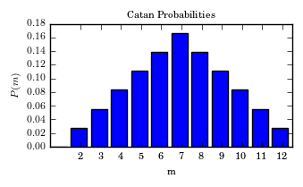
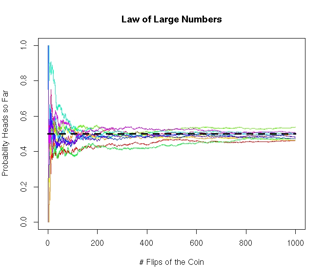

# Discrete Random Variables

## Random Variables
```{definition, name='Random Variables'}
Random variables are functions which map from the sample space $\Omega$ of a random experiment to numerical values.
```

The diagram below shows the random variable mapping a coin flip to the numbers $\{0,1\}$. 


Random variables are called **discrete** when the outputs taken on a integer (countable) number of values, (e.g. (1,2,3), (-2,-1,0,1,2,3,4,5, ...). Countable in the mathematical sense just means the values can be arranged in some ordered list which doesn't leave any values out. 

```{example}
For a coin flip with $\Omega=\{H,T\}$ we could define a random variable $X$ such that $X(T)=1$ and $X(H)=0$, this is shown in the above diagram.
```
```{example}
If our random experiment is flipping a coin ten times we could define a discrete random variable $X$ which gives the number of heads that appear in the experiment. $X(HTHTTTTTTT)=2$, etc. 
```

```{example}
If our random experiment is a baseball game, a random variable $B$ could be the number of base hits during the game. 
```


Notice we haven't talked yet about probability, in our discussion of random variables. When we want to know the probablity of a random variable taking a certain value we need to introduce the idea of a *probability distribution*. 

## Probability Distributions for Discrete Random Variables
To specify a random variable completely, we need to specify all the values the random variable can take (this is called the range of the random variable) and the probability that it takes each of those values.

```{example}
For example, let's consider a random variable $X$ which gives the number of flips of a fair coin until the first head appears. 

1. What possible values can our random variable $X$ take? 

Well we know it will take at least one flip of the coin to get our first heads to appear, and it could be any number of flips until the first head appears. So the range of $X$ is $\{1,2,3,4,5,6,.....\}$. That is all the positive integers.  

2. The probability that it takes each of those values? 

Let's start with the probability that the first flip is heads, which would mean that $X=1$. We denote this quantity $\prob{X=1}$, the probability that the random variable $X$ takes the value 1. Since it is a fair coin we have that $\prob{X=1}=1/2$. 

To find $\prob{X=2}$ is the probability that we flip a tails and then flip a heads $HT$. This two flips are independent so we can multiply these two probabilities to get $$\prob{X=2}=\frac{1}{2} \times \frac{1}{2}=\frac{1}{4}$$
In general, the probability of the first heads coming up on the kth flip of the coin is: 
$$\prob{X=k}=\left( \frac{1}{2} \right)^k.$$


We can also present the probability distribution of a discrete random variable as a graph. The probability distribution for our random variable $X$ for the first 11 values is shown in Fig.\@ref(fig:geoDistPlot).  
```

```{r geoDistPlot, echo=FALSE, fig.cap="Probability Distribution of the number of flips until the first head appears"}
barplot(dgeom(seq(0,11,1), prob=1/2), names.arg = seq(0,11,1), xlab='Number of Flips Until First Heads', ylab='Probability', col='darkgreen', main='Coin Flips Until First Heads')
```

```{example}
As another example of a random variable let $Y$ be the sum of the rolls of two six sided dice.

1. What possible values can our random variable $Y$ take? 

Here $Y$ can has to be a integer between 1 and 12 $\{2,3,4,5,6,7,8,9,10,11,12\}$. 

2. The probability that it takes each of those values? 
We have calculated these odds before for individual values. Now, we store the results in a random variable function. To get the probabilities we can make a table of the values each of the dice produce. 

```

```{r addCatanTable, echo=FALSE, fig.cap="Table of possibilities for the sum of two six-sided dice.", out.width='50%'}
knitr::include_graphics('catan1.png')
```

```{r addCatanPMF, echo=FALSE, fig.cap="The probability density function for the random variable $Y$ given by the sum of two dice.", out.width='50%'}

```


By counting the number of times the various sums appear in the table, we can get the probability distribution of our random variable $Y$. We can specify this distribution in two pieces:
$$
\begin{aligned}
& \prob{Y=k}=\frac{k-1}{36} & k \leq 7 \\
& \prob{Y=k}=\frac{13-k}{36} & k>7  
\end{aligned}
$$

A plot of the probability distribution is shown in the figure. 

```{example} 
Another application, (perhaps the original application), of the concept of a random variable is to gambling. In this context the numerical outputs of the random variable may be used to store the payoff for various bets. As a concrete example, consider the game of roulette. According to wikipedia,  "To determine the winning number and color, a croupier spins a wheel in one direction, then spins a ball in the opposite direction around a tilted circular track running around the circumference of the wheel. The ball eventually loses momentum and falls onto the wheel and into one of 38 (in American roulette) colored and numbered pockets on the wheel."  
 
In the simple case a player bets \$1 on the ball landing on a single number. If it lands on their number they receive \$36 dollars back, otherwise they lose the one dollar bet. Let the random variable $X$ be the winnings from the bet. Then $\prob{X=-1}=\frac{37}{38}\approx 97.3\%$ (this is probability of losing one dollar on the bet) and $\prob{X=36}=\frac{1}{38}=2.63\%$. 
```

```{block2, type='note'}
You may have noticed that we have seen plots which look pretty similar to the probability distribution plots in our examples. These were the histogram plots from our study of exploratory data analysis. The histogram is an estimate of the probability distribution based on a data set, rather than one calculated using the laws of probability. This is the difference between the study of statistics, where we use data to try and learn the probability of events and probability theory where we *calculate* the probability of events. 
```


```{exercise}
If $X$ is a random variable which describes the number of rolls of a six-sided dice before the first six is rolled. Find the probability distribution of this random variable. 
```

## Properties of Probability Distributions
Directly from the axioms of probability covered in the last chapter we get the following properties of a probability distribution for a random variable:

```{theorem, name='Properties of Probability Distributions'}
Any probability distribution $\prob{X=k}$ of a discrete random variable $X$ has the properties:
  
  + $\prob{X=k}\geq 0$ for any value $k$ in the range of the random variable.
  + $\sum_k \prob{X=k}=1$, where we sum over all possible values of the random variable. 

```

These two properties come from the axiom that the probability of any event in the sample space must be between zero and one, and that the probability that anything in the sample space occurs is one [$\prob{\Omega}=1$]. 


### Expected Values of Discrete Random Variables
Just as we found the mean of data sets in EDA as a measure of the central tendency of data, we can find the mean of a probability distribution to measure its central tendency. 
```{definition, name='Expected Value/Mean'}
The mean or expected value of a discrete random variable is given by: $$\mu=E[X]=\sum y \prob{X=y},$$ where the sum goes over all possible outputs of the random variable. 
```
The name expected value is a bit of a misnomer, as usually the expected value of a discrete random variable will be outside the range of the random variable.  So on any given sample from the random variable the *``expected value''* may never occur! However, in the long-run (infinite trials) the average of the random variable will converge to the expected value. This is called the **law of large numbers**. 

```{r addLLNFig, echo=FALSE, fig.cap="The Law of Large Numbers: This plot shows different simulations of flipping a fair coin 1000 times and calculating the fraction of heads observed after so many flips of the coin. The average number of heads converges to 0.50 as the number of flips increases. This is called the Law of Large Numbers.", out.width='70%'}

```

```{example}
Find the expected value (mean) of a bet on a single number in American roulette. 
$$
\begin{aligned}
& E[X]=\sum y \prob{X=y}= (-1)\left(\frac{37}{38}\right)+(36)\left( \frac{1}{38}\right)=\$-0.02
\end{aligned}
$$
So the expected return on a 1 dollar bet is about negative 2 cents. The expected value for all games at a casino will be negative, as this is how the casino makes money. The casino will make about two cents on every dollar bet on roulette in the long-run.
```


```{example}
We can also use the expected value to get an idea of the long-term cost of something. For example, lets say I am trying to compare the prices between two cell phone companies, say Monopoly Wireless and Cut-Rate Communications. Monopoly wireless charges me \$70 dollars a month, with an overage cost of \$20 dollars if I use to much data for that month. However, Cut-Rate communications charges only \$60 dollars a month, with an overage charge of \$50 dollars if I go over on the data. If I estimate that I will exceed my data allocation for three months in a given year, what is the expected monthly cost for the two companies?

Let us start with Monopoly Wireless and let $M$ be the random variable describing the monthly bill. Then $M$ is either 70 dollars or 90 dollars depending whether I go over on my data, with $\prob{M=70}=9/12$ and $\prob{M=90}=3/12$. Therefore the expected cost is $$E[M]=\sum k \prob{M=k}=70\left(\frac{9}{12}\right)+90\left(\frac{3}{12}\right)=75$$.

Now consider Cut-Rate Communications and let $C$ be the random variable describing the monthly bill. Then $C$ is either 60 dollars or 110 dollars depending on whether I go over on my data. We have that $\prob{C=60}=9/12$ and $\prob{C=110}=3/12$. Therefore, the expected monthly bill will be: $$ E[C]=\sum k \prob{C=k}=60\left( \frac{9}{12} \right)+110\left( \frac{3}{12} \right)=72.5$$

Therefore, we should choose Cut-Rate Communications as in the long-run (over the course of many years) we can expect to save \$2.5 dollars a month. 
```


```{exercise}
Greg is trying to decide whether to live on campus for next semester. He estimates it will cost 3 dollars a day for gas, but he has to travel through the Center Point speed trap on his commute to class. From experience he knows that about 3\% of the time he forgets to slow down when traveling through Center point and gets a \$300 speeding ticket. What is the true cost of his daily commute when living off campus?
```

```{exercise}
You are offered the chance to enter a raffle by purchasing a \$2 dollar ticket and the prize is a \$2000 jet-ski. 500 tickets will be sold. What is your expected return on purchasing a ticket in this raffle?
```

## Expected Value of Sums of Random Variables
Let $X_1$ and $X_2$ be random variables then $Y=X_1+X_2$ is also a random variable. For example, we could let $X_1$ be the roll of one dice and $X_2$ be the roll of a second dice. Then the random variable $Y$ would be the sum of these two dice, as we considered earlier in these notes.  For random variables which can be written as the sum of multiple of another random variable we have the following property:

```{theorem, name='Sums and Constant Multiples of Random Variables'}
Let $X_1$ and $X_2$ be random variables, and $a,b$ are constant numbers then if $Y=aX_2+bX_2$ we have that: $$E[Y]=aE[X_1]+bE[X_2].$$
```

```{example}
Lets consider finding the expected value of the sum of two dice. Remember this will give is the long term average if we repeated the rolls thousands of times. Then as given earlier $Y=X_1+X_2$ with $X_1$ giving the roll of the first dice and $X_2$ the roll of the second dice. Then,
$$
\begin{aligned}
E[Y]&=E[X_1]+E[X_2]=\frac{1}{6}(1+2+3+4+5+6)+\frac{1}{6}(1+2+3+4+5+6)\\&=3.5+3.5=7
\end{aligned}
$$
Notice we got this answer in a much easier way then finding the probability distribution of $Y$ and computing the expected value directly from that. 
```

If we want to find the expected value of any function of a random variable $f(X)$, we have the following theorem:

```{theorem}
Let $X$ be a random variable, then the expected value of $f(X)$ is given by: $$E[f(X)]=\sum f(y) \prob{X=k}$$
```
For example, if we want to know the expected value of the random variable $Y=X^2$ where $X$ is the result of a random roll of a six-sided dice. Then we have that $$E[Y]=E[X^2]=\frac{1}{6} (1^2+2^2+3^2+4^2+5^2+6^2)=15.16667$$

```{exercise}
If $X$ is the random variable which gives the number of heads produced when we flip a coin 100 times, find $E[X]$
```


## Variance of Random Variables

We may also get a measure for the width of the probability distribution of a random variable. For this we compute the variance of the random variable:

```{definition, name='Variance of a Discrete RV'}
The variance of a random variable $X$, with expected value $E[X]=\mu$ is given by: $$\var(X)= E[(x-\mu)^2]=\sum (k-\mu)^2 \prob{X=k}=E[X^2]-(E[X])^2 $$
```

Note that the variance for a random variable is always non-negative ($\var(X)\geq0$). 

```{example}
Find the variance of the random variable $X$ describing the betting results from a roulette wheel. We found earlier that $E[X]=-0.02$, so to get the variance we only need to find $E[X^2]$:
$$
\begin{aligned}
&E[X^2]=(-1)^2\left(\frac{37}{38}\right)+(36)^2\left( \frac{1}{38}\right)=35.07
\end{aligned}
$$
Therefore the $\var(X)=E[X^2]-(E[X])^2=35.07-(-0.02)^2=35.06$.
```

```{example}
Find the variance of the random variable $X$ given by the roll of a fair six sided dice. Well, $E[X]=\frac{1}{6}(1+2+3+4+5+6)=3.5$ and we calculated above that $E[X^2]=15.16667$. Therefore the variance is $\var(X)=E[X^2]-(E[X])^2=15.1667-3.5=11.6667$.
```

We may also define the **standard deviation** $\sigma$ of a random variable as the square root of the variance. $$\sigma=\sqrt{\var(X)}.$$ The standard deviation of a random variable has the advantage of having the same units as the outputs of the random variable $X$. Recall that we can use the mean and standard deviation to get prediction intervals for discrete random intervals using either the empirical rule (for mound-shaped distributions) or Chebyshev's rule for non-mound shaped distributions. 

### Variance of Sums of Random Variables
We may find the variance of the sum and constant multiple of *independent* random variables using the following theorem. 

```{theorem, name='Variance of a Sum of Random Variables'}
Let $Y=aX_1+bX_2$ be a random variable which is the sum of two independent random variables $X_1$ and $X_2$ with $a,b$ constant numbers. Then we have:
$$\var(Y)=\var(aX_1+bX_2)=a^2 \var(X_1)+b^2 \var(X_2).$$
```

For example if we consider the random variable $Y=X_1+X_2$ given by the sum of the results of two dice rolls again. Since the two dice rolls are independent we have that $\var(Y)=\var(X_1)+\var(X_2)=11.6667+11.6667=23.333$. 

## Bernoulli Random Variables
The simplest discrete random variable is called a Bernoulli random variable. Despite their simplicity we may use them as building blocks towards more complex random variables. 

```{definition name='Bernoulli Random Variable'}
A random variable $X$ is called a Bernoulli random variable if:
  
  + It takes on only the values 0 and 1 (two possible outcomes)
  + $\prob{X=1}=p$ and $\prob{X=0}=q=1-p$. 
We often think of a Bernoulli random variable as a test, which is successful (equal to 1) with probability $p$ and fails (equals 0) with probability $q=1-p$. 

```

We can easily compute the expected value and variance of a Bernoulli random variable:

```{theorem, name='Properties of Bernoulli Random Variables'}
If $X$ is a Bernoulli random variable then:
  
  + $E[X]=p$
  + $\var(X)=pq$
  + $\sigma_X=\sqrt{pq}=\sqrt{p(1-p)}$

 
```


```{exercise}
As a doctor you prescribe an experimental drug to a patient, which will cure the disease with a probability $p=0.20$. Write this as a Bernoulli random variable and find the variance of this random variable. Also, find the formula for the expected value and variance of a Bernoulli random variable from the definitions
```


## Binomial Random Variables
Consider a random variable that counts the number of successes in $N$ Bernoulli trials. We could write this random variable $X$ as $$X=\sum_{j=1}^N B_j$$ where $B_j$ are independent identically distributed Bernoulli random variables. Since a Bernoulli random variable returns a $1$ whenever the event is ``successful'', the sum of these will give the number successes in $N$ attempts. $X$ is called a **Binomial Random Variable** and will take values in the range $[0,1,2,...N]$. The following theorem gives the probability distribution of a binomial random variable. 

```{theorem, name='Binomial Random Variable'}
A probability distribution for a Binomial random variable $X$ is given by $$ \prob{X=m}=\binom{N}{m} p^m (1-p)^{N-m}$$
where

  + N is the number of trials
  + m is the number of successes
  + $p$ is the probability of success on each trial. 

```

We can compute the expected value and variance of a binomial random variable $X$ using the definition that:
$$X=\sum_{j=1}^N B_j$$ 
with each $B_j$ being an independent Bernoulli random variable with a probability of success of $p$. $$E[X]=E\left[\sum_{j=1}^N B_j\right]=\sum_{j=1}^N E[B_j]=\sum_{j=1}^N p=Np.$$ The variance can be found in a similar manner $$\var(X)=\var\left(\sum_{j=1}^N B_j\right)=\sum_{j=1}^N \var(B_j)=\sum_{j=1}^N p(1-p)=Np(1-p)=Npq.$$ Let's record these results as a theorem:

```{theorem, name='Expected Value and Variance of Binomial Random Variables'}
If $X$ is a binomial random variable with $N$ trials with a probability of success of each trial $p$ then:
  
  + $E[X]=Np$
  + $\var(X)=Np(1-p)=Npq$

 
```


```{example}
Karl is guessing on a true/false quiz with ten questions. Find the probability distribution for the number of questions he gets correct. 
This is a binomial random variable with $N=10$ and $p=1/2$. Therefore $$\prob{X=m}=\binom{10}{m} (0.5)^m (0.5)^{10-m}=\binom{10}{m} (0.5)^{10}.$$ This distribution is plotted in Fig.\@ref(fig:guessTF). 
```

```{r guessTF, echo=FALSE, fig.cap='The probability of getting X answers correct on a 10 question True/False Exam'}
barplot(dbinom(seq(0,10,1),size=10, prob=0.5), names.arg=seq(0,10,1), col='coral', main='Binomial Distribution N=10, p=1/2', ylim=c(0,0.30))
```

```{example}
In the NBA finals they play a seven-game series of games. The team who wins four (or more) games wins the championship. The Golden State Warriors are heavy favorites and the probability they win a given game against the Cleveland Cavaliers is $p=0.6$. Lets assume that the games are independent. What is the probability that the Cavaliers win the series? 

The Cavs will win the series if they win four or more games out of 7. Let the number of Cavs wins be the random variable $X$. This is a binomial random variable with $N=7$, $p=0.4$ (the chances the Cavs win is 1-0.6=0.4) and the want $\prob{X \geq 4}$. Using the binomial distribution we have:
$$
\begin{aligned}
\prob{X \geq 4} &= \sum_{m=4}^7 \binom{7}{m} (0.4)^m (0.6)^{7-m} \\
&= \binom{7}{4} (0.4)^{4} (0.6)^{3}+\binom{7}{5} (0.4)^{5} (0.6)^{2}+\binom{7}{6} (0.4)^{6} (0.6)^{1}+\binom{7}{7} (0.4)^{7} (0.6)^{0}  \\
&=0.2897
\end{aligned}
$$
So even with a heavy favorite and a seven game series the inferior team still wins about 29% of the time. This distribution is shown in Fig.\@ref(fig:nbaFinalsBin).

```

```{r nbaFinalsBin, echo=FALSE, fig.cap='Odds of the inferrior team winning X number of games'}
barplot(dbinom(seq(0,7,1),size=7, prob=0.4), names.arg=seq(0,7,1), col='skyblue', main='NBA Finals', ylim=c(0,0.30), xlab='Games won by Cavs', ylab='Probability')
```

```{exercise}
If you know that 5% of a companies products are defective. In an order of 30 products what is the probability that less than three are defective? What is the expected number of defective products?
```


## Binomial Random Variable in R
A binomial random variable $X$ gives the number of successes in $N$ independent Bernoulli trials each with a probability $p$ of success. Recall that probability distribution function for a binomial random variable is given by $$\mathbb{P}(X=k)=\binom{N}{k} p^k (1-p)^{N-k},$$ where $N$ is the number of trails and $p$ is the probability of a success on any given trial. $(N,p)$ are called the parameters for a binomial distribution. `R` provides several tools for studying binomial random variables.

### Probability Distribution in R
First, we may find the probability of an event using the `dbinom` command. For example, if we want to know the probability of having 3 successes in 10 trials, with a probability of success on each trial of $0.4$ we would type:
```{r}
dbinom(3, size=10, prob=0.4) ##Find the probability of having 3 success out of 10 for binomial with N=10, p=0.4
```
The `size=10` tells R that $N=10$ and `prob=0.4` sets the $p=0.4$. If we want to make a plot of a binomial distribution we can use the barplot feature:
```{r}
x<-0:10 ##make a vector of numbers from 0 to 10
y<-dbinom(x,size=10, prob=0.4) ##calculate the probability of each value using dbinom
barplot(y, names.arg=x, ylab='Probability', xlab='Number of Sucesses', main='Binomial Distribution Plot', col='coral') ##make a barplot
```


### Cumulative Distribution Calculations in R

When finding probabilties we very often want to answer questions like $\mathbb{P}(X\leq m)$. For example we may want to know the probability that I see less that 40 heads when flipping a fair coin 100 times. We could get this answer the long way by doing a long sum.
$$\mathbb{P}(X\leq m)=\sum_{j=1}^m \mathbb{P}(X=j).$$ However, this can get cumbersome quickly. It is better to use the `pbinom` function in `R` which calculates this sum for us. 
```{r}
pbinom(40, size=100, prob=0.5)
```
The argument $40$ tells R we want the probability that $X \leq 40$. For the coin flipping example we can see that only about 2% of time will we see less than or equal to 40 heads appear. 

Equivalently, if we want to find probabilities like $\mathbb{P}(X>m)$, we can use the formula $$\mathbb{P}(X>m)=1-\mathbb{P}(X\leq m)$$.

For example, we can find the probability we see more than $55$ heads using:
```{r}
1-pbinom(55,size=100, prob=0.5)
```
so only around 13\% of the time will we see more than 55 heads. 


### Random Binomial Distribution in R
We may also generate random numbers drawn from a binomial distribution, using the`rbinom` function. The below code draws $10$ random numbers from a binomial distribution with $N=100$ and $p=0.5$
```{r}
rbinom(10,size=100, prob=0.5)
```
Each of these numbers gives the results of flipping a fair coin one hundred times and counting the number of heads that come up. Each time we do this we would get different answers. 
However we draw large samples we can see the **law of large numbers** start to take effect, where the average of our samples is very close to the theoretical average $Np$ for a binomial distribution. 
```{r}
rs<-rbinom(10000, size=100, prob=0.5)
mean(rs)
```
In addition for large sample sizes the histogram of the random samples approaches the theoretical probability distribution.
```{r}
rs<-rbinom(10000, size=10, prob=0.4)
hist.data<-hist(rs, freq=FALSE, breaks=10, main='Histogram of Random Samples from a Binomial Dist', col='coral')
```

This histogram should look close to the barplot of the distribution we made above. However, any random sample won't match the theoretical probability distribution exactly due to sampling error. Sampling error is a huge topic in statistics so much more on this later.


## Homework

### Concept Questions:

  1. If the random variable $X$ has units of dollars, what are the units of var(X)?
  2. Does the binomial distribution have a mound-shape? 
  3. How many parameters does a binomial distribution have?
  4. Is it true that $var(X_1+X_2)\geq var(X_1)$ for any random variables $X_1$ and $X_2$?
  5. If $X$ and $Y$ are random variables, we must assume they are independent to apply the formula $E[X+Y]=E[X]+E[Y]$ (True/False). 
  6. The binomial random variable can be written as a sum of Bernoulli random variables (True/False)
  7. The variance of a binomial random variable increases with the number of trials ($N$). (True/False)


#### Practice Problems:
1. Let $X$ denote a random variable that takes the values $-1,0,1$ with the probabilities $\prob{X=1}=0.3$, $\prob{X=0}=0.5$ and $\prob{X=-1}=0.2$, find $E[X]$ and $E[X^2]$. 
2. During the rifle qualification in the Marine Corps the final ten shots are taken from 500 yards. You receive one point for a hit and zero points for a miss. If each shot is independent of all the others and the probability you hit the target on each shot is $p=0.70$ what is the probability you hit $7$ or more of your shots? 
3. In the NBA 3-point contest the player shoots 20 shots from positions around the court. Sixteen (16) of these shots are taken with a normal basketball and each made shot counts as one point, and four shots are taken with a stripped money ball where makes count as 2 points. Assume that each shot taken has an independent probability of $p=0.43$ of going in.

    + Find the expected value for the points scored
    + Find the standard deviation of the total points scored


### Advanced Problems:
1. **Parking Tickets:** Parking on the street costs \$1 a day, but about 5% of the time I forget to bring the parking pass and receive a \$50 dollar parking ticket. How much should I budget for my daily parking costs in the long-term? 

2. **Hogwarts Test Guessing:**  Professor Dumbledore is writing an exam for his students. He plans on giving a multiple choice exam, with no partial credit. However, he is worried that students who are randomly guessing may score much higher than they deserve.  His test has 20 questions on it, with four answer choices for each problem.

    + What is the expected number of questions correct when a student is purely guessing on the exam?
    + What is standard deviation for a randomly guessing students number of correct answers?
    + What is the probability that a student who is purely guessing scores 70\% or better on the exam?
    + Give an interval which will contain about 99\% of the students number of correct answers, if they are guessing on the exam. 

3. **Home Runs**:  In 1961 Roger Maris broke Babe Ruth's home run record with 61 home runs. Rather than adoration Maris was despised by much of the public because he was deemed unworthy of dethroning the great Babe Ruth as the home run king. This was largely because Maris never hit more than 40 home-runs in a season except his record breaking season. We can estimate Roger Maris's probability of hitting a home run in any given game as $p=0.187$ by taking his 275 career home runs and dividing by his 1463 career games. 

    + Given his career numbers what is Maris's expected number of home runs in a 162 game season?
    + What is the standard deviation expected in his home run output each year? 
    + Construct an interval which will contain about 95\% of Maris's home run output for a season?
    + Using these numbers do you think this malice towards Maris is justified?
    
4. **Triple A Rated Mortgages**: Most people who are investing their money want to do so at a very limited risk. For this reason many pension funds and mutual funds require that any stock or bond purchased has to be rated to have an very low risk of going into default. Standard and Poors (S\&P) and Moody are two companies who rate the risk of investments, and their triple $A$ ranking is supposed to indicate that the bond has a risk of less that 1 in 850 (0.12%) of going into default. 
It is rather difficult to find individual investments which are this conservative in their risk. Therefore, it is common practice on Wall Street to bundle together a bunch of risker investments into what are called *Collateralized Debt Obligations* (CDO's). The idea is that these bonds pay out as long as **not every loan in the bundle fails**. 

    + What is the risk of a CDO failing to pay out if it consists of 10 loans which all independently have a probability of 5% of failing individually?
    + If we are trying to bundle together subprime loans which each have a probability of 50\% of failing into a triple AAA CDO how many loans do we need to put into the CDO?
    + What is the probability the subprime CDO will fail to pay out if the loans used in the bundle are completely \textbf{dependent} on one another? 
    + Do you expect that mortgage loan foreclosures are completely independent of one another? This error by the ratings agencies was a major contributing factor in the recent global economic meltdown. 


5. **Murphy's Law:** The Air Force has ordered a new fighter jet from Lockheed Martin with contains 1000 critical engineering components. Tests have shown that each of these parts will fail independently with a probability of $p=0.001$. In the design team they have to decide how much redundancy to build into the system. 

    + Define a random variable $X$ which counts the number of components which fail on the jet. What distribution does $X$ have, and what are the parameters of the distribution?
    + If they add no redundancy into the system, so that the jet will fail if \textbf{ANY} of these 100 critical components fails what is the probability that the jet fails?
    + Given these numbers they decide to add some redundancy so that the jet will continue to work as long as less than $k$ components fail. What is the minimum $k$ where the probability for the jet to fail is less than $\prob{X>k}< 0.001$.


6. **Zombie Apocalypse**: The zombie apocalypse is here, and the population of Kerrville is quickly being converted to zombies. You are well prepared for such a contingency, but you estimate you have a 5% chance of being bitten by a zombie on any given day. Let $S$ be a random variable which gives the number of days you are able to survive. 

    + Find the probability distribution for $S$, that is write a formula for $\prob{S=d}$. 
    + If you get word that the national guard is on the way, but it will be ten days until they arrive, what are the odds that you survive until help arrives? [Hint: Use the first example of random variables for the number of flips of a coin until a heads appears]
    + The national guard is trying to estimate how many trucks to bring to evacuate the survivors. If there are 100 survivors left in Kerrville today and they each have the same 5\% daily chance of being bitten independent of the rest, how many people should the national guard expect to have survived 10 days from now? 


