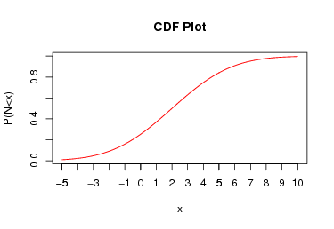

# Continuous Random Variables


## Introduction to Continuous Random Variables
We will now consider continuous random variables, which are very similar to discrete random variables except they now take values in continuous intervals. For example, the time you have to wait for a bus could be considered a random variable with values in the interval $[0, \infty)$. That is you could wait for any amount of time before the bus arrives, including a infinite amount of time if you are not waiting at a bus stop. 

Much of what we have learned about discrete random variables carries over to the study of continuous random variables. For example, to specify a continuous random variable fully we still want to define two characteristics:

1. The range of values the random variable can take (this will now be a continuous interval instead of a list)
2. The probability of the random variable taking on those values (this is called the probability density function $f_X(y)$). This gives the probability **density** at each point, which is not quite the same thing as the probability. 

Continuous random variables differ from discrete random variables in a one key way:

1. The $\mathbb{P}(X=y)$ for any single value $y$ is zero. This is because the probability of the random variable taking on exact value out of the infinite possible outcomes is zero. Therefore we asking about probabilities for continuous random variables we ask for the probability the random variable produces a value in some range $(a,b)$ of values $$\mathbb{P}(a\leq X \leq b).$$ Graphically, the probability the random variable taking values in the range $(a,b)$ is given by the **area under the probability density curve** between $a$ and $b$. 

```{r echo=FALSE}
x<- seq(-5,5,0.01);
y<-dcauchy(x)
a=-1;
b=2;
plot(x,y, type='l', ylab='Probability Density', main='Probability density functions')
cord.x <- c(a,seq(a,b,0.01),b) 
cord.y <- c(0,dcauchy(seq(a,b,0.01)),0) 
polygon(cord.x, cord.y, col="skyblue")
text(-0.0,0.15, "P(-1<x<2)")
```

The calculation of these probabilities from the probability density functions by hand typically involves **Calculus**. Since Calculus is not a prerequisite for this course we will have to gloss over some of the details for continuous random variables and lean on `R` to help us calculate some quantities. 

The total area under the probability density function $f_X(y)$ will be one. This comes from the axioms of probability: The sample space must cover all possible outcomes. 


## Uniform Random Variable

The simplest continuous random variable is the uniform distribution $U$. This random variable produces values in some interval $[c,d]$ and has a flat probability density function. Below we plot the uniform probability distribution for $c=0$ and $d=1$. 
```{r echo=FALSE}
x<- seq(-0.25,1.25,0.01);
y<-dunif(x)
a=0.25;
b=0.75;
plot(x,y, type='l', ylab='Probability Density', main='Uniform Probability Density function')
cord.x <- c(a,seq(a,b,0.01),b) 
cord.y <- c(0,dunif(seq(a,b,0.01)),0) 
polygon(cord.x, cord.y, col="skyblue")
text(0.5,0.5, "P(0.25<x<0.75)")
```

The probability density function for the uniform distribution $U$ on the interval $[c,d]$ is given by $$f_U(y)=\frac{1}{d-c},\qquad c \leq y \leq d.$$ The uniform distribution has a probability density of zero for values outside of its range $[c,d]$. 

The probability that the uniform random variable $U$ takes values in a range $(a,b)$ is given by $$\mathbb{P}(a \leq U \leq b)=\frac{b-a}{d-c}.$$

For a uniform distributed random variable on the interval $[c,d]$ we have
\begin{align}
& E[U]=\mu=\frac{c+d}{2} \\
& \sigma^2=\frac{1}{12}(d-c)^2
\end{align}

```{exercise}
Find the mean and variance of the uniform random variable on the interval $[-1,1]$
```

```{exercise}
Is the uniform random variable symmetric?
```

```{exercise}
What is the median of a uniform distribution on $[0,1]$?
```


## Normal Distribution
The most common distribution used in statistics is the **Normal Distribution**. It is also known as the Gaussian Distribution or the bell curve. The reasons that the normal distribution comes up so frequently in statistics will be revealed in the next chapter. For now, we note that random errors typically follow a Normal distribution. Below we plot the probability density function for the Normal distribution.

```{r echo=FALSE}
x<- seq(-5,5,0.01);
y<-dnorm(x)
a=-2;
b=2;
plot(x,y, type='l', ylab='Probability Density', main='Normal Distribution')
cord.x <- c(a,seq(a,b,0.01),b) 
cord.y <- c(0,dnorm(seq(a,b,0.01)),0) 
polygon(cord.x, cord.y, col="skyblue")
text(0.0,0.15, "P(-2<x<2)")
```

You can see that the Normal probability density function is a mound-shaped distribution and is symmetric about its mean value. In fact, the normal distribution is **the mother of all mound shaped distributions**. The techniques we learned about in EDA for mound-shaped distributions are based on the assumption that the distribution is normally distributed. More on this below. 

To specify a normal distribution we need two parameters the mean $\mu$ and the standard deviation $\sigma$. These give the center of the hump and the width of the normal distribution respectively. The probability density function for a normal random variable $N$ is given by $$f_N(y)=\frac{1}{\sqrt{2\pi \sigma^2}} e^{-\frac{(y-\mu)^2}{2\sigma^2}}.$$
Since the two parameters for a Normal distribution are the mean $\mu$ and standard deviation $\sigma$ we don't need any separate formulas for the mean and standard deviation of a Normal random variable.


### Cumulative Distribution Function (CDF) for Normal Random Variables
Within `R` we can easily find a probability of the form $\mathbb{P}(-\infty \leq N \leq b)$. Probabilities of this form are used so frequently they are given a special name, the **cumulative probability density** of a normal random variable $$F_N(x)=\mathbb{P}(-\infty \leq N \leq x)=\mathbb{P}(N \leq x).$$ The below plot depicts the cumulative distribution function value $F_N(2)$ for a normal random variable with $\mu=0, \sigma=1$. 

```{r echo=FALSE}
x<- seq(-5,5,0.01);
y<-dnorm(x)
a=-5;
b=2;
plot(x,y, type='l', ylab='Probability Density', main='Normal Distribution')
cord.x <- c(a,seq(a,b,0.01),b) 
cord.y <- c(0,dnorm(seq(a,b,0.01)),0) 
polygon(cord.x, cord.y, col="skyblue")
text(0.0,0.15, "Area=F(2)")
```

We can also plot the Normal CDF by itself:
```{r, echo=FALSE}
x<-seq(-5,5,0.01)
y<-pnorm(x)
plot(x,y, type='l', ylab='P(X<x)', main='Cumulative Density Function for the Normal Distribution', col='red')
```

We can see that $F_N(x)$ for a normal random variable with $\mu=0, \sigma=1$ goes to one as $x$ becomes large and goes to zero as $x$ goes toward $-\infty$. This should make sense as the probability of a random number from the normal distribution being less than a very large number is very high. The probability of being less than say $-100$ will be tiny. 

Within 'R' we can find the CDF for a normal distribution easily using the `pnorm` function:
```{r}
pnorm(1.5, mean=1.0,sd=2.0) ##find the probability N < 1.5 for a normal r.v. with mean=2.0 and standard deviation=2.0
```
Graphically, this means the blue area is ```r pnorm(1.5, mean=1.0,sd=2.0)``` in the below plot:
```{r echo=FALSE}
x<- seq(-5,5,0.01);
y<-dnorm(x, mean=1, sd=2)
a=-5;
b=1.5;
plot(x,y, type='l', ylab='Probability Density', main='Normal Distribution')
cord.x <- c(a,seq(a,b,0.01),b) 
cord.y <- c(0,dnorm(seq(a,b,0.01), mean=1.0, sd=2.0),0) 
polygon(cord.x, cord.y, col="skyblue")
text(0.0,0.10, round(pnorm(1.5,mean=1.0, sd=2.0),4))
```

Notice we can also find the probability of seeing a random number larger than some value using  $$\mathbb{P}(N>x)=1-\mathbb{P}(X\leq x)=1-F_N(x).$$ Therefore, if we want to know the probability of seeing a value greater than 5 for a Normal random variable with $\mu=0, \sigma=2.5$ in `R` we could type:
```{r}
1-pnorm(5, mean=0.0, sd=5.0)
```

### Finding Probabilities for the Normal Distribution
We are now ready to calculate the probability of the form $\mathbb{P}(a \leq N \leq b)$ for a Normal random variable $N$. $$\mathbb{P}(a \leq N \leq b)=F_N(b)-F_N(a).$$ Therefore, in `R` if we want to find the probability of a random sample lying within the interval $[1,2]$ for a normal random variable with $\mu=1, \sigma=3.0$ we can type:
```{r}
pnorm(2.0, mean=1.0, sd=3.0)-pnorm(1.0, mean=1.0, sd=3.0)
```

```{exercise}
For a normal random variable with $\mu=5.0, \sigma=1.0$ find $\mathbb{P}(3.0 \leq N \leq 7.0)$ using `R`. 
```

```{exercise}
For a normal random variable with $\mu=0.0, \sigma=1.0$ find $\mathbb{P}(-1.0 \leq N \leq 1.0)$.
```

```{exercise}
For a normal random variable with $\mu=0.0, \sigma=2.0$ find $\mathbb{P}(|N|>1.5)$.
```

## Standard Normal Distribution ($Z$)
The Normal distribution with $\mu=0, \sigma=1$ is called the standard Normal distribution. The standard normal distribution is used so often that it gets its own symbol $Z$. Notice we can transform any Normal random variable to the standard normal random variable by setting $$Z=\frac{X-\mu}{\sigma}$$. 

The benefit of doing this transformation is that asking the question $\mathbb{P}(-1 \leq Z \leq 1)$ tells us the percentage of the population which lies within one standard deviation of the mean for **ANY** normal random variable. Likewise, $\mathbb{P}(-2 \leq Z \leq 2)$ gives us the fraction of the population within two standard deviations of the mean for **ANY** normal random variable, etc. 

We can find those numbers easily in `R`
```{r}
pnorm(1.0, mean=0, sd=1)-pnorm(-1.0, mean=0, sd=1)
```
For two standard deviations we find:
```{r}
pnorm(2.0, mean=0, sd=1)-pnorm(-2.0, mean=0, sd=1)
```
These numbers (68\%, 95%) should be somewhat familiar as we saw they earlier in the context of the **empircial rule** for forming prediction intervals for mound-shaped intervals. We can now see that these values were derived from the standard normal distribution. This is what I meant by the Normal distribution being the mother of all mound-shaped distributions. When we learned about tools for analyzing mound-shaped distributions we were assuming the distribution had a Normal distribution. 

For example the outlier rule for mound-shaped distributions (that any data point with $|z|>3$ can be considered an outlier for mound-shaped distributions) comes from the calculation:
```{r}
pnorm(3.0)-pnorm(-3.0)
```
This tells us that for a Gaussian distribution we expect more that 99.7% of the data to lie within 3 standard deviations of the mean. Hence the z-score based outlier classification we learned. You will notice I didn't specify the mean and standard deviation is the above command. This is because `R` assumes the distribution is the standard normal $Z$ unless told otherwise. 

#### Note 

Before we had computers the values in the CDF calculations we did above had to be looked up in tables. Since books can't have infinite pages they couldn't make tables for normal distributions with every possible mean and standard deviation. Therefore, the practice was to convert all normal random variables to standard normal values $Z$, and then look the values up in the table for the standard normal random variable. 

Many statistics instructors still teach and advocate for the use of statistical tables. In my mind this is very old fashioned and is less accurate then using a computer. You won't be expected to look these numbers up in tables. However, you may run into table advocates at some point in your life. They will be extremely smug about using tables to look-up values, until you point out this is less accurate than using a computer. 


## Assessing Normality

We have already seen in our study of EDA that we can use more powerful tools when distributions have a mound-shape (Normal distribution). This will be a major theme in the class. If you can identify that a data set has a normal distribution then you can use more powerful tools to analyze it. 

Now that we have learned about the normal distribution we can develop some tools for determining whether a given distribution is normally distributed. These tools are still somewhat subjective but are a definite improvement over just looking at a histogram and trying to decide if it looks kinda like a mound as we did in our EDA chapter. 

**Steps for Assessing Normality in a Data Set**

1. Look at the histogram (does it even roughly look like a mound? If yes continue, if no you are done)

2. Find the IQR and sample standard deviation $s$ for the data. If the data is approximately Normally distributed then you should have: $$\frac{IQR}{s}\approx 1.3$$

3. Make a **Quantile-Quantile** plot of the data set. If the data is approximately normally distributed this should be approximately linear (lie along a straight line). 

The only really new concept is this procedure is making a Quantile-Quantile plot or QQ plot. This plots the z-scores $$z=\frac{x-\bar{x}}{s}$$ of the data points quantiles against the quantiles of a standard normal distribution. If the quantiles are the same then the plot will fall along a straight line. The quantiles agreeing means the two distributions have roughly the same shape at up until that point. 

For a first example we will analyze a fake data set which we know should have a mound-shape distribution:
```{r}
fake.data<-rnorm(100) ##Generate 100 random numbers from the standard normal distribution
```
First we make a histogram of the data:
```{r}
hist(fake.data)
```

Indeed this looks roughly mound-shaped, so we proceed to the second test:
```{r}
IQR(fake.data)/sd(fake.data)
```
This is close to the target value $1.3$. 

Now we make make a QQ-plot:
```{r}
qqnorm(fake.data)
qqline(fake.data, col='red')
```

The data points are shown as circles and we used the command `qqline` to add a line. We can see almost all the points lie along the line, meaning that the distribution is very close to being exactly normal. Indeed this should be the case because we generated the data from a normal distribution!

We can redo this analysis for fake data which is drawn from a uniform distribution. A uniform distribution is decidedly **NOT** mound-shaped. Therefore we expect we should fail at every step.  

```{r}
fake.unif<-runif(100) ##Generate 100 random numbers from the uniform distribution on [0,1]
```
First we make a histogram of the data:
```{r}
hist(fake.unif)
```

Not very mound-shaped like, but if we ignored that and proceeded to the next step we get:
```{r}
IQR(fake.unif)/sd(fake.unif)
```
This is not close to the target value of about $1.3$. 

Now we make make a QQ-plot:
```{r}
qqnorm(fake.unif)
qqline(fake.unif, col='red')
```

```{exercise}
Assess the Normality of the Hong-Kong Children Data Set for the weight column. 
````

## Regression to the Mean

Now lets talk about an important application of the intuition we have been developing for probability. The below plot in Figure \@ref(fig:regressionMean) shows the points scored in each game of the 2016 season by Lebron James. 

```{r regressionMean, echo=FALSE, fig.cap="Regression to the mean in points scored in games by Lebron James in 2016. Notice how his best games tend to be followed by worse performances. His worst games are usually followed by an improvement. The horizontal red line shows his season average."}

library(HannayIntroStats)
library(ggplot2)
data("Lebron_James_2016")
p=na.omit(Lebron_James_2016$PTS)
x=seq(1, length(p))
mydata=data.frame(Game=x, PTS=p)
ggplot(mydata, aes(x=x, y=p))+geom_point()+geom_hline(aes(yintercept=mean(p), color='red'))+
    labs(title='Lebron Games Points Scored 2016')+
  ylab('Game Number')+
  xlab("Points Scored")+
    geom_line()+
    theme(legend.position="none")
```
For the sake of argument lets assume that the points scored by Lebron James in a given game are independent random draws from his distribution of points scored. The probability density function of his point scored is shown below a estimated from the data. 

```{r lbjPDF1, echo=FALSE}
ggplot(mydata, aes(PTS)) +
  geom_density()+labs(title="Lebron James: Point Scored PDF")+xlab("Point Scored")+ylab("Probability Density")+theme_classic()
```

Given this if Lebron scored 35 points in his last game, what is the probability that he will score fewer points in the next game? We can visualize this on our PDF plot as:

```{r lbjPDF2, echo=FALSE}
p<-ggplot(mydata, aes(PTS)) +
  geom_density()+labs(title="Lebron James: Point Scored PDF")+xlab("Point Scored")+ylab("Probability Density")+theme_classic()
myprob<-sum(mydata$PTS<35)/length(mydata$PTS)
# subset region and plot
d <- ggplot_build(p)$data[[1]]
p + geom_area(data = subset(d, x<35), aes(x=x, y=y), fill="red", alpha=0.5) 
```

This is pretty likely! This is the idea of *regression to the mean* an outlier on either side of the distribution is likely to move back towards the center on the next observation. This is *not a law that absolutely must be obeyed*, but it is the most likely outcome for most probability distributions. 

The nobel prize winning psycologist Daniel Kahneman wrote about a case of regression to the mean in his book, "Thinking Fast and Slow" [@kahneman2011thinking]. 

*I had the most satisfying Eureka experience of my career while attempting to teach flight instructors that praise is more effective than punishment for promoting skill-learning. When I had finished my enthusiastic speech, one of the most seasoned instructors in the audience raised his hand and made his own short speech, which began by conceding that positive reinforcement might be good for the birds, but went on to deny that it was optimal for flight cadets. He said, “On many occasions I have praised flight cadets for clean execution of some aerobatic maneuver, and in general when they try it again, they do worse. On the other hand, I have often screamed at cadets for bad execution, and in general they do better the next time. So please don’t tell us that reinforcement works and punishment does not, because the opposite is the case.” This was a joyous moment, in which I understood an important truth about the world: because we tend to reward others when they do well and punish them when they do badly, and because there is regression to the mean, it is part of the human condition that we are statistically punished for rewarding others and rewarded for punishing them. I immediately arranged a demonstration in which each participant tossed two coins at a target behind his back, without any feedback. We measured the distances from the target and could see that those who had done best the first time had mostly deteriorated on their second try, and vice versa. But I knew that this demonstration would not undo the effects of lifelong exposure to a perverse contingency. *


## Final Thoughts on Random Variables

Many other random variables exist which we do not have time to cover in this class. In general if a random variable exists and is useful to more than two people then `R` has it. For any given random variable you should be able to use `R` to find $\mathbb{P}(a\leq X \leq b)$ using the cumulative distribution function. 

For example, the Cauchy distribution is often used in physics and chemistry. It has two parameters called the location and scale. We will use the standard Cauchy distribution with a location=0 and scale=1. It is continuous with a probability density function:
```{r}
x<-seq(-5,5,0.01)
y<-dcauchy(x)
plot(x,y, type='l', main='Cauchy Distribution')
```

We can find the probability that a random number drawn from a Cauchy distribution lies in the interval $[-1,1]$ as:
```{r}
pcauchy(1)-pcauchy(-1)
```


## Homework

#### Practice Problems:

1. If $U$ is a uniform random variable in the interval $[-2,2]$ find:
    + The probability density function $f_U(x)$.
    + The mean and variance of this distribution. 
    + $\prob{U\leq 1}$

2. If $N$ is a normal random variable with mean $\mu=1.0$ and standard deviation $\sigma=3.0$ find:
    + $\prob{-1 \leq N \leq 3}$
    + $\prob{N \geq 4.0}$

3. For the probability density function plot below shade the area which gives $\prob(-10<X<5)$
```{r echo=FALSE}
x<- seq(-10,10,0.01);
y<-0.5*dnorm(x, mean=5, sd=3)+0.5*dnorm(x,mean=-5, sd=2)
a=-5;
b=1.5;
plot(x,y, type='l', ylab='Probability Density')
```

4. Given the below plot of the cumulative distribution function (CDF) for a continuous distribution estimate the median and IQR for this distribution. 

```{r, echo=FALSE}

```


#### Advanced Problems:

1. **Accessing Normality:** In this exercise we will be using the data set `data(Gambling_HW_Normality)` It has two columns the first column gives the players name and the second their winnings in a night of gambling at a casino. 
    + Assess the normality of the Winnings column with both players winnings grouped together. 
    + Split the winnings column into the two individual players and assess the normality of each players winnings individually. 


