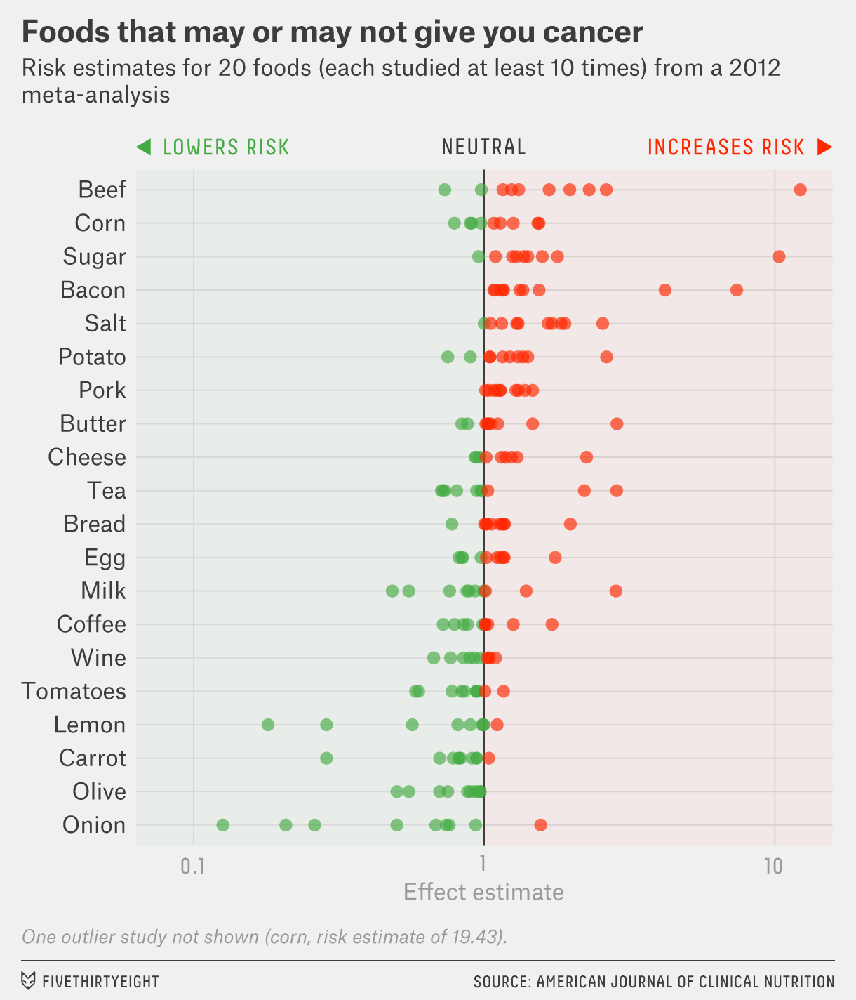

# (PART) Hypothesis Testing {-} 

# Hypothesis Testing: One Sample

```{r}
library(HannayIntroStats)
```

## Introduction and Warning
We now turn to the *art* of testing specific hypotheses using data. This is called *Hypothesis testing*. Unfortunately, hypothesis testing is probably the most abused concept in statistics. It can be very subtle and should only be used when the question being considered fits snugly into the hypothesis testing framework. We will see that very often a confidence interval is a better choice and conveys more information than is contained in a statistical hypothesis test. 

## A Starting Example
Lets say that we are investigating whether a large chemical company has been leaking toxic chemicals into the water supply of a town aptly called Chemical City. Let's say that the toxic chemical is known to stunt the growth of children. Therefore, we collect a random sample of heights of 3rd Grade children in Chemical City by measuring the heights of 42 children. Lets load it into `R` for analysis. 
```{r}
data(chemical_children)
hist(chemical_children$Heights, main='Heights of Children in Chemical City N=42', ylab='Number of Children', xlab='Height in ft', col='lightblue')
```

We can estimate the population mean $\mu$ for all the 3rd grade children in Chemical City using the sample mean:
```{r}
mean(chemical_children$Heights)
```
Suppose that we also know from a large study that the mean height for healthy 3rd grade children is $\mu=3.85$ feet. The question we can now ask is whether we have collected sufficient evidence that the growth of children in Chemical City has been stunted? Could the average height of the children been less than the national average in our sample by random chance? 

We can now form what is called the **null hypothesis** $H_0$ we wish to test.

* $H_0$ is the hypothesis that the mean height of children in Chemical city is equal to or greater than the national average $E[\bar{X}]=\mu \geq 3.85$

The null hypothesis is often the boring hypothesis which doesn't change the status quo. The opposite of the null hypothesis is called the **alternative hypothesis**. In this example our alternative hypothesis would be:

* $H_a$ is the hypothesis that the mean height of children in Chemical city is less than the national average $E[\bar{X}]< \mu$. 

As usual, our first approach will be based on simulations. We can re-sample of height data to get an idea of how variable our sample mean $\bar{X}$ will be for children in Chemical City.

```{r}
num.sim<-100000
many.studies<-replicate(num.sim, mean(sample(chemical_children$Heights, size=42, replace=TRUE))) ##generate a bunch of random sample means
length(many.studies[many.studies>=3.85])/num.sim ##find the fraction of random samples which give a value greater than the national average
```
Therefore, we can say that their is a small (about 1%) chance that our sample produced a smaller result than the national average by random chance. 

```{r, echo=FALSE, fig.cap="The red area shows those times we found a sample mean greater than or equal to the national average. Notice this distribution is mound shaped (normally distributed) this is the CLT at work again."}
h<-hist(many.studies, plot=FALSE, breaks=50)
cuts <- cut(h$breaks, c(-Inf,3.85,Inf))
plot(h, col=c("lightblue", "red")[cuts], main='Sample Averages for Chemical City Children',)
```


## The t.test command: Hypothesis Tests for the Population Mean $\mu$
For large enough $n \geq 30$ samples sizes (the same conditions for using the t.test command for confidence intervals) we can also do hypothesis testing using the `t.test` command for a hypothesis concerning the **population mean**. For example, here is the command for doing the Chemical City problem.
```{r}
t.test(chemical_children$Heights, mu=3.85, alternative="less")
```
The first parameter is the data set, the second is the null hypothesis value for the mean and the third option tells R that our alternative hypothesis is that the mean is less than 3.85. We will see examples of the other options for this. Notice that `R` will give you a sentence in the output of the `t.test` spelling out what the alternative hypothesis is. Also, notice the line which gives us the `p.value`. 

The p-value may be used to determine how well the data align with results expected when the null hypothesis is true. It is a measurement of how compatible the data are with the null hypothesis. How likely is the effect observed in the sample data if the null hypothesis is true. The p value gives the probability of observing our data as extreme (or more extreme) assuming the null hypothesis is true. 

* **High p-values** The data are likely when the null is true
* **Low p-values** The data are unlikely under the null hypothesis. 

A **low** p-value implies we can **reject the null hypothesis**. In this case we can see that the `p.value` is pretty small $p\approx0.01$ so we have strong evidence against the null hypothesis in our data. Therefore, we might reject the hypothesis that the children of Chemical City have average or greater heights. Notice that we haven't "proved" the alternative hypothesis conclusively, rather we have found it is *unlikely* that the null hypothesis holds in light of the evidence present in the sample.

```{block, type="warning"}
The one sample t test is making use of the central limit theorem under the hood. Therefore it comes with the same limitations as the CLT.

  + Only works for the hypothesis tests concerning the *mean*
  + Need sample sizes of at least 30 to be safe
  + If we apply this with smaller samples, we are assuming that the underlying population distribution is roughly mound shaped. Generally, we have no way to verify this. 

```

```{block2 type="advanced"}
The statements above might remind you of a conditional probability statement. In fact we can think of the p value as the conditional probability $$P(D|H_0),$$ that is the probability of observing the data given that the null hypothesis is true.

Recall that generally $P(A|B)\neq P(B|A)$. This error leads to a common **misinterpretation** of p values that they give the reverse conditional probability $P(H_0|D)$. It is not correct to say that p values give the probability the null hypothesis is true given the data. This is really a more useful probability to know in many ways. However, that is **NOT** what a p value gives us. To reverse conditional probabilities we need Bayes Rule.  
```

## Theory of Hypothesis Testing
We have already seen the main ingredients of statistical hypothesis testing. However, here are the basic steps for single sample hypothesis tests for the population mean $\mu$:

1. Select the alternative hypothesis as that which the sampling experiment is intended to establish. The alternative hypothesis will take one of the following forms:

    * One-tailed, upper tailed (e.g $H_a: \mu > 2400$)
    * One tailed, lower tailed (e.g $H_a: \mu < 2400$)
    * Two-tailed (e.g $H_a \neq 2400$)

2. Select the *null hypothesis* $H_0$ as the status quo. It will be the opposite of the alternative hypothesis, although if the alternative is one-tailed we can fix the value at the closest value to the alternative hypothesis. 

3. Run the test in `R` using the t.test command. 
```{r generalTtestcommand, eval=FALSE, cache=FALSE}
t.test(data, mu=null value, alternative=two.sided, less, greater)
```

4. Interpret the results using the p.value. If p is small we may *reject the null hypothesis*, if it is large we say that we *retain the null hypothesis*, or *fail to reject the null hypothesis*. More on the reasons for this jargon later, although I will say that using the correct jargon is **very important** to avoiding misinterpretations of hypothesis testing results.   


For each of the following situations form the null and alternative hypothesis and give the options for the command in `R`.

```{exercise}
In a high school they have tested out a new teaching technique on a class. The students scored an average of an 82 on a standardized test, where the national average is a 75. The school wants to know if the new teaching technique has improved the test scores.
```

```{exercise}
Lets say we have collected data on tadpole sizes in one pond in Chemical city. If the average tadpole size is 1cm we would like to know if these chemical city tadpoles are abnormally small.
```

```{exercise}
The Lays potato chip factory has added a new machine which makes bags of potato chips. If Lays machines typically put an average of 17 chips into each bag, we want to know if the new machine is performing like the typical potato chip machines.
```

```{block2, type="note"}
If you are conducting a hypothesis test and get a p value which is near 1 this might be a clue that you have your alternative backwards. 
```


## Under the Hood (t tests)
Suppose we have designed a questionnaire system (SMARTY PANTS) to select people with higher than average IQs. The IQ test by definition gives the average person a score of 100. To evaluate this system we take a random sample of 50 people which SMARTY PANTS tells us have a higher than average IQ and have them complete an actual IQ test. 

We find that the mean IQ score of our SMARTY PANTS selected people is $m=103$ with a sample standard deviation of $s=15$. 

This sample mean (m) is certainly greater than 100, but we know this could have occurred by chance. Perhaps we were just lucky in our samples? To evaluate this we want to conduct a statistical hypothesis test with:

* $H_0$: $\mu \leq 100$ The mean of those selected people by SMARTY pants in less than or equal to 100
* $H_a$: $\mu > 100$ The mean of those selected people by SMARTY is greater than 100. 
    
To evaluate this we **assume that the null hypothesis is true**. As we specified above the null hypothesis here owns all values less than or equal to 100 ( $H_0:\mu \leq 100$). The closest value in the null hypothesis range to our sample mean (m=103) is 100. So let's assume that the population (true) mean of our SMARTY PANTS sample is 100. 

Given this assumption we now want to calculate the probability that we would collect a sample of 50 people with a sample mean greater than or equal to what we actually observed $m \geq 103$? 

Well, we know from our study of sampling that the sampling distribution for the sample mean $\bar{x}$ will be approximately normally distributed (for samples with at least 30) with a mean=$\mu$ and a standard deviation given by the standard error $\sigma_{\bar{x}}=s/\sqrt{N}$. Notice this statement is using the central limit theorem.  

Figure \@ref(fig:sdHyp) shows the sampling distribution assuming the null hypothesis is true. 

```{r sdHyp, echo=FALSE, fig.cap="Sampling distribution under the assumption of the null hypothesis. Red area shows the probability of observing a sample mean greater than or equal to 103."}
x<- seq(90,110,0.01);
y<-dnorm(x, mean=100, sd=15/sqrt(50))
a=103;
b=110;
plot(x,y, type='l', ylab='Probability Density', main='Sampling Distribution SMARTY PANTS', xlab="m")
cord.x <- c(a,seq(a,b,0.01),b) 
cord.y <- c(0,dnorm(seq(a,b,0.01), mean=100, sd=15/sqrt(50)),0) 
polygon(cord.x, cord.y, col="red")
cord.x2 <- c(90,seq(90,a,0.01),a) 
cord.y2 <- c(0,dnorm(seq(90,a,0.01), mean=100, sd=15/sqrt(50)),0) 
polygon(cord.x2, cord.y2, col="lightblue")
#text(-0.0,0.15, "P(-1<x<2)")
```

Recall, we can compute the *Z score* for normally distributed values to get an idea of how extreme they are. 
$$Z=\frac{D-\mu}{\sigma}=\frac{m-\mu}{\frac{s}{\sqrt{N}}}$$

```{r}
se=15/sqrt(50)
Zval=(103-100)/se
Zval
```
This tells us that the results we observed in our data are `r Zval` standard deviations above the mean. Thus, the data we observed is not particularly extreme under the null hypothesis. We can find the probability we observe a Z score greater than or equal to 0.2 using `pnorm`:
```{r}
1-pnorm(Zval)
```

This is in fact the p value for this statistical hypothesis test. The Z value is called the **test statistic** in this case. 

To be more precise we should really use the student t distribution instead of the assuming a normal distribution for our samples. Recall, we use the student t distribution when we have used the data to estimate *both the sample mean and the population standard deviation*. This is almost always the case for real data sets. 

Using the student t distribution in `R` is pretty easy we just switch `pnorm` for `pt` and specify the second parameter for a student t distribution (called the degree of freedom). The degrees of freedom for our t distribution is just the number of samples (100) minus 1. 
  
```{r}
1-pt(Zval, df=99)
```
Notice, this is essentially the same thing as what we found with the normal approximation above. This is because the student t distribution becomes closer and closer to a normal distribution for large sample sizes.

In summary when we use a t.test command in `R`. This is what `R` computes for us:

1. The test statistic (t): $$t=\frac{m-\mu}{\frac{s}{\sqrt{N}}}$$ 

    + $m$ is the sample mean
    + $\mu$ is the mean under the null hypothesis
    + $s$ is the sample standard deviation 
    + $N$ is the sample size. 

2. The p value using the alternative keyword:
    
      + Greater: `1-pt(t, df=N-1)`
      + Less: `pt(t, df=N-1)`
      + Two-tailed: `2*pt(abs(t), df=N-1)` where abs is the absolute value of our t statistic. 
      


## Errors in Hypothesis Testing
In general two things can go wrong when we use [statistical hypothesis testing](https://latrobe.libguides.com/maths/hypothesis-testing) (Fig. \@ref(fig:errorsHypTesting)).

```{r errorsHypTesting, echo=FALSE, fig.cap="Errors in Hypothesis Testing", out.width='75%', out.height='75%' }
knitr::include_graphics('hypothesis_testing_errors.png')
```


1. **Type I Error (False Positive):** occurs when the researcher rejects the null hypothesis in favor of the alternative hypothesis, while in fact the null hypothesis is true. The probability of committing a type I error is denoted by $\alpha$. 

2. **Type II Error (False Negative):** occurs when the researcher retains the null hypothesis when in fact the null hypothesis is false. The probability of commuting a type II error in denoted by $\beta$. 


An analogy that some people find helpful in understanding the two types of error is to consider a defendant in a trial. 

Court Analogy for Hypothesis Tests:

+ $H_0:$ The defendant is innocent
+ $H_a:$ The defendant is guilty
+ Type I Error: Convict an innocent person
+ Type II Error: Let a guilty person go free

```{block2 type="note"}
Notice that we could always set one of these error rates to zero if we wanted. For example, if I just convict everyone that comes to trial then my Type II error would be zero! I cannot let a guilty person go free if I convict everyone. On the other hand I can set my Type I error rate to zero by acquitting every case. 

This might seem silly but it illustrates the point that in any real scenario (with uncertainity involved) both the Type I and Type II error rates will be non zero.
```

### Statistical Significance ($\alpha$)

We can control the $\alpha$ or false positive rate of our statistical test by setting a *significance level* before we test the hypothesis (really this should be set before we even collect the data). Typically we use $\alpha=0.05$ or $\alpha=0.01$ which mean that we have a 5% chance or 1% chance respectively of rejecting the null hypothesis incorrectly. When the statistical test is performed then we reject the null hypothesis only if the p-value produced is less than the significance level used. 

To understand this lets perform some simulations. The below code runs a t test for the null hypothesis $\mu=1.0$ for a random sample from a normal distribution which has a mean of 1.0. 
```{r}
t.test(rnorm(100, mean=1.0, sd=2.0), mu=1.0, alternative = "two.sided")$p.value
```
In this artificial case we *know the null hypothesis is true*, but due to sampling error we may occasionally get an p value which indicates that the null hypothesis should be rejected. Notice that the p.value which comes out changes every time we collect a sample and run our test.
```{r}
t.test(rnorm(100, mean=1.0, sd=2.0), mu=1.0, alternative = "two.sided")$p.value
```
This is a key-point the p value depends on the data we collect, which the result of random sampling, therefore p values are random variables themselves! 

By setting our significance level in advance to $\alpha=0.05$ we say that we will reject the null hypothesis if and only if $p < 0.05$. Lets run our simulation thousands of times to see how many times we commit a Type I error at this significance level.
```{r}
many.p.vals<-replicate(50000, t.test(rnorm(100, mean=1.0, sd=2.0), mu=1.0, alternative = "two.sided")$p.value)
sum(many.p.vals<0.05)/50000
```
We can see that we get about what we expect from this simulation. We incorrectly reject the null hypothesis about 5% of the time as expected. If we were to compute the p value of the test, **and then decide to set our significance level** we can end up with a much higher false positive rate. This is because very often we are searching for evidence to reject the null hypothesis. 

If we conduct enough experiments even when their is no effect whatsoever eventually we will find **convincing** statistical evidence against the null hypothesis. 

For example, if we conduct 100 experiments and only report the smallest p value we find then we can find an effect:
```{r}
many.pv<-replicate(100, t.test(rnorm(100, mean=1.0, sd=2.0), mu=1.0, alternative = "two.sided")$p.value)
min(many.pv)
```


```{block2 type="fallacy"}
By conducting hypothesis tests again and again until we get the result we want (rejecting the null hypothesis) we can end up with a much higher Type I error rate then $\alpha$. This fallacy (called p-hacking) is behind many of the absurd statistics you will see online. Nutrional studies are particurily prone to this type of error. This is why you may have heard that (insert common food) causes cancer and only a few weeks later hear that it cures cancer. Figure \@ref(fig:phack538) shows some [results on this](https://fivethirtyeight.com/features/you-cant-trust-what-you-read-about-nutrition/). 
```

```{r phack538, echo=FALSE, out.width='50%', out.height='50%', fig.cap="Figure downloaded from fivethirtyeight.com showing studies on food types that increase/decrease the risk for cancer"}

```


### Type II Error 
The type II (False Negative) error rate for statistical hypothesis tests is much more difficult to control than the Type I error rate. However, we can get an idea of this rate by doing some simulations where we *know* the alternative hypothesis is true. 
```{r}
type2.er<-replicate(5000, t.test(rnorm(30,mean=1.1, sd=2.0), mu=1.0, alternative = "greater")$p.value)
sum(type2.er>0.05)/5000 ##cases where the retain the null hypothesis at alpha=0.05, even though it is false
```

Notice how large this $\beta$ rate is! In the general $\beta$ will usually increase as we decrease $\alpha$.

```{block2, type='note'}
Generally as we attempt to lower the Type I error rate in hypothesis testing this will result in an *increase* in the Type II error rate. 
```


```{r}
type2.er<-replicate(5000, t.test(rnorm(30,mean=1.1, sd=2.0), mu=1.0, alternative = "greater")$p.value)
sum(type2.er>0.01)/5000 ##cases where the retain the null hypothesis at alpha=0.01, even though it is false
```
That is if we risk more False Negatives if we make our criterion for rejecting the null hypothesis very stringent. In the court analogy this is equivalent to saying by making the burden of proof very high we can control for the rate of false convictions, but making this criteria overly stringent will lead to an increase in the false acquittals. The best way to decrease both $\alpha$ and $\beta$ is to shed more light on the true nature of the population by *increasing the sample size*. We can control the false positive rate by choosing $\alpha$ small, and decrease $\beta$ by increasing the sample size.
```{r}
type2.er<-replicate(5000, t.test(rnorm(3000,mean=1.1, sd=2.0), mu=1.0, alternative = "greater")$p.value) ##larger sample size
sum(type2.er>0.05)/5000 ##cases where the retain the null hypothesis at alpha=0.01, even though it is false
```
We can see that by increasing the sample size to large samples we can get a more reasonable Type II (False Negative) error rate. 

```{block2, type='note'}
We may lower the chances of a type II error by collecting more data. The type I error rate is controlled by us in choosing an appropriate $\alpha$. 
```

### Practical Significance versus Statistical Significance

It is also important to note that just because we find the differences are *statistically significant* it doesn't mean that they are of any practical significance. For example, suppose we wanted to examine whether an online statistics tutor increased the mean grade point average of the students. If the mean GPA before the tutoring was 3.50 we could do a upper tailed significance test to see if the GPA increased. 

* $H_0: \mu=3.5$

* $H_a: \mu > 3.5$

Lets simulate this process but we will set the mean GPA after the tutoring to $3.51$. 
```{r}
gpa.after<-rnorm(10000, mean=3.51, sd=0.2)
t.test(gpa.after, mu=3.50, alternative='greater')
```
We can see that the difference in GPAs before and after the tutoring is highly, highly significant with a tiny p value. However, if we payed 500 dollars for the tutoring a difference in 0.01 in the final GPA is of no practical significance. This means we need to pay attention to the actual differences rather than just whether the result in statistically significant. If we have large enough sample sizes we can find statistically significant differences between groups which have no practical significance. This is like the twix bar from the left and right factories. 

```{block2, type='fallacy'}
Practical and statistical significance are two different things entirely. With large data sets we can find statistically significant differences which may amount to **NO** practical significance. 
```

As a matter of point if we have *small* sample sizes we can fail to find differences between groups as well. For example, if we had some nefarious wish to show that Turtles sizes on golf courses were no different than normal turtles, we might collect the data for only a few turtles (say 10) and then do a two tailed hypothesis test. Here is a simulation of this scenario:
```{r}
fake.golf.course.turtles <- rnorm(10, mean=20.0, sd=8.0)
t.test(fake.golf.course.turtles, mu=19.0, alternative = "two.sided" )
```
We can see that the mean of the golf course turtles mass is actually different than the population mean ($\mu=19.0$), however since our sample size is so small we will in general get large p values. Therefore, we fail to reject the null hypothesis. This is why we **don't say that we "accept the null hypothesis"**, because failing to reject the null hypothesis might occur because there truly is no difference OR it may occur because we didn't collect enough data. We can never prove the null hypothesis as being true, only collect and measure (using a p value) the evidence against it. 

The golf course owner might misinterpret the results of the statistical test and report that the results of the turtle survey concluded that no difference existed between the golf course turtles and normal turtles.

```{block2, type="note"}
We are careful to say we *retain the null hypothesis* or if you are a fan of double negative *we fail to reject the null hypothesis* because when we retain the null hypothesis this could happen for two reasons:
  
+ The null hypothesis is in fact true
+ We have insufficient data to reject the null hypothesis

Generally, we have no way of knowing which of these two reasons are the culprit. 
```

```{block2, type='fallacy'}
Beware of the fallacy of **accepting** the null hypothesis. Under this fallacy we could prove anything by just never collecting enough evidence to reject the null hypothesis. 
```

## Hypothesis Testing for Population Fraction
We have seen how to perform hypothesis testing for the population mean $\mu$. We can also easily do hypothesis testing for the population proportion in `R`. The same principles apply to this case, except now we are testing for evidence that our samples proportion $p$ differs from a larger population. 

### Example:
Suppose we flip a coin 20 times and obtain 15 heads and 5 tails. Can we conclude that the coin is biased? Here are alternative hypothesis is that $H_a: p \neq 0.5$ and therefore the null hypothesis is $H_0=0.5$. To run this test in `R` we use the `prop.test` command:
```{r}
prop.test(15,20, p=0.50, alternative="two.sided")
```
You will notice that the syntax for this command is similar to the `t.test` hypothesis test. Here the first entry is the number of successes in our sample, the second entry is the total number of trials in the sample, `p` sets the null hypothesis value (like mu in `t.test`), and the alternative option is the same as the `t.test`.


```{block2 type="warning"}
The conditions for performing a hypothesis test for a population proportion are the same as forming a confidence interval. We need....
  
  + At least five sucesses in our data set
  + At least five failures in our data set

I call this the rule of 5 and 5. 
```

```{exercise}
If I flip a coin 35 times and obtain 20 heads. If $p$ is the fraction of heads produced when flipping the coin can I conclude at a $\alpha=0.05$ significance level that the coin is biased towards heads?
```

```{exercise}
If only 5% of people have a rare genetic disease in the United States, if we find that 15 out of 100 people randomly sampled in Kerrville have the disease can we conclude with a significance level of $\alpha=0.01$ that Kerrville has a higher rate of this disease than the national average?
```


## Hypothesis Testing in Linear Regression
We have seen some t tests being performed already in this class when we learned about linear regression. Let's consider the simple example using the `alligator` data set. Recall this data set has two columns lnLength and lnWeight which gives the snout length of alligators against their weight. When plotting these two variable together we get a nice linear relationship in the scatter plot.

```{r}
data("alligator")
plot(alligator$lnLength, alligator$lnWeight, xlab='Snout Length', ylab='Weight', main="Alligators")
```

Therefore, we are led to doing a linear regression analysis of the relationship between these variables. From this analysis we get the familiar summary. 

```{r}
lm.alligator=lm(lnWeight~lnLength, data=alligator)
summary(lm.alligator)
```

However, now that we know a bit about hypothesis testing take a look at the last two columns in the Coefficients section. One column has *t values* and the next column gives us p values (3.08e-10, 1.49e-12). These p values are the result of performing a two tailed t test on the coefficients. These tell us if we have sufficient evidence to reject the null hypothesis that the coefficient is equal to zero. 

The other p value that you can see in this summary is on the very last line. This p value is produced by a new type of hypothesis test (rather inventively called an F-test). An F-test for a regression model allows us to compare the fit of our model against a model with all the slopes set to zero. The null hypothesis of the F-test is that a model with no slope $y=\alpha$ can explain our data just as well as our linear model $y=\beta x + \alpha$. 

In this simple case notice the F-test is redundant with the t test for the slope. In fact they give the exact same p value. In multiple regression models the F-test won't be redundant with one of the slope t tests and gives us a way to assess the overall fit of our model. 


```{block2 type="advanced"}
We can also use the F-test to compare two nested regression models. By nested we mean where one of the models can be generated from the other by setting some of the slopes to zero. We won't go into this in detail here. However if interested you can read more [here](https://bookdown.org/ndphillips/YaRrr/comparing-regression-models-with-anova.html).  
```


## Power of a Statistical Test
The final note for this section is to define the **power** of a statistical hypothesis test. The power of a test range from 0 to 1, with 1 being the most powerful test. The statistical power of a hypothesis test is given by $$\text{Power}=1-\beta$$ where $\beta$ is the Type II (False Negative) error rate. The power of a test a measurement of the ability of the test to distinguish truth from illusions. We saw that if we collect only a small amount of data, then we have very little evidence from which to draw our conclusions. Therefore, our statistical test has little power in this case. In addition, since collecting more data will in general decrease our Type II error rate we can increase the power of any test by collecting more data.

In Statistics much effort is devoted to finding the most powerful test available for a given scenario. Generally, to increase the power of a test without collecting more data we will need to add some assumptions about the data. If these are justified then all is well and we will get reduced error rates. 

## Homework

### Concept Questions:
1. If I test 100 hypotheses using a significance level of $\alpha=0.05$, what is the expected number of Type I (False Positive) errors?
2. Collecting larger samples lowers both the Type I and Type II error rates for a Hypothesis test (True or False?) Why?
3. By testing a hypothesis many times against data, eventually I will collect a sample which allows me to reject the null hypothesis (True/False)
4. The p value measures the weight of evidence against the null hypothesis present in the data. (True/False)
5. The p value of a test is a random variable. (True/False)
6. By collecting enough data we can prove the null hypothesis (True/False)
7. Decreasing the significance parameter $\alpha$ will decrease the risk of False Negatives (Type II errors) (True/False)
8. A p value is the probability that the null hypothesis is true. (True/False)
9. A p value can be thought of as a conditional probability $P(D|H_0)$ where D is the data. (True/False)

### Practice Problems:
For each of the scenarios below form the null and alternative hypothesis. 

1. We want to measure if people in Kerrville consume on average more fried food in a week than the national average of 1 pound of fried food a week. 
2. We would like to evaluate if a smaller fraction of people in Kerrville support banning those on the no-fly list from purchasing a gun than the national average. A national poll found that around 80\% of the public supported this measure. 
3. You have had have collected the number of cyber attacks each week on your website during the last year. You would like to test whether there has been a change in the long-time average of $425$ attacks per year. 

### Advanced Problems

1. Within the Turtle data set conduct a hypothesis test to determine if we have sufficient evidence to conclude that Turtles which were collected on the Property "BGAD" have a mean mass greater than 2100 grams.  The following R command filters the mass data to give only those Turtles collected on the BGAD property and drops any turtles whose weights were not measured. 
```{r eval=FALSE}
td<-na.omit(Distel_Turtle_Data$Mass[Distel_Turtle_Data$Property=='BGAD'])
```

2. Using Lebron James Data Set (from the Confidence Interval homework) conduct a hypothesis test to see if we have sufficient evidence that Lebron's true scoring average PPG exceeded 20 PPG in 2016-2017. 
3. You suspect that an online poker game is not giving you random cards. The odds a receiving two pair in a five card hand determined randomly is 42.25\%. You have played 100 hands and only started with a single pair 32 times. Do you have sufficient evidence to conclude that the website is cheating? 

4. Explain why we are careful to say we "fail to reject the null hypothesis" or "retain the null hypothesis" versus we "accept the null hypothesis". 

5. Load the `wine_tasting` data set. Conduct a hypothesis test to determine if the mean price of a bottle of wine from France is truly greater than the average price of a bottle of wine from all countries in the data set (the mean of the price column). Report and interpret the p value obtained from your test. 

6. Load the `NBA_Salaries_2017` data set. Determine whether we have sufficient evidence to conclude that the average guaranteed salary of NBA players ( NBA_Salaries_2017$Guaranteed) exceeded 16 million in 2017. Report and interpret the p value obtained as well as justifying the use of the statistical hypothesis test chosen. 


