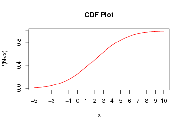
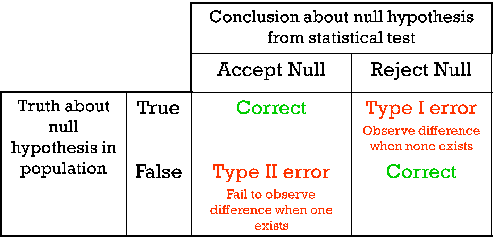

--- 
title: "Introduction to Statistics and Data Science"
author: "Dr. Kevin Hannay"
date: "`r Sys.Date()`"
site: bookdown::bookdown_site
output: bookdown::gitbook
documentclass: book
bibliography: [book.bib, packages.bib]
biblio-style: apalike
link-citations: yes
github-repo: khannay/statsbook
description: "Introductory textbook for statistics and data science"
---

```{r importEverything, echo=FALSE, warning=FALSE, message=FALSE}
library(MASS)
library(knitr)
library(tidyverse)
library(HannayIntroStats)
library(dplyr)
library(ggrepel)

opts_chunk$set(echo=TRUE, cache=TRUE, autodep=TRUE, cache.comments=FALSE,message=FALSE, warning=FALSE,tidy.opts=list(width.cutoff=80),tidy=TRUE)
```

# Preface

Welcome to the exciting world of statistics and data analysis. During this semester we will learn tools for *reasoning under uncertainty*. 

Our brains are not programmed to do well in reasoning with any level of uncertainty. For example, one of the two lines shown below are random numbers and the other is not. Can you tell which is pure random?

```{r, echo=FALSE, cache=TRUE}
set.seed(191)
y1<-sample(seq(0,9), replace = TRUE, size = 50)
y2<-rep(5,50);
for (i in 2:50) {
  t<-sample(seq(0,9), size=1)
  while (t==y2[i-1]) {
    t<-sample(seq(0,9), size=1)
  }#while
  y2[i]<-t;
}
print(y1)
print(y2)
```

## Librarian or Farmer?

Steve is very shy and withdrawn, invariably helpful but with little interest in people or in the world of reality. A meek and tidy soul, he has a need for order and structure, and a passion for detail.” Is Steve more likely to be a librarian or a farmer?

## Profits

Suppose you are a sales manager and are presented with the below plot of profits for the last five years. What conclusions can you draw from the below graph?
```{r, echo=FALSE, cache=FALSE}
set.seed(1012)
p<-rnorm(5, mean=100, sd=10)
dataProfits<-data.frame(Year=seq(2014,2018, by=1), Profits=p)
ggplot(dataProfits, aes(x=Year, y=Profits))+geom_point()+geom_line()+labs(title='Yearly Profits')+ylab('Sales Profits in thousands of dollars')
```

## Accidental Deaths

Now, suppose that you are investigating the occurance of accidental deaths within the united states where the cause of death is a fire. We may download the data from the center for disease control (CDC) for the year 2017 to look for which states have the highest rates and the lowest rates. By *rate* here we mean the number of deaths per hundred thousand residents in the state. Overall in the United States the rate of accidental deaths of this type is quite low at `r sum(fire_deaths_2017_states$crudeNumber)*1e5/(sum(fire_deaths_2017_states$population))` per hundred thousand americans in 2017. 

The five states with the highest rates are shown in the below table:

```{r fireDeathsWorst, echo=FALSE}
data("fire_deaths_2017_states")
myfiredisplayTop10 =fire_deaths_2017_states %>% mutate(population.percentage.us=(population/sum(population))*100) %>% select(stateName, RatePerHundredThousand, population.percentage.us) %>% arrange(desc(RatePerHundredThousand), desc(population.percentage.us)) %>% head(5)
kable(myfiredisplayTop10)
```

Notice these states have much higher rates then the nation wide average of `r sum(fire_deaths_2017_states$crudeNumber)*1e5/(sum(fire_deaths_2017_states$population))`. This might make us want to avoid these states! On the other hand the five states with the lowest rates are shown in the below table. 

```{r fireDeathsBest, echo=FALSE}
data("fire_deaths_2017_states")
myfiredisplayTop10 =fire_deaths_2017_states %>% mutate(population.percentage.us=(population/sum(population))*100) %>% select(stateName, RatePerHundredThousand, population.percentage.us) %>% arrange(desc(RatePerHundredThousand), desc(population.percentage.us)) %>% tail(5)
kable(myfiredisplayTop10)
```

These states all had zero accidental fire deaths in 2017. However, do you notice anything strange about our top/bottom ten lists here in terms of the populations? Perhaps the below graph will help you see what is really going on here. 

```{r echo=FALSE}
myfiredisplay =fire_deaths_2017_states %>% mutate(population.percentage.us=(population/sum(population))*100) %>% select(stateName, RatePerHundredThousand, population.percentage.us) %>% arrange(desc(RatePerHundredThousand), desc(population.percentage.us))
fire.plot1<-ggplot(myfiredisplay, aes(x=population.percentage.us, y=RatePerHundredThousand))+
  geom_point(color=dplyr::case_when(myfiredisplay$RatePerHundredThousand>=1.7~"red", myfiredisplay$RatePerHundredThousand==0.0~"blue", TRUE~"darkgreen"))+
  labs(title='Accidental Deaths (Fire) 2017')+
  ylab('Rate of Deaths Per 100k')+
  xlab("Population Percentage of United States")

fire.plot1 + geom_label_repel(data=subset(myfiredisplay, myfiredisplay$population.percentage.us>5), aes(label = stateName),
                  box.padding   = 0.35, 
                  point.padding = 0.5,
                  segment.color = 'grey50')+
  geom_hline(yintercept=0.80, color="coral")+
  geom_label_repel(data=subset(myfiredisplay, myfiredisplay$RatePerHundredThousand>1.75), aes(label = stateName),
                  box.padding   = 0.35, 
                  point.padding = 0.5,
                  segment.color = 'grey50')
  
```


These notes are written in bookdown [@R-bookdown]. 


```{r bibBuilder, include=FALSE}
# automatically create a bib database for R packages
knitr::write_bib(c(
  .packages(), 'bookdown', 'knitr', 'rmarkdown'
), 'packages.bib')
```

<!--chapter:end:index.Rmd-->

# (PART) Exploratory Data Analysis {-} 

# Introduction to R


## What is R?
R is a language and environment for statistical computing and graphics. R provides a wide variety of statistical and graphical techniques, and is highly extensible. Basically, anything you could ever want to do using statistics has already been done in `R`. 

Better yet R is completely free to use and [download](https://cloud.r-project.org/). Unfortunately, R has a bit of a learning curve to get comfortable using it. We will only be using a little bit of the whole power of R in our class, and I will introduce all the commands you will need as we come to them. You are authorized to use R for any homework questions and it will be available to you for any class requirements. R is the principle tool for completing the projects for the class. 

As a little motivation the average salary of those who write computer code in R is over $100,000 a year. So learning a little bit of R may make you rich someday. It will also give you a leg-up over any future job market competitors, as knowledge of R is highly desirable by employers. 

[RStudio](https://www.rstudio.com/products/rstudio/download/##download) provides a nice interface to the power of R, and I will be using RStudio exclusively in this class. It is also free for personnel use. 

## R Packages
The true power of `R` lies in the harnessing of the work of millions of nerds across the globe who use `R` and write up useful packages which add new features to `R`. There are thousands of `R` packages which can be installed to add features to `R`, we will only be using a few of these in the class.

In particular, your instructor is a nerd who has created his own `R` package specifically for this class. You will be using this package almost every time we use `R` in this class. I will expect that you have loaded R Studio and have run the command `library(HannayIntroStats)` when giving directions in class, on tests, etc. Make sure you have installed my package and load it anytime you are working in this class.

To install the class R package you will need to run the following commands:
```{r, eval=FALSE}
install.packages("devtools") #get the package installing package
devtools::install_bitbucket(repo="khannay/hannayintrostats.git") #install the class R package
```

You will only need to run these install commands one time. From now on you can start your R session by giving the command:

```{r, eval=FALSE}
library(HannayIntroStats)
```

```{block2, type='warning'}
Remember to load the class R package when you open RStudio using library(HannayIntroStats)
```

## R as a Fancy Calculator

#### Basic Operations
The console in R can be used like a very powerful calculator:
```{r}
2+3 ##add two numbers
2-3 ##subtract two numbers
2*3 ##multiply two numbers
2/3 ##divide two numbers
2^3 ## raise 2 to the third power
```

R also has many functions which we can use just like on a calculator. For example we can use the trigonometric function $\sin(x)$:
```{r}
sin(10.0)
```
Or we could use the exponential function $y=e^x$ easily using:
```{r}
exp(2.0)
```
You can always look up what a function does using:
```{r helpPage, eval=FALSE}
?exp
```
which will bring up the details of what that function does in RStudio. You can also search for a function using the RStudio help menu. 

R has many functions which aren't typically on a calculator. For example, I will use the `print()` function a bunch in these notes. This just prints a variable to the screen. 

#### Variables in R
You won't use the R command line very long before you want to save the value of a computation. This is easy to do in R:
```{r}
x=2
y=x+2
print(y)
```
The first line says define the value of x as 2, the second line define y as the value of x+2=(2)+2=4. One note is we come back later and change the value of x, the value of y won't change automatically. You need to run the y=x+2 line again to update y if you change x. 
```{r}
x=2
y=x+2
print(y)
x=3;
print(y)
```
As a note you can use either the equals sign `x=2` to assign a variable a value, or you can use the "arrow" way `x<-2`. I will generally use the arrow method, as I think arrows are cool. You are welcome to use either notation. 
```{r}
x<-2;
y<-x+2
print(y)
```

Within Rstudio you can always see what variables are defined during your current session in the upper right panel under the environment tab.

```{exercise}
Open RStudio and use `R` as a calculator to find the value of `2^3+exp(3)/10` in the console. 
```

## More Advanced R

### Data Types in R
R stores the variables as one of a few different types, 

Data Type  | Example 
---------------|--------------------------
logical        | TRUE/FALSE
numeric        | 1.23, 2.3 decimal numbers
integer        | 0,1,-1,2,-2, etc
character      | 'abc', 'Hannay', etc
factor         | A categorical variable which takes on a small number of values

and a few types we should never need to use. Note that for the character types I use quotes around them, this tells R to consider that as a character and not a variable name. You can use either single or double quotes as long as they match. The data type shouldn't matter much as R typically picks the correct type for our variables automatically. If you are curious you can check what type a variable is using the `class()` command:
```{r}
last.name<- "Hannay"
class(last.name)
age <- 22
class(age)
```
If you want to change the type of a variable you can use the `as.numeric, as.character, as.integer, etc` functions. For example, if we want to store `age` as a integer instead as a numeric type we could use:
```{r}
age.int <- as.integer(age)
class(age.int)
```

## Logic in R

The logical types are returned when we ask the computer true/false questions like:
```{r}
old<- age.int > 30;
print(old)
```

The answer to whether the integer called age.int is greater than 30 is FALSE. 

```{r}
class(old)
```

We can see that R stores the answers to our true/false questions using the logical type. The most basic logical operations we can do are comparisons. To put these into `R` we need the following notations.


What is we want to ask R more complicated logical questions for example how can we ask whether a number $a$ is between 1 and 2. Mathematically this would look like: $$ 1 < a < 2.$$ The key is to notice this is really just two of our questions from before stacked together. We want to know if $a>1$ **AND** if $a<2$. 

To ask this question in `R` we can use the `&&` operator. 

```{r}
a=2.8
(a>1) && (a<2)
```

```{r}
a=1.6
(a>1) && (a<2)
```

We may also want to ask the logical questions which involve using **OR**. For example, we can ask whether a character equals apples OR oranges. 

We denote an OR question in `R` using the notation `||`. This one doesn't make as much sense as the `&&` for and but this is the standard notation for computer scientists. 

```{r}
a='apples'
(a=='apples') || (a=='oranges')
```

```{r}
a='grapes'
(a=='apples') || (a=='oranges')
```

We may also reverse the answer to a logical question using the **NOT** operator `!`. This just reverses our answer TRUE becomes FALSE and FALSE becomes TRUE.

```{r}
a='grapes'
!((a=='apples') || (a=='oranges'))
```

Logical Comparison Operation  | R notation
---------------|--------------------------
Equality       | == 
Greater than   | >
Greater than or equal to | >=
Less than   | <
Less than or equal to | <=
AND | &&
OR | \|\|
NOT | !
NOT EQUAL | !=

You might rightly ask can we really do everything we will want to do with these relatively simple logic operations? Pretty much, as long as we learn to ask the questions in the right way. Perhaps I am biased but my field of mathematics is basically just a bunch of these logical operations chained together in new and interesting ways. Also these logical operations underlie the mechanics of computers used for everything from guiding missles to posting pictures of cats on instagram. 

```{block2, type='warning'}
Notice that testing for equality uses a **double** equal sign (==). This is because the single equals sign is already being used to save a variable to memory. This is a very common error!
```

## Storing Data in R

### Vectors

Statistics involves analyzing large collections of data, so individually naming each variables would be a huge waste of time. We need a way to store a collection of related data and give them a single name. For this we have `vectors` in R.

```{r}
x<-c(1,2,3)
```
The `c` here is a function which concatenates the collection of numbers 1,2,3  into a single `vector`. If we do operations on vectors they act on each entry individually. 
```{r}
x+1 ##add one to each number in x
x^2 ##square each number in x
x>2 ## for each number in x, ask the question is x greater than 2? 
```
If we want to access the entries of x individually we can use brackets `x[1]` to get that entry individually. For example the first entry of x can be accessed using:
```{r}
x[1]
```
The third entry:
```{r}
x[3]
```
If we try to access the an entry in a vector which isn't there we get `NA` back,
```{r}
x[4]
```
which stands for **Not Available**. To avoid this we can always find the length of a vector (number of entries) using:
```{r}
length(x)
```
We can also add all the values in a vector using the `sum` command,
```{r}
sum(x)
```
Besides creating vectors using the `c` function and manually typing them in `R` provides many other ways to create vectors.
For example the `seq` function, short for sequence, can be used to get a vector with a sequence of values separated by an increment:
```{r}
seq(0,10,1) ##created a vector with values going from 0 to 10 by 1
```
as another example
```{r}
seq(0,1,0.1)
```

The seq command can be useful if we want to apply a function to a vector of evenly spaced values, e.g.
```{r}
x.example<-seq(0,5,0.1) ##values from 0 to 5 every 0.1
y.example<-exp(x.example) ## the exponential of each value in the x vector
print(y.example)
```

Later we will see how to create of plot of the exponential function by plotting x.example versus y.example:

```{r echo=FALSE}
plot(x.example, y.example, main='Plot of the Exponential Function', xlab='x.example', ylab='y.example')
```

We can also use our logical operators to **slice** a vector. For example, suppose we want to get only the elements in our `y.example` vector which are less than or equal to 50. 

```{r logicalSlices}
y.example[y.example<=50.0]
```
This R command translates to "give the elements of the vector y.example where the logical statement y.example<=50.0 is true."


```{exercise}
Make a vector in R with the numbers 1,2,3,4,5 and save it under the name my_vec. Slice your vector to vector to get only values greater than 3. 
```


### Data Frames
We will find that vectors are still inconvenient when dealing with many statistical data sets. Imagine are looking to come up with a statistical way of measuring body mass index. We collect the genders, heights, weights, and ages of the study participants. We could try and store this data as four separate vectors (one for each category of our data) but this is unwieldy. Moreover, storing them as four seperate vectors we lose the knowledge that they are all connected as part of our BMI study. 

Instead we can create one `data frame` variable which stores all this information:

```{r}
## Create the data frame.
BMI <- 	data.frame(
   gender = c("Male", "Male","Female", "Male", "Female", "Female"), 
   height = c(81,93, 78,100,92,75),
   weight = c(152, 171.5, 165,140,192.1,180.2),
   Age = c(42,38,26,52,18,23)
)
print(BMI)
```
This way we can name the columns (gender, height, weight, Age) and store all this related information under one name. If you have my package installed and loaded you can load this data set in by typing `data(BMI_Example)`. To get a look at the data in a spreadsheet type format you can type `View(BMI_Example)`.

If we want to see the names of the columns we can use the command:
```{r}
colnames(BMI)
```
We can see the size of this data set (rows by columns) using the command `dim` or by looking at the information provided in the enviroment tab in the top right of the RStudio window. 

```{r}
dim(BMI)
```

From a data frame it is easy to access a single column. For example if we want to look at just the ages we can use the `$` command:
```{r}
BMI$Age ##get the Age vector from the dataframe named BMI
```
Of if we want to see the weights we use the command:
```{r}
BMI$weight ##get a vector of the weights in the BMI data frame
```
Individual entries in the data frame can still be accessed easily as well. However, now we need to give the row and column numbers (instead of just the one index in a vector)
```{r}
BMI[2,3] ##Get the entry in the data frame in the second row, third column (weight of the second participant)
```

We could also have gotten this information by specifying the column using the dollar sign `$` and the row as a single index. 
```{r}
BMI$weight[2]
```

Finally, if we want to look at a row of our data we can use:
```{r}
BMI[2,] ##Get all the data for the second participant in the study
```
Notice the use of the **comma**. 

If you are worried that it will be a pain to type in the data.frames-- don't worry I will show you how to read data frames in automatically from spreadsheets of data. In addition, most of the data sets used in the class will be loaded using the command `data()` from the R console. You won't spend much time typing in data sets into R. 


#### Filtering Data Frames

Now comes the real cool part of `R`, and a big reason why it is used so much. Data frames are a powerful tool for keeping large collections of data organized, but often we will want to consider just a subset of the data. For example, in our body mass index `BMI` data frame above we might want to just consider the entries where the gender is female. 

Therefore, we want to consider just a **subset** of the available data. Intuitively, we can do this using the powerful `subset` command in `R`. 

```{r}
BMI.FEMALE<-subset(BMI, BMI$gender=='Female')
print(BMI.FEMALE)
```
The new data frame `BMI.FEMALE` has only the entries where the gender is Female. Once again notice the use of the double equal sign `==`, it used to ask if the entry is equal to a given value. When using subset the first entry is the whole set we are trying to extract a piece from, and the second entry gives the logical condition for the piece we want to grab. 

For another example imagine we are interested in looking only those participants who are over the age of 30. Then we could filter the data frame using:
```{r}
BMI.OLD <- subset(BMI, BMI$Age>30)
print(BMI.OLD)
```
This filters the data frame so that we only see the rows where the age variable is greater than 30. We can also get the entries with ages less than or equal to 30 using:
```{r}
BMI.YOUNG <- subset(BMI, BMI$Age<=30)
print(BMI.YOUNG)
```

We will see many examples of using filtering to look at subsets of data in the class. You will be expected to be able to perform basic filtering of data frames on all of the assessments in this class. **It is worth your time to learn how to do this now!**

```{exercise}
Load the animal sleep data frame by typing the command `data("animal_sleep")` into the R console. Look up the help page for this data set using the command `?animal_sleep`. The help pops up the the lower right panel in RStudio. All the data sets I provide in the class will have a help page like this telling you what each column in the data set means. Filter this data frame to keep only rows where the `vore` column is equal to `carni`. How many rows are left in this subset? 
```


```{exercise}
Load the geese flocks data set using the command `data(geese_flocks)` filter this data frame to have only rows (observations) where the flock.size is greater than 50. How many rows are left in this reduced data frame? 
```


## Basic Plots in R
`R` has an extremely powerful library of functions for producing pretty plots of data. We will only use a few of these commands in the course of the class. For now lets assume we want to plot the height and weight variables from the BMI data frame. 
```{r}
plot(BMI$height, BMI$weight)
```

This gives a plain plot with the height on the x-axis and the weight on the y-axis. Notice that `R` automatically labels the axes using the names given by the data frame (`BMI$height` and `BMI$weight`). We can easily improve the aesthetics of the plot using a few extra parameters to the `plot` function. 

```{r}
plot(BMI$height, BMI$weight, main='BMI Height versus Weight', col='red')
```

The keyword `main` changes the title of the plot, and the keyword 'col` changes the color of the points to being red. If for some reason you wanted to change the x-axis and y-axis labels this can easily be done as well:

```{r}
plot(BMI$height, BMI$weight, main='BMI Height versus Weight', col='red', xlab='Height', ylab='Weight')
```

The `xlab` keyword changes the x-axis label and likewise for the `ylab` keyword. Within RStudio you can view the plots and save them as images easily. 

Notice the use of quotes around the inputs for the axis labels and the plot title. This tells `R` that these are character types and not some variable named Height, etc. This is a common mistake in using R. 

As a note for the class, producing pretty plots is not really our goal so you are not required to produce plots which are easy on the eyes. However, it is important to produce plots which are readable and convey the correct information. To this end it will be a good idea to get used to labeling your graphs axes and giving each graph an informative title. 

```{block2, type='note'}
The graphics commands we learn in R will all have the same keyword arguments (as long as they make sense for that plot). For example, main='Blah' will set the title of the graph to be 'Blah'. 
```

```{block2, type='advanced'}
We we be using basic plots in R for this course, but you can make some really pretty plots using another R package called ggplot2. A quick google search will give you an introduction to this more fancy plotting library. 
```

## Additional Resources

A huge number of people use `R` for statistical analysis creating a large online nerd community. If you are having an issue there is a 99.999% chance that someone else has suffered in the same way and has asked for help on an online forum. Many times a quick google search for the issue you are having will save you much time and frustration. 

Here are a few links for R resources around the web. Note that these tutorials are much more extensive then will be required for this class. We are only going to use R as a tool to make learning and doing statistics easier. 

* [The official intro to R pdf](https://cran.r-project.org/doc/manuals/R-intro.pdf)
* [DataCamp Free Online Course on R](https://www.datacamp.com/courses/free-introduction-to-r)
* [R-tutor introductory course](http://www.r-tutor.com/r-introduction)
* [R short reference card](https://onlinecourses.science.psu.edu/statprogram/sites/onlinecourses.science.psu.edu.statprogram/files/lesson00/Short-refcard.pdf)
* [Statistics using R Textbook](https://cran.r-project.org/web/packages/IPSUR/vignettes/IPSUR.pdf)
* [Lynda has several R tutorial videos](https://www.lynda.com/)
* [Youtube has thousands of videos on R](www.youtube.com)
* [RBloggers: Resources for learning R](https://www.r-bloggers.com/how-to-learn-r-2/)


```{block2, type='advanced'}
If anyone reading this has a background in computer programming then you are probably wondering if `R` has all the features you are used to in other programming languages. The answer is yes (for the most part). R is a full programming language with the usual conditional statements (if, else, etc) and loops (for, while) that you are used to. We won't focus on the computer programming aspects in this class but their are many resources online for learning the full R programming language. 
```


## Homework

#### Concept Questions
1. What are the fundamental data types in R?
2. Explain the difference between using `=` and `==` in `R`.
3. What does the command `rep` do in `R`? Look at the help page for this function
4. How can I convert the data type of a variable from an integer to a factor?
5. For what numbers will the following logical statement evaluate to TRUE? !((a>10)||(a<1))?
6. Look up the help for the rep command in `R`. Create a vector which has 100 copies on 23 in it. 


#### Practice Problems
1. Make a scatter plot of the parabola y=x^2 for x between [-1,1] in R.
2. Create a vector with the numbers 1,2,3,4,5 and call this vector x:

    + Type x==1, what does the result produced mean? What is R doing?
    + Type x>2, what does the result tell you?


#### Advanced Problems

1. Install R and R Studio on your laptop (if you have one) and follow the directions at the start of these notes to install the class R package. 

2. Load the `mtcars` data set by typing `data(mtcars)`. Bring up the help page for this data set by typing `?mtcars`.


    * How many cars are there in the data set total? 
    * How many cars with 6 cylinders?
    * How many cars weight more than 4000 lbs? Hint the `wt` column gives the weight of the cars in 1000's of pounds.
    * How many cars weight more than 2000 lbs AND are four cylinders?
    * Create a new column on the mtcars data set which is given by the weight of the car divided by its horsepower. What is the value of this new column for the Volvo 142E car?
    * How many cars get better than 20.0 miles per gallon?

3. Load the wine_tasting data set `data(wine_tasting)`. 

    * What is the size of this data set? rows x columns
    * How many wines in the data set are less than 100 dollars in price? 
    * How many wines are from the united states? This is stored with the name "US" in the country column

4. You can generate a vector of random numbers of length $N$ using the command `rnorm(N)`. 

    * Generate a random vector of length 1000 using `rnorm` and save it under the name rx
    * How many of the entries in this vector are positive? Hint use logical vector slices

5. We can also do some simulations in `R` using the `sample` command. Look up the help page for this command using `?sample`. As an example, suppose I want to generate the results of random (fair) coin flips in `R`. We can do this
using the sample command. The below command generates 100 random coin flip results. To use the sample command we put in a vector of outcomes, then set the number of draws to perform (size=100). The final options says that we should draw from the full list of options each time (otherwise we can have no repeats)
```{r eval=FALSE}
coin.options=c('H','T')
sample(coin.options,size=100, replace=TRUE)
```
      
      
  * Generate 1000 rolls of a fair six-sided dice using the sample command and save the result. 
  * How many 6's appear in your simulation? Does this change if you run a new simulation? 

6. Load the candy rankings data set using the commands: 
```{r eval=FALSE}
  library(fivethirtyeight)
  data("candy_rankings")
```
Look at the help page for this data set to see what the various columns mean. 

  + How many candies are in this data set?
  + What `R` data type is being used to store the `chocolate` column?
  + How many candies contain nougat?


<!--chapter:end:01-IntroductionToR.Rmd-->

# Exploratory Data Analysis 


## Shot Logs Basketball Data 
We load a data set (originally downloaded from kaggle.com) which has every shot taken during the 2014-2015 NBA season. This can be done by giving the commands:

```{r readdata, warning=FALSE, message=FALSE}
library(HannayIntroStats)
data("shot_logs_2014")
```
We can see what the columns of the data frame are using the colnames command:
```{r exploredata, warning=FALSE, message=FALSE}
colnames(shot_logs_2014)
```
We can access each of these columns using ```shot_logs_2014$COL_NAME```, for example ```shot_logs_2014$TOUCH_TIME``` gives the data for how long each player had the ball before taking the shot. 

You can also look-up the help page for that data set using the command:

```{r eval=FALSE}
?shot_logs_2014
```


## Principal Types of Statistical Data

Data comes into two principle types in statistics, and it is crucial that we recognize the differences between these two types of data.

1. **Categorical Variables**: These are data points that take on a finite number of values, *AND* whose values do not have a numerical interpretation. For example, "Male" or "Female", the position of an NBA player, the species of a toad, the color of a mushroom, etc. Each of these examples take on a finite number of possibilities, and it doesn't make sense to add the colors or mushrooms, the species of toads, etc. Many times these variables will have non-numerical names, however this is *NOT* the way to tell. For example, smoker versus non-smoker could be encoded in our data as S versus NS, or it could be 1 versus 0. The context of the data is the only sure way to tell whether a variable is categorical or not. Categorical variables may be divided into two sub-groups called ordinal and nominal variables:

    + **Ordinal categorical variable** takes on values which can be logically ordered. For example, the reviews for an product which are given as 0-5 stars. We can say that 4 stars is closer to 5 stars then 1 star is. Academic grades A,B,C,D,F provide another example of ordinal categorical variables. 

    + **Nominal categorical variables** cannot be put in any logical order. Examples of this would be the gender, toad species, race, etc. 

2. **Numerical Variables**: These are variables which are numerical in nature, so adding them together makes mathematical sense. They can come in two principle subcategories, either discrete or continuous. 

    + **Continious Variables**: Take on a continious values (no breaks). For example, height, weight, reaction time for a chemical reaction, profits from a stock transaction, etc are examples of continuous numerical variables. 
    
    + **Discrete numerical variables** take on a set of values which can be counted. For example, goals scored by a soccer team, assists in a game for an NBA player, number of leaves on a spinach plant, etc. 

Here is a handy flow chart to help you keep these variable types straight:


```{r addVariablesDiagram, echo=FALSE}
knitr::include_graphics('VariableTypes_Diagram.png')
```


We will develop different statistical approaches based on whether the data are numerical (discrete/continuous) or categorical in nature. `R` knows about this important distinction and we can let `R` know that a variable should be treated as a categorical variable by using the command `as.factor`. 

```{r}
shot_logs_2014$W=as.factor(shot_logs_2014$W) ##make sure that the wins column is treated as a categorical variable (factor)
class(shot_logs_2014$W) ##check the type of data stored in this column
levels(shot_logs_2014$W) ##give the options for a categorical variable
```

The `levels` command tells us how many different categories are in the categorical variable. 

#### Exercises

```{exercise}
Consider the PTS_TYPE column of the shot logs data set. Should this be considered a continuous or categorical variable? 
```

```{exercise}
How many levels does the Location variable have? What are they? Is this variable ordinal or nominal?
```

```{exercise}
What type of variable is the SHOT_CLOCK variable in the shot logs data set?
```

```{exercise}
How many shots are in the data set for away games? (Practice Filtering data sets in R)
```


## The Distribution of a Data Set


The most crucial step to exploratory data analysis is estimating the **distribution** of a variable. We begin with continuous variables and the histogram plot. 

#### Histograms (Continuous Variables)

First let us consider the distance measurements for every shot taken during the NBA season. This is over 128,000 distance measurements so just staring at these numbers won't give us much insight into the data. 

We may be interested in the number of shots which are taken from a given distance. If we define bins for our data then we can count the number of shots between say 12-15 feet and compare this with the number in the other bins. This is called a histogram of the data. Luckily R has a built-in function for this. 
```{r morley}
hist(shot_logs_2014$SHOT_DIST, freq=TRUE, main="Distances of NBA Shots 2015", xlab='Distance (ft)', ylab='Number of Shots', col="light blue")
```

The histogram tells us that nba players tend to either try to shoot from very close to the basket or from 3-pt shots. In fact we can compute that ```r length(shot_logs_2014$SHOT_DIST[shot_logs_2014$PTS_TYPE==3])/length(shot_logs_2014$SHOT_DIST)*100```% of the shots taken were 3pt shots and ```r length(shot_logs_2014$SHOT_DIST[shot_logs_2014$SHOT_CLOCK<=12.0])/length(shot_logs_2014$SHOT_DIST)*100```% were taken from less than 12 feet. 


Notice that histograms can be very sensitive to the number of bins that you use. By default R will choose the number to bins used to be somewhat appropriate. However lets see what happens if we choose only a few bins for our histogram. 
```{r}
hist(shot_logs_2014$SHOT_DIST, freq=TRUE, breaks=3, main="Distances of NBA Shots 2015 (bad bins)", xlab='Distance (ft)', ylab='Number of Shots', col='cyan')
```

The conclusions for our data is entirely different! With these large bins it looks like NBA players just try and get as close as possible to the basket.

```{block2, type='fallacy'}
Always question the bin sizes for a histogram to see whether they are appropriate for the plot being presented. If you see a histogram with illogically large or small bin sizes and/or uneven bin sizes beware of the results being presented! 
```

For the purposes of this class you can usually just use the default number of bins in R, unless you have some special reason to change the number of bins. 


From our data we can also pull out individual players shot-chart for the 2015 season. For example, Steph Curry's distribution of shot distances is given by,
```{r}
sc_data<-subset(shot_logs_2014, shot_logs_2014$player_id==201939) ##get only those rows (shots which were taken by Steph Curry)
hist(sc_data$SHOT_DIST, freq=TRUE, main='Steph Curry Shot Distances', xlab='Distance (ft)', ylab='Number of Shots', col='lightblue', breaks=20)
```

#### Tables (Categorical Variables)

To investigate the distribution of categorical variables we will use the powerful `table` command to generate bar plots and/or pie charts. For example, if we use the `table` command on the LOCATION column of the the shot logs data set we get a count of the number of shots taken for home teams and away teams in the data set. 

```{r}
table(shot_logs_2014$LOCATION)
```

To get a graphical representation we can use the output from the table command to make a bar plot. Here I have added the command prop.table outside the table command. This changes our table from raw counts to the proportion of the data in each category. 

```{r}
barplot(prop.table(table(shot_logs_2014$LOCATION)), main='Location of the Game')
```

Another way to represent the proportions in each category is to use a pie chart. This is also easily done in `R`.

```{r}
pie(prop.table(table(shot_logs_2014$LOCATION)), main='Location of the Game')
```

```{block2, type='note'}
Pie charts should not be used to categorical variables with many levels (options) or to present data where some levels are very rare. Pie charts can give a sense of the relative size but small differences in the proportions are hard to see. These data are better presented using a barchart.
```

```{block2, type='fallacy'}
A common way of creating a misleading statistical plot is to make a pie chart where it is unclear what the whole pie represents. 
```

The table command can also be used to create an two-dimensional table based on the values of two categorical variables. For example, within the nba shot logs data set we could make a table:

```{r}
table(shot_logs_2014$LOCATION, shot_logs_2014$SHOT_RESULT)
```
We could then use statistical analysis we will learn in this class to examine whether NBA teams shot a higher percentage on shots during home games versus away games. 

We can also make this into a proportion table using the `prop.table` command.

```{r}
prop.table(table(shot_logs_2014$LOCATION, shot_logs_2014$SHOT_RESULT))
```


```{exercise}
For the nba shot logs data what is the appropriate way to plot the distribution of the column (variable) FINAL_MARGIN? Make the appropriate plot of this column. 
```

```{exercise}
Load the mushrooms data set `data(mushrooms)`. The `class` column tells us if the mushroom species is edible or poison. Make the appropriate plot of the distribution of this data. What proportion of the mushroom species in the data set are edible?
```


## Numerical Measures for Central Tendency

When examining data sets we will very often find *mound* shaped histograms. This mound shaped data tells us that the values tend to cluster about the central values. In describing data of this type it is useful to have a numerical method for finding the location of this central cluster. 
```{r, echo=FALSE}
ms<-rnorm(10000)
hist(ms, col="light blue", xlab='x', ylab='y', main='Mound Shaped Dist', breaks=100, freq=FALSE)
d<-density(ms)
lines(d, col='red', lwd=2.0)
text(x=mean(ms)+3*sd(ms), y=max(d$y), labels='Center of Mound', col='blue')
arrows(x0=mean(ms)+1.8*sd(ms), y0=max(d$y), x1=mean(ms), y1=max(d$y), col='blue', length=0.1, lwd=3)
```

#### Sample Mean and Median

Within our NBA data set if we look at the time remaining on the shot clock when a shot was taken we find a mound shaped distribution. A histogram of this data is shown below:

```{r}
all_shot_clock<-na.omit(subset(shot_logs_2014$SHOT_CLOCK, shot_logs_2014$SHOT_CLOCK<24.0))
hist(all_shot_clock, freq=FALSE, breaks=24, main='Time left on the shot clock', xlab='Time (sec)', col='light blue')
```

Notice that unlike the shot distance data, this data has a single peak located around 12 seconds. This type of single hump distribution is very common in statistics and we would like a good measure for the location of the "hump". 

Perhaps the most popular choice to measure this quantity is the sample mean: $$\bar{x}=\frac{1}{N}\sum_{j=1}^N x_j$$ where $x_j$ is the value of each data point in the sample. 

The sample mean $\bar{x}$ can be computed in R using:

```{r}
mean(all_shot_clock)
```

Another measure for the central tendency in a data set is given by the **median**. The median is the middle number when the entries are sorted in ascending (or descending) order. If the data set has an even number of entries then we average the two middle most entries. 

```{r}
median(all_shot_clock)
```

For this data set the median and the mean are very close to one another. This will be the case when the distribution of data values is  has few extreme values (outliers) and the mound is symmetric. In this case the choice of the sample mean or median doesn't matter much although we will see the mean is usually the better choice as it is easier to work with. 

However, lets pretend that out data set has one outlier. If we add one large point to our data set and recompute the mean and median we get:

```{r collapse=TRUE}
sc_new<-c(all_shot_clock, 12000*60)
mean(sc_new)
median(sc_new)
```
In this case the median is not effected by much, but the mean is strongly effected by the outlier. Therefore, the median is often used when a data set has outlier points. 

```{block2, type='fallacy'}
Imagine you are considering taking a job at a company. As part of your research you find the average (mean) salary of employees at this company is 931,818.2 dollars! However, the actual salaries for the ten normal workers at this company are all 25000 dollars, and the CEO makes 10 million a year. Therefore the average salary is quite high due to the CEOs enormous salary, although the median salary is only 25k. 

Beware of the mean of a data set being pulled very far away from the *typical* value by large outliers. 
```

#### Skewness

The difference between the mean and the median can also tell you about the **skewness** of the data. A data set is said to be skewed of one tail of the distribution is more extreme then the other tail. 

```{r, echo=FALSE}
rs<-rbeta(20000,2,5)
d<-density(rs)
plot(d, lwd=2.0, col='red', xlab='x', main='Right Skewed')
abline(v=mean(rs), col='blue', lwd=3.0)
abline(v=median(rs), lwd=3.0)
```

For a right skewed graph the median (black line) is typically **less** than the mean (blue line).


```{r, echo=FALSE}
ls<-rbeta(20000,5,2)
d<-density(ls)
plot(d, lwd=2.0, col='red', main='Left Skewed', xlab='x')
abline(v=mean(ls), col='blue', lwd=3.0)
abline(v=median(ls), lwd=3.0)
```

For a left skewed graph the median (black line) is typically **more** than the mean (blue line).

#### Mode

The final method we will discuss for determining the "central tendency" of a data set is to use the **mode**. The mode is the value which appears most often in the data set. For example, in the data set [2,3,5,4,3,2,1,1,5,5,5,0] the mode is 5 as it appears four times. 

It might seem that the mode is a very good measure for the central clustering in a data set. However, it has a few problems. First, it is hard to define for continuous variables, for example the data set ```r rnorm(8)+5.0``` technically has no mode as no value is repeated. We could try and get around this by binning the data as we did to make histograms. Then we can talk about the "modal class (bin)" instead of the raw value. However, now the value of the mode depends on how we decided to bin the data. This makes the mode subjective. 

Also, the mode is more sensitive to the size of the data set used to find it than our other measures. Thus, we will avoid using the mode as a measure of the peak of the hump in a distribution whenever possible. However, in some applications using the mode may be the best choice. 

#### The Dangers of these Measures

Be aware than anytime you try and reduce a data set to a single number summarizing it, information is lost! This is a bit like reading a one sentence summary of a thousand page novel. For example, a one sentence summary of the Harry Potter series is "Every summer, an evil sorcerer suddenly gets the urge to kill a young wizard." For any Harry Potter fans out there this is about as good as I can do in a single sentence but I wouldn't say that does a great job in getting across the whole message of the books. 

So looking at only the mean, median, mode, etc for a data set at best gives you only a rough idea about the trends in the data. At worst these summary statistics can be grossly misleading. 

For example, if we look again at the distribution of shot-distances in the 2015 NBA season:
```{r echo=FALSE}
hist(shot_logs_2014$SHOT_DIST, freq=TRUE, main="Distances of NBA Shots 2015", xlab='Distance (ft)', ylab='Number of Shots', col="light blue")
```

As noted before this distribution shows two "humps" one corresponding to short distance shots and one for three-point shots. If we blithely ignore this and take the mean= ```r mean(shot_logs_2014$SHOT_DIST)``` as the typical distance of a shot we miss this trend entirely! Likewise, with the median=```r median(shot_logs_2014$SHOT_DIST)```. Clearly, the **typical value** for the shot distance variable is not either the mean or the median. 

```{block2, type='note'}
Always use graphical presentations of the data before choosing a summary statistic for the data. 
```


```{exercise}
Find the mean and median of the FINAL_MARGIN column of the shot logs data set. Is this a mound shaped distribution?
````

```{exercise}
Load the Employee_Data data set, for the Performance.Score column what is the best measure of the central tendency of this variable?
```


## Numerical Measures of Variability

#### Variance and Standard Deviation

If we know where the center of the mound is located in a mound-shaped distribution we still don't know how wide the mound is about that point. For example the two plots below have the same mean but a very different width!


```{r, echo=FALSE}
ms<-rnorm(30000)*1.0
hist(ms, col="light blue", xlab='x', ylab='y', main='Mound Shaped Dist', breaks=100, freq=FALSE, xlim = c(-5,5))
d<-density(ms)
lines(d, col='red', lwd=2.0)
text(x=mean(ms)+2.0*sd(ms), y=max(d$y)/2.0, labels='Variability', col='black')
arrows(x0=mean(ms)+1.16*sd(ms), y0=max(d$y)/2.0, x1=mean(ms)-1.16*sd(ms), y1=max(d$y)/2.0, col='black', length=0.1, lwd=3, code=3)
text(x=mean(ms)+3*sd(ms), y=max(d$y), labels='Center of Mound', col='blue')
arrows(x0=mean(ms)+1.8*sd(ms), y0=max(d$y), x1=mean(ms), y1=max(d$y), col='blue', length=0.1, lwd=3)
```

```{r echo=FALSE}
ms<-ms*2.0
hist(ms, col="light blue", xlab='x', ylab='y', main='Mound Shaped Dist', breaks=100, freq=FALSE, xlim = c(-5,5))
d<-density(ms)
lines(d, col='red', lwd=2.0)
text(x=mean(ms)+2.0*sd(ms), y=max(d$y)/2.0, labels='Variability', col='black')
arrows(x0=mean(ms)+1.16*sd(ms), y0=max(d$y)/2.0, x1=mean(ms)-1.16*sd(ms), y1=max(d$y)/2.0, col='black', length=0.1, lwd=3, code=3)
text(x=mean(ms)+2*sd(ms), y=max(d$y), labels='Center of Mound', col='blue')
arrows(x0=mean(ms)+0.8*sd(ms), y0=max(d$y), x1=mean(ms), y1=max(d$y), col='blue', length=0.1, lwd=3)
```


Therefore, we need an additional numerical measure to describe mound shaped distributions. The most intuitive measurements for the spread of data is the **range** given by the difference between the largest and smallest values in the data set. 
```{r}
max(ms)-min(ms) ##range of a data set in R
```

The range is a good thing to know about a data set, but it has a critical flaw. It can change drastically (even for large data sets) if we introduce one very large or small data point. Ideally, we want our summary statistics to be relatively unaffected by changes to a small percentage of the data points. 

Generally a better measure of the variability of data is given by the **sample variance**. Here we add up the squares of the differences between the data values and the sample mean $\bar{x}$. We then normalize this value by the number of data points $N-1$ so that the sample variance doesn't grow with the number of data points. 
$$s^2=\frac{1}{N-1}\sum_{j=1}^N (x_j-\bar{x})^2$$
Notice if we have constant values for our data $d=[1,1,1,...1]$ then $\bar{x}=1$ and $s^2=0$ as this distribution has no width at all.  


In `R` we can compute the sample variance using the command `var()`. For the shot clock data we find the sample variance is:

```{r}
var(all_shot_clock)
```
Notice that since the variance is defined as the sum of squares it has *weird units*. For example if the data is measurements of tadpole tail lengths in inches, the variance will have units of inches^2^. 

To put things back in the original units of the data we can consider the sample standard deviation $s=\sqrt{s^2}$. The sample standard deviation is given by the square root of the variance. In `R` we can just use the command:
```{r}
sd(all_shot_clock)
```
which gives us the same result as using:
```{r}
sqrt(var(all_shot_clock))
```

#### Understanding Data with the Standard Deviation

If we know both the mean and the standard deviation of a data set we can use a couple of rules to help us get an idea of the whole distribution of values. In cases where we have the full data set we don't really need to use these, but in the real world we often are given only the summary statistics (mean and standard deviation) for a data set. 

Our first rule works no matter what the underlying data distribution (histogram) is. 

__Chebyshev's Rule__:

* We can't say anything about how much data is within one standard deviation for **general** data sets. 
* For **any** data set at least $\frac{3}{4}$ of data points will lie within two standard deviations of the mean.
* At least $\frac{8}{9}$ of observations fall within three standard deviations of the mean. 
* In general for any $k>1$ at least $1-\frac{1}{k^2}$ of the observations will fall within $k$ standard deviations of the mean. 

###### Example Chebyshev's Rule:
As an example of using Chebyshev's Rule lets consider the data set of NBA shot distances again. The rule tells us that without knowing anything about the data other than the sample mean $\bar{x}=$```r mean(shot_logs_2014$SHOT_DIST)``` and the standard deviation s=```r sd(shot_logs_2014$SHOT_DIST)```. We still know that at least $3/4$ of nba shots were taken from $(\bar{x}-2s, \bar{x}+2s)$ or (```r mean(shot_logs_2014$SHOT_DIST)-2.0*sd(shot_logs_2014$SHOT_DIST)```, ```r mean(shot_logs_2014$SHOT_DIST)+2.0*sd(shot_logs_2014$SHOT_DIST)```).  Since the distances for the shots can't be negative we could tighten this to (0.0, ```r mean(shot_logs_2014$SHOT_DIST)+2.0*sd(shot_logs_2014$SHOT_DIST)```). 

Since we have the full data set we can check to see how well Chebyshev is doing. This code finds fraction of shots taken from less than 31.34 feet. 
```{r}
length(subset(shot_logs_2014$SHOT_DIST, shot_logs_2014$SHOT_DIST<31.34))/length(shot_logs_2014$SHOT_DIST)
```

Well, ```r length(subset(shot_logs_2014$SHOT_DIST, shot_logs_2014$SHOT_DIST<31.34))/length(shot_logs_2014$SHOT_DIST)```> 0.75 for sure. However, since Chebyshev has to be true for **ANY** data set it has to be pretty conservative in its estimates. 

If we think the data set shows a mound-shape symmetrical distribution then we can do better than Chebyshev estimates. However, unlike Cheby we no longer have an iron clad mathematical guarantee. 

**Empirical Rule**

* About 68% of measurements will lie within one standard deviation of the mean $(\bar{x}-s, \bar{x}+s)$.
* About 95% of measurements will lie within two standard deviations of the mean $(\bar{x}-2s, \bar{x}+2s)$.
* About 99.7% of measurements will lie within three standard deviations of the mean $(\bar{x}-3s, \bar{x}+3s)$.

###### Example Empirical Rule:

Lets consider the shot clock data set again:
```{r}
hist(all_shot_clock, freq=FALSE, breaks=24, main='Time left on the shot clock', xlab='Time (sec)', col='light blue')
```

If we apply the empirical rule to the shot clock data set we get the prediction that 68% of shots were taken with between (```r mean(all_shot_clock)-1*sd(all_shot_clock)```, ```r mean(all_shot_clock)+1*sd(all_shot_clock)```) seconds on the shot clock. Using $(\bar{x}-2s, \bar{x}+2s)$ the empirical rule tells us to expect 95% of shots were taken with between (```r mean(all_shot_clock)-2*sd(all_shot_clock)```, ```r mean(all_shot_clock)+2*sd(all_shot_clock)```) seconds on the shot clock. 


```{block2, type="note"}
It might not seem like it now, but the empirical rule will play a big role later in this class. We will see later in the class that mound shaped distributions are the norm rather than the exception in statistics. Therefore, it is worth your time to commit the 68,95,99 rules to memory. 
```

```{r}
mean(all_shot_clock)-2*sd(all_shot_clock)
```

```{exercise}
Which rule (Cheby or Empirical) would you use to form a prediction interval for the Performace.Score column of the Employee_Data data set? What is the standard deviation of this variable?
```

```{exercise}
Considering the FINAL_MARGIN column of the shot logs data set, is it accurate to say that about 68% of NBA games ended with teams within 14 points of one another for the 2014 NBA season?
```


## Numerical Measures for Relative Standing

#### Quantiles, Percentiles, etc

Lets consider another basketball data set, this one has the per game averages for all the NBA players who appeared in an NBA game in 2016-2017. We will look the points scored per game of the players (PPG), for only those players who appeared in more than 50 games .
```{r}
data("nba_pgs_all_players_2016")
PPG<-subset(nba_pgs_all_players_2016$PPG, nba_pgs_all_players_2016$G>50) ##Get the PPG for only those players who appeared in more than 50 games
```
This leaves a total of ```r length(PPG)``` players in our data set. We can make a histogram of the PPG averages of the NBA players:
```{r}
hist(PPG, col='coral', main='NBA PPG 2016-2017', xlab='PPG', freq=TRUE, breaks=20)
```

If we sort this list and choose the middle entry (or average the two closest to the middle) we have the **median** value (median=```r median(PPG)```). The definition of the median means that 50% of the players in the NBA scored less than ```r median(PPG)``` PPG in 2016-2017, and 50% scored more. 

In the same way we could find the PPG average where 75% of players scored less than that (it is ```r quantile(PPG, 0.75)```). 
These more general "median" type numbers are known as the quantiles of the data. In R we can find quantiles for any percentage we are interested in using:
```{r}
quantile(PPG,0.90)
```
This command tells us that 90% of NBA players score less than ```r quantile(PPG, 0.90)``` points per game. 

Quantiles are useful because like the median they are resistance to the effect of outliers and non-symmetric distributions. The default quantile command in R gives the quantiles at 25% increments:
```{r}
quantile(PPG)
```
These are some of the most common quantiles to consider. The difference between the 25% and 75% quantile is known as the inter-quartile range $$IQR=Q_{0.75}-Q_{0.25}.$$
The R command for this is given by:
```{r collapse=TRUE}
IQR(PPG)
```
The IQR gives a measure for the spread of the data which is resistance to the presence of outliers (extreme values) in the data. Therefore, it is often used as a criteria for identifying outliers in the data.

**Outlier: Tukey's Rule of Thumb**

*  Any value is greater that $Q_{0.75}+\frac{3}{2} IQR$ can be considered an outlier
*  Any value less than $Q_{0.25}-\frac{3}{2} IQR$ can be considered an outlier

If this already seems like to much information you are in good company. The box plot or (box and whisker plot) was invented to summarize the quantile information about a data set graphically. 

Box plots are very easy to make in R:
```{r}
boxplot(PPG, main='Box Plot of PPG', ylab='PPG', col='bisque')
```


**How to read Box Plots:**

* The thick line in the middle of the box gives the median value. 
* The top of the box shows $Q_{0.75}$
* The bottom of the box shows $Q_{0.25}$
* So the height of the box in the IQR
* The top whisker ---| shows $Q_{0.75}+1.5*IQR$, the upper cutoff for outliers using Tukey's rule
* The bottom whisker ---| shows $Q_{0.25}-1.5*IQR$, the lower cutoff for outliers using Tukey's rule
* Any data points (circles) show outlier values

Actually, `R` only goes to the full length of the whiskers if there are outlier points in that direction for the data set, otherwise the whisker will stop at the most extreme data point in that direction. This is why the lower whiskers in the above data set stop at zero. 

If you are curious here are the players which are considered 'outliers' in our analysis:

```{r}
nba_pgs_all_players_2016$Player<- as.character(nba_pgs_all_players_2016$Player)
upper.outlier.bd <-quantile(PPG,0.75)+1.5*IQR(PPG)
subset(nba_pgs_all_players_2016$Player, nba_pgs_all_players_2016$PPG>upper.outlier.bd)
```

If you are a basketball fan you will know these outliers make sense because they are the best players in the league .

#### Z-scores
For mound shaped and symmetric distributions another method of detecting outliers and computing percentiles is commonly used. This method relies on computing **z-scores** and for a data point $X$ the z-score is given by: $$Z=\frac{X-\bar{x}}{s}$$ where $\bar{x}$ is the sample mean of the distribution and $s$ is the sample standard deviation. The z-score measures the distance of a data point from the mean in units of the standard deviation. So a $Z=2.0$ means the data point is two standard deviations above the mean, $Z=-1.0$ means the data point is one standard deviation below the mean, etc. You might guess that z-scores are nicely paired with the **empirical rule**. Using Z-scores we can rephrase the empirical rule for mound-shaped distributions as:

* About 68% of data points in a mound shaped distribution will have $|Z|<1.0$
* About 95% of data points in a mound shaped distribution will have $|Z|<2.0$
* About 99.7% of data points in a mound shaped distribution will have $|Z|< 3.0$

To learn more about z-scores let's load a new data set into `R`:
```{r}
data("hkhw")
colnames(hkhw)
hist(hkhw$Height.in, col='light blue', xlab='Height Inches', main='Heights of Hong Kong Children in Inches', breaks=30)
```

This data set has the heights and weights of 200 children in Hong Kong and is downloaded from the UCLA stats wiki (http://wiki.stat.ucla.edu/socr/index.php/SOCR_Data_Dinov_020108_HeightsWeights). 


In R we can easily compute the z-scores for each data point in a data set using the ```scale``` command:
```{r }
hkhw$Z_heights <- scale(hkhw$Height.in)
```
I created a new column, called Z_heights,  in our height data frame to store the z-scores for each child. 
```{r}
hist(hkhw$Z_heights, col='coral', main='Z-score Distribution of Heights', xlab='Z', breaks=30)
```

The distribution of z-scores will always have a mean of zero and a standard deviation of one. Using the empirical rule we know that about 68% of a mound-shaped distribution will have z-scores in the range [-1,1], 95% will be in the range [-2,2], etc. 

The z-score is sometimes used to detect outliers in a data set. For example, about 99% of the data should have z-scores in the range of [-3,3], for data points with $|Z|>3$ may be classified as outliers. Data points with $|Z|>2$ are possible outliers. 

Using the $|Z|>3$ criteria we can see two outliers in the height data:
```{r}
outliers_height<-subset(hkhw$Height.in, abs(hkhw$Z_heights)>3.0)
outliers_height
```

We can estimate the percentile of a data point from the z-score in R using the ```pnorm``` command:
```{r}
hkhw$height.percentiles=pnorm(hkhw$Z_heights)*100
head(hkhw)
```
From this we can see that the about 97% of hong kong children are shorter than the child who is 71.52 inches tall. As a warning using z-scores to estimate percentiles can give **very poor results** if the distribution is not mound shaped and symmetric! See the homework for an example of this. 

#### Exercises

```{exercise}
Find the number of weight outliers using the z-score rule ($|Z|>3$) in the hkhw data set.
```

```{exercise}
Create a weight percentile column on the hkhw data frame, and find the percentile of the third child's weight. 
```


## Relation between Continuous and Categorical Variables: Boxplot

Box plots are especially useful when we want to compare the values of a continuous variable for different values of a categorical value. In fact `R`, has a shortcut for this to make this easier. Suppose for example we want to compare the points per game averages for the different positions in our per game NBA statistics. The position of each player is stored in the `Pos` column of our data set. To get an idea about this categorical (ordinal) variable we can make a table of the values:
```{r}
table(nba_pgs_all_players_2016$Pos)
```

Notice we have a good amount of players at each position except for the one player who is listed as `PF-C`. We may want to remove this category from consideration because it is impossible to perform statistical analysis on a single data point. 

```{r}
PosColNumber=which(colnames(nba_pgs_all_players_2016)=='Pos') ##find the column number for the Position
nba_pgs_all_players_2016=dropLowFactors(nba_pgs_all_players_2016, factor.column = PosColNumber, threshold = 10) ##drop the PF-C player
```

We can check this using another table command:

```{r}
table(nba_pgs_all_players_2016$Pos)
```

Now we visualize the PPG data for each position using a special boxplot:

```{r}
boxplot(nba_pgs_all_players_2016$PPG~nba_pgs_all_players_2016$Pos, col='coral', main='Points Per Game for Different Positions', xlab='Position', ylab='PPG')
```

This is the first demonstration of the **magical** tilde `~` operator in `R`. It may be used to split up data in one column using the values of a categorical variable. 

```{exercise}
Make a boxplot comparing the assists per game by position in the nba_pgs_all_players_2016 data set. How many outliers are there using Tukey's rule at the `SG` position? 
```

## Relation between Continuous Variables: Scatter Plots
The final type of plot we will examine is the scatter plot. A scatter plot is best used when you are trying to look for a relationship **between two continuous variables**. For example, we could make a scatter plot of the height versus the weight of the Hong Kong children.

```{r}
plot(hkhw$Height.in, hkhw$Weight.lbs, main='Height versus Weight in Hong Kong Children', xlab='Height Inches', ylab='Weight (lbs)')
```

This graph shows the expected trend that taller children tend to weigh more. The scatter plot is very often used when a box plot is a better choice. Box plots should be used when the x-axis is a categorical variable and the y-axis is a numerical (continuous) variable. If you make a scatter plot with a categorical variable on either axis the points will all lie on top of one another and the plot will give very little information to the reader. 

```{block2, type='warning'}
In your projects using a scatter plot where a box plot is a better choice will result in zero points for that component. You have been warned!
```

Here is an example of a **POOR** choice for a scatter plot

```{r}
data(mtcars)
plot(mtcars$cyl, mtcars$mpg, xlab='Cylinders in the Engine', ylab='Miles Per Gallon', main='Poor Choice for a Scatter Plot')
```

Here cylinders is a categorical variable and mpg is a continuous variable. It is better to make a boxplot of this data:

```{r}
boxplot(mtcars$mpg~mtcars$cyl, xlab='Cylinders in the Engine', ylab='Miles Per Gallon', main='Box Plot is Better: MPG of Cars', col='lightblue')
```

Notice is used the magical tilde `~` to automatically split up the mpg data into the cylinder categories. 


```{exercise}
For the mtcars data set should we make a boxplot or a scatter plot to look for a relationship between the `mpg` column and the `disp` column?
```

```{exercise}
Load the `PlantGrowth` data set using the command `data(PlantGrowth)`. Should we use a boxplot or a scatter plot to look for a relationship between the weight column and the `group` column?
```


## Relationship between Categorical Variables: Contingency Tables

We have seen that looking for a relationship between a numeric and categorical variable should lead to a `boxplot`. A comparison of two numeric (continuous) variables should be done with a scatter plot (`plot` command.) The final comparison we might want to make is a comparison between two categorical variables. 

As an example of this lets consider the relationship between the down (1,2,3,4) and the type of play (Pass versus Rush) in the `nflplays` data set. 
```{r}
data(nflplays)
```
This data set has data for over 275 thousands plays during NFL (football) games from 2009-2017 we will be using the PlayType and down columns (each categorical).

We have seen that we can use the `table` command to build what is called a contingency table. Lets begin with that:

```{r}
table(nflplays$PlayType, nflplays$down)
```

This table counts up the number of pass/run plays for each down in the data set. However, it is difficult to look at these large numbers and get and idea about how likely the two play types are. To look at this we can put a prop.table command outside. 

```{r}
prop.table(table(nflplays$PlayType, nflplays$down))
```

This tells us that for example 21.23% of the plays in our data set were first down running plays. However, this isn't really what we want either. We would like to look at the percentage of Pass/Run plays for each down. We can use the `margin` keyword in the `prop.table` command to compute this. 

```{r}
prop.table(table(nflplays$PlayType, nflplays$down), margin=2)
```

Selecting margin=1 divides each row by its total, margin=2 divides each column by its sum.

Now we can actually see that pass plays becomes more likely for downs 1-3 before falling slightly for 4th downs. We can make a graphical representation of this using the barplot command:

```{r}
down.table=prop.table(table(nflplays$PlayType, nflplays$down), margin=2)
barplot(down.table, legend=rownames(down.table))
```

By default `R` will make what is called a stacked bar chart. This shows the percentage in each category as the high of the colored part of the bar. I can't say I am a huge fan of stacked bar charts. I prefer to put the bars beside one another:

```{r}
barplot(down.table, legend=rownames(down.table), beside=TRUE)
```

You can do this with the `beside=TRUE` keyword. The below shows you how to make a pretty version of this plot:

```{r}
barplot(down.table, beside=TRUE, xlab='down', ylab='Probability', main='Play Choice by Down', col=c('coral', 'lightblue'), legend=rownames(down.table), ylim=c(0,1))
```


## Tips and Tricks

Now that we have learned all about exploratory data analysis (EDA), here are a few tips and tricks for doing EDA in R.

* Use the summary command:
```{r}
summary(PPG)
```
It also works for multiple columns or our data set. Here we get a summary of the 15-18 columns in the NBA per game stats data set. 
```{r}
summary(nba_pgs_all_players_2016[15:18])
```
If your run this for a the whole data frame you will get a separate summary of each column in the data frame.  

## Homework

#### Concept Questions:
1.) What is the goal of exploratory data analysis? Is it subjective?

2.) What should one consider when looking at a histogram of a data set, i.e. what is subjective about a histogram plot?

3.) What does it mean to say that a data distribution is skewed? How can we detect skewness?

4.) Give an example for when the median should be used instead of the sample mean as a measure of central tendency.

5.) When should one use Chebyshev's Rule versus the Empirical Rule?

6.) When can Z-scores be used for detecting outliers versus Tukey's Rule?

7.) What are some dangers in leaving ``outlier'' data points out of your data set? 

8.) Which plot would you use to look for a relationship between the location of a basketball game (Home or Away) and the number of passes in the game?


#### Practice Problems:

1. It has been asserted that income inequality is on the rise in the United States and around the world. How might we be able to capture this trend with our summary statistics? In particular, if only the top 1\% richest people in the US have seen their wages increase how will this effect the median of the income distribution? How would the mean of the income distribution be affected by the wealthy getting wealthier? Which measure would you use?

2. Make a histogram and box plot for the rebounds per game in the NBA Players Stats 2016-2017 data set (nba_pgs_all_players_2016). Are there any outliers? What is the IQR? 

3. Make a box plot to compare the rebounds per game by position in the NBA per game stats data set (nba_pgs_all_players_2016) 


#### Advanced Problems:

1. **Mushrooms** Load the mushroom data set in `R` using the command `data(mushrooms)`. Use the help page for this data set to look at what each of the columns tells you `?mushrooms`. The mushrooms$class variable is a categorical variable with two levels e and p standing for edible and poisonous. Make a bar chart of the fraction of edible and poisonous mushrooms in the data set. How many poisonous mushrooms have cap.shape of `b` for bell?  

2. **Geese Flocks** Load the geese_flocks data set (same procedure as the mushroom data set). Make a histogram of the geese flocks sizes. Is this a mound shaped distribution? What is the largest goose flock observed? On how many days were geese observed in the fields?

3. **Credit Card Fraud Detection:** You are setting up alerts for your credit card and need to tell the bank when you should be notified via text message that a purchase has been made. Most of your purchases are small and let us assume you don't want the bank blowing up your cell phone every time you buy a coke. From your back records you see that your average purchase is 5 dollars with a standard deviation of 5 dollars. 

    + Is this distribution of your purchase amounts likely to be symmetric?
    + If you want to be notified for \underline{no more} than 25\% of the purchases what should you set your threshold?


4. **Gerrymandering:** Imagine that we have ten voters where three vote for Steve and seven vote for Amanda \{A,A,A,A,A,A,A,S,S,S\}. If we look at the whole set together then the Amanda has won the election. However, imagine that you can place these votes into three districts however you want. Whoever has the majority in the district collects 1 pt and the loser gets 0 pts. If they tie in the district then both get 0 points. Whoever has the most points wins the election. 
For example, you could group the entries \{A,A,A\}, \{A,A,A\}, \{A,S,S,S\}, then the Amanda gets two points and Steve gets one point, thus,  Amanda wins the election. 

    + Can you come up with a grouping where Steve wins the election?
    + If Amanda received 8 votes, and Steve only 2, can you find a grouping (with 3 districts) where Steve wins?

5. **Curving Grades**: Lets, say that a professor wants to curve the grades on his exam because the mean score is only a $\mu=50.91$ with a standard deviation of $\sigma=15.92$. Without looking at the distribution of scores, he assumes that it will be a symmetric ``mound-like'' distribution. He curves the scores by saying that anyone who scored better than $\mu+\sigma$ will receive an A, those with scores in the interval $(\mu-\sigma, \mu+\sigma)$ we receive a B and those in the region $(\mu-2\sigma, \mu-\sigma)$ will get a C. Any students with scores in the region $(0, \mu-2\sigma)$ will get an F. 

    + If the professor's assumption is correct that the distribution in mound-like and symmetric, then about how many students will receive each letter grade?
    + The grade distribution, z scores and assigned letter grades for the imaginary class are given in GradeCurveHW. This can be loaded by typing `data(GradeCurveHW)`. Make a histogram of the raw exam scores. 
    + Take a look at the letter grades assigned by the professors grade curve scheme using z-scores. How many B's and C's were given?
    + Given this information about the class can you discover what went wrong in this grade curving scheme?
    + Describe a better way of curving the grades, which will give 25\% A's, 50\% B's and 25\% C's. 


<!--chapter:end:02-EDA.Rmd-->

# Data Wrangling


## What is Data Wrangling?
Usually data sets require some work to extract the answers we are looking for. This is especially true for modern data sets which can be extremely large. These techniques are called **data wrangling**. 

In these notes we will learn how to use the R library `dplyr` to extract information from data sets. You can load this library in R using the command:
```{r warning=FALSE}
library(dplyr)
```

It may print some warnings, but you don't need to worry about these. 


## NA's and the Curse of Real World Data
In real data sets we will often run into an issue where some of the data is missing. This can occur for a variety of reasons. For example, for scientific data the recorder may have messed up and not recorded that particular piece of data for some reason. If we were measuring lizard tail lengths and a lizard had lost its tail we would not have anything to record for that piece of data. In survey data the person filling out the survey may have skipped that question for some reason, etc. Yet another reason might be that a column only makes sense to answer if your answer to a previous entry takes on a particular value. If you are recording information about your employees in a spreadsheet the column child.ages only makes sense if the column has.children is true. 

Whatever the reasons behind it, when you are working with real-life data you will encounter this issue. `R` knows about these issues and uses a special term for missing data, "NA". Whenever a piece of data is missing from a data set it will appear as an NA in the data set. 

Many ways exist for dealing with the issue of missing data. The simplest method however is to just remove the data where we are missing some component. For this we can use the `na.omit` function in `R`. This function just removes all rows in the data set where one or more of the columns is missing a value. 

As an example lets consider the `animal_sleep` data set. 

```{r}
data("animal_sleep")
head(animal_sleep)
```
Notice the missing values appear as NA's. We can see the dimensions of the data frame using the dim command:

```{r}
dim(animal_sleep)
```

So we have data for 83 species and 11 columns of information. To remove the NA's from this data set we can use the `na.omit` command:

```{r}
trim_animal=na.omit(animal_sleep)
head(trim_animal)
```

Notice the NA's have disappeared. However, we have gotten rid of most of the rows:

```{r}
dim(trim_animal)
```

Next we will see how we can use the select command to avoid dropping rows that we could have kept. 

## Select: Pick only a few columns

Our primary data set in these notes will be the `nflplays` data set. 
```{r}
data("nflplays")
```

This data set has data for over 275 thousands plays during NFL (football) games from 2009-2017. For each play we have recorded 43 pieces of information:
```{r}
colnames(nflplays)
```

You will want to use the help page to look up what a column actually stores `?nflplays`

For large data sets we may not be interested in all of the columns present in the data. We get only the ones we are interested in we can use the `select` command from `dplyr`. For example, if we are only interested in the Team and the Yards.Gained columns we can `select` those from our huge data frame:

```{r selectDemo1}
team.offense=dplyr::select(nflplays,posteam,Yards.Gained) ##Grab just the columns posteam and Yards.Gained
head(team.offense) ##Look at the first few rows in our new data 
```

You can also grab a range of columns using the select command. For example, if we want only the columns from Date to Yard.Gained in the nflplays data set we could use:

```{r selectEx2, eval=FALSE}
test12=select(nflplays, Date:Yards.Gained) ##get columns from Date to Yards.Gained
colnames(test12)
```

You can put multiple selectors into your command without issue. For example, if we want the Date through Yards.Gained and the Season column you can use:

```{r selectEx3}
test=dplyr::select(nflplays, Date:Yards.Gained, Season) ##get columns from Date to Yards.Gained
colnames(test)
```

A very common use of the select command is to use it in combination with the `na.omit` command. For example, we saw that applying the `na.omit` command to the whole animal_sleep data set left us with only 20 species (rows) where all 11 columns had been measured. 

However, if we are only interested in a few of the columns (for example species and brainwt) it doesn't make sense to get rid of a row just because we don't have its diet listed as we aren't planning to use that anyways. 

The below command limits the data to what we are interested in first using the select command, and then removes any missing data. 
```{r}
trim_animal2=na.omit(dplyr::select(animal_sleep, name, brainwt))
head(trim_animal2)
```

Notice that we now have a much larger data set:

```{r}
dim(trim_animal2)
```

We will see that the select command will also be useful when chained together with our other commands. 

```{exercise}
Create a new dataframe from the nflplays dataframe which has only the PlayType, Yards.Gained, posteam columns using the select command. 
```

```{exercise}
From the nflplays data frame use the select command to grab all columns from posteam to Fumble. How many columns are left in your reduced data frame?
```

```{exercise}
Run the na.omit on animal_sleep and THEN select the name and brainwt columns. How many rows are left in this data set? Does the order of the commands matter? 
```

## Filter (select rows)
One of the most common things we want to do with a data set is pull out some of the rows. For example, in our `nflplays` set we might want to pull out only the rows where the play was a running play. We have seen how to do this already using the `subset` command. However, the more powerful library `dplyr` also has a function for doing this. 

First, notice that the type of play is stored in the `PlayType` column of the data set. The below command will produce a new data frame which contains the same information as the full data set except it will now only contain rows where the PlayType is "Run".

```{r}
running=filter(nflplays, PlayType=='Run')
dim(running)
```

Notice that we use the double equal sign `==` here. We could grab all non running plays using:

```{r}
tmp=filter(nflplays, PlayType!='Run') ##all plays besides running plays
dim(tmp) ##find the dimensions
```

For numeric columns we can also filter using the greater than >, less than <, greater than or equal to >=, or less than or equal to <= operators. 

For example, if we want to look only for plays which gained more than 30 yards we could use:
```{r}
bigplays=filter(nflplays, Yards.Gained>30.0)
dim(bigplays)
```

For we could then look at the distribution of these long plays based on the teams:
```{r}
barplot(table(bigplays$posteam), las=2, main='Number of 30 Yard of More Plays Since 2009', ylab='Num of Plays', col='skyblue')
```

Finally, say we wanted to grab only plays run by either the Dallas Cowboys or Green Bay Packers. For this purpose `R` has the special word `%in%`. The below tests whether the `posteam` is in the vector we created. 

```{r}
dallas.gb=filter(nflplays, posteam %in% c('GB', 'DAL'))
table(dallas.gb$posteam)
```


### Compound Criteria

##### AND

What if we want to grab rows with a more complicated criteria? For example, suppose we want to find all the running plays which were over 30 yards?

From the data set we want the `PlayType` column to be equal to 'Run', **AND** we want the Yards.Gained column to be greater than 30. This is easy using the filter command as we just add that condition as we did for the first one. 

```{r}
big.running.plays=filter(nflplays,PlayType=='Run',Yards.Gained>30.0)
dim(big.running.plays)
```

This makes a new data frame where we only have runs over 30 yards. 


We can use the same column if we want to in our filter command. For example, the below gives plays which gained between 5 and 10 yards.

```{r}
five.ten.plays=filter(nflplays,Yards.Gained>=5.0, Yards.Gained<=10.0)
##Now count up the number of pass and run plays which produced 5-10 yards
table(five.ten.plays$PlayType)
```

Whenever we have a series of conditions where we want only those rows where **all of them hold** we can use the filter command with each condition listed out with commas in between. 


##### OR

Now imagine we want to limit our data to just plays which happened on first or second down. The down is stored in the column `down`. 

If we use the comma notation we are looking for plays which occurred on first and second down. This would be true for exactly zero plays.

```{r}
##Wrong way!
filter(nflplays,down==1, down==2)
```

Clearly, we need a different approach. Instead of a comma we should use a vertical bar `|`. 
```{r}
tmp=filter(nflplays, down==1| down==2)
prop.table(table(tmp$PlayType))
```

We could compare this with the percentage of the play types on third down:

```{r}
tmp=filter(nflplays, down==3)
prop.table(table(tmp$PlayType))
```

Clearly, a pass is much more likely on a third down. 


```{exercise}
How many pass plays resulted in a fumble in the data set? How does this compare to the number of Run plays that resulted in a fumble? Use the filter command and the fumble column and the PlayType column.
```

```{exercise}
How many pass plays resulted in a fumble OR an interception? 
```

```{exercise}
How many pass plays did the New York Giants (NYG) run on third down?
```


## Chains/Pipes %>%

How about if we are interested in finding the yards gained on third down pass plays?

Here is a quick way to get to this information:

```{r}
nflplays %>% filter(down==3, PlayType=='Pass') %>% select(Yards.Gained) %>% head(10)
```

This is our first example of the powerful chaining capability in dplyr. This is the weird notation `%>%` which means take the output of the last entry as the input to the next. Of course, that is a complicated way of saying we formed a chain. We start with the full data set, then filter it to just the rows which match our conditions then we select the only column we care about from that filtered data set. All of the dplyr commands can be used in a chain. 


```{exercise}
Use a chain to find the order of animals in the `animal_sleep` data set from the smallest to largest brain weight (brainwt). Do this all in one command. 
```


## Grouping Data Together
Our nfl plays data set is based around recording data for each individual play. However, we might be more interested in grouping things by the player, team, league, play-type, etc. 

For example, lets try and find the average yards gained per play for each team:

```{r}
nflplays %>% group_by(posteam) %>% summarize(av.yds.gained=mean(Yards.Gained))
```

Let's unpack what this command does. It first groups the plays by the `posteam` column meaning grouped by the team with the ball. The group_by command is not terribly useful by itself, you will just about always want to use it in combination with the summarize command. The summarize command is used to create a summary of the data **after it** has been grouped in some way. It will create new summary columns in a new data frame. In this case we compute the mean of the Yards.Gained column. 

Typically, we will want to group our data using a **categorical column(s)** in the data set. 

We can extend this basic command in many different ways. For example, we can group our data using more than one categorical variable. The below command finds the average yards gained for each team and season.

```{r}
nflplays %>% 
  group_by(posteam, Season) %>% 
  summarize(av.yards.gained=mean(Yards.Gained))
```

Now we can see the average yards gained for each team and season from the results. 

In addition we could also calculate more columns in our summary. For example, in the below we find the mean yards gained, the median yards gained and the standard deviation.

```{r}
nflplays %>% group_by(posteam, Season) %>% 
  summarize(av.yards.gained=mean(Yards.Gained), median.yds.gained=median(Yards.Gained), sd.yds.gained=sd(Yards.Gained))
```

The names you choose in the summarize command are up to you. Just name them something you will be able to remember for later. We can use any of our summary statistics commands learned in the EDA notes to find a summary of our grouped data. 

Sometimes you might want to just find the number of entries as well. For this we can use the `n()` function. This just counts up the number of entries in each group. The below adds a column which gives the number of plays. 


```{r}
nflplays %>% group_by(posteam, Season) %>% 
  summarize(av.yards.gained=mean(Yards.Gained), number.of.plays=n())
```

Also, it is sometimes useful to add up a column for each group. We can do this with the `sum()` command in `R`. Let's add a column to our data which has the total yards gained for each season/team.


```{r}
nflplays %>% group_by(posteam, Season) %>% 
  summarize(av.yards.gained=mean(Yards.Gained), number.of.plays=n(), total.yards=sum(Yards.Gained))
```

#### Example 1
Lets find the number of plays which were pass plays for each team in the NFL. 

First we want to filter to keep only rows which correspond to a pass play. Then we will group these by the teams and summarize by counting up the number of pass plays. 

```{r}
nflplays %>% filter(PlayType=='Pass') %>% 
  group_by(posteam) %>% 
  summarize(num.pass.plays=n()) 
```

#### Example 2
Lets find the average yards per rush attempt grouped by the player attempting the rush. Now we are grouping by the categorical variable `Rusher` instead of the team.

```{r}
nflplays %>% filter(PlayType=='Run') %>% 
  group_by(Rusher) %>% 
  summarise(av.yards.per.carry=mean(Yards.Gained))
```

Even this summary data set is rather large so we might want to refine it some more. It has some strange points because some of the players only carried the ball a few times. Let's get rid of the players that carried the ball less than 200 times.

```{r}
nflplays %>% filter(PlayType=='Run') %>% 
  group_by(Rusher) %>% 
  summarise(av.yards.per.carry=mean(Yards.Gained), num.carries=n()) %>% 
  filter(num.carries>=200)
```

We might want to **sort this data** to put it in some order based on the average yards per carry. We can do this with the `arrange()` command from `dplyr`. 

```{r}
nflplays %>% filter(PlayType=='Run') %>% 
  group_by(Rusher) %>% 
  summarise(av.yards.per.carry=mean(Yards.Gained), num.carries=n()) %>% 
  filter(num.carries>=200) %>% arrange(av.yards.per.carry)
```

To use the arrange command you just give it the column (numerical generally) that you want to use to sort the data. By default it will sort the data into ascending order (small to big). If we want to reverse that (big to small) we can use the `desc()` command.

```{r}
nflplays %>% filter(PlayType=='Run') %>% group_by(Rusher) %>% 
  summarise(av.yards.per.carry=mean(Yards.Gained), num.carries=n()) %>%
  filter(num.carries>=500) %>% arrange(desc(av.yards.per.carry))
```


```{exercise}
Find the average yards gained for Run plays grouped by the team. You will need to add a filter command to the chain. 
```

```{exercise}
Find average yards gained for Pass plays grouped by the Passer. Eliminate those Passers who threw less than 300 passes and find the top ten passers 
```


```{r echo=FALSE, eval=FALSE}
nflplays %>% filter(PlayType=='Pass') %>% group_by(Passer) %>% 
  summarise(av.yards.gained=mean(Yards.Gained), num.passes=n()) %>% 
  filter(num.passes>300) %>% arrange(desc(av.yards.gained)) %>% head(10)
```

```{block2, type="advanced"}
For more information about data wrangling in R I recommend that you read [@Wickham2016]. One topic that is missing from these notes and is pretty commonly needed is merging together two data frames of data. Many ways exist for merging two data set together. If you need to do this then please see the discussion in [@Wickham2016] which is freely available online.  
```


## Homework

### Concept Questions
1. Explain what the `dplyr` commands `select`, `filter`, `group_by`, `summarize`, and `arrange` do. 
2. (True/False) The na.omit command is used to remove all rows from a data frame which have any columns missing. 
3. (True/False) The order we apply the select command and na.omit can change the results
4. (True/False) The `group_by` command is used to create groups of rows based on a categorical variable
5. (True/False) The arrange command reorders the rows of the data using a given column from small to large (by default)
6. (True/False) The `group_by` command should always be paired the `summarize` command. The `group_by` command doesn't really change anything by itself. 
7. (True/False) The `dplyr` package is awesome. This topic is so awesome you just can't stop computing things. 
8. (True/False) The first step in looking for a relationship between two categorical variables is to make a contingency table using the `table` command. 


### Practice Problems
1. Load the `flightNYCFull` data. This data has data for over 300,000 flights departing from NYC in 2013. 

    + Filter this data to contain only flights which came from the carriers AA or UA (american or united airlines). 
    + Filter this data to contain only flights from carrier 'US' and origin='JFK'
    + Find the average departure delays for the carrier 'US' with origin='JFK'
  
2. Load the `BirdCaptureData`. This data set contains over 14000 recordings of captured birds at a bird station in California. Besides other information it contains the day of the year each bird was captured (`JulianDay`), the species code of the bird `SpeciesCode` and the `Season` (either Fall or Spring). The species in this study are migratory, so they are passing through when they are captured. Find the median capture day for each species in the two seasons.

3. Load the `BirdCaptureData`. Make the appropriate plot to look for a relationship between the `Season` column and the `SpeciesCode`. Find the percentages of the birds captured for each species in the two seasons. Is this roughly the same for all the bird species?

```{r echo=FALSE, eval=FALSE}
bird.table=prop.table(table(BirdCaptureData$Season, BirdCaptureData$SpeciesCode), margin=2)
barplot(bird.table, beside=TRUE, legend=rownames(bird.table), las=2, ylim=c(0,1))
```


#### Advanced Problems

1. Load the Young_People_Survey data, and look familiarize yourself with the data set using `?Young_People_Survey. Find the average weight (the Weight column) of grouped by they participants answer to the "Healthy Eating"" column. Make a barplot of this result. 

Hint: You will need to remove the missing values NA from the data set using the `na.omit` command. This will drop all rows which are missing values in any column in the data set. 

So your answer will start with:

```{r eval=FALSE}
Young_People_Survey %>% select(`Healthy eating`, Weight) %>% na.omit() 
```

```{r echo=FALSE, eval=FALSE}
## Answer
Young_People_Survey %>% select(`Healthy eating`, Weight) %>% na.omit %>% group_by(`Healthy eating`) %>% summarise(mean.weight=mean(Weight))
```

2. Load the demographic_data data set. This has demographic information for over 11,000 cities in the US. Find the average of the debt.proportion column for each state in the data set. What state has the smallest average debt proportion?

3. Load the wine_tasting data set. What country has the most number of wines which are priced above 100 dollars? 

```{r echo=FALSE, eval=FALSE}
wine_tasting %>% select(country, price) %>% filter(price>100) %>% group_by(country) %>% summarize(count.wines=n()) %>% arrange(desc(count.wines))
```

4. Load the `shot_logs_2014` data set. Notice you can find the percentage of shots are made for the whole data set using the command `mean(shot_logs_2014$FGM)`. This is because the `FGM` column has a 1 if the shot was made and a zero if it was missed. The team playing defense on a given shot is stored in the `Team.Defending` column of the data set. Group this data by the team defending and find the allowed field goal percentage. Sort this data from smallest to largest. What team allowed the smallest of percentage of made baskets (best defense)?

5. Load the `HR_Employee_Attrition` data set. Each row contains information about one individual at a company. Group the employees by the `Department` and find the average and sd of the `DailyRate` for each department. 

6. Load the `flightNYCFull` data set.

    + Find the mean and median departure delay for each of the carriers. 
    + Now group the data using both the carrier and the origin and find the median departure delays. Arrange the data from the smallest median delay to the largest. 


<!--chapter:end:03-DataWrangling.Rmd-->

# Introduction to Clustering


## What is Clustering?
Clustering properly belongs in a class on Machine Learning. However, it is so useful we will cover just the basics in this class. The idea behind clustering is to look for groups or **clusters** of related data points in our data set. For example, we might have a data set which gives the purchase history of customers. From this data we might want to extract classes of customers.

Here is what we need to get started (plus my package as usual):
```{r message=FALSE}
library(maps)
library(cluster)
```
these packages should have been installed at the same time you installed my package, if not then you will have to install them using the install.packages() function. 

 
## Introduction to Kmeans clustering
We will be using the kmeans clustering algorithm. The kmeans algorithm is pretty intuitive in nature. For example, lets suppose we have collected a data set with two variables and wish to create two clusters. We could plot the data points using those two variables:
```{r, echo=FALSE}
mysd=0.25
x1<-rnorm(100, 1, sd=mysd)
y1<-rnorm(100, 1, sd=mysd)
x2<-rnorm(100,0, sd=mysd)
y2<-rnorm(100,0,sd=mysd)
x<-c(x1,x2)
y<-c(y1,y2)
practice_cluster=data.frame(x=x, y=y)
plot(practice_cluster$x, practice_cluster$y, main='K means Clustering Ideas')
```

We can intuitively see two clusters in this data set. One is centered around (0,0) and the other is centered around (1,1). We can then draw a circles with a radius large enough to contain those points which are close to those centers. This is the main idea behind the k means clustering algorithm. However instead of us trying to eyeball where the center of the circles are we let the algorithm do the work for us. The k means algorithm has to be told how many clusters we are looking for, it then proceeds to minimize the sum of distances of points in a cluster to those centers. 

```{r}
cluster_obj<-kmeans(practice_cluster, centers=2, nstart=25)
clusplot(practice_cluster, cluster_obj$cluster)
```

This makes a two-dimensional plot of our data and which cluster each data point is assigned to. We can see that is this case the kmeans algorithm does a pretty good job of finding the two clusters in the data. 


#### Crime Clusters by State
We are now going to look for clusters in a real data set. Lets load in a crime data set, which gives murder, assault and rape statistics for all 50 states in 1973. We are going to see if we can cluster these into groups of high and low crime states. 
```{r}
data("crime_cluster")
```
Looking at the help page for this data we can see that we are given the number of arrests in each category per 100,000 residents. 
```{r}
head(crime_cluster)
```
You can see that there are many more assault arrests per 100,000 residents than the other two categories. This can cause some issues with our clustering. Therefore, it is generally a good idea to **standardize** your variables. Recall, this means we just transform them so that each column has a mean of zero and a standard deviation of one. The `scale` command in `R` does this for us easily. For example,
```{r}
ccs=data.frame(sapply(crime_cluster, scale)) ##this scales each column of the data and makes a new data frame ccs
rownames(ccs)=rownames(crime_cluster) ##this makes sure the state names are in our standardized data set
```
Now when we look at the data:
```{r}
head(ccs)
```
we can see that Alabama is about one standard deviation above the national average in the murder and assault rate and about average in the rape category. 

```{block2, type='warning'}
When performing a cluster abalysis on a data set you should consider standardizing your variables. This will allow for easier interpretations of the cluster centers and will prevent one variable (column) from dominating the cluster algorithm. 
```


We can make a map of our crime clusters of states in `R`, using a function I wrote called StatePlot. 

```{r}
cl2<-StatePlot(2, ccs) ##2 is the number of clusters to look for, ccs is the data
```

Notice this prints out the cluster centers. It looks like it has found two main groups: high crime and low crime. The high crime cluster are all about one standard deviation above the mean in each of the three categories. The low crime cluster is centered around being 0.6 standard deviations below the national average in all categories. 

We can explore the differences between the clusters further by making some box plots, splitting the states into their clusters. For example, the below box plot compares the normalized murder rates between the two clusters. 
```{r}
boxplot(ccs$Murder~cl2$cluster, main='Murder Rate for the Two Clusters', ylab='Murder Rate', xlab='Cluster', col='coral')
```


We can also make a two-dimensional plot of our clusters using the `clusplot` command (in the cluster package). Since we have three variables this two-dimensional plot is a projection (shadow). `R` automatically chooses the best way to project the data onto two dimensions. 

```{r}
clusplot(ccs,cl2$cluster, labels=3, color=TRUE)
```

Looking at this plot lets us see which states are barely in the high or low crime clusters (and which are NOT!). For example, it looks like Missouri just barely makes the list of high crime states according to our analysis. 


## How many clusters should we choose?

A difficult question to answer when we are conducting a cluster analysis on data is: How many clusters should I pick to get the best representation of my data? Sometimes, we know that we are looking for some number of groups. For example, cancer genes and not cancer genes, or terrorist versus non-terrorist, etc. However, in many other cases it is not obvious how many clusters should be in our data. For example, how many customer types are shopping on your website, how many types of learners are in the classroom, etc. Part of the beauty of cluster analysis is that we let the data guide us to how many clusters to pick. 

To begin lets look at the crime data, and see what happens if we divide states into three groups. Here is a map if we cluster the states into three groups:

```{r}
cl3<-StatePlot(3, ccs)
```

We can see that the new cluster mostly split the low crime states into very low and sort of low. Here is a look at the clusters if we split the data into four clusters. 
```{r}
cl4<-StatePlot(4, ccs)
```

In general, if we split the data into more clusters we can expect the data points to lie closer to the centers of the clusters. We can measure this by looking at the sum of all distances between the data points and the center of their clusters. The `kmeans` function reports this value to use:
```{r}
cl2$tot.withinss
cl3$tot.withinss
cl4$tot.withinss
```

This will decrease as we increase the number of clusters. If we allowed for 50 clusters we would just get one cluster for each state in our data set (giving a withinss value of zero)-- although this wouldn't really tell us any useful information. Lets make a plot of the `tot.withinss` or distortion measurements against the total number of clusters. 

```{r}
ElbowClusterPlot(ccs) ##This is a special function written by me in the package HannayAppliedStats
```

One common criteria for choosing the number of clusters to use is to look for the "elbow" for this plot. The elbow gives the smallest number of clusters which yields a big decrease in the total distance from the centers of the clusters. For the crime clusters the elbow occurs for $2$ clusters, as adding in a third cluster doesn't really reduce the total error (distortion) by much. 

```{block2, type='note'}
Use an **elbow** plot to look for the number of clusters you can form from a data set. This should be balanced against the number of clusters you expect to find in your data set. 
```


```{exercise}
Conduct a cluster analysis for the bad drivers data set. Load this data by typing `data(bad_drivers_cluster)`.
  + Make a State plot of the bad drivers data set for two clusters. Does Texas belong to the better or worse driver cluster?
  + Cluster the States into two clusters and make a boxplot comparing the perc_speeding values between the clusters
  + Make an Elbow plot to determine the optimal number of clusters in the data. Does this plot have an obvious elbow?
```


## Clustering NBA Players

As another interesting application of clustering lets consider clustering the top 100 NBA players by per game statistics. The below code forms two clusters among the top 100 players, using a built in data set:

```{r}
data("nba_pg_2016") ##load the nba data
nba_clusters=kmeans(nba_pg_2016, centers=2, nstart=25)
nba_clusters$centers
row.names(subset(nba_pg_2016, nba_clusters$cluster==1))
row.names(subset(nba_pg_2016, nba_clusters$cluster==2))
```

Knowing something about the NBA it looks like the clustering algorithm has found the a cluster of the "star" players. We could also view this as high usage players versus low usage players. The star cluster gets more shot attempts, free throws, etc then the other cluster. Here is a two dimensional plot of the two cluster solution. 

```{r}
clusplot(nba_pg_2016, nba_clusters$cluster)
```

Lets see what happens if we break into three clusters:

```{r}
nba_clusters=kmeans(nba_pg_2016, centers=3, nstart=25)
nba_clusters$centers
row.names(subset(nba_pg_2016, nba_clusters$cluster==1))
row.names(subset(nba_pg_2016, nba_clusters$cluster==2))
row.names(subset(nba_pg_2016, nba_clusters$cluster==3))
```

Looks like the "high usage" or stars split into two clusters (mid level stars and superstars) when we allow for three clusters. Conducting an elbow plot analysis shows that two or three clusters is probably the best choice in this case. 

```{r}
ElbowClusterPlot(nba_pg_2016, scale = FALSE)
```

## Requirements for Performing Cluster Analysis
In order to perform kmeans clustering analysis on a data set we need to have a a key property:

* All the data used in the clustering must be either numerical in nature or at least an ordinal categorical variable (stored as a number, with a defined order). You cannot use clustering analysis on data which includes nominal categorical variables as the **distance** between categories like (male/female) isn't defined. I have written a function called `grabNumeric` in my package which can be used to remove any non numerical columns from a data frame. By default this will also drop the rows with missing values in the clustering variables.

See the example below for how to use the grabNumeric function. 

```{r}
data("Young_People_Survey")
dim(Young_People_Survey)
yp=grabNumeric(Young_People_Survey)
dim(yp)
```

* The clusters found by the algorithm can be sensitive to the normalization of the data. You should choose whether you want to standardize your variables (using `scale`) carefully. Having variables which were measured on widely different scales can lead to erroneous clusters being found.


## Homework 

### Concept Questions

Are the following statements True or False? Why?

1. When performing a kmeans cluster analysis, the algorithm will automatically choose the optimal number of clusters for you.

2. Cluster analysis can be performed using nominal categorical variables.

3. When performing cluster analysis you should **always** standardize the variables. 

4. Kmeans clustering seeks to minimise the distance from each point to the center of a fixed number of clusters.


### Practice Problems

1. Give an example of a data set where clustering analysis might be interesting. This can be an imaginary data set, just explain the context. 


### Advanced Problems

1. Load the bad_drivers data set and perform a cluster analysis. 

    + Should we standardize the variables in this data set?
    + How many clusters should we choose for this data set? 
    + Which states have the worst drivers? Give just a couple of examples of states in the cluster with the worst drivers. 

2. Load the iris data set using `data(iris)`. Look at the help page to see what this data set contains `?iris`.

    + How many iris species are in the data set? 
    + Can the Species column be used in a clustering analysis? Why or Why not?
    + If the Species column can not be used in your estimation remove this column by running the command: ```iris$Species<-NULL```. How many clusters should we choose for this data set? 
    + Run a clustering analysis and give the centroids of your clusters
    + Make a `clusplot` of your clusters. How well are they separated? You will need the cluster package for this installed and loaded.
    + Make a box plot of the Sepal.Width for the different clusters found in your analysis. 


<!--chapter:end:04-Clustering.Rmd-->

# (PART) Probability Theory {-} 

# Probability 

## Sample Spaces and Events

### Introduction
Now is the time to take a slight detour from the study of statistics into the sister field of probability theory. Probability theory provides much of the theoretical backbone for the study of statistics. The origins of probability theory come from gambling. In particular, the first person to apply the analysis given here was Geralamo Cardano and Italian gambler in the 1500's. Cardano was the first person to analyze the outcomes of ``games of chance'' in a structured and mathematical way. This gave him a tremendous advantage over his competitors in 1500's Italy. However, he was never able to fully capitalize on his advances as his family life was a 1500's version of the Jerry Springer show. 

### Sample Spaces
Cardano's great idea was the concept of the **sample space** which will denote as $\Omega$. To determine the probability on a event occurring, Cardano's idea is to make a list of all the possible outcomes from a random event. For example, a random event might be flipping a coin in which case the set of possible outcomes (the sample space $\Omega$) is given by $\Omega=\{H,T\}$. If the random event is rolling a six-sided dice the sample space is $\Omega=\{1,2,3,4,5,6\}$. In blackjack the sample space is $\Omega=\{2,3,4,...21, B\}$, where the $B$ stands for busting. 

```{exercise}
List out the possible outcomes from flipping a coin twice.

```

```{exercise}
List out the possible outcomes for random event of choosing two finalists for an award with four applicants Ann, Jerry, Tom and Andy. 
```

### Law of Sample Spaces
 
 For the special case where all events from a random event are equally likely we can use the **Law of Sample Spaces** to calculate the probability of an event. 
 
```{definition, name="Law of Sample Spaces (LSS)"}
 If all the outcomes of a random event are equally likely then $$\prob{A}=\frac{|A|}{|\Omega|}=\text{ Probability of event A occurring. }$$ Where $|A|$ is the number of outcomes in $A$ and $|\Omega|$ is the total number of events in the sample space. 
```
 
 
 Use the Law of Samples Spaces to Calculate the probabilities below:
 
```{exercise}
Probability a fair coin flip is heads
```


```{exercise}
Probability a fair dice roll is greater than 3?
```


```{exercise}
You are in a class with only four students. If you have to do a project with a partner what are the chances you are paired with your best friend. Assume the assignments are made entirely randomly.
```


```{exercise}
If you know that someones pin is 4 digits (0-9) long, what are your chances of guessing it?
```


```{exercise}
What are the odds that the sum of the rolls from two six-sided dice is 8?
```


We can already see that the LSS turns probability calculations into a problem of counting stuff. As the numbers get larger it quickly becomes untenable to count things by hand. For example, if we try and list out all possible ways outcomes from flipping a coin ten times this would take about 84 days working for 12 hours a day! (over 3 million possibilities). In order to make better use of the LSS we need better techniques to count things. 


## Combinatorics


### Basic Principle of Counting


Combinatorics just means the mathematics of counting things. 

```{definition, name='Basic Principle of Counting'}
If two experiments are performed such that experiment 1 has $N_1$ possible outcomes and experiment 2 has $N_2$ possible outcomes then taken together we have $N_1 \times N_2$ possible outcomes. 
```

Use the basic principle of counting to find the number of outcomes for the following random experiments:

```{exercise}
Two rolls of a six-sided dice.
```

```{exercise}
Flipping a coin three times.
```

```{exercise}
How many DNA sequences are their which are 10 base pairs long? Hint: DNA has found bases $A,T,C,G$ 
```
```{exercise}
For a 100 meter dash final with 5 runners how many ways can the runners finish?
```

### Permutations
In the last exercise above we had to figure out how many ways we could order the five runners. Our logic for solving this generalizes to how many ways we can order any $N$ distinct objects. 

```{theorem, name='Permutations'}
The number of ways to order $N$ distinct objects is given by: $$N \times N-1 \times N-2 \times ... \times 2 \times 1=N!$$
```
We can use R to calculate permutations $N!$ using the command:
```{r, eval=FALSE}
factorial(N) #calculate N!
```


```{exercise}
If you bought ten cans of soup, each different types, and loaded them into the grocery bag randomly. What are the odds that when you pull them out of the grocery bag they come out in alphabetical order?
```

```{exercise}
How many ways can the cards in a standard deck (52 cards) be ordered?
```

```{exercise}
How many orders can 8 French nobles be executed in, if they are drawn randomly from a holding cell with 8 occupants?
```

In some cases we may want to know how many ways we can order a subset of elements. For example, how many four digit pins are possible if we can't repeat the same digit more than once? Well, we have 10 choice for the first digit, 9 for the second, 8 for the third and 7 for the fourth. Therefore $N=10\times9\times8\times7$. Notice we can also write this as $N=10!/6!$

```{theorem, name="Permutations of Subsets"}
The number of ways to order $r$ distinct objects taken from a set of $n$ distinct objects is: $$P(n,r)=\frac{n!}{(n-r)!}.$$
```

```{exercise}
How many orders can 8 French nobles be executed in, if they are drawn randomly from a holding cell with 18 occupants?
```

### Combinations
We now want to consider the problem of counting outcomes for the case where the order doesn't matter. For example, we may want to find the total number of five card poker hands. Perhaps our first instinct is to use the permutations formulas from the last section. We have 52 distinct objects and we want to know how many ways we can draw five of them. This gives: $$P(52,5)=52!/47!=52\times 51\times50\times49\times48=5,997,600.$$ However, their is a subtle error in our calculation. Using the permutation formula means that we care about the order the cards appear in! For example, the permutation way of counting means that the two hands:
$$ 
2 \heartsuit, 3 \spadesuit, 8 \clubsuit, 2 \spadesuit, \text{Ace} \diamondsuit \qquad \qquad \qquad \text{Ace} \diamondsuit, 2 \heartsuit, 3 \spadesuit, 8 \clubsuit, 2 \spadesuit
$$

are being counted as separate hands! This isn't what we really want to count as these two hands are entirely equivalent in a game of poker. 

To correct this over counting, we just need to divide by the *number of equivalent entries* in our count. In this case we have $5!$ poker hands which are equilvalent. Therefore, we have the total number of five card poker hands is:
$$ P_5=\frac{52!}{5! 47!}=2,598,960 $$
So just about 2.6 million unique five card hands. As usual we can generalize our poker analysis to hold for general collections of objects. 
```{theorem, name='Combinations'}
The number of ways to draw k distinct objects from a set of $N$ distinct objects  is given by: $$ C(N,k)=\binom{N}{k}=\frac{N!}{(N-k)!k!}$$
```
In R we can calculate $C(N,k)=\binom{N}{k}$ using the command:
```{r, eval=FALSE}
choose(N,k) #calculate C(N,k) 
```

```{exercise}
How many ways can a jury of 12 people be chosen from a pool of 30 candidates?
```

```{exercise}
A fire team of 4 junior Marines must be chosen from a platoon with junior 36 Marines for a patrol. Also a sergeant must be chosen to lead the fire team from a pool of 5 candidates. How many ways can the patrol be chosen with four juniors and one leader?
```


## Axioms of Probability

### Beyond the Law of Sample Spaces
The LSS tells us that $$\prob{E}=\frac{\text{outcomes in E}}{\text{total outcomes}},$$ but we have seen that the LSS doesn't apply when the outcomes are not all equally likely. Outside of gambling scenarios not all outcomes are equally likely and the Law of Sample Spaces does not apply.

```{block2, type='fallacy'}
Keep a lookout for the law of sample spaces being applied to scenarios where the outcomes are not all equally likely. My favorite example of this is the protests of the opening of the Large Hadron Collider where one of the chief protestors argued that the LHC would either create a blackhole or not. Therefore, the chances that the earth would be swallowed up by a man-made blackhole were roughly 50/50. 
```


To continue to make progress we need to move beyond the Law of Sample Spaces. 

### Set Theory
To go much further we need to learn a bit of *set theory.* A set is just a collection of *unique* objects. For example, coin flip outcomes {H,T}, dice roll outcomes $\{1,2,3,4,5,6\}$. Now lets consider the different ways we can combine sets. 

1. **Union of Sets:**  Given two sets $A$ and $B$ the union of $A$ and $B$ which we write as $A \cup B$ consists of all the elements in $A$ and all the elements in $B$. For example, let $A=\{1,2,3\}$ and $B=\{3,4,5\}$ then $A \cup B=\{1,2,3,4,5\}$. 
2. **Intersection of Sets:** Given two sets $A$ and $B$ the intersection of $A$ and $B$ which we write as $A \cap B$ consists of those elements which are in BOTH A and B. For example, let $A=\{1,2,3\}$ and $B=\{3,4,5\}$ then $A \cap B=\{3\}$. 

3. **Difference of Sets:** Given two sets $A$ and $B$ the A minus B written $A\setminus B$ consists of those elements in A which are NOT also in B. For example, let $A=\{1,2,3\}$ and $B=\{3,4,5\}$ then $A \setminus B=\{1,2\}$.

4. **Subsets:** We say that the set A is a subset of B written as $A \subseteq B$ if every element of A is also in B. The symbol  $A \subseteq B$ is similair to the less than or equal to $(\leq)$ sign. It means that $A$ is contained in $B$ but the two sets may in fact be equal. The symbol $A \subset B$ means that $A$ is a proper subset of B. Meaning that there is some element of $B$ which is not in $A$. 

5. **Empty Set:** Occasionally it is useful to have a notation for a set which has no elements in it at all. This is called the empty set and is denoted by $\emptyset$. For example, we could say that $\{1,2\} \cap \{9,10\}=\emptyset$

```{r SetOpsDiagram2, echo=FALSE}
knitr::include_graphics('SetOperations.png')
```


```{exercise}
Let $\Omega$ be the set of all students at Schreiner, and $\mathbb{A}$ be the set of students in this class and let $\mathbb{M}$ be the set of music majors at Schreiner. 

1. Is it true that $\mathbb{A} \subset \Omega$?
2. What does the set $\Omega \setminus \mathbb{M}$ contain?
3. What does the set $\mathbb{A} \cup \mathbb{M}$ contain?

```

### The Axioms of Probability 
The axioms of probability are sort of like the mathematical version of the declaration of independence statement: We hold these truths to be self-evident.... We can't *prove* them but without agreeing on them it is impossible for us to have a productive conversation about probability theory. 

1. The probability of any event $E$ in the sample space $\Omega$ [$E \subseteq \Omega$] is between 0 and 1: $$ 0 \leq \prob{E} \leq 1.$$
2. The probability that at least one of the elemental events in the sample space occurs is 1: $$\prob{\Omega}=1.$$ This means that the sample space must contain at all possible outcomes. 
3. The probability of the union of two events occurring is given by: $$\prob{E_1 \cup E_2}=\prob{E_1}+\prob{E_2}-\prob{E_1 \cap E_2}$$


### The OR Rule
The last axiom of probability actually can be very useful in calculations, I call it the **OR** rule of probability. Let's break it down in some more detail.
$$\prob{E_1 \cup E_2}=\prob{E_1}+\prob{E_2}-\prob{E_1 \cap E_2}$$
This tells us that the probability of the event $E_1$ OR the event $E_2$ occurring is the sum of the probabilities that $E_1$ and $E_2$ occur minus the probability that both $E_1$ and $E_2$ occur. 


Perhaps it is best to make sense of this using a simple example. Suppose we are rolling a six sided dice. Then the sample space $\Omega=\{1,2,3,4,5,6\}$ and each outcome is equally likely. Let $E_1=\{2,4,6\}$ be the event and even number is rolled and let $E_2=\{1,2,3\}$ be the event that an number less than or equal to three is rolled. Then $\prob{E_1\cup E_2)}=\prob{\{1,2,3,4,6\}}=5/6$ finding this directly. Now the OR rule tells us we could also find this as $\prob{E_1}+\prob{E_2}-\prob{E_1 \cap E_2}=\prob{\{2,4,6\}}+\prob{\{1,2,3\}}-\prob{\{2\}}=3/6+3/6-1/6=5/6$. 

Why does this work? Notice that when we break up the set $E_1 \cup E_2$ we end up counting the event that a two is rolled twice! It appears in both $E_1$ and $E_2$. Therefore, to correct for this we need to subtract off this double counting. 

The OR rule is especially simple and useful when $E_1$ and $E_2$ have no overlap, i.e $E_1 \cap E_2=\emptyset$. Sets with this property of no overlap are called **disjointed sets**. Then we have the following simple rule:

```{theorem, name="Simple OR Rule"}
Let $E_1$ and $E_2$ be disjoint events ($E_1 \cap E_2=\emptyset$) within some sample space $\Omega$. Then we have that $$\prob{E_1 \cup E_2}=\prob{E_1}+\prob{E_2}$$
```

```{exercise}
Suppose 80% of the wizarding world supports restrictions on underage magic, and 55% support the use of dementors as guards at the wizarding prison Azkaban. If 50% support both dementors and underage magic restrictions, what percentage support either underage restrictions or dementors?
```

```{exercise}
A card is drawn randomly from a deck of ordinary playing cards. You win 10 dollars if the card is a spade or an ace. What is the probability that you will win the game?
```

### The AND Rule
We are now ready to discuss the powerful **AND** rule. This will allow us to find $\prob{A \cap B}$ easily under the special circumstances that the events $A$ and $B$ are ``independent''.  

```{theorem, name='AND Rule'}
Let $A$ and $B$ be independent events within some sample space $\Omega$ then $$\prob{A \cap B}=\prob{A} \times \prob{B}.$$
```

We will give a mathematical definition for independence in the next section of the notes. For now we will use the intuitive definition that two events $A$ and $B$ are independent if the occurrence of $A$ has no effect whatsoever on the likelihood of $B$ occurring and vice-versa. For example, my hair color has nothing to do with the probability I am eaten by a shark. Rolls of a dice, spins of a roulette wheel and many other gambling events are independent events. 

```{example}
If 100 people are on a dating site. If 30% of people are attractive to the user, then removing 70% leaves 30 candidates. If only 10% are honest then this leaves only 3 people who are both honest and attractive to the user. Using the AND rule the probability of finding an honest and attractive date on the site is: $$\prob{H \cap A}=\prob{H}\times \prob{A}=30/100 \times 10/100=300/10000=0.03$$  
```

```{example}
If 10% of people are scared of flying and 20% of people have brown hair then what is the probability of finding a brown-haired person who is scared of flying? We expect that hair color will have no effect on a persons feelings about flying. Therefore, we can apply the AND rule. $$\prob{B \cap S}=\prob{B} \times \prob{S}=1/10 \times 2 /10=2/100$$
```

#### Exercise

1. **People vs Collins:** In 1968 an old lady in Los Angeles, California was mugged and her purse was stolen. She didn't get a good look at her assailants but the police did find one eye witness. Unfortunately, this witness didn't get a good look at the mugger either. However, the witness did report seeing a black man with a beard/mustache running back to a yellow car with a blond haired white woman with her hair in a pony tail. This was very little to go on, however the police did find a couple which matched his description. Amazingly, using just this evidence they were brought to trial. At the trial a mathematics professor was brought in to testify for the prosecution. The professor presented the below table to the jury:

Characteristic | Probability
---------------|-----------------
Black man with beard | 1/10 
Man with mustache | 1/4 
White woman with pony tail | 1/10 
White woman with blonde hair | 1/3 
Yellow car | 1/10  
Interracial couple | 1/1000 


The fact that this was presented by a math professor brings me great shame (for many reasons). Let's examine the argument made by the professor. 

1. Using the AND rule what are the odds assuming these numbers are accurate in 1968 that a couple would match these all these characteristics?
2. What is wrong with applying the AND rule to this data?
3. If there were 60 million couples in the LA area at the time, about how many couples will match this description?
4. What is the probability that the couple that was arrested actually committed the crime? (Given your calculations above)

This poor couple was convicted and it took years of appeals before the conviction was overturned. This is called the prosecutors fallacy. You will see another tragic case of this in your homework (Sally Clark Case). 


### The Complement Rule
 One last rule to introduce for calculating probabilities. This is called the complement rule. The idea here is that sometimes it is easier to calculate the odds that an event *does NOT* happen, then to calculate the probability directly. 
 
```{theorem, name="Complement Rule"}
 Let $A$ be an event in a sample space, and let $A^c=\Omega \setminus A$ be the collection of all outcomes not in $A$. Then we have that $$\prob{A}=1-\prob{A^c}.$$
```
 
 As an example if your doctor tells you that there is a 25% chance that you have a rare disorder based on your test results. Then you could also phrase this as a 75% chance you **do NOT** have the disorder. I would prefer the doctor tell me this way! 
 
```{exercise}
You have purchases a mortgage backed security, where you lose your money if at least one of the mortgages in the bundle fails. If each mortgage has a 5% chance of failing, independent of the rest, what is the probability you lose your money if you bundle 10 mortgages together?
```

## Conditional Probability and Independence


### Introduction
Conditional probabilities allow us to include additional information into our calculation of probabilities. Let's begin with some examples:
```{example}
What is the probability of a psychic being able to guess my birthday?
  + Call the event that the psychic guesses my birthday correctly B, then $$\prob{B}=\frac{1}{365}=\frac{\text{Number of Correct Guesses}}{\text{Number of Total Possibilities}}.$$
```

```{example}  
What about if the psychic knows that I was born in December? 
  + Well this information limits the number of choices down to the 31 days in December. Now we have that 
$$\prob{B|M}=\frac{1}{31}.$$
```

This is much better odds of guessing the correct day. The notation $\prob{B|M}$ should be read The probability of $B$   given $M$. In the psychic problem B is the event of guessing my birthday correctly and $M$ is the event that the month I was born in is December. 

In practical situations we deal with this type of situation, where we wish to calculate the odds of something we have partial knowledge of. For example,

  1. What is the probability your spouse is cheating on you, given the new information that you found strange text messages on their phone?
  
  2. What is the probability of someone living past the age of 70? What about if you are given the added information that they smoke?
  
  3. What is the probability of that you have the flu, given that you have a slight fever?


### Mathematical Definition

```{definition, name="Conditional Probability"}
The conditional probability of some event $A$ given the information that $B$ has occurred is given by: $$\prob{A|B}=\frac{\prob{A \cap B}}{\prob{B}}$$
```
We can get an idea for why this formula works by looking at a Venn diagram for conditional probability (Figure.~\ref{Fig:CondProb}). 

```{r addCondDiagram, echo=FALSE, fig.cap="Venn Diagram of a conditional probability calculation. The numbers indicate the number of outcomes in each category. Knowledge that $C$ has occurred limits the possibilities down to 27 possible outcomes, and means only 13=B intersect C of the outcomes in $B$ are possible", out.width='50%'}
knitr::include_graphics('P361_z1.png')
```


#### Examples
1. What is the probability of rolling a three with a dice, given that we know that an odd number was rolled? 
Let $\mathcal{O}=\{1,3,5\}$ be the event an odd number is rolled and $\mathcal{T}=\{3\}$ the event a three is rolled. Then by our conditional probability formula we have
$$
\prob{\mathcal{T}|\mathcal{O}}=\frac{\prob{\mathcal{T} \cap \mathcal{O}}}{\prob{\mathcal{O}}}=\frac{|\{3\} \cap \{1,3,5\} |}{| \{1,3,5\}|}=\frac{1}{3}
$$
Note that $\prob{\mathcal{O}|\mathcal{T}}=\frac{\prob{\mathcal{T} \cap \mathcal{O}}}{\prob{\mathcal{T}}}=\frac{1/6}{1/6}=1$.  This leads us to the important discovery:
```{theorem, name="Order Matters"}
In general for two events $A$ and $B$: $$\prob{A|B}\neq\prob{B|A}$$ that is probability of A given B is not the same as the probability of B given A. 
```
As another example of this non-equality, let $A$ be the event that someone is an professional basketball player and $B$ be the event that someone is taller than 5.5 feet. Then the probability of B given A,  $\prob{B|A}$,  is quite large because most professional basketball players are much taller than 5.5. That is if someone is a professional basketball player you would be very surprised if they were shorter than 5.5 feet tall. However, if we consider the probability that someone in a professional basketball player given that they are taller then 5.5ft, that is $\prob{A|B}$, we can see it is quite small. This is because there are very few professional basketball players and many people taller than 5.5ft. Therefore,  concluding every above average height person you meet is on the San Antonio Spurs is going to be wrong most of the time. The lesson here is that knowledge of $A$ can tell us much more about $B$ then vice versa. 

```{block2, type='fallacy'}
Forgetting that the order matters in conditional probability statements is a classic mistake in probability. It has been named the **inverse fallacy**. This is very commonly applied in political and legal arguments. The proper way to reverse the order of a conditional probability is to use **Bayes Law** discussed at the end of this chapter.   
```

2. Say 5% of a particular emergency room patient arrive with pain in their lower right abdomen and must be rushed to surgery, and 1% of the people arriving have appendicitis and pain in their lower right abdomen. If a new patient comes with pain in their lower right abdomen what is the probability they have appendicitis? 
Let $A$ be the event they have appendicitis, and $P$ be the event they have abdominal pain. Then we want to compute the probability $$\condprob{A}{P}=\frac{0.01}{0.05}=\frac{1}{5}=20\%$$


```{exercise}
In 2016 the Cleveland Cavaliers had the following record in home and away games:

Outcome| Home | Away
-----|-----|------
Wins | 31 | 20 
Losses | 10 | 21

Using this table find the probability of the Cavaliers winning a game $\prob{W}$ in 2016. Then find the conditional probabilities $\prob{W|H}$, the probability of winning given the game is a home game, and $\prob{W|A}$ the probability of them winning a game given it is an away game. 
```


### Independence
Now that we have a knowledge of conditional probability we can return to the question of independence of random events. 

```{definition, name="Indepedence"}
We say two events $A$ and $B$ are independent if and only if: $$\prob{A|B}=\prob{A}$$ or $$\prob{B|A}=\prob{B}.$$
```

Practically this means that the probability of $A$ occurring is not changed whatsoever by the knowledge that $B$ has occured. For example, the probability of me being struck by lightning is is no way effected by the color of my hair. 

If two events are independent then using the definition of conditional probability gives:
$$ \prob{A}=\condprob{A}{B} $$
$$ \prob{A\cap B}=\prob{A} \times \prob{B} $$

This is called the **AND** rule of calculating probabilities because if $A$ and $B$ are independent events then the probability of $A$ AND $B$ occurring $\prob{A \cap B}$ is the product of the probabilities.


### Multiplicative Rule
If $A$ and $B$ are dependent (that is not independent) then we can use the multiplicative rule of probabilities to find $\prob{A \cap B}$. This is a more general AND rule. 
```{theorem, name='Multiplicative rule of probabilities'}
For two events $A$ and $B$ which may be dependent we have that $$\prob{A \cap B}=\prob{B|A} \prob{A}=\prob{A|B} \prob{B}$$
```
 
 ```{example}
 Suppose you have 6 white socks, 4 red socks and 2 blue socks in a drawer. What is the probability that the first two socks you draw out of the drawer in the dark are white socks?
 ```
 
 Let $W_1$ be the event the first sock is white and $W_2$ the event the second sock is white. We want $$\prob{W_1 \cap W_2}=\prob{W_2|W_1} \prob{W_1}, $$ using the multiplicative rule for probabilties. Now, $\prob{W_1}=6/12=0.50$,  but $\prob{W_2|W_1}=5/11$ because after drawing the first sock out we keep it. Therefore, their are only 11 socks left in the drawer, 5 of which are white. Therefore, we have
$$
 \prob{W_1 \cap W_2}=\prob{W_2|W_1} \prob{W_1}=6/12 \times 5/11= 0.227
$$
Notice that $\prob{W_1 \cap W_2} \neq \prob{W_1} \times \prob{W_2}=1/4$, this tells us that drawing the socks are not independent events. This is because we keep the first sock in our hand before drawing the second. This is called sampling *without replacement* and this can often break independence between events. 


```{block2, type="warning"}
Be on the watch for sampling *without* replacement as this is a common way to break independence between events. 
```
 
 
### Law of Total Probability
 The law of total probability allows us to use break down a complex probability calculation into a series of simpler calculations using conditional probabilities. To use the Law of Total Probability we need to form what is called a *partition* of our sample space. 
 
```{definition name='Partition'}
 A partition of the sample space $\omega$ is a collection of disjoint events (no overlap) $B_1, B_2, ... B_N$ whose union is $\Omega$. Such a partition divides any set $A$ into $N$ disjoint pieces. 
```
 
 The Venn diagram of a partition is shown in Fig~\ref{Fig:Partition}. 
 
```{r addPartitionDiagram, echo=FALSE, fig.cap='Here we partition the sample space into 6 disjoint components $B_1, B_2, .... B_6$', out.width='50%'}
knitr::include_graphics('Partition_pic.png')
```

 
 
 ```{theorem, name='Law of Total Probability'}
 Suppose we have a sample space $\Omega$ which can be broken into $N$ subsets $B_k$ each of which are disjoint (no overlap) and the union of these subsets gives the entire sample space (i.e $\cup_{k=1}^N B_k=\Omega$). Then if we want to find the probability of an event $\prob{A}$ we have: $$\prob{A}=\prob{A|B_1}\prob{B_1}+\prob{A|B_2}\prob{B_2}+...+\prob{A|B_N}\prob{B_N}$$
```
 
 The law of total probability tells us we can compute the probability of an event by breaking it into a series of disjoint slices then adding up the contributions of these slices to get the total back. This will come in useful when the slices have probabilities which are easy to find. 
 
```{example}
Suppose we have a well shuffled deck of cards what is the probability that the second card drawn is an ace? 
```
  
 Let $A$ be the event that the first card is an Ace and $A^c$ the event that the first card is not an ace. These two events are a partition of our sample space as the first card is either an Ace or not an Ace and it cannot be both. Therefore, we can use the Law of Total Probability to find the probability the second card is an Ace, call this event $S$. We have that,
$$
  \prob{S}=\prob{S|A} \prob{A}+\prob{S|A^c}\prob{A^c}  
$$
 We can find each of these probabilities easily:
 
$$
 \begin{aligned}
 &\prob{A}=\frac{4}{52}=\text{Probability the first card is an Ace}  \\
 &\prob{A^c}=\frac{48}{52}=\text{Probability the first card not an Ace}    \\
 &\prob{S|A}=\frac{3}{51}=\text{Probability the second card is an Ace, when the first was an Ace}    \\
 &\prob{S|A^c}\frac{4}{51}=\text{Probability the second card is an Ace, when the first card isn not an Ace}   
 \end{aligned}
$$

 Now plugging these back into our law of total probability
 
$$\prob{S}=\frac{3}{51}\times \frac{4}{52} + \frac{4}{51}\times \frac{48}{52} =\frac{4}{52} $$


```{example}
   Lets say that Chick-Fil-B has two chicken supply providers: Old McDonalds Chicken Inc and Sick Chickens Inc. Old McDonalds provides 70% of the chicken and Sick Chickens Inc provides the other 30% of the chicken. Unsurprisingly, Sick Chickens Inc has a spotty record and 40% of their chickens give people food poisoning. Old McDonalds has a much better record with only 5% of their chickens making people sick. If you eat at Chick-Fil-B what are the chances you get sick?  
```
   
 Let $S$ be the event the chicken makes you sick. Let $M$ be the event the chicken came from Old MacDonalds Chicken Inc and $SC$ be the event it came from Sick Chicken Inc. Since the chicken had to come from one of those two suppliers, and can not have come from both we have a partition of our sample space. Then the law of total probability tells us that:
 $$ \prob{S}=\prob{S|M}\prob{M}+\prob{S|SC}\prob{SC}=0.05 \times 0.70 + 0.40 \times 0.30=0.155=15.5\% $$
 

 
```{exercise}
 Fred has never had MATH 2330 and thinks its a good idea to join a underground game of Russian roulette. To make things more interesting he has two pistols to choose from. Each of the guns has six chambers (six places to insert a bullet), although you know that one of the guns has two bullets loaded and the other only has a single bullet. Assuming he has to choose between the guns randomly what is the probability he survives?
```


## Bayes Rule

From our knowledge of conditional probability we know that $$\prob{D|M}\prob{M}=\prob{M \cap D}=\prob{M|D}\prob{D}.$$ From this observation we can get a rule for reversing a conditional probability order. This is called **Bayes Law** or **Bayes Rule**. 

```{theorem, name="Bayes Law"}
$$\prob{M|D}=\frac{\prob{D|M}\prob{M}}{\prob{D}}=\frac{\prob{D|M}\prob{M}}{\sum \prob{D|M_i}\prob{M_i}}$$
```
Notice I used the law of total probability to write $\prob{D}=\sum \prob{D|M_i}\prob{M_i}$. This is the most common way to use Bayes law. 

You may have noticed I switched from using the notation A and B for events to using M and D for Bayes rule. This change was intentional as we can think of the M as the *model* and D as the *data*. In this way we may update our belief in a model (scientific theory, business conclusion) as we add additional data (D). In this way Bayes rule encompasses the scientific method by allowing us to measure the strength of evidence for a particular theory against the available evidence. 

For example, lets suppose that I have a been handed a coin which was randomly chosen from a bag with contains 1/2 fair coins and 1/2 biased coins. The fair coins will come up heads 50% of the time. The biased coins will come up heads 55% of the time. I am trying to figure out which type of coin I have been handed. 

To investigate this I will collect data by flipping the coin say 5 times and recording the outcomes. Let's say I flip this coin 5 times and I find that it comes up heads *all five times*. Let F be the event the coin is fair and B the event it is biased. D represents the data we have collected (five heads). 

We may use Bayes rule to calculate the probability $\prob{F|D}$:
$$
\prob{F|D}=\frac{\prob{D|F}\prob{F}}{\prob{D|F}\prob{F}+\prob{D|B}\prob{B}}
$$

We can fill in this data:

  + $\prob{D|F}$ is the probability of observed the data given the model (fair coin) this is given by $(1/2)^5=1/32$.
  + $\prob{F}$ this is the probability the coin we were handed is fair. Since we know the bag with the coins in it has a        50/50 mix of fair/biased coins we can say this equals $\prob{F}=0.50$, For the same reasons we have that $\prob{B}=0.50$
  + The only remaining entry to find is the $\prob{D|B}$ term. This is the probability we get 5 heads in a row using the  
    biased coin thus $\prob{D|B}=0.55^{10}$
    
$$
\prob{F|D}=\frac{\prob{D|F}\prob{F}}{\prob{D|F}\prob{F}+\prob{D|B}\prob{B}}=\frac{0.50^5\times 0.50}{0.50^5 \times 0.50+0.55^5\times 0.50}=0.383=38.3\%
$$
Likewise we can find $\prob{B|D}$ as:
$$
\prob{B|D}=\frac{\prob{D|B}\prob{B}}{\prob{D|F}\prob{F}+\prob{D|B}\prob{B}}=\frac{0.55^5\times 0.50}{0.50^5 \times 0.50+0.55^5\times 0.50}=0.617=61.7\%
$$
Given this data Bayes law tells us it is more likely that we have a biased coin. Notice that if we flipped the coin 10 times and found heads everytime then we would find:

$$
\prob{B|D}=\frac{\prob{D|B}\prob{B}}{\prob{D|F}\prob{F}+\prob{D|B}\prob{B}}=\frac{0.55^{10}\times 0.50}{0.50^{10} \times 0.50+0.55^{10}\times 0.50}=0.721=72.1\%
$$

This should make sense the more heads we find in collecting our data the more likely it is that the coin is biased towards heads. 


## Homework

### Concept Questions
1. What is the Law of Sample Spaces and when does it apply?
2. What is the condition for applying the OR rule of probabilities?
3. What is the condition for applying the AND rule of probabilities?
4. Is it true that $\prob{A \cap B} \leq \prob{A}$?
5. Is it true that $\prob{A \cup B} \geq \prob{A}$?
6. For conditional probabilities does $\prob{A|B}=\prob{B|A}$?

### Practice Problems
1. How many 7-place license plates are possible if the first two places are letters and the last 5 places are numbers?
2. Twenty workers are assigned to 20 different jobs, how many different assignments are possible?
3. How many ways can a wedding table of 5 people be selected from a wedding party of 12 people?
4. Two fair dice are thrown and let E be the event that the sum of the dice is odd and F be the event the sum is less than 6

    + Define $E$ and $F$ and the sample space $\Omega$. 
    + Are $E$ and $F$ disjoint sets? 
    + Find $\prob{E}$ and $\prob{F}$
    + Find $E \cup F$ and $\prob{E\cup F}$
    + Find $\prob{E \cap F}$
    + Are $E$ and $F$ independent events? 

### Advanced Problems
1. **Advertising Decisions:** You are trying to decide how effective your product advertisements are. You find that 61% of your customers are on Facebook, and 32% are on Twitter with 16% on both Facebook and Twitter. If you decide to pay for advertising on both Facebook and twitter what percentage of customers do you expect to reach? 

2. **DNA Evidence:** In a murder trial and expert witness is called to testify about DNA evidence found at the crime scene. They say that the probability of a person randomly matching the DNA fragment found at the crime scene is approximately 1 in a million. In the cross examination the defense attorney asks what the probability of a lab mistake is during the processing of the evidence (contamination, human error, etc), to which the expert witness replies about 5\% of the time. 

    + If we are a juror, we are interested in the probability the DNA evidence linking the defendant to the crime scene is        false. Lets call this event $F$. Call the event that the defendant is unluckily enough to share the DNA sequence with       the real killer $R$, and call the event that the lab screwed up and the match is false $L$. How can we express $F$ in       terms of $R$ and $L$?
    + Using the numbers given by the expert witness find $\prob{F}$ in this case.
    + Is this beyond your reasonable doubt? How would you explain this to your fellow jurors who aren't skilled in                probability theory?

3. **The Simpson Trial:** During the O.J. Simpson trial the prosecution argued that the history of domestic abuse by O.J. towards his ex-wife Nicole Brown showed a pattern of escalating violence which culminated in her murder. To make the point the chief prosecutor famously used the line ``A slap is a prelude to homicide''. Predictably, the defense argued this history of domestic abuse meant nothing. The defense used the following statistics to make their argument: over 4 million women were victims of domestic abuse in 1992 and only 1,432 of these were killed by their significant others. Therefore the probability, in 1992, that an abuser murders their spouse is less than $1/2500$. Therefore, they argued that very few wife beaters actually go on to murder their wives. 

    + Write the defense's statistic in terms of a conditional probability where $M$ is the event that the women is murdered      by their abuser, and $A$ is the event that they were previously abused. 
    + What key piece of information is the defense conveniently forgetting to condition on? Hint: Is it relevant to consider      the probability that O.J. will murder Nicole at some future date?
    + If I told you that 90% of the time when an abused women is murdered, the murderer was the abuser (this is true). How       would you respond to the defenses argument? 

4. **Sally Clark Case:** Sally Clark was a women in England who in 1999 was convicted of killing her two children. The first child's untimely death was put down to Sudden Infant Death Syndrome (SIDS). However, when two years later another seemingly healthy child suddenly died, Sally was accused of murdering the two children. The thrust of the prosecutions argument hinged on the fact that SIDS, thankfully, is relatively rare. The odds of a randomly chosen baby, dying from SIDS is about 3 in 5000.  

    + If the two deaths are independent then what is the probability of having two children who die of SIDS?
    + If 130 million babies are born worldwide each year, about how many will die from SIDS using the 3:5000 odds?
    + If 50,000 mothers have another child after having a child die of SIDS about how many will have a second child die from SIDS assuming the two deaths are independent?
    + Using you answer from part(c) how would you defend Sally in court? 

5. If two events $A$ and $B$ are disjoint (i.e. $A \cap B=\emptyset$) does this mean they are independent? If not give an example of a case where this fails. Hint: Consider $A$ and $A^c$. 


 


<!--chapter:end:05-Probability.Rmd-->


# Discrete Random Variables

## Random Variables
```{definition, name='Random Variables'}
Random variables are functions which map from the sample space $\Omega$ of a random experiment to numerical values.
```

The diagram below shows the random variable mapping a coin flip to the numbers $\{0,1\}$. 


Random variables are called **discrete** when the outputs taken on a integer (countable) number of values, (e.g. (1,2,3), (-2,-1,0,1,2,3,4,5, ...). Countable in the mathematical sense just means the values can be arranged in some ordered list which doesn't leave any values out. 

```{example}
For a coin flip with $\Omega=\{H,T\}$ we could define a random variable $X$ such that $X(T)=1$ and $X(H)=0$, this is shown in the above diagram.
```
```{example}
If our random experiment is flipping a coin ten times we could define a discrete random variable $X$ which gives the number of heads that appear in the experiment. $X(HTHTTTTTTT)=2$, etc. 
```

```{example}
If our random experiment is a baseball game, a random variable $B$ could be the number of base hits during the game. 
```


Notice we haven't talked yet about probability, in our discussion of random variables. When we want to know the probablity of a random variable taking a certain value we need to introduce the idea of a *probability distribution*. 

## Probability Distributions for Discrete Random Variables
To specify a random variable completely, we need to specify all the values the random variable can take (this is called the range of the random variable) and the probability that it takes each of those values.

```{example}
For example, let's consider a random variable $X$ which gives the number of flips of a fair coin until the first head appears. 

1. What possible values can our random variable $X$ take? 

Well we know it will take at least one flip of the coin to get our first heads to appear, and it could be any number of flips until the first head appears. So the range of $X$ is $\{1,2,3,4,5,6,.....\}$. That is all the positive integers.  

2. The probability that it takes each of those values? 

Let's start with the probability that the first flip is heads, which would mean that $X=1$. We denote this quantity $\prob{X=1}$, the probability that the random variable $X$ takes the value 1. Since it is a fair coin we have that $\prob{X=1}=1/2$. 

To find $\prob{X=2}$ is the probability that we flip a tails and then flip a heads $HT$. This two flips are independent so we can multiply these two probabilities to get $$\prob{X=2}=\frac{1}{2} \times \frac{1}{2}=\frac{1}{4}$$
In general, the probability of the first heads coming up on the kth flip of the coin is: 
$$\prob{X=k}=\left( \frac{1}{2} \right)^k.$$


We can also present the probability distribution of a discrete random variable as a graph. The probability distribution for our random variable $X$ for the first 11 values is shown in Fig.\@ref(fig:geoDistPlot).  
```

```{r geoDistPlot, echo=FALSE, fig.cap="Probability Distribution of the number of flips until the first head appears"}
barplot(dgeom(seq(0,11,1), prob=1/2), names.arg = seq(0,11,1), xlab='Number of Flips Until First Heads', ylab='Probability', col='darkgreen', main='Coin Flips Until First Heads')
```

```{example}
As another example of a random variable let $Y$ be the sum of the rolls of two six sided dice.

1. What possible values can our random variable $Y$ take? 

Here $Y$ can has to be a integer between 1 and 12 $\{2,3,4,5,6,7,8,9,10,11,12\}$. 

2. The probability that it takes each of those values? 
We have calculated these odds before for individual values. Now, we store the results in a random variable function. To get the probabilities we can make a table of the values each of the dice produce. 

```

```{r addCatanTable, echo=FALSE, fig.cap="Table of possibilities for the sum of two six-sided dice.", out.width='50%'}
knitr::include_graphics('catan1.png')
```

```{r addCatanPMF, echo=FALSE, fig.cap="The probability density function for the random variable $Y$ given by the sum of two dice.", out.width='50%'}
knitr::include_graphics('CatanPMF.png')
```


By counting the number of times the various sums appear in the table, we can get the probability distribution of our random variable $Y$. We can specify this distribution in two pieces:
$$
\begin{aligned}
& \prob{Y=k}=\frac{k-1}{36} & k \leq 7 \\
& \prob{Y=k}=\frac{13-k}{36} & k>7  
\end{aligned}
$$

A plot of the probability distribution is shown in the figure. 

```{example} 
Another application, (perhaps the original application), of the concept of a random variable is to gambling. In this context the numerical outputs of the random variable may be used to store the payoff for various bets. As a concrete example, consider the game of roulette. According to wikipedia,  "To determine the winning number and color, a croupier spins a wheel in one direction, then spins a ball in the opposite direction around a tilted circular track running around the circumference of the wheel. The ball eventually loses momentum and falls onto the wheel and into one of 38 (in American roulette) colored and numbered pockets on the wheel."  
 
In the simple case a player bets \$1 on the ball landing on a single number. If it lands on their number they receive \$36 dollars back, otherwise they lose the one dollar bet. Let the random variable $X$ be the winnings from the bet. Then $\prob{X=-1}=\frac{37}{38}\approx 97.3\%$ (this is probability of losing one dollar on the bet) and $\prob{X=36}=\frac{1}{38}=2.63\%$. 
```

```{block2, type='note'}
You may have noticed that we have seen plots which look pretty similar to the probability distribution plots in our examples. These were the histogram plots from our study of exploratory data analysis. The histogram is an estimate of the probability distribution based on a data set, rather than one calculated using the laws of probability. This is the difference between the study of statistics, where we use data to try and learn the probability of events and probability theory where we *calculate* the probability of events. 
```


```{exercise}
If $X$ is a random variable which describes the number of rolls of a six-sided dice before the first six is rolled. Find the probability distribution of this random variable. 
```

## Properties of Probability Distributions
Directly from the axioms of probability covered in the last chapter we get the following properties of a probability distribution for a random variable:

```{theorem, name='Properties of Probability Distributions'}
Any probability distribution $\prob{X=k}$ of a discrete random variable $X$ has the properties:
  
  + $\prob{X=k}\geq 0$ for any value $k$ in the range of the random variable.
  + $\sum_k \prob{X=k}=1$, where we sum over all possible values of the random variable. 

```

These two properties come from the axiom that the probability of any event in the sample space must be between zero and one, and that the probability that anything in the sample space occurs is one [$\prob{\Omega}=1$]. 


### Expected Values of Discrete Random Variables
Just as we found the mean of data sets in EDA as a measure of the central tendency of data, we can find the mean of a probability distribution to measure its central tendency. 
```{definition, name='Expected Value/Mean'}
The mean or expected value of a discrete random variable is given by: $$\mu=E[X]=\sum y \prob{X=y},$$ where the sum goes over all possible outputs of the random variable. 
```
The name expected value is a bit of a misnomer, as usually the expected value of a discrete random variable will be outside the range of the random variable.  So on any given sample from the random variable the *``expected value''* may never occur! However, in the long-run (infinite trials) the average of the random variable will converge to the expected value. This is called the **law of large numbers**. 

```{r addLLNFig, echo=FALSE, fig.cap="The Law of Large Numbers: This plot shows different simulations of flipping a fair coin 1000 times and calculating the fraction of heads observed after so many flips of the coin. The average number of heads converges to 0.50 as the number of flips increases. This is called the Law of Large Numbers.", out.width='70%'}
knitr::include_graphics('LLN_Plot.jpeg')
```

```{example}
Find the expected value (mean) of a bet on a single number in American roulette. 
$$
\begin{aligned}
& E[X]=\sum y \prob{X=y}= (-1)\left(\frac{37}{38}\right)+(36)\left( \frac{1}{38}\right)=\$-0.02
\end{aligned}
$$
So the expected return on a 1 dollar bet is about negative 2 cents. The expected value for all games at a casino will be negative, as this is how the casino makes money. The casino will make about two cents on every dollar bet on roulette in the long-run.
```


```{example}
We can also use the expected value to get an idea of the long-term cost of something. For example, lets say I am trying to compare the prices between two cell phone companies, say Monopoly Wireless and Cut-Rate Communications. Monopoly wireless charges me \$70 dollars a month, with an overage cost of \$20 dollars if I use to much data for that month. However, Cut-Rate communications charges only \$60 dollars a month, with an overage charge of \$50 dollars if I go over on the data. If I estimate that I will exceed my data allocation for three months in a given year, what is the expected monthly cost for the two companies?

Let us start with Monopoly Wireless and let $M$ be the random variable describing the monthly bill. Then $M$ is either 70 dollars or 90 dollars depending whether I go over on my data, with $\prob{M=70}=9/12$ and $\prob{M=90}=3/12$. Therefore the expected cost is $$E[M]=\sum k \prob{M=k}=70\left(\frac{9}{12}\right)+90\left(\frac{3}{12}\right)=75$$.

Now consider Cut-Rate Communications and let $C$ be the random variable describing the monthly bill. Then $C$ is either 60 dollars or 110 dollars depending on whether I go over on my data. We have that $\prob{C=60}=9/12$ and $\prob{C=110}=3/12$. Therefore, the expected monthly bill will be: $$ E[C]=\sum k \prob{C=k}=60\left( \frac{9}{12} \right)+110\left( \frac{3}{12} \right)=72.5$$

Therefore, we should choose Cut-Rate Communications as in the long-run (over the course of many years) we can expect to save \$2.5 dollars a month. 
```


```{exercise}
Greg is trying to decide whether to live on campus for next semester. He estimates it will cost 3 dollars a day for gas, but he has to travel through the Center Point speed trap on his commute to class. From experience he knows that about 3\% of the time he forgets to slow down when traveling through Center point and gets a \$300 speeding ticket. What is the true cost of his daily commute when living off campus?
```

```{exercise}
You are offered the chance to enter a raffle by purchasing a \$2 dollar ticket and the prize is a \$2000 jet-ski. 500 tickets will be sold. What is your expected return on purchasing a ticket in this raffle?
```

## Expected Value of Sums of Random Variables
Let $X_1$ and $X_2$ be random variables then $Y=X_1+X_2$ is also a random variable. For example, we could let $X_1$ be the roll of one dice and $X_2$ be the roll of a second dice. Then the random variable $Y$ would be the sum of these two dice, as we considered earlier in these notes.  For random variables which can be written as the sum of multiple of another random variable we have the following property:

```{theorem, name='Sums and Constant Multiples of Random Variables'}
Let $X_1$ and $X_2$ be random variables, and $a,b$ are constant numbers then if $Y=aX_2+bX_2$ we have that: $$E[Y]=aE[X_1]+bE[X_2].$$
```

```{example}
Lets consider finding the expected value of the sum of two dice. Remember this will give is the long term average if we repeated the rolls thousands of times. Then as given earlier $Y=X_1+X_2$ with $X_1$ giving the roll of the first dice and $X_2$ the roll of the second dice. Then,
$$
\begin{aligned}
E[Y]&=E[X_1]+E[X_2]=\frac{1}{6}(1+2+3+4+5+6)+\frac{1}{6}(1+2+3+4+5+6)\\&=3.5+3.5=7
\end{aligned}
$$
Notice we got this answer in a much easier way then finding the probability distribution of $Y$ and computing the expected value directly from that. 
```

If we want to find the expected value of any function of a random variable $f(X)$, we have the following theorem:

```{theorem}
Let $X$ be a random variable, then the expected value of $f(X)$ is given by: $$E[f(X)]=\sum f(y) \prob{X=k}$$
```
For example, if we want to know the expected value of the random variable $Y=X^2$ where $X$ is the result of a random roll of a six-sided dice. Then we have that $$E[Y]=E[X^2]=\frac{1}{6} (1^2+2^2+3^2+4^2+5^2+6^2)=15.16667$$

```{exercise}
If $X$ is the random variable which gives the number of heads produced when we flip a coin 100 times, find $E[X]$
```


## Variance of Random Variables

We may also get a measure for the width of the probability distribution of a random variable. For this we compute the variance of the random variable:

```{definition, name='Variance of a Discrete RV'}
The variance of a random variable $X$, with expected value $E[X]=\mu$ is given by: $$\var(X)= E[(x-\mu)^2]=\sum (k-\mu)^2 \prob{X=k}=E[X^2]-(E[X])^2 $$
```

Note that the variance for a random variable is always non-negative ($\var(X)\geq0$). 

```{example}
Find the variance of the random variable $X$ describing the betting results from a roulette wheel. We found earlier that $E[X]=-0.02$, so to get the variance we only need to find $E[X^2]$:
$$
\begin{aligned}
&E[X^2]=(-1)^2\left(\frac{37}{38}\right)+(36)^2\left( \frac{1}{38}\right)=35.07
\end{aligned}
$$
Therefore the $\var(X)=E[X^2]-(E[X])^2=35.07-(-0.02)^2=35.06$.
```

```{example}
Find the variance of the random variable $X$ given by the roll of a fair six sided dice. Well, $E[X]=\frac{1}{6}(1+2+3+4+5+6)=3.5$ and we calculated above that $E[X^2]=15.16667$. Therefore the variance is $\var(X)=E[X^2]-(E[X])^2=15.1667-3.5=11.6667$.
```

We may also define the **standard deviation** $\sigma$ of a random variable as the square root of the variance. $$\sigma=\sqrt{\var(X)}.$$ The standard deviation of a random variable has the advantage of having the same units as the outputs of the random variable $X$. Recall that we can use the mean and standard deviation to get prediction intervals for discrete random intervals using either the empirical rule (for mound-shaped distributions) or Chebyshev's rule for non-mound shaped distributions. 

### Variance of Sums of Random Variables
We may find the variance of the sum and constant multiple of *independent* random variables using the following theorem. 

```{theorem, name='Variance of a Sum of Random Variables'}
Let $Y=aX_1+bX_2$ be a random variable which is the sum of two independent random variables $X_1$ and $X_2$ with $a,b$ constant numbers. Then we have:
$$\var(Y)=\var(aX_1+bX_2)=a^2 \var(X_1)+b^2 \var(X_2).$$
```

For example if we consider the random variable $Y=X_1+X_2$ given by the sum of the results of two dice rolls again. Since the two dice rolls are independent we have that $\var(Y)=\var(X_1)+\var(X_2)=11.6667+11.6667=23.333$. 

## Bernoulli Random Variables
The simplest discrete random variable is called a Bernoulli random variable. Despite their simplicity we may use them as building blocks towards more complex random variables. 

```{definition name='Bernoulli Random Variable'}
A random variable $X$ is called a Bernoulli random variable if:
  
  + It takes on only the values 0 and 1 (two possible outcomes)
  + $\prob{X=1}=p$ and $\prob{X=0}=q=1-p$. 
We often think of a Bernoulli random variable as a test, which is successful (equal to 1) with probability $p$ and fails (equals 0) with probability $q=1-p$. 

```

We can easily compute the expected value and variance of a Bernoulli random variable:

```{theorem, name='Properties of Bernoulli Random Variables'}
If $X$ is a Bernoulli random variable then:
  
  + $E[X]=p$
  + $\var(X)=pq$
  + $\sigma_X=\sqrt{pq}=\sqrt{p(1-p)}$

 
```


```{exercise}
As a doctor you prescribe an experimental drug to a patient, which will cure the disease with a probability $p=0.20$. Write this as a Bernoulli random variable and find the variance of this random variable. Also, find the formula for the expected value and variance of a Bernoulli random variable from the definitions
```


## Binomial Random Variables
Consider a random variable that counts the number of successes in $N$ Bernoulli trials. We could write this random variable $X$ as $$X=\sum_{j=1}^N B_j$$ where $B_j$ are independent identically distributed Bernoulli random variables. Since a Bernoulli random variable returns a $1$ whenever the event is ``successful'', the sum of these will give the number successes in $N$ attempts. $X$ is called a **Binomial Random Variable** and will take values in the range $[0,1,2,...N]$. The following theorem gives the probability distribution of a binomial random variable. 

```{theorem, name='Binomial Random Variable'}
A probability distribution for a Binomial random variable $X$ is given by $$ \prob{X=m}=\binom{N}{m} p^m (1-p)^{N-m}$$
where

  + N is the number of trials
  + m is the number of successes
  + $p$ is the probability of success on each trial. 

```

We can compute the expected value and variance of a binomial random variable $X$ using the definition that:
$$X=\sum_{j=1}^N B_j$$ 
with each $B_j$ being an independent Bernoulli random variable with a probability of success of $p$. $$E[X]=E\left[\sum_{j=1}^N B_j\right]=\sum_{j=1}^N E[B_j]=\sum_{j=1}^N p=Np.$$ The variance can be found in a similar manner $$\var(X)=\var\left(\sum_{j=1}^N B_j\right)=\sum_{j=1}^N \var(B_j)=\sum_{j=1}^N p(1-p)=Np(1-p)=Npq.$$ Let's record these results as a theorem:

```{theorem, name='Expected Value and Variance of Binomial Random Variables'}
If $X$ is a binomial random variable with $N$ trials with a probability of success of each trial $p$ then:
  
  + $E[X]=Np$
  + $\var(X)=Np(1-p)=Npq$

 
```


```{example}
Karl is guessing on a true/false quiz with ten questions. Find the probability distribution for the number of questions he gets correct. 
This is a binomial random variable with $N=10$ and $p=1/2$. Therefore $$\prob{X=m}=\binom{10}{m} (0.5)^m (0.5)^{10-m}=\binom{10}{m} (0.5)^{10}.$$ This distribution is plotted in Fig.\@ref(fig:guessTF). 
```

```{r guessTF, echo=FALSE, fig.cap='The probability of getting X answers correct on a 10 question True/False Exam'}
barplot(dbinom(seq(0,10,1),size=10, prob=0.5), names.arg=seq(0,10,1), col='coral', main='Binomial Distribution N=10, p=1/2', ylim=c(0,0.30))
```

```{example}
In the NBA finals they play a seven-game series of games. The team who wins four (or more) games wins the championship. The Golden State Warriors are heavy favorites and the probability they win a given game against the Cleveland Cavaliers is $p=0.6$. Lets assume that the games are independent. What is the probability that the Cavaliers win the series? 

The Cavs will win the series if they win four or more games out of 7. Let the number of Cavs wins be the random variable $X$. This is a binomial random variable with $N=7$, $p=0.4$ (the chances the Cavs win is 1-0.6=0.4) and the want $\prob{X \geq 4}$. Using the binomial distribution we have:
$$
\begin{aligned}
\prob{X \geq 4} &= \sum_{m=4}^7 \binom{7}{m} (0.4)^m (0.6)^{7-m} \\
&= \binom{7}{4} (0.4)^{4} (0.6)^{3}+\binom{7}{5} (0.4)^{5} (0.6)^{2}+\binom{7}{6} (0.4)^{6} (0.6)^{1}+\binom{7}{7} (0.4)^{7} (0.6)^{0}  \\
&=0.2897
\end{aligned}
$$
So even with a heavy favorite and a seven game series the inferior team still wins about 29% of the time. This distribution is shown in Fig.\@ref(fig:nbaFinalsBin).

```

```{r nbaFinalsBin, echo=FALSE, fig.cap='Odds of the inferrior team winning X number of games'}
barplot(dbinom(seq(0,7,1),size=7, prob=0.4), names.arg=seq(0,7,1), col='skyblue', main='NBA Finals', ylim=c(0,0.30), xlab='Games won by Cavs', ylab='Probability')
```

```{exercise}
If you know that 5% of a companies products are defective. In an order of 30 products what is the probability that less than three are defective? What is the expected number of defective products?
```


## Binomial Random Variable in R
A binomial random variable $X$ gives the number of successes in $N$ independent Bernoulli trials each with a probability $p$ of success. Recall that probability distribution function for a binomial random variable is given by $$\mathbb{P}(X=k)=\binom{N}{k} p^k (1-p)^{N-k},$$ where $N$ is the number of trails and $p$ is the probability of a success on any given trial. $(N,p)$ are called the parameters for a binomial distribution. `R` provides several tools for studying binomial random variables.

### Probability Distribution in R
First, we may find the probability of an event using the `dbinom` command. For example, if we want to know the probability of having 3 successes in 10 trials, with a probability of success on each trial of $0.4$ we would type:
```{r}
dbinom(3, size=10, prob=0.4) ##Find the probability of having 3 success out of 10 for binomial with N=10, p=0.4
```
The `size=10` tells R that $N=10$ and `prob=0.4` sets the $p=0.4$. If we want to make a plot of a binomial distribution we can use the barplot feature:
```{r}
x<-0:10 ##make a vector of numbers from 0 to 10
y<-dbinom(x,size=10, prob=0.4) ##calculate the probability of each value using dbinom
barplot(y, names.arg=x, ylab='Probability', xlab='Number of Sucesses', main='Binomial Distribution Plot', col='coral') ##make a barplot
```


### Cumulative Distribution Calculations in R

When finding probabilties we very often want to answer questions like $\mathbb{P}(X\leq m)$. For example we may want to know the probability that I see less that 40 heads when flipping a fair coin 100 times. We could get this answer the long way by doing a long sum.
$$\mathbb{P}(X\leq m)=\sum_{j=1}^m \mathbb{P}(X=j).$$ However, this can get cumbersome quickly. It is better to use the `pbinom` function in `R` which calculates this sum for us. 
```{r}
pbinom(40, size=100, prob=0.5)
```
The argument $40$ tells R we want the probability that $X \leq 40$. For the coin flipping example we can see that only about 2% of time will we see less than or equal to 40 heads appear. 

Equivalently, if we want to find probabilities like $\mathbb{P}(X>m)$, we can use the formula $$\mathbb{P}(X>m)=1-\mathbb{P}(X\leq m)$$.

For example, we can find the probability we see more than $55$ heads using:
```{r}
1-pbinom(55,size=100, prob=0.5)
```
so only around 13\% of the time will we see more than 55 heads. 


### Random Binomial Distribution in R
We may also generate random numbers drawn from a binomial distribution, using the`rbinom` function. The below code draws $10$ random numbers from a binomial distribution with $N=100$ and $p=0.5$
```{r}
rbinom(10,size=100, prob=0.5)
```
Each of these numbers gives the results of flipping a fair coin one hundred times and counting the number of heads that come up. Each time we do this we would get different answers. 
However we draw large samples we can see the **law of large numbers** start to take effect, where the average of our samples is very close to the theoretical average $Np$ for a binomial distribution. 
```{r}
rs<-rbinom(10000, size=100, prob=0.5)
mean(rs)
```
In addition for large sample sizes the histogram of the random samples approaches the theoretical probability distribution.
```{r}
rs<-rbinom(10000, size=10, prob=0.4)
hist.data<-hist(rs, freq=FALSE, breaks=10, main='Histogram of Random Samples from a Binomial Dist', col='coral')
```

This histogram should look close to the barplot of the distribution we made above. However, any random sample won't match the theoretical probability distribution exactly due to sampling error. Sampling error is a huge topic in statistics so much more on this later.


## Homework

### Concept Questions:

  1. If the random variable $X$ has units of dollars, what are the units of var(X)?
  2. Does the binomial distribution have a mound-shape? 
  3. How many parameters does a binomial distribution have?
  4. Is it true that $var(X_1+X_2)\geq var(X_1)$ for any random variables $X_1$ and $X_2$?
  5. If $X$ and $Y$ are random variables, we must assume they are independent to apply the formula $E[X+Y]=E[X]+E[Y]$ (True/False). 
  6. The binomial random variable can be written as a sum of Bernoulli random variables (True/False)
  7. The variance of a binomial random variable increases with the number of trials ($N$). (True/False)


#### Practice Problems:
1. Let $X$ denote a random variable that takes the values $-1,0,1$ with the probabilities $\prob{X=1}=0.3$, $\prob{X=0}=0.5$ and $\prob{X=-1}=0.2$, find $E[X]$ and $E[X^2]$. 
2. During the rifle qualification in the Marine Corps the final ten shots are taken from 500 yards. You receive one point for a hit and zero points for a miss. If each shot is independent of all the others and the probability you hit the target on each shot is $p=0.70$ what is the probability you hit $7$ or more of your shots? 
3. In the NBA 3-point contest the player shoots 20 shots from positions around the court. Sixteen (16) of these shots are taken with a normal basketball and each made shot counts as one point, and four shots are taken with a stripped money ball where makes count as 2 points. Assume that each shot taken has an independent probability of $p=0.43$ of going in.

    + Find the expected value for the points scored
    + Find the standard deviation of the total points scored


### Advanced Problems:
1. **Parking Tickets:** Parking on the street costs \$1 a day, but about 5% of the time I forget to bring the parking pass and receive a \$50 dollar parking ticket. How much should I budget for my daily parking costs in the long-term? 

2. **Hogwarts Test Guessing:**  Professor Dumbledore is writing an exam for his students. He plans on giving a multiple choice exam, with no partial credit. However, he is worried that students who are randomly guessing may score much higher than they deserve.  His test has 20 questions on it, with four answer choices for each problem.

    + What is the expected number of questions correct when a student is purely guessing on the exam?
    + What is standard deviation for a randomly guessing students number of correct answers?
    + What is the probability that a student who is purely guessing scores 70\% or better on the exam?
    + Give an interval which will contain about 99\% of the students number of correct answers, if they are guessing on the exam. 

3. **Home Runs**:  In 1961 Roger Maris broke Babe Ruth's home run record with 61 home runs. Rather than adoration Maris was despised by much of the public because he was deemed unworthy of dethroning the great Babe Ruth as the home run king. This was largely because Maris never hit more than 40 home-runs in a season except his record breaking season. We can estimate Roger Maris's probability of hitting a home run in any given game as $p=0.187$ by taking his 275 career home runs and dividing by his 1463 career games. 

    + Given his career numbers what is Maris's expected number of home runs in a 162 game season?
    + What is the standard deviation expected in his home run output each year? 
    + Construct an interval which will contain about 95\% of Maris's home run output for a season?
    + Using these numbers do you think this malice towards Maris is justified?
    
4. **Triple A Rated Mortgages**: Most people who are investing their money want to do so at a very limited risk. For this reason many pension funds and mutual funds require that any stock or bond purchased has to be rated to have an very low risk of going into default. Standard and Poors (S\&P) and Moody are two companies who rate the risk of investments, and their triple $A$ ranking is supposed to indicate that the bond has a risk of less that 1 in 850 (0.12%) of going into default. 
It is rather difficult to find individual investments which are this conservative in their risk. Therefore, it is common practice on Wall Street to bundle together a bunch of risker investments into what are called *Collateralized Debt Obligations* (CDO's). The idea is that these bonds pay out as long as **not every loan in the bundle fails**. 

    + What is the risk of a CDO failing to pay out if it consists of 10 loans which all independently have a probability of 5% of failing individually?
    + If we are trying to bundle together subprime loans which each have a probability of 50\% of failing into a triple AAA CDO how many loans do we need to put into the CDO?
    + What is the probability the subprime CDO will fail to pay out if the loans used in the bundle are completely \textbf{dependent} on one another? 
    + Do you expect that mortgage loan foreclosures are completely independent of one another? This error by the ratings agencies was a major contributing factor in the recent global economic meltdown. 


5. **Murphy's Law:** The Air Force has ordered a new fighter jet from Lockheed Martin with contains 1000 critical engineering components. Tests have shown that each of these parts will fail independently with a probability of $p=0.001$. In the design team they have to decide how much redundancy to build into the system. 

    + Define a random variable $X$ which counts the number of components which fail on the jet. What distribution does $X$ have, and what are the parameters of the distribution?
    + If they add no redundancy into the system, so that the jet will fail if \textbf{ANY} of these 100 critical components fails what is the probability that the jet fails?
    + Given these numbers they decide to add some redundancy so that the jet will continue to work as long as less than $k$ components fail. What is the minimum $k$ where the probability for the jet to fail is less than $\prob{X>k}< 0.001$.


6. **Zombie Apocalypse**: The zombie apocalypse is here, and the population of Kerrville is quickly being converted to zombies. You are well prepared for such a contingency, but you estimate you have a 5% chance of being bitten by a zombie on any given day. Let $S$ be a random variable which gives the number of days you are able to survive. 

    + Find the probability distribution for $S$, that is write a formula for $\prob{S=d}$. 
    + If you get word that the national guard is on the way, but it will be ten days until they arrive, what are the odds that you survive until help arrives? [Hint: Use the first example of random variables for the number of flips of a coin until a heads appears]
    + The national guard is trying to estimate how many trucks to bring to evacuate the survivors. If there are 100 survivors left in Kerrville today and they each have the same 5\% daily chance of being bitten independent of the rest, how many people should the national guard expect to have survived 10 days from now? 


<!--chapter:end:06-Discrete_Random_Variables.Rmd-->


# Continuous Random Variables


## Introduction to Continuous Random Variables
We will now consider continuous random variables, which are very similar to discrete random variables except they now take values in continuous intervals. For example, the time you have to wait for a bus could be considered a random variable with values in the interval $[0, \infty)$. That is you could wait for any amount of time before the bus arrives, including a infinite amount of time if you are not waiting at a bus stop. 

Much of what we have learned about discrete random variables carries over to the study of continuous random variables. For example, to specify a continuous random variable fully we still want to define two characteristics:

1. The range of values the random variable can take (this will now be a continuous interval instead of a list)
2. The probability of the random variable taking on those values (this is called the probability density function $f_X(y)$). This gives the probability **density** at each point, which is not quite the same thing as the probability. 

Continuous random variables differ from discrete random variables in a one key way:

1. The $\mathbb{P}(X=y)$ for any single value $y$ is zero. This is because the probability of the random variable taking on exact value out of the infinite possible outcomes is zero. Therefore we asking about probabilities for continuous random variables we ask for the probability the random variable produces a value in some range $(a,b)$ of values $$\mathbb{P}(a\leq X \leq b).$$ Graphically, the probability the random variable taking values in the range $(a,b)$ is given by the **area under the probability density curve** between $a$ and $b$. 

```{r echo=FALSE}
x<- seq(-5,5,0.01);
y<-dcauchy(x)
a=-1;
b=2;
plot(x,y, type='l', ylab='Probability Density', main='Probability density functions')
cord.x <- c(a,seq(a,b,0.01),b) 
cord.y <- c(0,dcauchy(seq(a,b,0.01)),0) 
polygon(cord.x, cord.y, col="skyblue")
text(-0.0,0.15, "P(-1<x<2)")
```

The calculation of these probabilities from the probability density functions by hand typically involves **Calculus**. Since Calculus is not a prerequisite for this course we will have to gloss over some of the details for continuous random variables and lean on `R` to help us calculate some quantities. 

The total area under the probability density function $f_X(y)$ will be one. This comes from the axioms of probability: The sample space must cover all possible outcomes. 


## Uniform Random Variable

The simplest continuous random variable is the uniform distribution $U$. This random variable produces values in some interval $[c,d]$ and has a flat probability density function. Below we plot the uniform probability distribution for $c=0$ and $d=1$. 
```{r echo=FALSE}
x<- seq(-0.25,1.25,0.01);
y<-dunif(x)
a=0.25;
b=0.75;
plot(x,y, type='l', ylab='Probability Density', main='Uniform Probability Density function')
cord.x <- c(a,seq(a,b,0.01),b) 
cord.y <- c(0,dunif(seq(a,b,0.01)),0) 
polygon(cord.x, cord.y, col="skyblue")
text(0.5,0.5, "P(0.25<x<0.75)")
```

The probability density function for the uniform distribution $U$ on the interval $[c,d]$ is given by $$f_U(y)=\frac{1}{d-c},\qquad c \leq y \leq d.$$ The uniform distribution has a probability density of zero for values outside of its range $[c,d]$. 

The probability that the uniform random variable $U$ takes values in a range $(a,b)$ is given by $$\mathbb{P}(a \leq U \leq b)=\frac{b-a}{d-c}.$$

For a uniform distributed random variable on the interval $[c,d]$ we have
\begin{align}
& E[U]=\mu=\frac{c+d}{2} \\
& \sigma^2=\frac{1}{12}(d-c)^2
\end{align}

```{exercise}
Find the mean and variance of the uniform random variable on the interval $[-1,1]$
```

```{exercise}
Is the uniform random variable symmetric?
```

```{exercise}
What is the median of a uniform distribution on $[0,1]$?
```


## Normal Distribution
The most common distribution used in statistics is the **Normal Distribution**. It is also known as the Gaussian Distribution or the bell curve. The reasons that the normal distribution comes up so frequently in statistics will be revealed in the next chapter. For now, we note that random errors typically follow a Normal distribution. Below we plot the probability density function for the Normal distribution.

```{r echo=FALSE}
x<- seq(-5,5,0.01);
y<-dnorm(x)
a=-2;
b=2;
plot(x,y, type='l', ylab='Probability Density', main='Normal Distribution')
cord.x <- c(a,seq(a,b,0.01),b) 
cord.y <- c(0,dnorm(seq(a,b,0.01)),0) 
polygon(cord.x, cord.y, col="skyblue")
text(0.0,0.15, "P(-2<x<2)")
```

You can see that the Normal probability density function is a mound-shaped distribution and is symmetric about its mean value. In fact, the normal distribution is **the mother of all mound shaped distributions**. The techniques we learned about in EDA for mound-shaped distributions are based on the assumption that the distribution is normally distributed. More on this below. 

To specify a normal distribution we need two parameters the mean $\mu$ and the standard deviation $\sigma$. These give the center of the hump and the width of the normal distribution respectively. The probability density function for a normal random variable $N$ is given by $$f_N(y)=\frac{1}{\sqrt{2\pi \sigma^2}} e^{-\frac{(y-\mu)^2}{2\sigma^2}}.$$
Since the two parameters for a Normal distribution are the mean $\mu$ and standard deviation $\sigma$ we don't need any separate formulas for the mean and standard deviation of a Normal random variable.


### Cumulative Distribution Function (CDF) for Normal Random Variables
Within `R` we can easily find a probability of the form $\mathbb{P}(-\infty \leq N \leq b)$. Probabilities of this form are used so frequently they are given a special name, the **cumulative probability density** of a normal random variable $$F_N(x)=\mathbb{P}(-\infty \leq N \leq x)=\mathbb{P}(N \leq x).$$ The below plot depicts the cumulative distribution function value $F_N(2)$ for a normal random variable with $\mu=0, \sigma=1$. 

```{r echo=FALSE}
x<- seq(-5,5,0.01);
y<-dnorm(x)
a=-5;
b=2;
plot(x,y, type='l', ylab='Probability Density', main='Normal Distribution')
cord.x <- c(a,seq(a,b,0.01),b) 
cord.y <- c(0,dnorm(seq(a,b,0.01)),0) 
polygon(cord.x, cord.y, col="skyblue")
text(0.0,0.15, "Area=F(2)")
```

We can also plot the Normal CDF by itself:
```{r, echo=FALSE}
x<-seq(-5,5,0.01)
y<-pnorm(x)
plot(x,y, type='l', ylab='P(X<x)', main='Cumulative Density Function for the Normal Distribution', col='red')
```

We can see that $F_N(x)$ for a normal random variable with $\mu=0, \sigma=1$ goes to one as $x$ becomes large and goes to zero as $x$ goes toward $-\infty$. This should make sense as the probability of a random number from the normal distribution being less than a very large number is very high. The probability of being less than say $-100$ will be tiny. 

Within 'R' we can find the CDF for a normal distribution easily using the `pnorm` function:
```{r}
pnorm(1.5, mean=1.0,sd=2.0) ##find the probability N < 1.5 for a normal r.v. with mean=2.0 and standard deviation=2.0
```
Graphically, this means the blue area is ```r pnorm(1.5, mean=1.0,sd=2.0)``` in the below plot:
```{r echo=FALSE}
x<- seq(-5,5,0.01);
y<-dnorm(x, mean=1, sd=2)
a=-5;
b=1.5;
plot(x,y, type='l', ylab='Probability Density', main='Normal Distribution')
cord.x <- c(a,seq(a,b,0.01),b) 
cord.y <- c(0,dnorm(seq(a,b,0.01), mean=1.0, sd=2.0),0) 
polygon(cord.x, cord.y, col="skyblue")
text(0.0,0.10, round(pnorm(1.5,mean=1.0, sd=2.0),4))
```

Notice we can also find the probability of seeing a random number larger than some value using  $$\mathbb{P}(N>x)=1-\mathbb{P}(X\leq x)=1-F_N(x).$$ Therefore, if we want to know the probability of seeing a value greater than 5 for a Normal random variable with $\mu=0, \sigma=2.5$ in `R` we could type:
```{r}
1-pnorm(5, mean=0.0, sd=5.0)
```

### Finding Probabilities for the Normal Distribution
We are now ready to calculate the probability of the form $\mathbb{P}(a \leq N \leq b)$ for a Normal random variable $N$. $$\mathbb{P}(a \leq N \leq b)=F_N(b)-F_N(a).$$ Therefore, in `R` if we want to find the probability of a random sample lying within the interval $[1,2]$ for a normal random variable with $\mu=1, \sigma=3.0$ we can type:
```{r}
pnorm(2.0, mean=1.0, sd=3.0)-pnorm(1.0, mean=1.0, sd=3.0)
```

```{exercise}
For a normal random variable with $\mu=5.0, \sigma=1.0$ find $\mathbb{P}(3.0 \leq N \leq 7.0)$ using `R`. 
```

```{exercise}
For a normal random variable with $\mu=0.0, \sigma=1.0$ find $\mathbb{P}(-1.0 \leq N \leq 1.0)$.
```

```{exercise}
For a normal random variable with $\mu=0.0, \sigma=2.0$ find $\mathbb{P}(|N|>1.5)$.
```

## Standard Normal Distribution ($Z$)
The Normal distribution with $\mu=0, \sigma=1$ is called the standard Normal distribution. The standard normal distribution is used so often that it gets its own symbol $Z$. Notice we can transform any Normal random variable to the standard normal random variable by setting $$Z=\frac{X-\mu}{\sigma}$$. 

The benefit of doing this transformation is that asking the question $\mathbb{P}(-1 \leq Z \leq 1)$ tells us the percentage of the population which lies within one standard deviation of the mean for **ANY** normal random variable. Likewise, $\mathbb{P}(-2 \leq Z \leq 2)$ gives us the fraction of the population within two standard deviations of the mean for **ANY** normal random variable, etc. 

We can find those numbers easily in `R`
```{r}
pnorm(1.0, mean=0, sd=1)-pnorm(-1.0, mean=0, sd=1)
```
For two standard deviations we find:
```{r}
pnorm(2.0, mean=0, sd=1)-pnorm(-2.0, mean=0, sd=1)
```
These numbers (68\%, 95%) should be somewhat familiar as we saw they earlier in the context of the **empircial rule** for forming prediction intervals for mound-shaped intervals. We can now see that these values were derived from the standard normal distribution. This is what I meant by the Normal distribution being the mother of all mound-shaped distributions. When we learned about tools for analyzing mound-shaped distributions we were assuming the distribution had a Normal distribution. 

For example the outlier rule for mound-shaped distributions (that any data point with $|z|>3$ can be considered an outlier for mound-shaped distributions) comes from the calculation:
```{r}
pnorm(3.0)-pnorm(-3.0)
```
This tells us that for a Gaussian distribution we expect more that 99.7% of the data to lie within 3 standard deviations of the mean. Hence the z-score based outlier classification we learned. You will notice I didn't specify the mean and standard deviation is the above command. This is because `R` assumes the distribution is the standard normal $Z$ unless told otherwise. 

#### Note 

Before we had computers the values in the CDF calculations we did above had to be looked up in tables. Since books can't have infinite pages they couldn't make tables for normal distributions with every possible mean and standard deviation. Therefore, the practice was to convert all normal random variables to standard normal values $Z$, and then look the values up in the table for the standard normal random variable. 

Many statistics instructors still teach and advocate for the use of statistical tables. In my mind this is very old fashioned and is less accurate then using a computer. You won't be expected to look these numbers up in tables. However, you may run into table advocates at some point in your life. They will be extremely smug about using tables to look-up values, until you point out this is less accurate than using a computer. 


## Assessing Normality

We have already seen in our study of EDA that we can use more powerful tools when distributions have a mound-shape (Normal distribution). This will be a major theme in the class. If you can identify that a data set has a normal distribution then you can use more powerful tools to analyze it. 

Now that we have learned about the normal distribution we can develop some tools for determining whether a given distribution is normally distributed. These tools are still somewhat subjective but are a definite improvement over just looking at a histogram and trying to decide if it looks kinda like a mound as we did in our EDA chapter. 

**Steps for Assessing Normality in a Data Set**

1. Look at the histogram (does it even roughly look like a mound? If yes continue, if no you are done)

2. Find the IQR and sample standard deviation $s$ for the data. If the data is approximately Normally distributed then you should have: $$\frac{IQR}{s}\approx 1.3$$

3. Make a **Quantile-Quantile** plot of the data set. If the data is approximately normally distributed this should be approximately linear (lie along a straight line). 

The only really new concept is this procedure is making a Quantile-Quantile plot or QQ plot. This plots the z-scores $$z=\frac{x-\bar{x}}{s}$$ of the data points quantiles against the quantiles of a standard normal distribution. If the quantiles are the same then the plot will fall along a straight line. The quantiles agreeing means the two distributions have roughly the same shape at up until that point. 

For a first example we will analyze a fake data set which we know should have a mound-shape distribution:
```{r}
fake.data<-rnorm(100) ##Generate 100 random numbers from the standard normal distribution
```
First we make a histogram of the data:
```{r}
hist(fake.data)
```

Indeed this looks roughly mound-shaped, so we proceed to the second test:
```{r}
IQR(fake.data)/sd(fake.data)
```
This is close to the target value $1.3$. 

Now we make make a QQ-plot:
```{r}
qqnorm(fake.data)
qqline(fake.data, col='red')
```

The data points are shown as circles and we used the command `qqline` to add a line. We can see almost all the points lie along the line, meaning that the distribution is very close to being exactly normal. Indeed this should be the case because we generated the data from a normal distribution!

We can redo this analysis for fake data which is drawn from a uniform distribution. A uniform distribution is decidedly **NOT** mound-shaped. Therefore we expect we should fail at every step.  

```{r}
fake.unif<-runif(100) ##Generate 100 random numbers from the uniform distribution on [0,1]
```
First we make a histogram of the data:
```{r}
hist(fake.unif)
```

Not very mound-shaped like, but if we ignored that and proceeded to the next step we get:
```{r}
IQR(fake.unif)/sd(fake.unif)
```
This is not close to the target value of about $1.3$. 

Now we make make a QQ-plot:
```{r}
qqnorm(fake.unif)
qqline(fake.unif, col='red')
```

```{exercise}
Assess the Normality of the Hong-Kong Children Data Set for the weight column. 
````

## Regression to the Mean

Now lets talk about an important application of the intuition we have been developing for probability. The below plot in Figure \@ref(fig:regressionMean) shows the points scored in each game of the 2016 season by Lebron James. 

```{r regressionMean, echo=FALSE, fig.cap="Regression to the mean in points scored in games by Lebron James in 2016. Notice how his best games tend to be followed by worse performances. His worst games are usually followed by an improvement. The horizontal red line shows his season average."}

library(HannayIntroStats)
library(ggplot2)
data("Lebron_James_2016")
p=na.omit(Lebron_James_2016$PTS)
x=seq(1, length(p))
mydata=data.frame(Game=x, PTS=p)
ggplot(mydata, aes(x=x, y=p))+geom_point()+geom_hline(aes(yintercept=mean(p), color='red'))+
    labs(title='Lebron Games Points Scored 2016')+
  ylab('Game Number')+
  xlab("Points Scored")+
    geom_line()+
    theme(legend.position="none")
```
For the sake of argument lets assume that the points scored by Lebron James in a given game are independent random draws from his distribution of points scored. The probability density function of his point scored is shown below a estimated from the data. 

```{r lbjPDF1, echo=FALSE}
ggplot(mydata, aes(PTS)) +
  geom_density()+labs(title="Lebron James: Point Scored PDF")+xlab("Point Scored")+ylab("Probability Density")+theme_classic()
```

Given this if Lebron scored 35 points in his last game, what is the probability that he will score fewer points in the next game? We can visualize this on our PDF plot as:

```{r lbjPDF2, echo=FALSE}
p<-ggplot(mydata, aes(PTS)) +
  geom_density()+labs(title="Lebron James: Point Scored PDF")+xlab("Point Scored")+ylab("Probability Density")+theme_classic()
myprob<-sum(mydata$PTS<35)/length(mydata$PTS)
# subset region and plot
d <- ggplot_build(p)$data[[1]]
p + geom_area(data = subset(d, x<35), aes(x=x, y=y), fill="red", alpha=0.5) 
```

This is pretty likely! This is the idea of *regression to the mean* an outlier on either side of the distribution is likely to move back towards the center on the next observation. This is *not a law that absolutely must be obeyed*, but it is the most likely outcome for most probability distributions. 

The nobel prize winning psycologist Daniel Kahneman wrote about a case of regression to the mean in his book, "Thinking Fast and Slow" [@kahneman2011thinking]. 

*I had the most satisfying Eureka experience of my career while attempting to teach flight instructors that praise is more effective than punishment for promoting skill-learning. When I had finished my enthusiastic speech, one of the most seasoned instructors in the audience raised his hand and made his own short speech, which began by conceding that positive reinforcement might be good for the birds, but went on to deny that it was optimal for flight cadets. He said, “On many occasions I have praised flight cadets for clean execution of some aerobatic maneuver, and in general when they try it again, they do worse. On the other hand, I have often screamed at cadets for bad execution, and in general they do better the next time. So please don’t tell us that reinforcement works and punishment does not, because the opposite is the case.” This was a joyous moment, in which I understood an important truth about the world: because we tend to reward others when they do well and punish them when they do badly, and because there is regression to the mean, it is part of the human condition that we are statistically punished for rewarding others and rewarded for punishing them. I immediately arranged a demonstration in which each participant tossed two coins at a target behind his back, without any feedback. We measured the distances from the target and could see that those who had done best the first time had mostly deteriorated on their second try, and vice versa. But I knew that this demonstration would not undo the effects of lifelong exposure to a perverse contingency. *


## Final Thoughts on Random Variables

Many other random variables exist which we do not have time to cover in this class. In general if a random variable exists and is useful to more than two people then `R` has it. For any given random variable you should be able to use `R` to find $\mathbb{P}(a\leq X \leq b)$ using the cumulative distribution function. 

For example, the Cauchy distribution is often used in physics and chemistry. It has two parameters called the location and scale. We will use the standard Cauchy distribution with a location=0 and scale=1. It is continuous with a probability density function:
```{r}
x<-seq(-5,5,0.01)
y<-dcauchy(x)
plot(x,y, type='l', main='Cauchy Distribution')
```

We can find the probability that a random number drawn from a Cauchy distribution lies in the interval $[-1,1]$ as:
```{r}
pcauchy(1)-pcauchy(-1)
```


## Homework

#### Practice Problems:

1. If $U$ is a uniform random variable in the interval $[-2,2]$ find:
    + The probability density function $f_U(x)$.
    + The mean and variance of this distribution. 
    + $\prob{U\leq 1}$

2. If $N$ is a normal random variable with mean $\mu=1.0$ and standard deviation $\sigma=3.0$ find:
    + $\prob{-1 \leq N \leq 3}$
    + $\prob{N \geq 4.0}$

3. For the probability density function plot below shade the area which gives $\prob(-10<X<5)$
```{r echo=FALSE}
x<- seq(-10,10,0.01);
y<-0.5*dnorm(x, mean=5, sd=3)+0.5*dnorm(x,mean=-5, sd=2)
a=-5;
b=1.5;
plot(x,y, type='l', ylab='Probability Density')
```

4. Given the below plot of the cumulative distribution function (CDF) for a continuous distribution estimate the median and IQR for this distribution. 

```{r, echo=FALSE}

```


#### Advanced Problems:

1. **Accessing Normality:** In this exercise we will be using the data set `data(Gambling_HW_Normality)` It has two columns the first column gives the players name and the second their winnings in a night of gambling at a casino. 
    + Assess the normality of the Winnings column with both players winnings grouped together. 
    + Split the winnings column into the two individual players and assess the normality of each players winnings individually. 


<!--chapter:end:07-CRV_Notes.Rmd-->

# (PART) Sampling and Confidence Intervals {-} 

# Introduction to Sampling Distributions


## Why Sample?
We have learned about the properties of probability distributions such as the Normal Distribution. Up until now we assumed we are given a probability distribution and learned how we can extract information from knowledge of the distribution. For example, given that a process follows a binomial distribution how can we calculate the mean? This is probability theory. 

Now we are going to start learning *Statistics* where we are concerned with estimation of parameters from **random samples**.

Example: Lets say we want to estimate the mean height of Schreiner students. Heights follow some distribution function, so one way to do this would be to collect the heights of every Schreiner students and take the average of this list to get an answer. This approach has the advantage of giving an exact answer. However, collecting all that information would be a huge investment of time. 

For the Schreiner heights example it would be a hassle to collect all the data. In other situations it may be practically impossible to collect all that information. Imagine a medical study where instead of asking someone how tall they are you have to pay them $30,000$ dollars to participate in a drug trial. No way the drug company is going to pay everyone in the United States to take a drug, or even everyone at Schreiner. 

Collecting information is both expensive and time-consuming so we need a better approach. 


### Average Height Example

To illustrate the idea behind sampling lets imagine we did ask every student their height. To simulate this process I create a list of random height values which is 1200 students long. We can then find the average value of the list to get an exact answer for the average height of Schreiner students.

```{r}
heights<-rnorm(1200, mean=5.5, sd=4/12.0)
mean(heights)
```

Thus we find that average height of Schreiner students is exactly `r mean(heights)` feet. We can also make a histogram our our fake height data for Schreiner students. 

```{r}
hist(heights, col='coral', main='Heights of Schreiner Students', ylab='Proportion of Students', xlab='Height (ft)', freq=FALSE)
```

But lets say that I also gave the task of finding the average height to a lazy person (not an Applied Stats student, but maybe after this lesson). They start going around to ask everybody their heights, but get bored and quit after only asking $N$ number of people. When it comes time to report the answer they panic and just average up the people they did ask and turn that in. 

How wrong would they be? We can examine this using the `sample()` command in `R`. The below command simulates us randomly choosing $N$ people, recording their heights, and then averaging. 

```{r}
N=50; ##The number of people they ask before quitting
mean(sample(heights, replace=FALSE, size=N)) ##the panic answer
```

A **very important point** is that if we did this again we would get a slightly different answer this time:
```{r}
mean(sample(heights, replace=FALSE, size=N))
```

The answer we get if we quit early will depend on who exactly we asked. For example, if we happened to run into the basketball team and recorded their heights and then quit we would end up with a very **wrong** answer for the mean height of a Schreiner student! However, notice that if we choose only $50$ students at random above we get an answer which is pretty close to the exact answer `r mean(heights)` we would find if we went to the trouble of asking **every single student on campus their height**. 

#### Analysis
Wow that is not so bad! Unless they are very unlucky they can give a pretty good answer after only doing a fraction of the work. Note however that every time we run the lazy person sample it changes a little bit. This has to do with the order that they ask people in. If they just so happen to ask a few tall people first and then quit the answer can be farther off. However, if they keep asking people this bad luck will be balanced out fairly quickly.

#### Why does this work?

First, notice that their is something magical about the mean. Lets say I have asked 100 students and have an estimate of 5.4 feet for the average height. If we let $h_1, h_2,...h_{100}$ be the heights then we can write this as:
$$s_{100}=\frac{h_1+h_2+...+h_{100}}{100}=5.40$$

I decide to quit, but as I am walking back to my dorm I pass one more person and decide to collect their height as well. It just so happens to be Kevin Durant (a professional basketball player) who is 7 feet tall. If I include him in my sample how does that effect it?

$$s_{101}=\frac{h_1+h_2+...+h_{100}+7.0}{101}=\frac{100}{101}\left(\frac{h_1+h_2+...+h_{100}}{100}+\frac{7.0}{100}\right)=0.990(s_{100}+0.07)=5.4158$$

So adding a 7 foot person to your sample only changes it by less than $0.02$ feet. This is because we divided the 7.0 number by the number of samples. It is hard to change the average value after the sample size is large enough. It is resistant to random effects when the sample size is large. 

Note, this is our friend the Law of Large Numbers again. Since we are looking for the expected value (average) of the sample we expect this value to become more predictable as we increase the number of people included in the sample. 


## Inferences and Point Estimators

We have seen that it is possible to make some **inference** about the average height of Schreiner students from a *sample* taken from the whole student body. We expect this value to be vary slightly with the sample we take. 

In more general terms we are trying to make an **inference** about the mean of the *population distribution*. We call the true probability distribution the *population distribution*. The population distribution for the heights example was shown in our first histogram where we asked every student their height:
```{r}
hist(heights, col='coral', main='Heights of Schreiner Students', ylab='Proportion of Students', xlab='Height (ft)', freq=FALSE)
```
As noted the population distribution is often unobtainable in a practical sense but as the height example shows we may be able to get an idea of its properties by sampling from it. We hope to *infer* properties of the whole population from a relatively small sample. The process we are engaged in is called **statistical inference**.

In many practical cases we may be interested in estimating some descriptive statistic, instead of the entire population distribution function. For example, we have seen an example where we were looking for an estimate of the mean of the height distribution. We didn't have to turn in all our height measurements, just the average of them, if you had to turn-in the whole list it would be more obvious who had been lazy and only asked a few people.

When we are only interested in a single number (mean, variance, median, etc) then we are talking about a **point estimator** $\hat{\theta}$. If we had been looking for the median height of Schreiner students we might have used the median of our sample to estimate the population median. It is vital to understand that a point estimator $\hat{\theta}$ is a random variable, because each time we collect a sample we will get a slightly different answer. The population parameter we are trying to estimate $\theta$ is **NOT** a random variable, but a fixed value we are trying to estimate. There is an average height of Schreiner student!

Since $\hat{\theta}$ is a random variable we can use probability theory to analyze its properties. 


## The Distribution of Sample Means
We are now ready to use probability theory to analyze the properties of the point estimator $\hat{\theta}$ random variables. We will focus on a the special point estimator $\bar{X}$ which uses the **sample mean** to form an estimate for the population mean. The random sample and then average procedure we have been using can be written in terms of random variables. 
$$\bar{X}=\frac{1}{N} \sum_{j=1}^N X_j.$$ Here $\bar{X}$ is the random variable describing the outcomes from sampling $N$ values from a population which follows the random variable $X_j$. Each of the random variables $X_j$ are independent and identically distributed. For  the heights of Schreiner students example, each $X_j$ is the height of a randomly chosen student. 

Since $\bar{X}$ is defined as the *sum* of random variables we can use our property of expected values $E[aX+bY]=aE[X]+E[Y]$ to find the expected value of the random variable $\bar{X}$. In particular we have that,
$$E[\bar{X}]=E\left[\frac{1}{N} \sum_{j=1}^N X_j \right]=\frac{1}{N}\sum_{j=1}^N E[X_j]=\frac{N \mu}{N}=\mu.$$
Where $\mu$ is the population mean. If the expected value of the point estimator $\hat{\theta}$ equals the population parameter it is trying to estimate $E[\hat{\theta}]=\theta$ we say that the estimator is an **unbiased** estimator for $\theta$. In turn if an estimator does not have this property we say that the estimator is **biased**. 

Another important property of a statistical estimator is the variance of the sampling distribution. This measures how variable the answers will be depending on the random sample we take from the population distribution. For the sample mean estimator $\bar{X}$ we can find the variance of our random sample using the properties $Var(aX+bY)=a^2 Var(X)+b^2Var(Y)$ for independent random variables $X$ and $Y$. 
\begin{align}
&Var(\bar{X})=\sigma^2_{\bar{X}}=Var\left[\frac{1}{N} \sum_{j=1}^N X_j \right]=\frac{1}{N^2}\sum_{j=1}^N Var[X_j]=\frac{N \sigma^2}{N^2}=\frac{\sigma^2}{N} \\
& \sigma_{\bar{X}}=\frac{\sigma}{\sqrt{N}}
\end{align}
The standard deviation of the point estimator is called the **standard error of the estimator** $\sigma_{\bar{X}}$. Notice that no matter how large the population standard deviation $\sigma$ is, the standard error of the sample mean estimator goes to zero as the sample size goes to infinity. Therefore, if we take large enough samples the sample mean will become very close to the population mean. 

```{r}
sample.size<-50;
store<-replicate(10000, mean(sample(heights, size=sample.size, replace=TRUE)))
hist(store, col='coral', xlab='Sample mean', main='Distribution of Sample Means N=50')
```

The standard deviation of this distribution is $\sigma_{\bar{X}}=$```r sd(store)``` found through simulation above. If we used our formula for the standard error we get $$\sigma_{\bar{X}}=\frac{\sigma}{\sqrt{N}}=\frac{4/12}{\sqrt{50}}=0.047$$

Thus our random sampling will produce a very accurate and consistent answer for the population mean if we only ask 50 out of the roughly 1200 students are Schreiner! 

It is very important to remember that our formula for the standard error for the sample mean point estimator **ONLY** applies if we take a truly random sample, where each data point is exactly independent of all the others. If we did our "random" sample by standing outside the gym after basketball practice gets out we will get much,much worse results. 

```{exercise}
What is the standard error for our height sampling problem if we ask 100 randomly chosen students?
```

```{exercise}
How many samples should I take if I want to $\sigma_{\bar{X}}<0.01$, if I am sampling from a population with $\sigma=1$?
```

```{exercise}
Do the above results depend on the distribution of the random variables $X_j$?
```

## Distribution of Sample Means
You may notice that our distribution of sample means above looks suspiciously like a normal distribution. Lets investigate this will our tools for **assessing normality** learned in the last chapter. We have already made a histogram and it looks like a normal distribution to me, so we proceed to step 2:

```{r}
IQR(store)/sd(store)
```

This is *close* to the target value of 1.3. To finish we will make a QQ plot of our distribution of sample means:

```{r}
qqnorm(store)
qqline(store, col='red')
```

This plot shows that the distribution of sample means is very well approximated by a normal distribution. It turns out this will be true whenever the population distribution follows a normal distribution $N(\mu, \sigma)$, the distribution of sample means will also follow a normal distribution with the same mean $\mu$ and a standard deviation which decreases with the sample size $N(\mu, \sigma/\sqrt{N})$. We can use this information to calculate the probability of obtaining results in our sampling. For example, the odds that we ask 50 random Schreiner students their heights and our sample mean is less than ```5.3``` is given by:

```{r}
m<-mean(heights) ##mu the population mean
my.sd=sd(heights)/sqrt(50) ##the standard deviation of sample means, with sample size 50
pnorm(5.4, mean=m, sd=my.sd )
```

### The Central Limit Theorem
What if the population distribution we are sampling from is **NOT** a normal distribution? Can we say anything about the distribution of sample means in that case?

To investigate this lets create a population of heights which is uniform.
```{r}
heights.uniform <- runif(1200,min=5.0, max=6.0)
hist(heights.uniform, col='lightblue', main='Uniform Population Distribution of Heights')
```

Just like before we could simulate asking 50 students their heights and then averaging using the sample command. 
```{r}
mean(sample(heights.uniform, size=50))
```
Each time we do this we would get a slightly different answer:
```{r}
mean(sample(heights.uniform, size=50))
```
If we imagine repeating this experiment many times, asking 50 random students their heights and then averaging, we can get an idea of the distribution of sample means.
```{r}
sample.size<-50;
sample.uniform<-replicate(10000, mean(sample(heights.uniform, size=sample.size, replace=TRUE)))
hist(sample.uniform, col='coral', xlab='Sample mean', main='Distribution of Sample Means for a Uniform Pop Dist N=50')
```

Surprisingly this looks a lot like a Normal distribution!. Lets investigate this further:
```{r}
IQR(sample.uniform)/sd(sample.uniform)
```
This is relatively close to the Normal distribution value of 1.3. So we proceed to make a QQ plot:
```{r}
qqnorm(sample.uniform)
qqline(sample.uniform, col='red')
```

Thus our sampling distribution is well approximated by a normal distribution. This result is known as the **central limit theorem**.

```{theorem, name="Central Limit Theorem"}
Consider a random sample of $n$ observations selected from a population (*any* population) with a mean $\mu$ and standard deviation $\sigma$. Then when $n$ is sufficiently large the sampling distribution of $\bar{x}$ for the sample mean will be *approximately  normal* with mean $\mu$ and standard deviation $\sigma_{\bar{x}}=\frac{\sigma}{\sqrt{n}}$. The larger the sample size the better the normal approximation will become. 
```

**Key Points**

1. This is the most powerful tool in statistics. 
2. Notice that *sufficiently large* is purposely vague in the statement. It will vary with how bizarre our population distribution may be. A rule of thumb is that a sample size of $n\geq 30$ is generally enough for the CLT to provide an accurate answer. 
3. The CLT applies only to the sampling distribution of sample means. If we want to estimate the median, variance, IQR, etc of the population we can't use the CLT. 

```{block2, type='warning'}
Whenever you are considering a statistical result you should ask is the central limit theorem being applied to produce this result? If yes then make sure the conditons have been satisfied. 
```

```{block2, type='fallacy'}
Misuse of the central limit theorem is perhaps the most common abuse of statistics. Usually, it is applied to data with small sample sizes $N<30$. 
```


```{exercise}
Repeat the above analysis for estimating the mean value of a uniform population, using a sample size of only 10. Does the sample mean distribution pass the evaluations for normality in this case?
```

```{exercise}
If we randomly sample 36 data points from a population which has a mean $\mu=0$ and a standard deviation of $\sigma=3.0$. Estimate the probability that we get a sample mean greater than 7, i.e. $\mathbb{P}(\bar{X}>7)$
```


## Other Point Estimators
We have focused mainly on the point estimator for the sample mean. This is because we can find a **formula** for the standard error and expected value for that point estimator. Additionally, we have the power of the central limit theorem at our disposal. However, let us not forget that many other interesting point estimators $\hat{\theta}$ exist. For example, if we wanted to estimate the variance of the heights of Schreiner students, we could randomly sample the heights and estimate the population variance using this **sample variance**. 
```{r}
var(sample(heights, size=50))
```
If we do this again we will get a slightly different answer:
```{r}
var(sample(heights, size=50))
```

If we do this many times we can get a distribution of sample variances, which we can plot as a histogram:

```{r}
sample.size<-50;
store.var<-replicate(10000, var(sample(heights, size=sample.size, replace=TRUE)) )
hist(store.var, col='coral', xlab='Sample SD', main='Distribution of Sample Variance N=50')
```

The mean of this distribution of sample variances is ```r mean(store.var)``` which is close to the population variance of ```r var(heights)```. The standard error for this point estimator is approximately ```r sd(store.var)```, estimated by finding the standard deviation of the sampling distribution in the above histogram. 


For these exercises we will use the applet "SamplingDemo". If your version of my RPackage has been updated then you can launch this applet with the command:
```{r, eval=FALSE}
runHannayApp('SamplingDemo')
```
Answer the following questions using this applet.

```{exercise}
Set the population distribution to Normal and sample size to 30. Does the sampling distribution look normally distributed when the point estimator used is the:
    + Mean
    + Median

```

```{exercise}
Use the mean point estimator with samnple size greater than 30. Does the sampling distribution look normally distributed when the population is uniform, beta, binomial ? What theorem can we use to tell us this?
```

```{exercise}
What happens to the standard error as the sample size increases for any of these point estimators?
```

```{exercise}
The dashed red lines in the sampling distribution plot show the 2.5% and 97.5% quantiles of the sampling distribution. How often do we expect that the population parameter (blue line) will fall outside these limits?
```


## Sampling Distribution for the Sample Proportion

You suspect a coin may be biased and want to estimate the fraction of flips which come up heads by collecting data. That is we want to **infer** the population parameter $p$ from finite samples. You could think of estimating the fraction of heads from the data using the point estimator $$\hat{p}=\frac{1}{N} \sum_{j=1} X_j$$ where each $X_j$ is a Bernoulli trial (comes out 1 if a heads appears, and 0 if a tails appears.) Since $N$ is finite we expect that each time we flipped the coin $N$ times we will get a slightly different answer. Therefore, $\hat{p}$ is a random variable. 

We can find the expected value of the $\hat{p}$ point estimator $$E[\hat{p}]=E\left[\frac{1}{N} \sum_{j=1}^N X_j \right]=\frac{1}{N} \sum_{j=1}^N E[X_j]=\frac{Np}{p}=p$$ This tells us that $\hat{p}$ is an unbiased estimator for the population parameter $p$. The variance of our estimator $\sigma^2_{\hat{p}}$ for our estimator is given by:
\begin{align}
Var\left[\frac{1}{N} \sum_{j=1}^N X_j \right]=\frac{1}{N^2} \sum_{j=1}^N Var[X_j]=\frac{Npq}{N^2}=\frac{pq}{N}
\end{align}
using that the variance of a Bernoulli trial is $p(1-p)=pq$. Therefore, the standard error of a our point estimator $\hat{p}$ is given by:
$$\sigma_{\hat{p}}=\sqrt{\frac{pq}{N}}=\sqrt{\frac{p(1-p)}{N}}$$
Thus, as expected the standard error decreases with the sample size $N$ considered. In addition, for **large sample sizes** this estimator is approximately normal. A good rule of thumb for using the normal distribution as an approximation is given by:

**Rule of Thumb for $\hat{p}$ Normal Approximation: **

1. $N\hat{p}\geq 15$

2. $N(1-\hat{p})\geq15$

#### Example:

1. To figure out how popular a city proposal is, we conduct a survey of 100 randomly chosen people. If 40 people are in favor of the proposal then estimate the fraction of the whole city which support the proposal. Estimate odds that the true percentage is greater than 50?

Our best estimate for the fraction of people of that support the proposal is $\frac{40}{100}=0.40$, with a standard error of $\sigma_{\hat{p}}=\sqrt{p(1-p)/N}$, using `R` to compute this gives:
```{r}
sqrt(0.40*0.60/100)
```

You can also use a shortcut function I wrote to compute this standard error:
```{r}
proportion.se(40,100)
```

To find the odds that the true percentage is greater than 50% we can use the normal approximation. This is justified here because $N\hat{p}=100*0.40=40\geq 15$ and $N(1-\hat{p})=100*0.60=60 \geq 15$. To find these odds we can use `pnorm` with mean=$\hat{p}$ and standard deviation given by the standard error we found above.
```{r}
se<-sqrt(0.40*0.60/100)
1-pnorm(0.50,mean=0.40, sd=se)
```
So based on our sample the odds that the true percentage of support in the population exceeds 50% is about 2%. 

```{exercise}
The San Antonio Spurs have won 40 of their first 55 games of the NBA season. We would like to estimate their winning percentage $p$ giving the probability that they will win any given game using this data. Find an interval which should contain the Spurs true winning percentage about 95\% of the time (Hint: Use the Normal Approximation and the Empirical Rule)
```

```{block2, type='fallacy'}
The basis for all statistical reasoning is random sampling. When a sample is not drawn *truly* randomly the entire statistical procedures that follow are suspect. 
```


## Tales in Sampling: Poincare's Baker

The french mathematician Jules-Henri Poincare visited the same baker each day to get his daily loaf of bread. He began to suspect that the loaves he was recieving were less than the 1000 grams advertised. To see if this was really the case he began weighing his daily bread loaves and kept a detailed bread journal of the results. The poor baker had no idea that Poincare was keeping a bread journal and just grabbed a loaf randomly each day to give him. 

Unfortunately, Poincare's bread data has been lost to history at this point. However, I have recreated data with the same key components that he found. 

```{r}
data(poincare_bread)
summary(poincare_bread$bread.before)
```

After collecting data for one year he found that the average bread loaf he recieved was only 950 grams. He also looked at the distribution of bread weights and observed a roughly normal distribution. 

```{r}
hist(poincare_bread$bread.before, main="Poincare Bread Police Part I", ylab="Number of Loaves", xlab="Weight (g)", col='brown')
```

Poincare promptly contacted the police and the baker was cited for selling underweight loaves. 

```{exercise}
How did poincare convince the police that he had convincing evidence that the baker was selling underweight loaves? Hint: Calculate the standard error of his estimation for the mean bread weight. Then use the empirical rule in combo with the central limit theorem. 
```

Amazingly, the story continues and Poincare continued to get his bread from the same baker and he maintained his weighing and bread journal. However, *now the baker knew that Poincare had reported him to the bread police*. 

Once again Poincare was able to find an anomaly in his bread data. Although the average weight of his loaves was now sufficient when he plotted a histogram of his bread weights since the initial police visit they did not show a mound shaped distribution. In fact, they now had a distinct lean to them. His new bread distribution had a surplus of heavy loaves and a relative sparsity of lighter loaves. 

```{r}
hist(poincare_bread$bread.after, main="Bread Weights after first Police Visit", ylab="Number of Loaves", xlab='Bread Weights', col="brown")
```

```{exercise}
Why did the distribution change? What has the baker been doing? Hint what would you do in the baker's shoes...
```

Poincare reported the baker once again to the bread police. Not sure what happened after this point, but I think we can assume that the baker either (i) quit baking bread (ii) stopped serving Poincare or (iii) corrected his recipes. 


## Homework

#### Concept Questions:
Are the following statements true? If so, then why? If not then why not?

1. The standard error for a point estimator $\hat{\theta}$ is given by $\sigma_{\hat{\theta}}=\dfrac{\sigma}{\sqrt{N}}$.
2. If $E[\hat{\theta}]=\theta$ then we say the point estimator $\hat{\theta}$ is unbiased.
3. The distribution of the sample mean point estimator $\bar{X}$ is unbiased and is normally distributed for large enough sample sizes.
4. To calculate the standard error for the sample mean point estimator $\bar{X}$ we need to know the standard deviation of the population distribution. 
5. The point estimator $\hat{\theta}$ is a random variable which has a normal distribution. 

#### Practice Problems:

1. How many samples are needed to have a standard error of less than $0.1$ for the sample mean $\bar{X}$ estimator if we are sampling from a population with a distribution $\sigma=1.5$?
2. If we randomly sample $100$ data points from a population with standard deviation $\sigma=2.0$. If the sample mean of our data set is $36$ what is the probability that the next sample we take is:
    + Greater than $40$?
    + Between $32$ and $40$?
    + Greater than $36$?

#### Advanced Problems:
1. **Toads**: You are trying to estimate the girth of Kerrville toads. From your many years of experience in the study of toad girths you know that the standard deviation of toad girths is about $\sigma=40$mm for normal Texas toads. You collect 100 toads from many different ponds, rivers, witches cauldrons, etc around Kerrville. This is in the data set toad_girth, using this data set find the following:
    + What is your estimate for the mean toad girth in Kerrville?
    + What is the standard error for this estimation?
    + How many toads would you have to measure if you wanted to estimate the mean girth of Kerrville toads with a standard error of less than 1mm?

2. **Hogwarts:** The Hogwarts_heights data set (`data(Hogwarts_Heights)`) gives the heights of all students and magical creatures at Hogwarts. Suppose we would like to estimate the **typical height** of a life-form at Hogwarts data set by sampling. 
    + Conduct EDA to determine the best measure of central tendency for this data set. Justify your answer. 
    + Using R estimate the standard error of your point estimator for a sample of 50 data points.
    + What if we increase the sample to 100 data points? 
    
3. **Drug Use:** 
The below table gives the data from a survey of 20 and 21 year olds and the percentage of them who admitted to drinking alcohol.

```{r echo=FALSE, message=FALSE}
library(fivethirtyeight)
data("drug_use")
```
```{r echo=FALSE, warning=FALSE}
drug_use_20_21=subset(drug_use, drug_use$age==20 | drug_use$age==21)
alc_my=drug_use_20_21[,1:3]
knitr::kable(alc_my, row.names = FALSE)
```

The n column gives the size of the survey (number of people asked in each category). Given this information estimate the probability of the following events:

* The probability if we repeat the survey we will find the percentage of alcohol in 21 year olds exceeds 69.7?
* The probability that if we repeat the experiment we will find that the percentage of use in 20 year olds exceeds 68?


<!--chapter:end:08-Intro_to_Sampling.Rmd-->

# Confidence Intervals


## Introduction NYC Flights Dataset

To introduce the idea of a confidence interval we will look at the NYC flights data set. This data set has flight data for over 30k flights which left the three NYC airports in 2013. 

The below commands load this data set into R and looks at the columns names. Remember you can also use the `?flightNYC` and `View(flightNYC)` commands to get an idea of what is in this data set. 
```{r warnings=FALSE}
data("flightNYC")
colnames(flightNYC)
```

For the purposes of this lecture we will focus on the column `flightNYC$dep_delay` which gives the length of departures delays (in minutes) for each flight. 

```{r}
sample.size<-length(flightNYC$dep_delay)
print(sample.size)
```
We can see this data set has `r sample.size` measurements of the flight delays at takeoff. To begin we will focus on estimating the mean delay time of flights leaving NYC. 

## Mean Flight Delays

As expected the first step to any exploratory data analysis is make a graph of the distribution, since the dep_delay column is a continuous statistical variable:
```{r}
hist(flightNYC$dep_delay, col='coral', xlab='Departure Delay (min)')
```

We can see that most of the delays are relatively small, with a few which are very large. Also, notice the distribution of delays is distinctly **NOT** mound shaped. From the data we can also calculate the sample mean of the delays.
```{r}
mean(flightNYC$dep_delay)
```


However, we expect that if we are trying to forecast future delays and collected data again for the next year we would expect this mean delay time to change! The next year would have different flights with different weather conditions, etc. This could cause problems as science is founded on the idea that other should be able to repeat our experiments and arrive at the same conclusions. 

This produces a logical conundrum, because if we just report the sample mean that we found, we are virtually guaranteed that if someone repeated our analysis they would find a different answer! Even more importantly, the sample mean is most likely not exactly equal to the population mean we are trying to estimate. This leads us to the important idea of a **confidence interval**. We can use confidence intervals to report an interval $(a,b)$ of values which we can be confident contains the population mean. Instead of reporting a single value for the mean delay we give a range of values. This also ensures we don't oversell the precision of our results. 

Perhaps, the most intuitive way of coming up with our confidence interval is to repeat the analysis many times and report the range of values (min to max) as the confidence interval. If the answer changes quite a lot each time we conduct the analysis then we should feel less confident about our results and therefore give a wider interval. In real-life repeating experiments may be impossible, impractical, expensive, boring, etc. For the flight data case we don't have the time to collect 100 years of data and examine how variable the annual average of flight delays is. 

However, using the power of computers we can *simulate* this process quite easily. 
```{r}
second.study<-sample(flightNYC$dep_delay, 5000, replace=TRUE) ##5000 because that is the number of flights we have data for
mean(second.study)
```
Notice that we I simulated this process I used the keyword `replace=TRUE` this is important as otherwise our simulation of recording flight delay times would have exactly the same flights as the original data! This keyword means we are allowed to measure the same flight twice and makes our simulation different on each run. 

If we repeated his simulation of measuring delays many times we would get a distribution of values, representing the results from thousands of replications of the analysis. 

```{r}
many.studies<-replicate(10000, mean(sample(flightNYC$dep_delay, 5000, replace=TRUE))) ## measure the sample mean for 5000 flights 10 thousands times
hist(many.studies, col='coral', xlab='Flight Delays in Minutes', main='Histogram of Possible Mean Flight Delays NYC') 
```

As a side note you may notice that this distribution of sample means looks very mound-shaped (Normal distribution). This is the central limit theorem at work!! Recall that the sample mean has the special property that sampling errors follow a normal distribution for large enough sample sizes. More on this observation in a minute. 

Now that we have an idea about all the possible values our analysis **could have** produced we can compute an **interval** containing say 95% of these sample mean outputs. We call this interval the *95% confidence interval*. We can find this using the `quantile` command quite easily:

```{r}
quantile(many.studies, c(0.025, 0.975))
```

What does this confidence interval actually mean? Well we can't really say that there in a 95% chance that our interval above contains the true population mean $\mu$. This is because the true population mean of flight delays at NYC is a fixed but generally unknown number. The interval either contains the true mean or it doesn't! However, here is what we can say about our confidence interval. If we have a long career in business analytics and form many thousands of 95% confidence intervals for various measurements, then we can expect that about 95% of our CIs would contain the true population parameter. We can't say which ones were right and wrong for sure, but we can be *confident* that if we make enough of 95% confidence intervals we will be right about 95% of the time. 

The simulation and re-sampling process we used above to generate confidence intervals is called **bootstrapping** in statistics. To use it you don't need to remember any formulas or theorems and **it will work for whatever point estimator we could possibly want.** For example, we could find the 95% confidence interval for the median flight delays using the commands:

```{r}
many.median.studies<-replicate(10000, median(sample(flightNYC$dep_delay, 5000, replace=TRUE))) 
quantile(many.median.studies, c(0.025, 0.975))
```
Notice that the only change was to change the `mean` of each sample to the `median`. This versatility makes bootstrapping one of the most useful processes in statistics. 

As a side note you will notice that performing a bootstrap analysis involves running two commands in R. One to run the simulations and one to form the confidence interval. I am lazy so I wrote a few functions in the `HannayAppliedStats` package to do both these commands for you automatically for some common point estimators. If you are using my package we could bootstrap the above confidence interval for the median using the command:

```{r}
bootstrap.median.confidence(flightNYC$dep_delay, conf.level=0.95)
```

You can find the 99% confidence interval for the median using:

```{r}
bootstrap.median.confidence(flightNYC$dep_delay, conf.level=0.99)
```

```{exercise}
Find the 99% Confidence Interval of the sample mean departure delays using bootstrapping
```

```{exercise}
 Find the 95% Confidence Interval for the sample variance of the departure delays using bootstrapping
```


To learn more about how to interpret confidence intervals open the app "ConfidenceIntervals" by running the command:

```{r eval=FALSE}
runHannayApp('ConfidenceIntervals')
```

and answer the questions in the app below:

```{r, echo=FALSE}
knitr::include_app("https://khannay.shinyapps.io/ConfidenceIntervals/", height = "900px")
```

```{exercise}
Back to the flight delays example if we increased our sample size in the original experiment to 10000 flights what would you expect to happen to to the width of our 95% confidence interval?
```


## Shortcut Using the Central Limit Theorem
As noted above the distribution of **sample means** is expected to follow a Normal distribution as a consequence of the Central Limit Theorem. In addition we know that this normal distribution will have a standard deviation equal to the standard error $$\sigma_{\bar{X}}=\frac{\sigma}{\sqrt{N}}.$$ Therefore, the empirical rule tells us that 95% of the outcomes in this normal distribution will occur in the interval $$(\bar{X}-2\sigma_{\bar{X}}, \bar{X}+2\sigma_{\bar{X}}).$$ Moreover, if we wanted to have a 99% guarantee we could form the interval $$(\bar{X}-3\sigma_{\bar{X}}, \bar{X}+3\sigma_{\bar{X}}).$$

We already have $\bar{X}$ (the sample mean) as:
```{r}
mean(flightNYC$dep_delay)
```

However, to use the formula for the standard error $\sigma_{\bar{X}}=\frac{\sigma}{\sqrt{N}}$ we need to know the population standard deviation $\sigma$. This is difficult because if we don't know what the mean flight delays is, in all likelihood we don't know what the standard deviation is either!

One way around this logical trap is to use the sample standard deviation $s$ as an estimate for the value of the population standard deviation $\sigma$. In R we can find this value as 
```{r}
sd(flightNYC$dep_delay)
```
This is what is often done in practice and in old fashioned statistics. However, since the sample standard deviation is based on a **sample** it will change each time we conduct the experiment as well (as you saw in the exercise above). Fortunately, we have a fix for this issue. Instead of using a normal distribution we can use a distribution called the **Student t distribution**. This distribution accounts for the fact that our sample standard deviation is not a perfect estimate for the population standard deviation used in the CLT. 


As usual if we use R we can avoid having to deal with the student t distribution directly. This brings us to perhaps the most important `R` command of the entire course:

```{r}
t.test(flightNYC$dep_delay)
```

This produces a lot of output which we will be learning about over the next few weeks. For now we can ignore all the output except the line which gives us the confidence interval. By default `R` will find a 95% confidence interval. Notice that this confidence interval is pretty close to the one we found using simulations above. This is because the distribution of sample means is close to a t distribution. 

We could do a 99% confidence interval by changing one of the options to the `t.test` function. 

```{r}
t.test(flightNYC$dep_delay, conf.level=0.99)
```

Notice we could get **almost** the same thing using bootstrapping (with less assumptions).

```{r}
bootstrap.mean.confidence(flightNYC$dep_delay, conf.level=0.99)
```

The Student t distribution becomes very close to the Normal distribution for large sample sizes. Therefore, most old-fashioned statistics textbooks usually define an entirely different test (called the *z-test*) for use with large sample sizes. If we are willing to use R then it makes no sense to use the z-test just to save the computer some work. Make the computer do the hard work!

#### Conditions for using t.test for CIs
Let us quickly review what the required conditions are to use a student t distribution to find a confidence interval:

1. Must be using the the sample mean $\bar{X}$ estimator to estimate the population mean

2. Either a large enough sample size $n \geq 30$ for the Central Limit Theorem to apply, or **for small sample sizes you need to know (assume) the population distribution is roughly mound-shaped**. This is because the confidence intervals formed using the t distribution assume that $\bar{X}$ is approximately normally distributed. 

If either of these conditions are not met, then you need to use bootstrapping technique to estimate the confidence interval for the population mean. For the mean flight delay problem we are fine to use the t test approach because our sample size is `r sample.size`>30. 

```{block2, type='warning'}
A **very** common mistake is to use the student t distribution and CLT approach to form confidence intervals when these assumptions are violated. Most commonly when we have small sample size $N<30$ or when trying to form a confidence interval for a point estimator which is not the sample mean $\bar{x}$. 
```


```{exercise}
Use the t.test command to find the 90% confidence interval for the mean flight departure delay. 
```

```{exercise}
How would you form confidence intervals for the mean flight delay if you only had measurements for 15 flights? Which approach is justified?
```


## Additional Practice: Comparing Airports
We began work on the flights data set using all the measurements as one data set. However, we are often more interested in comparing the outputs for data covering different conditions. 

In particular, for the flights data set, we may interested in estimating the mean flight delays between the three airports in the NYC area. Recall that we can easily *filter* data in R. First, lets take a look at the different airports in our data set. Using the `table` command to look at how many flights we have from each airport in the data set.

```{r}
table(flightNYC$origin)
```

Now lets create three weight data sets for each of these origin airports:
```{r}
delays.ewr=subset(flightNYC$dep_delay,flightNYC$origin=='EWR') ##give the depature delays for flights out of EWR only
delays.jfk=subset(flightNYC$dep_delay,flightNYC$origin=='JFK')
delays.lga=subset(flightNYC$dep_delay,flightNYC$origin=='LGA')
```

Since each of these data sets are relatively large we can use the `t.test` command to form the confidence intervals for the population mean. 
```{r}
t.test(delays.ewr) 
```

```{r}
t.test(delays.jfk)
```

```{r}
t.test(delays.lga)
```
We can see that the confidence intervals EWR shows flights there tend to be delayed a bit longer on average. We will learn in the next chapter about how we can use statistics to find differences between groups. 

## Population Proportion Confidence Intervals
Suppose that we want to estimate the fraction of the total flights which are delayed on departure going out of NYC. These are the flights which have a positive value in the dep_delay column. Lets make a new column on the data frame which tracks this:

```{r}
flightNYC$is.delayed=ifelse(flightNYC$dep_delay>0, 'Delayed', 'Not Delayed') ##make a new column 
```

```{r}
prop.table(table(flightNYC$is.delayed))
```

So our first estimate for this might be that about 39% of the the flights out of NYC take off late. However, how confident should we be in this answer? How reliable is this estimate? For this we would like to find a confidence interval for our proportion. 

Let us start by simulating repeating this analysis using simulations. The below command finds the fraction of delayed flights in a simulated year of flights: 
```{r}
sum(sample(flightNYC$is.delayed, 5000, replace=TRUE)=="Delayed")/5000
```

We could run this simulation again and we will get a slightly different answer:
```{r}
sum(sample(flightNYC$is.delayed, 5000, replace=TRUE)=="Delayed")/5000
```

Now lets do it thousands of times to get an idea about the *sampling distribution* of the proportion of delayed flights. 

```{r}
many.studies.delayed<-replicate(10000, sum(sample(flightNYC$is.delayed, 5000, replace=TRUE)=="Delayed")/5000)
hist(many.studies.delayed, col='coral', main='Fraction of Delayed Flights in a Simulated Year')
```

We saw in the last chapter that the standard error of this sampling distribution is given by $$\sigma_{\hat{p}}=\sqrt{\frac{p(1-p)}{N}}.$$ For the flights case we have $N=5000$ and $p \approx 0.3898$ this gives:
```{r}
sqrt(0.3898*(1-0.3898)/5000)
```
From our simulations we can estimate the standard error as the standard deviation from our simulated experiments:
```{r}
sd(many.studies.delayed)
```
We can see that our simulation results agree closely with the theoretical prediction for the standard error $\sigma_{\hat{p}}$. Now we can find the 95% confidence interval using the quantile command again:
```{r}
quantile(many.studies.delayed, c(0.025,0.975))
```
Here are the two commands for bootstrapping the 95% confidence interval for $\hat{p}$ together:
```{r}
many.studies.delayed<-replicate(10000, sum(sample(flightNYC$is.delayed, 5000, replace=TRUE)=="Delayed")/5000)
quantile(many.studies.delayed, c(0.025,0.975))
```

So we could conclude that the true proportion delayed flights out of NYC is highly likely to be in the interval (0.37, 0.40). 

We could also estimate the 95% confidence interval using the command `prop.test` in `R`. This is similar in nature to the `t.test` command we say earlier for estimating the population **mean**. The main difference is that we have to do a little bit of processing before we give the information to the `prop.test` command. 

```{r}
delayed.table=table(flightNYC$is.delayed)
print(delayed.table)
```
We can hand this table directly over to the `prop.test` command. 

```{r}
prop.test(delayed.table)
```

Just like the `t.test` command this gives us a bunch of information that we don't really need right now. Notice the answer is almost exactly what we found using the bootstrapping approach. If we want a different confidence interval we just have to change the conf.level option to prop.test:

```{r}
prop.test(delayed.table, conf.level = 0.99)
```
This gives the 99% confidence interval. 

#### Conditions for using prop.test for CI

For our confidence interval for a population proportion to be valid the following must be true:

* To use the prop.test command we should have at least 5 successes AND 5 failures in our data set. 
* All trials should be independent and identically distributed in our data set. 

Otherwise the confidence interval formed will be unreliable. 

For the flight example this means we need to have at least five delayed flights and at least five not delayed flights. Moreover, we are assuming that the flights were collected randomly with no biases in terms of the likelihood of recording either outcome. 


#### Additional Examples of Proportion Tests
1. Suppose we conducted a survey to see what proportion of the population supports a candidate in the upcoming election. If we asked 300 people and 76 supported the candidate then form a 95% confidence interval for the fraction of the population who supports the candidate.

This doesn't require any real processing before we hand it over to prop.test, because we are given the number of successes (76 here) and the total number of measurements (300). We also are good to use the prop.test command because we have at least 5 successes (76) and at least five failures (300-76>5). 

```{r}
prop.test(76,300)  ##format is the number of successes and the number of trials
```

2. If the San Antonio Spurs have played 41 games and won 35 of them. Find a 99% confidence interval for their winning percentage. 

Successes:35 and 
Total Attempts: 41

We have at least 5 successes (35) and at least 5 failures (6). 

```{r}
prop.test(35,41, conf.level=0.99)
```

## Extra Practice Problems

Sometimes we are not provided with the entire data set but we still want to be able to form a confidence interval for the **mean value**. Suppose for example that we want to form a confidence interval for the mean concentration of a chemical in our water supply. From a government website we find some data telling us that in a sample of 74 glasses of water they found an mean of 0.6 moles of this chemical and a standard deviation of $s=0.056$. We could use our large sample confidence interval formula to form this using the CLT and the empirical rule. 

$$\bar{x} \pm 2\frac{s}{\sqrt{N}} \qquad \text{95\% Confidence interval}$$ 
$$\bar{x} \pm 3\frac{s}{\sqrt{N}} \qquad \text{99\% Confidence interval}$$
However, for smaller samples this doesn't take into account the variation induced by using the data to estimate *both* the mean and standard deviation. This is where we want to use the student t distribution. The below command forms a confidence interval for the population mean using just the sample mean, sample standard deviation and the number of samples taken. 

```{r}
t.test.hand(0.6, 0.056, 74, conf.level = 0.99)
```


## Homework 

#### Concept Questions:
Are the following statements true? If so, then why? If not then why not?

1. We expect the 95% Confidence Interval to be larger than the 99% Confidence Interval
2. We can use the student t distribution to estimate the confidence interval for the sample **median**.
3. For large samples $N>30$ the student t distribution can be used to find the population mean Confidence Intervals for any underlying population distribution.
4. As the sample size increases we expect the width of the confidence intervals to decrease.
5. To form reliable confidence intervals for the population proportion $p$ we need a data set which has at least 5 successful trials and at least 5 failed trials. 
6. If we repeat an experiment we should expect the confidence interval will change if we use the new data. 
7. If we double the sample size from n = 50 to n = 100, the length of the confidence interval for the population mean is reduced by half.
8. If zero lies inside the 95% confidence interval for $\mu$, then zero is also inside the 99% confidence interval for $\mu$.


#### Practice Problems:
1. For the flightNYC data set used in class form a 90% confidence interval for the population mean of the departure delays.
2. For the flight data set again form a 95% confidence interval for the population median of the arrival delays using bootstrapping. 
3. Suppose a drug company is conducting a drug trial with 68 participants. If 11 of the subjects experienced extreme side-effects give a 99% confidence interval for the proportion of the general population who will experience extreme side-effects.
4. A consumer group surveys 195 people who recently bought new kitchen appliances. Fifteen percent of them expressed dissatisfaction with the salesperson. Find a 95% confidence interval for the percentage of disatisfied customers. 
5. Load the Titanic data set in `R` using the command `data(Titanic)`. Then run the command `Titanic=data.frame(Titanic)`. Now form a confidence interval for the proportion of passengers who survived the wreck. 
6. You have fallen on hard times and are working for a carnival. Your boss has never had a formal statistics course and is designing a new ride for the park. The ride will have to have a height restriction where the riders have to be taller than X feet and shorter than Y feet to ride. His goal is to design the ride so at least 95% of the people who enter the carnival can ride it. He takes a sample of 134 people who enter the park and finds and average of 5.41 ft with a standard deviation of $s=0.2$ ft. He asks you to find a 95% confidence interval for the mean heights of people in the park?
  + What is the confidence interval?
  + Is a confidence interval of use in this scenario?
7. If I shoot 27 free-throws and make 15 find a 95% confidence interval for my free throw percentage. Why is this justified or not justified in this case?


#### Advanced Problems:
1. **More Toads:** You are trying to estimate the girth of Kerrville toads. You collect 100 toads from many different ponds, rivers, witches cauldrons, etc around Kerrville. This is in the data set `toad_girth`. Using this data set find the following:

    + What is your estimate for the mean toad girth in Kerrville?
    + What is the standard error for this estimation?
    + Form a 95% confidence interval for the mean toad girth in Kerrville.
    + Form a 95% confidence interval for the population standard deviation of toad girths


2. **Roger Maris Again:**  In 1961 Roger Maris broke Babe Ruth's home run record with 61 home runs. Rather than adoration Maris was despised by much of the public because he was deemed unworthy of dethroning the great Babe Ruth as the home run king. This was largely because Maris never hit more than 40 home-runs in a season except his record breaking season. We can estimate Roger Maris's probability of hitting a home run in any given game as $p=0.187$ by taking his 275 career home runs and dividing by his 1463 career games. 

    + What is the standard error in our estimation of $\hat{p}=0.187$ given above?
    + Form a 95\% Confidence interval for the probability that Maris hits a home run in a given game given this data. 
    + Is this statistic valid? How could you critique this statistic?

3. **Lebron James**: For this question we will be using the data set `Lebron_James_2016` data set. This gives the statistics for Lebron James during every game of the 2016-2017 NBA regular season. This question will involve doing some processing of the data, to remove missing values. 

    + Find  95% Confidence Interval for Lebron's mean points per game.
    + Find a 99% Confidence Interval for Lebron's **median** points per game. 
    
Here are some hints on processing this data to remove the missing values (NA). 

```{r}
      data(Lebron_James_2016)
      PTS<-as.numeric(Lebron_James_2016$PTS) ##tells R that the PTS column should be treated as numbers
      PTS<-na.omit(PTS) ##tells R to drop any values which are missing from the vector PTS
```

4. **Drug Use Again**: Form a confidence interval for the following statistics in the `drug_use` data set, found in the `fivethirtyeight` R package. 
    + Find a 99% confidence interval for the proportion of 20 year olds who have used alcohol
    + Find a 95% confidence interval for the proportion of 21 year olds who have used alcohol

```{r eval=FALSE}
library(fivethirtyeight)
data("drug_use")
```


<!--chapter:end:09-ConfidenceIntervals.Rmd-->

# (PART) Regression {-} 

# Introduction to Linear Regression

## Statistical Models
We are now ready to start studying **relationship** between variables (columns) in our data. To begin our study of this vast topic we will consider the NYC flight data again. First lets read this data into `R`. 
```{r}
data("flightNYC")
colnames(flightNYC)
```
Lets begin is a simple example by considering the relationship between the distance (flight distance in miles) and the air_time (flight time in minutes). From high school physics we know these should linearly related in theory, and this is easy enough to examine by making a scatter plot of these two variables:
```{r}
plot(flightNYC$distance, flightNYC$air_time/60.0, xlab='Flight Distance in Miles', ylab='Flight Time in Hours', main='Flight Distance versus time', col='blue', cex=0.5)
```


This plot shows the expected trend that longer distance flights generally take longer to complete, and intuitively in describing this trend we might draw a line through this cloud of points. However, notice that we have some significant variation in the flying times which are going about the same distance. This may have to do with many possible factors (weather, aircraft type, seasonal effects, airport approach requirements, etc). 

Also notice that we the vast majority of the flights are less than 3000 miles and we have a large gap in out data set for flights between 3000-5000 miles. Since we don't have any data in this interval it is best that we remove the very long flights from the data and focus on the less than 3000 mile flights. 

```{r}
flightNYC=subset(flightNYC, flightNYC$distance<=3000)
```

This leads to the following set of questions we would like to answer about this data set:

1. How can we tell is this effect is real or just us seeing trends in random data? (This is obvious in this case.....but not always the case!)

2. If the effect is real, and how can we measure the *strength of this effect*?

3. How much information does knowledge of the distance give us about the flying time?

4. Given the flight distance can we we make an accurate prediction for the flight time?

To answer these questions we need to build a **statistical model** for the flying time based on the distance. A simple model for the effect of distance on flight time is a *linear model*: $$T_{flight}=\beta D+\alpha+\epsilon_i$$ This is called a linear model because it takes the form of $y=mx+b$. In this case $\alpha$ is the y-intercept and $\beta$ is the slope of the line. The $\epsilon_i$ is an assumed **noise** term which allows for random  errors in the measurements. We assume these errors have a normal distribution with mean zero and standard deviation $\sigma_r$. For our flight model we call $T_{flight}$ the *response variable* (y axis) and $D$ is the called the *explanatory variable* (x axis). 

To specify the model we will need to find the slope $\beta$ and y-intercept $\alpha$. 

```{exercise}
Does a unique line exist which goes through all of our data points? If you fit a line to the data points what are you attempting to minimize?
```

```{exercise}
What do you expect the slope $\beta$ to be if the explanatory variable (distance) and the response variable (flight time) are completely unrelated?
```

```{r, echo=FALSE, cache=TRUE}
x<-rnorm(1000)
y<-rnorm(1000) ##no relationship between x and y
plot(x,y, col='red', main='Unrelated variables', cex=0.7)
```

```{exercise}
What is your intuition for sign (positive/negative) for $\beta$ in the flight data set? Extra: What physical quantity does our $\beta$ correspond to? 
```

```{block2, type='note'}
When we interpret a linear model of the form $y=\beta x+ \alpha$, $\alpha$ is the value the y variable takes when x is zero, $\beta$ gives the amount that $y$ will increase(decrease) when $x$ increases by one.  
```

## Fitting a Linear Model in R
It turns out that a very way to choose the *best* $\alpha$ and $\beta$ is to minimize the sum of square distance between the data points and the model predictions. Suppose, we have a model with $N$ data points $(x_1,y_1), (x_2,y_2), ... (x_N,y_N)$, then we can measure the **Cost** of the model for one data point $y_j$ by finding the distance (squared) between this data point and the predicted value $\hat{y_j}(x_j)=\alpha+\beta x_j$. Summing up all these errors or **residuals** gives us a measure of how well the model describes the data. 
$$
\text{Cost}(\alpha, \beta)=\sum_{j=1}^N r_j^2=\sum_{j=1}^N [y_j-(\alpha+\beta x_j)]^2
$$

The below plot shows the residuals as green arrows for a guess of $\alpha=10$, $\beta=1.5$ for the flight model. The total cost is also printed below for this parameter choice. Note, I reduced the number of data points (circles) in this plot just for the purpose of being able to see the green arrows (residual) values more clearly. 

```{r, echo=FALSE}
flightNYCreduced=dplyr::sample_n(flightNYC, 100)
makeSimpleResidualPlot(0,0.1, flightNYCreduced$distance, flightNYCreduced$air_time, main='Flight Residual Plots')
```

Now I want to show you how to use `R` to fit a linear model and view the results. Here is the command to build a linear model for our flying data and view a summary of the results. 
```{r}
res.flying=lm(air_time~distance, data=flightNYC) ##notice the format y~x response~explanatory
summary(res.flying)
```
We will learn what *all* this output (stats poop) means later. Let's see what our residual plot looks like for these optimal values:

```{r, echo=FALSE, warning=FALSE}
makeSimpleResidualPlot(18.49,0.126, flightNYCreduced$distance, flightNYCreduced$air_time, main='Flying Residual Plots: Best Fit Parameters', xlab='Distance (miles)', ylab='Flying Time (Minutes)')
```

Notice that the cost (sum of all the residuals squared has decreased by quite a bit from our initial guess). This is the best (optimal) values of $\alpha$ and $\beta$ we could possibly choose. **Any other choice of $\alpha, \beta$ would give a larger cost value.** 
Now we can look at the the estimates for the $\alpha$ and $\beta$ parameters that `R` finds:
```{r}
res.flying$coefficients
```
The $\beta$ slope parameter is what is most important for our flying model. The best point estimate for $\beta$ is $\approx 0.126$. In the context of the model this means that for every 1 mile increase in distance we should expect the flying time to increase by about $0.12$ minutes. We can see how well the value of $\beta$ is determined by the data by finding the confidence interval for $\beta$:
```{r}
confint(res.flying, level=0.99)
```

We can also make a plot of the line that `R` fit to our flying data. We can see that the line captures some of the big picture trends in the data. 
```{r}
plot(flightNYC$distance, flightNYC$air_time, main='Flying Distance versus Time Linear Model', xlab='Distance (Miles)', ylab='Time (Minutes)', col='red', cex=0.3)
abline(res.flying, col='blue')
```

The $\alpha$ term (y-intercept) here tells us that flights which go no distance at all (0 miles) should be expected to take somewhere between 17-19 minutes. This is a bit more difficult to interpret as presumably nobody is booking flights which take off and go nowhere. However, we could regard this value as a measurement of the inevitable inefficiency of airports where planes must take turns to take-off and land and can only approach from particular directions. This effect generally adds something like twenty minutes to flights out of NYC. 


#### House Sales Price vs Square Footage
Lets consider a more interesting problem. In this section we will use linear regression to understand the relationship between the sales price of a house and the square footage of that house. Intuitively, we expect these two variables to be related, as bigger houses typically sell for more money. The data set comes from Ames, Iowa house sales from 2006-2010. First, lets read this data in and make a scatter plot of the sales price versus the square footage. 

```{r}
data("AmesHousing_Regression") ##from HannayAppliedStats package
house<-AmesHousing_Regression ##rename this data
house<-dropLowFactors(house, factor.column = 3, threshold = 30) ##from HannayApplied Stats drop all neighborhoods with less than 30 data points
head(house)
```

We can see this has the log10 of the selling price, the square footage and the number of bathrooms in the house. 

```{r}
plot(house$Square.Feet, house$SalePrice, main='Real Estate Prices in Ames Iowa (Color by Neighborhood)', xlab='Square Footage (log10)', ylab='Sale Price ($) log10', col=house$Neighborhood, cex=0.5)
```

As expected we can see from the plot that square footage is somewhat important in determining the sales price of the house, but we can see that their is significant variation in the sales price for any given sqft size. Let's try and build a linear model for the relationship between the sqft of the houses and the sales price. 

```{r}
res.house<-lm(SalePrice.log10~Square.Feet.log10, data=house)
summary(res.house)
```

Lets look to see if the slope we found is significant (relative to a slope of zero):
```{r}
confint(res.house, level=0.99)
```
We can say that the slope is significantly greater than zero with a significance level $\alpha=0.01$ since this 99% confidence interval doesn't include zero. Finally, lets plot our regression line on the scatter plot:
```{r}
plot(house$Square.Feet, house$SalePrice, main='Real Estate Prices in Ames Iowa (Color by Neighborhood)', xlab='Square Footage (log10)', ylab='Sale Price ($) log10', col=house$Neighborhood, cex=0.5)
abline(res.house$coefficients)
```

Note, since we are dealing with the logarithms of the price and square footage here we these results tell us to *expect* a 1% increase in the square footage of the house to increase the Sales price by about 1% as well. In terms of the non logarithm transformed variables our model looks like $$Price=\alpha_0(Sqft)^{\beta}.$$ By taking the logarithm of both sides of this we get a linear equation $$\log(Price)=\log(\alpha_0)+\beta \log(Sqft)$$
```{r}
plot(10^house$Square.Feet, 10^house$SalePrice, main='Real Estate Prices in Ames Iowa (Color by Neighborhood)', xlab='Square Footage', ylab='Sale Price ($)', col=house$Neighborhood, cex=0.5)
x<-seq(0,5000,1)
alpha0<-10^2.35
y<-alpha0*x^0.90
lines(x,y, type='l')
```


```{exercise}
Lets get some practice fitting a linear model in R. Load the alligator data set, from the HannayAppliedStats package. Fit a linear model to this data in `R` with the weight as the response variable and the snout vent length as the explanatory variable. 
  + What does the slope tell you for this model?
  + What is a 95% confidence interval for the slope?

```


## Assumptions of Linear Regression

Recall the form of our statistical model for linear regression is: 

$$ y_j=\beta_1 x_j+\alpha_0+\epsilon_j $$

1. **Linearity**: The most important assumption of linear regression is that the response variable $y$ is **linearly** dependent on the explanatory variable. This assumption forms the bedrock for the rest of our analysis, so when it is violated the entire model is invalid. The good news is that many relationships in nature are at least approximately linear. We can examine this assumption by looking at a scatter plot of the two variables, and by examining the residual plot. 

2. **Independence of Errors**: We assume that the errors added to our model (the $\epsilon_j$ terms) are all independent. 

3. **Equal Variance of Errors**: We assume the standard deviation of the errors is the same for all values of the explanatory variable $x_j$. Without this assumption we would need to perform what is called a weighted least squares on our data- which generally requires more data than a normal linear regression. This won't be covered in the class. The residual plot will reveal if this assumption is at least approximately valid.

4. **Normality of Errors**: The least important assumption is that the errors are normally distributed. If this is violated it doesn't have a effect on the best fit parameters, only in the estimation of the confidence intervals for those parameters. We can verify this assumption by making a QQ plot of the residuals. 


### Successful Linear Regression
In this notebook we will examine some metrics to test for how well our linear regression has performed for a set of data. 

To begin we make some fake data which fits the assumptions for linear regression analysis:
```{r}
beta0<-2.0;
beta1<-1.0;
x<-seq(0,10,0.05);
y<-beta0+beta1*x+rnorm(length(x),0.0,1.0); ## random, independent normally distributed noise
plot(x,y)
```

We may know run a linear regression in $R$ using the $lm$ command,
```{r}
lm.results<-lm(y~x);
```
we store the results of the linear regression in the lm.results object. If we want a quick summary of the results we can use the `summary` command:
```{r}
summary(lm.results)
```
We may get confidence intervals on the parameters by running:
```{r}
confint(lm.results, level=0.95)
```

The following command is part of my package (HannayIntroStats) and makes a few plots automatically which are useful in determining whether linear regression is working on a data set.

```{r}
diagRegressionPlots(lm.results)
```

As expected since we created this fake data so that it satisfies each of the assumptions of regression it passes each of our tests. Starting with the histogram and QQ plot of the residuals. We can see from these two plots that the errors are approximately normally distributed (mound shaped histogram, and QQ plot roughly along the line). 

The top right plot shows the residual values as a function of the explanatory variable. We will see this plot will help us check for equal variance in the errors. In this case the width of the residuals is approximately the same as the x variable increases. This indicates the variance in the noise terms is constant. This plot also shows a flat tube of points centered around zero. If this is not the case then this indicates the first assumption (linearity) is violated. 

The bottom right plot shows the data plotted against the regression line model. 


### What Failure Looks Like

Now we will see what it looks like when the assumptions of linear regression are violated, and how we can tell from our diagnostic plots. These topics are roughly in the order of how serious these errors are. 

#### Not a Linear Relationship between Variables

The most serious error occurs when we attempt to fit a linear regression line to data which clearly does not show a linear pattern. Many times this can be avoided by making a scatter plot of the data before you attempt to fit a regression line. For example, in the below plot we can see that their clearly is a nonlinear relationship between the variables x and y. 

```{r}
y<-beta0+beta1*sin(x)+rnorm(length(x),0.0,1.0);
plot(x,y)
```

Let's assume we ignores this and fit a linear model anyway.  

```{r}
lm.fail.notlinear<-lm(y~x)
summary(lm.fail.notlinear)
```

Now we can make some diagnostic plots for linear regression. 


```{r}
diagRegressionPlots(lm.fail.notlinear)
```

Notice that the residual plot in the top right shows a clear pattern. This is a sign that the relationship between the variables is nonlinear, and a linear model is not appropriate. 


#### Errors are not independent

The next most important assumption for linear regression models is that the errors are independent. If this isn't the case then the errors can give false trends when we fit the model. 

```{r}
noise<-generateCorrelatedErrors(n=length(x), lag=5, sigma=2.0)
y<-beta0+beta1*x+noise
plot(x,y)
```

Lets make the linear model as usual. 
```{r}
lm.fail.notind<-lm(y~x)
summary(lm.fail.notind)
```

Now we can make some diagnostic plots for linear regression. 


```{r}
diagRegressionPlots(lm.fail.notind)
```

Notice that the residual plot has a weird shape/pattern to it. This is because the noise terms are not independent! These not independent random effects invalidate our linear model in this case. Typically, we can look for non-independence by looking for any non-random effects on the residual plot. 


#### Unequal Variance in Residuals

The next assumption of linear regression analysis is that the variance (or standard deviation) of the error terms is constant across all values of the explanatory variable. This is easily checked by looking at the residual plot. If the variance is not constant then the residual plot rectangle will change widths as the explanatory (x) variable changes. 

```{r}
noise<-rnorm(length(x), sd=0.1)*(1.0+x)
y<-beta0+beta1*x+noise
lm.fail.var<-lm(y~x)
diagRegressionPlots(lm.fail.var)
```

In the above plot the residuals variance increases with x. This issue is correctable if we use weighted least squares analysis. 


#### Non-Normality in Noise

This is not a huge concern for most linear regression models as they are not very sensitive to this assumption. However, our error terms need to be roughly mound shaped and continuous in nature to apply linear regression. If these are violated severely it will appear in the QQ plot and histogram of the residuals. 

For the example below I use a error (noise) term which follows a t distribution with two degrees of freedom (this has heavier tails then the normal distribution). Since our *assumed* regression model has less density in the tails our model will underestimate the chances of having large deviations from the curve. 

```{r}
noise<-rt(length(x), 2) #rbimodalNormal(length(x),sigma1=0.25, sigma2=0.25)
y<-beta0+beta1*x+noise
lm.fail.normal<-lm(y~x)
diagRegressionPlots(lm.fail.normal, cex=0.5)
```


```{exercise}
Run these diagnostics on our model for flying times based on distance used in the first section of the notes. Are any of the assumptions of linear regression significantly violated?  
```

```{exercise}
Run these diagnostics on the model we formed for house prices. Are any of the assumptions of linear regression significantly violated? 
```

## Goodness of Fit

The last topic we will discuss for linear regression are some measures of the **goodness of fits** for our models. These measurements are focused on how well the model performs in predicting the response variable in terms of the explanatory variable. 

### Correlation and Slope
You may have heard the term *correlation* used before. I have focused mainly on the slope of a regression model $\beta$ for measuring the strength of a linear relationship between two continious variables. However, the correlation coefficient is also a meaure for this. In fact the two of them are explicity related:
$$
\begin{aligned}
& \beta=\rho \frac{\sigma_Y}{\sigma_X} \qquad \implies \qquad \rho=\beta \frac{\sigma_X}{\sigma_Y} \\
&\rho=\text{Pearson's correlation coefficient} \\
&\sigma_Y=\text{Standard deviation of the response variable} \\
&\sigma_Y=\text{Standard deviation of the explanatory variable}
\end{aligned}
$$
Notice that if we have $\sigma_X=\sigma_Y$ then $\rho=\beta$. An easy way to get $\sigma_X=\sigma_Y$ is to scale both the explanatory and response variables. Recall that the scale command in R subtracts the mean of a column from the values and divides by the standard deviation. The end result is a value which has mean zero and standard deviation equal to one $\sigma_x=\sigma_y=1$. 
```{r}
at2<-scale(flightNYC$air_time)
dist2<-scale(flightNYC$distance)
#Fit a linear model and show only the computed slope
lm(at2~dist2)$coefficients[2]
```
We can find the correlation between two variables using the `corr` command in R.
```{r}
cor(flightNYC$air_time, flightNYC$distance)
```

The correlation coefficient will always have the property that $-1 \leq \rho \leq 1$. Values near 1 indicate a strong positive linear relationship, and values near -1 indicate a strong negative relationship. 

The correlation coefficient is especially useful when trying to compare the strength of a linear relationship between regression models. Suppose we have formed two models $y=\beta x_1+\alpha$ and $y=\beta x_2+\alpha$ and we want to know which of these exhibits a stronger linear relationship. Comparing the slopes directly isn't a good idea as the two explanatory variables $x_1$ and $x_2$ may have different units. Looking at the correlation coefficients removes the units and allows for a direct comparison.

### $R^2$ Coefficient of Determination and Measuring Model Fits

The residual standard error is given by $$\hat{\sigma}=\sqrt{\frac{\sum_{i=1}^N r_i^2}{N-k}}$$ where $N$ is the number of data points and $k$ the number of parameters estimated. This quantity gives us an idea about the raw accuracy of the regression model in its predictions. In other words the residual standard deviation is a measure of the distance each observation falls from its prediction in the model. 

We can also describe the **fit** of a model using the $R^2$ value, which gives the fraction of the response variance explained by the statistical model. The unexplained variance is the variance of the residuals $\sigma_R^2$, and let $\sigma_Y^2$ be the variance of the response variable data, then $$R^2=1-\frac{\sigma_R^2}{\sigma_Y^2}=\rho^2.$$ This quantity is just the correlation coefficient $\rho$ squared. 

If the model tells us nothing about the relationship we expect to find $R^2=0$ meaning none of the variation in the response variable is explained by the model. On the other hand if the y values lie perfectly along a line we would have $\hat{\sigma}=0$ which gives $R^2=1$. In general the values of $R^2$ will lie somewhere between zero and one. 

One final note about the *goodness of fit* measures. They are often incorrectly used as a total measure of the utility of a model. While it is true that a linear model with a small $R^2$ value cannot precisely predict the response variable, these models can still tell us important things about our data (and life in general). As an example lets consider some (fake) data on the life expectancy of people given how many pounds of bacon they have consumed.

```{r}
data("bacon_data")
plot(bacon_data$bacon.lbs, bacon_data$life.expectancy)
lm.bacon<-lm(life.expectancy~bacon.lbs, data=bacon_data)
summary(lm.bacon)
confint(lm.bacon)
plot(bacon_data$bacon.lbs, bacon_data$life.expectancy)
abline(lm.bacon, col='blue')
```

In this analysis of the effect of eating bacon is on life expectancy, we don't expect for the amount of bacon to completely explain why one person lives longer than others. Therefore, we expect the bacon consumption will have a low $R^2$ value. Indeed we can see above that it does have a low value. However, we also find that for every pound of bacon we eat we expect to lose between 51 days and 21 days of life. According to our fake data bacon doesn't *predict* how long you are going to live, but it does have important effects on your life expectancy. 

The lesson here is that we use linear regression to understand complex phenomena we should not expect to have high $R^2$ values (no free lunches). This doesn't always mean those models are useless-- it depends on what you are trying to learn by forming the model!


## Using Regression Models to Make Predictions

In many cases you do want to use linear regression on a data set to forecast the response variable (y) given a value for the explanatory variable (x). In the most basic sense we can do this by just plugging the new x variable into our best-fit regression model. For example, let's think out the flight data set again and say we want to predict the flight time for a flight which will travel 1400 miles. Well our best fit values for the intercept and slope are:

```{r}
res.flying$coefficients
```
Therefore, we can plug in our x value to the linear model: $$ T=\beta D+\alpha=0.1264*(1400)+18.19 $$ which gives an estimate of `r 0.1264*(1400)+18.19` minutes of flying time. 

However, we can do better than just providing a single best estimate for the flying time. Our statistical model can also give a **prediction interval** which is likely to contain the true flying time. This involves factoring in the size of the error terms $\epsilon_i$ in our regression model $$y_i=\beta x_i+ \alpha+\epsilon_i.$$ Of course we have assumed that the $\epsilon_i$ terms are normally distributed with a mean 0 and a constant standard deviation $\sigma_\epsilon$. 

Therefore, a good start is to form the 95% prediction interval using the empirical rule $$(\beta x_{new} + \alpha-2\sigma_\epsilon, \beta x_{new} + \alpha+2 \sigma_\epsilon)\approx 0.95.$$ However, this is slightly more complicated by the fact that we have some uncertainty in both the slope and y-intercept parameters $(\beta, \alpha)$ in addition to our imperfect knowledge of $\sigma_\epsilon$. For one this means we should be using a t distribution instead of the empirical rule if we want to be precise: 
$$(\beta x_{new} + \alpha-t(0.025, N-2) se(y_{new}), \beta x_{new} + \alpha+t(0.025, N-2) se(y_{new}))\approx 0.95.$$

The standard error of $y_{new}$ is given by the rather complicated formula:
$$y_{new}=s_e \sqrt{1+\frac{1}{N}+\frac{(x_{new}-\bar{x})^2}{(N-1) s_x^2}}$$ where $N$ is the sample size, $\bar{x}$ is the mean of the $x$ variable, $s_x$ is the standard deviation of the x variable and $s_e$ is the standard error of the residuals. 

Thankfully, we should not ever have to compute this by hand (or remember this formula). However, notice that $se(y_{new})\approx s_e$ when $x_{new}\approx\bar{x}$ and otherwise the size of the prediction interval will grow. This tells us we can make the most accurate predictions for $x$ near the average value of $x$ in the data set. Also, notice that $se(y_{new})\approx s_e$ for very large data sets $N\rightarrow \infty$. In these cases we can use the simplified rule of thumb for prediction intervals: $$ \text{Rule of Thumb:}\qquad y_{new} \pm 2 s_e$$

We can find $s_e$ (the standard error for the residuals) for our model using the command:
```{r}
sd(res.flying$residuals)
```

or by finding the correct line in the summary:

```{r}
summary(res.flying)
```

Therefore for our flying case we can estimate our prediction interval for the flying time for a 1400 mile trip as $195.15 \pm 2*12.86$=(`r 195.15-2*12.86`, `r 195.15+2*12.86`). 

If we require more accuracy (want to use the more complicated formula) then we can use the software to form the prediction interval. In `R` we can find the prediction interval with the following command:
```{r}
predict(res.flying,data.frame(distance=1400), interval='predict', level = 0.95)
```

Notice this is almost exactly the same interval that our rule of thumb produced. If we want to form prediction intervals for a range of $x$ values we can do this as well. The below code forms the prediction intervals and plots them alongside the data. 


```{r}
##How to make prediction intervals for flight times
values.predict=seq(100,3000,10) ##make a sequence of value to predict
predict.flying=predict(res.flying, data.frame(distance=seq(100,3000,10)), interval='predict', level = 0.95);
plot(flightNYC$distance, flightNYC$air_time, main='Flying Distance versus Time Linear Model', xlab='Distance (Miles)', ylab='Time (Minutes)', col='blue', cex=0.3)
lines(values.predict, predict.flying[, "lwr"], col='black')
lines(values.predict, predict.flying[, "upr"], col='black')
```

#### Some Warnings about Prediction Intervals

Some caution is advised when forming prediction intervals for regression models. Here are some warnings:

  + Prediction intervals are **very sensitive** to the assumptions of linear regression being strictly satisfied. For example, the residuals really need to have a normal distribution for our intervals to form accurate intervals. 
  
  + Be careful using prediction intervals for value of the x values which are outside the range of observed values. Just because the assumptions of linear regression are satisfied for the data shown doesn't mean they will be outside the range shown. 


## Homework

#### Concept Questions:
Are the following statements True or False?:

1. When conducting linear regression we assume that the error terms are independent

2. The $R^2$ term measures the goodness of fit for a linear model

3. Linear models with a small $R^2$ term should be discarded in all applications as they are poor predictive models. 

4. An assumption of linear regression analysis is that the error terms have equal variance.

5. The least squares solution finds the minimum of the sum of the residuals squared.

6. The standard error of the residuals gives a measure of the predictive power of a regression model.

7. It is safe to form prediction intervals for any value of the explanatory variable we want. 

8. The width of the prediction interval will decrease if the standard error of the residuals for a model decreases. 


#### Practice Problems:
1. If we fit a linear model for the effect of a pesticide dosage (gallons sprayed) on the yield of tomatoes (pounds) on our field and find the best fit slope is $\beta=1.2$ and a 99\% confidence interval for the slope is given by $(0.75, 1.25)$ what can we say about the effect of spraying an additional gallon of pesticide on our field on our crop yield?
2. We have collected a data set on the amount of hours studying versus the grade on a final exam for 300 students. We find this plot has a slope a best fit slope of $5.0$ with a 95\% confidence interval of $(3.0,6.0)$. What can we conclude about the effects of studying for one additional hour? Do you expect this model to have a high $R^2$ value? 

#### Advanced Problems:
For each of these data sets conduct a full regression analysis including an exploratory scatter plot, fit a linear model, form confidence intervals for the parameters and perform diagnostics to determine if the assumptions of linear regression are satisfied. 

1. Load the `cricket_chirps` data set. Conduct a linear regression using the temperature as the explanatory variable and the chirps per second as the response variable. 
2. Load the `kidiq` data set. Conduct a linear regression analysis to see how well the mom's IQ (mom_iq) relates to the kid_score) column giving the child's IQ score.  What can you conclude about the genetic components of intelligence? 
3. Load the `NBA_Draft_Data` data set. Perform a linear regression analysis with the `Pick.Number` column as the explanatory variable and the `PTS` column as the response variable. 

    + Form a 99% confidence interval for the slope. What does this tell you about the value of an NBA draft pick? 
  
    + About how many more points does the number one pick average than the 10th pick? 
  
    + Form a prediction interval for the PPG average of the number 2 pick in the draft

4. Load the `seaice_dec_northern` data set. Conduct a linear regression analysis of this data set using the year as the explanatory variable and the `extent` column as the response variable. Check the assumptions of linear regression using diagnostic plots, are any of the conditions violated? 

5. Load the `StudentsPerformance` data set. Conduct a linear regression analysis on this with the `Math.Score` column as the explanatory variable and `Writing.Score` as the response variable. Form a confidence interval for the slope parameter and interpret the meaning of this interval. 

6. *Exponential Models:* Load the `census.us.pop` data set. This data contains the census population of the united states every ten years from 1790 to 2010. Make a scatter plot of the `Year` column versus the `Population` column. You should notice that the population grows roughly exponentially with the year. Therefore, we could try and fit a exponential model to this data: $$P=\alpha e^{\beta t}$$ where $t$ is the number of years since 1790 and $P$ in the united states population. You might notice that this is *not a linear model*. However, we can turn this exponential model into a linear one by taking the logarithm of both sides. This gives $$\log(P)=\log(\alpha)+\beta t$$

Make two variables (x,y) to store the tranformed variables:
```{r}
logpop=log(census.us.pop$Population)
t=census.us.pop$Year-1790
```
Now perform a linear regression to estimate $\beta$ and $log(\alpha)$. Perform some diagnostics on your regression. Are the assumptions of linear regression satisfied for our transformed data set? 


<!--chapter:end:10-Introduction_to_Regression.Rmd-->


# Regression with Categorical Variables

```{r echo=FALSE, warning=FALSE, eval=FALSE}
library(HannayIntroStats)
library(dplyr)
```

## Introduction
Thus far in our study of statistical models we have been confined to building models between numeric (continuous) variables. $$y_i=\beta x_i+\alpha+\epsilon_i.$$ However, we don't actually need to restrict our regression models to just numeric explanatory variables. To extend our models to include categorical explanatory we will use a trick called **one-hot-encoding** of our categorical variables. 

## One Hot Encoding
Let's consider the `food_college` data set contained in the class `R` Package. 
```{r}
data("food_college")
```
This data set contains `r dim(food_college)[1]` survey responses from college students on their food choices. For now we will focus on two columns the `weight` column gives us the self reported weight of each student (or at least the `r sum(!is.na(food_college$weight))` students who answered that question) and the Gender column which is categorical with levels (Female and Male). 

Suppose we want to look for a difference in the average weight of the students based on the gender variable. We are thus looking for a relationship between a continuous and categorical variable. Therefore, we should make a boxplot to look for this relationship graphically:

```{r boxplotWeight}
boxplot(food_college$weight~food_college$Gender, col="skyblue", main='Weight of College Students', xlab="Gender", ylab="Weight (lbs)")
```

Based on this boxplot it looks like (as we might expect) the average weight of Males is greater than the average weight of Females. However, as usual we want to consider the possibility that random chance could have generated the effects we see. Let's see how many samples we have in each of the categories:
```{r}
table(food_college$Gender)
```

Looks we have a healthy sample size in each category. As you might have gathered from the title of this chapter we can adapt our regression techniques to study this data set. We want to build a model of the form: $$ y_i=\beta x_i +\alpha$$ but we can't use the names "Female" and "Male" as our x variable directly as $\beta*Female+\alpha$ doesn't make sense!

The trick here (called one hot encoding) is to recode our categorical variables with $N$ levels into $N-1$ indicator variables $\delta_i^L$ which give the value 1 if observation $i$ is in category $L$ and zero otherwise. Thus we could write our regression as:

$$weight_i=\beta_1 \delta_i^{Female}+ \beta_2 \delta_i^{Male}+\alpha$$
However, we will see that we only really need 1 (or generally N-1) indicator variable for our system. After all in our data set if you are *NOT* male then you must be female. Thus we can simplify our model to:

$$weight_i=\beta \delta_i^{Male}+\alpha$$
This model will give the value $\alpha$ if the subject is female and $\beta(1)+\alpha=\beta+\alpha$ if the subject is male. Thus, $\alpha$ will be the mean weight of the $0$ category (Females here) and $\beta$ will be the **difference in weights between the two categories**. 

R will perform this encoding of categorical variables for you automatically as long as it knows that the variable being put into the regression should be treated as a factor (categorical variable). You can check whether `R` is treating a variable as a factor (categorical) using the `class` command:

```{r}
class(food_college$Gender)
```
Since this variable is already stored as a factor type `R` will take care of the encoding for us automatically. Let's go ahead and fit our simple model now:

```{r}
lm(weight~Gender, data=food_college)
```

Just as with simple regression we can take a look at the summary of the linear model. 

```{r}
lm.weight=lm(weight~Gender, data=food_college)
summary(lm.weight)
```

More importantly, we can compute the confidence intervals for the slope and intercepts. Remember that the intercept gives an estimate for the mean weight of females in our data set and the slope gives the **difference** in weights between the males and females (on average). 

```{r}
confint(lm.weight, level=0.99)
```

Based on this conference interval we can see that the slope parameter is somewhere between 20.72 and 47.3 pounds. Therefore, we expect that if we repeated this sample we would still find that Males out weight females (on average) by somewhere between these values. Generally, a slope confidence interval which contains zero means that if we repeated the experiment we might find the reverse trend as presented in our boxplot. 

```{block2, type="advanced"}
Later in this class we will see that performing a regression of this type (continious variable compared across two categories) is equivalent to performing a statistical hypothesis test called a *t test* under the assumption that the variance of both groups is equal. 
```

```{exercise}
Load the HR_Employee_Attrition data set in `R`. Perform a regression analysis to compare the DailyRate variable (giving the daily pay of employees at a company) according to the categorical variable (Attrition) which tells whether the employee left the company or not. Be sure to interpret the coefficients in the model you form and use confidence intervals for the parameters to reach a conclusion. 
```

### Example: Exercise and Weight

Now lets consider the effect of (self-reported) exercise on weight in college students. Exercise information is stored in the `exercise` column of the food_college data set. It is a categorical variable with five levels. The students were asked the question: how often do you exercise in a regular week? 

    + 1: Everyday 
    + 2: Twice or three times per week 
    + 3: Once a week 
    + 4: Sometimes 
    + 5: Never
    
Let's take a look at how many observations we have our each level of this variable. 

```{r}
table(food_college$exercise)
```
Here is a boxplot of this data:

```{r}
boxplot(food_college$weight~food_college$exercise, main="Exercise and Weight", ylab="Weight (lbs)", xlab='Exercise', col='cyan')
```


Also, the below code discovers that we have `sum(is.na(food_college$exercise))` who did not answer this question. They will need to be removed from consideration.

```{r}
sum(is.na(food_college$exercise))
#Create a new data set with missing entries removed
f2=food_college %>% select(exercise, weight, Gender, GPA) %>% na.omit()
```

Notice that only the first three options were reported on in this data set (nobody answer with the 4 or 5 options in the survey). To build our regression model we want something of the form:
$$weight_i=\beta_1 \delta_i^{E_2}+\beta_2 \delta_i^{E_1}+\alpha$$
The works out daily (exercise==1) describes everyone that doesn't workout 2-3 times or once a week and is therefore included in the $\alpha$ term. 

To make sure that `R` treats the exercise variable as a categorical one in our regression model we should check what `R` thinks this variable is:

```{r}
class(f2$exercise)
```
Notice `R` thinks this is a discrete numeric variable (incorrectly). Therefore we should correct this before performing a regression. This can be done with the `as.factor` function.

```{r}
f2$exercise=as.factor(f2$exercise)
```

Now we can proceed with the regression analysis in `R`. 

```{r}
lm.exercise=lm(weight~exercise, data=f2)
summary(lm.exercise)
```

    
```{r confint}
confint(lm.exercise)
```

This confidence interval shows us that we can't conclude we have any difference in the average weight of these three categories as the confidence intervals contain both positive and negative values. It also gives us a confidence interval for the average weight of those in category 1 (exercise everyday), as this is the intercept. 

```{block2, type="advanced"}
Later we will see that a comparison between a continious response variable and a categorical response variable with *more than two levels* is called an ANOVA analysis (one-way). ANOVA is an acronym for ANalysis Of VAriance. This is a very common statistical technique used in science and business applications. For us this is just a special type of regression. 
```

```{exercise}
Repeat the analysis from this section but change the response variable from weight to GPA. Be sure to interpret the coefficients in your model and use confidence intervals to reach a conclusion. 
```

### Housing Prices by Neighborhood

As another example, let's consider the Ames housing data set again. We will build a regression model for the Sales Price (log10) as iot depends on the Neighborhood. 

We can begin by building a boxplot of this. 

```{r}
data("AmesHousing_Regression")
boxplot(AmesHousing_Regression$SalePrice.log10~AmesHousing_Regression$Neighborhood, main='Sales Price for Different Neighborhoods', cex=0.5, las=2, col='skyblue', ylab='Sales Price log10', xlab='')
```
Based on this plot we might ask if we have sufficient evidence to conclude that the neighborhood effects the sales price of houses? 

We can write this as a multiple linear regression model, like-so:

```{r}
lm.houseNeig=lm(SalePrice.log10~Neighborhood, data=AmesHousing_Regression)
summary(lm.houseNeig)
```

Let's take a look at the 95% confidence intervals for the coefficients. Those Neighborhoods whose CI are all negative we have considerable evidence that they tend to be priced lower than the reference neighborhood (Blmngtn). Those will all positive values tend to be priced higher on average.  

```{r}
confint(lm.houseNeig)
```

Later in the course we will learn about statistical hypothesis testing, then we can look at the last line last-line for the F-statistics. This tells us if we have sufficient evidence that the mean sales price differs based on the neighborhood (as that is our only explanatory variable now). The small p-value here tells us to reject this null hypothesis here. Apparently, the real-estate agents are correct the location does matter. 


### Advanced: Exercise and Gender Together

In our above example we had an obvious confounding variable (gender). We have already shown that the gender of the participants matters quite a bit in determining their weights. Lets see how many males and females we have for each of the three exercise categories. 

```{r}
table(f2$exercise, f2$Gender)
```

Looking at this table we can see that the dip in the mean weight for exercise group 2 might not be caused by any real effect of exercise but just the fact that this group has a larger percentage of female participants (who tend to weight less). 

In studying the effect of exercise frequency on the weight of our participants we should also account for the natural weight differences between genders. 

We can account for this by adding the two models we have developed together. 

$$W_i=\beta_1 \delta_i^{Male}+\beta_2 \delta_i^{E2}+\beta_3 \delta_i^{E3}+\alpha$$
Notice that $\alpha$ will now be the average weight of a female who exercises daily (exercise category 1). The $\beta_1$ term will show the effects of gender on weight without accounting for exercise. The exercise coefficients give the shifts in the mean weights caused by exercise at that frequency (relative to the weight of a female who exercises daily).

Before you run more complicated models like this one it is generally a good idea to think about what you expect to see in the results. Here I am assuming that exercise more frequently will reduce weight. For this model I would expect to see that $\beta_1\approx 30$ because that is the difference in the mean weights between the genders. If exercising more frequently has a strong effect on weights we would expect that $\beta_2, \beta_3$ are positive. Moreover, if the frequency matters quite a bit then $\beta_3>\beta_2$. 

Now that we have designed our model we are ready to create it. This is pretty fast and easy in `R`. 

```{r}
lm.control=lm(weight~Gender+exercise, data=f2)
summary(lm.control)
```

From this we can see the *best fit* parameters follow our expectations in that $\beta_3>0$ and $\beta_3>\beta_2$. However, we still see that $\beta_2<0$. Moreover, we really shouldn't look to closely at these best fit values as they are certain to change if we recollect our data.

Looking at the confidence intervals we can see that we can't conclude much about exercise frequency based on this data set. 


```{r}
confint(lm.control)
```

Both of our confidence intervals for exercise contain zero. This means that we don't have enough data to see a consistent effect OR perhaps no consistent effect exists. Also, notice these confidence intervals are pretty wide, especially for the exercise3=$\beta_3$ parameter. This is because we only have a very small sample in this category (6 females and 4 males). 

Notice, as we include more factors in our models we will steadily reduce the samples we have in each category. This will in turn lead to larger standard errors and confidence intervals for the parameters. It might seem like a good idea to include many components in our models but you need to exercise some prudence in doing so. Including too many components will whittle our data set into small chunks which won't be large enough for us to distinguish much from the data. 

```{block2, type="advanced"}
This type of analysis with two categorical explanatory variables is also a type of ANOVA. This time it is called a two-way ANOVA. Once again we see it is just a special case of regression. 
```


```{exercise}
Repeat the analysis from this section but change the response variable from weight to GPA. Be sure to interpret the coefficients in your model and use confidence intervals to reach a conclusion. 
```

## Diagnostics

When we use form regression models where the explanatory variables are categorical the same core assumptions (Linearity, Independence of Errors, Equal Variance of Errors and Normality of Errors) are being used to form the model. 
$$ y_j = \sum_{i=1}^{L-1} \beta_i \delta_{ij} + \alpha+\epsilon_j $$
We can still evaluate these by looking at histograms, qqplots of the residuals (Normality of the Residuals) and the residuals plotted as a function of the explanatory variable (Residual plot). In the residual plot (which should now be a **box plot** instead of a scatter plot) we should see no obvious trends as well as roughly equal variance (spreads) as a function of the explanatory variable. 

The required plots should still be formed by using the `diagRegressionPlots` command in my R package. Test this out for yourself and see how you might expect violations of the conditions to manifest in the diagnostic plots. 

However, note the bottom right plot is no longer useful for categorical explanatory variables. Below I show the diagnostic plots for the exercise versus weight regression we performed above. 

```{r}
diagRegressionPlots(lm.exercise)
```
```{block2, type='note'}
The bottom right plot in oour regression diagnostics is not useful for categorical explanatory variables. 
```

## Homework

### Concept Questions

1. Describe the process that R uses to generate a "One Hot Encoding" of a categorical variable with $L$ levels for regression.

2. If I form a regression model using a single categorical explanatory variable with 4 levels, how many slopes will need to estimated from the data?

3. The same core assumptions apply to regression using categorical variables as to ordinary regression (True/False)

    
### Practice Problems
1. Suppose that I have collected survey data the education level of people in the local area and their annual income. Suppose that my educational background variable has the following four levels (Non high school graduate, high school graduate, college graduate, advanced degree) cooresponding to the highest level achieved by a respondant. I want to look for a difference in incomes based on this categorical variable. 

    + If I form a regression model using this data, how many parameters (slopes+intercepts) will I be estimating?
    + Write out a formula for the model, and give an interpretation of all the variables and parameters.

2. Explain the reasoning behind one-hot encoding categorical variables. Why do we need to do this? What is subjective about the process? 

    
    
### Advanced Problems
For each of the below questions conduct a full regression analysis. Remember to check whether `R` is treating a categorical variable as a "factor". If not then cast it to a factor using the `as.factor` command. 

1. Load the kidiq data set in R. Famalirise yourself with this data set. We will be using various explanatory variables in this exercise to try and predict the response variable `kid_score`. For each of the below form a graphical plot to look for a relationship, check sample sizes, form a regresion model and interpret the results. 

    + Use **mom_hs** as the explanatory variable. 
    + Use **mom_work** as the explanatory variable.
    + Use both mom_hs and mom_work as explanatory variables.
    
2. Load the videoGameSales data set in R. We want to look for a relationship between the `genre` column and the `Global_Sales` column. 
    
    + Choose the appropriate graphical way to look for a relationship between these two columns. What does you EDA indicate?
    + Check the sample size for each of the categories of the Genre column. Are any categories poorly represented in the data set and need to be combined or removed?
    + Build a regression model of your system. Write down the model form and what each of the slopes and the intercepts mean. What can you conclude based on your model? 
    
3. Load the `NBA_Draft_Data` data set in R. We will be looking for useful explanatory variables for the response variable `PTS`. For each of the following explanatory variables, make the appropriate plot in R, check sample sizes, form the regression model and interpret the model results. 

    + Use the `Pos` column as an explanatory variable.
    + Use the `Tm` column as an explanatory variable.
    + Use nboth `Pos` and `Tm` as an explanatory variable. 
    


<!--chapter:end:11-Regression_with_Categorical.Rmd-->

# Multiple Regression Models


## Introduction to Multiple Regression Models
We have learned about simple linear regression where we have a single explanatory and response variable, which we assume are related in a linear manner. This gives us a model of the form: $$ y=\alpha+\beta x+\epsilon_i$$ where $y$ is our response variable, $x$ is the explanatory variable. The parameters $(\alpha, \beta)$ the y-intercept and slope respectively are fit to the data to minimize the least-square error. Finally, the term $\epsilon_i$ is the random noise which is assumed to be Gaussian (Normal) distributed with equal variance.  

However, in analyzing data we are often interested in building a model for a system where more than one input of explanatory variable may be important. For example, when building a model to predict the value of a stock-price we would want to include several economics indicators (market measures, GDP, etc). To build a model of the size of the freshman class at Schreiner we would want to include many factors such as the number of high school graduates in the area, economic health of Texas, etc. 

Models with more than one explanatory variable are called **multiple regression models**. They take the general form: 
$$ y=\alpha+\beta_1 x_1+\beta_2 x_2+...+\beta_n x_n+\epsilon_i $$
Often the most important decision to make when building a multiple regression model is deciding what explanatory variables $(x_1, x_2, ... x_n)$ to include in the model. It is sometimes tempting to just include everything that you feel might be relevant. However, this will lead to very complex models which are difficult to interpret, and can lead to exceptionally poor models due to the dangerous condition called **over-fitting**. A model which has been over-fit can be exceedingly dangerous as it will appear to be very precise when considering the collected data but may generate exceptionally poor estimates when used to make new predictions. 

A key decision in building a regression model is to deciding what variables to include in the model. 

The starting point for this decision should always be common sense. You should never include an explanatory variable which you don't have good reason to suspect will have any effect on the response variable (output). For example, if we are building a model to predict the Schreiner freshman class size, it would make no sense to include an explanatory variable of the number of ice cream cones sold in Texas the previous year. Ice cream sales should be totally unrelated to the freshman class size, so anything we find would likely be spurious. 

We also need to ensure that any explanatory variables we include are at least approximately linearly related to the response variable. We checked for this in simple linear regression using a scatter plot of x versus y. If this scatter plot looks roughly like a line then it makes sense to build a simple regression model. 

For multiple regression we have a simple plot we can make to look for relationships between our variables. To make this plot we need to be considering numeric variables (just like a scatter plot), therefore in the below command I am using the command `grabNumeric` from my package. This takes a data frame (spreadsheet) and removes any categorical variables from it, leaving only the numeric values. 

```{block2, type='note'}
Models can also suffer from a condition known as **underfitting** this occurs when some significant explanatory variable(s) are not included in the model. This to can lead to poor predictions when use to predict new data. 
```

For these notes I will be using the Ames Housing data set from my package. The columns of this data set are:
```{r}
colnames(AmesHousing_Regression)
```

The Neighborhood column is categorical, the others are numeric. The goal is to build a model which can predict the sales price of a house using the SQFT, Bathrooms and Neighborhood information. It makes logical sense that the size, number of bathrooms and neighborhood would each effect the sales price of a house. 

```{r}
plot(grabNumeric(AmesHousing_Regression), cex=0.3, main='Multiple Regression EDA', col='lightblue')
```

This plot shows the relationship between each of these factors and the sales price, and also looks for relationships between the variables themselves. Since we have three numeric variables here we get a 3 by 3 grid of plots. The plot in the first row, second column shows the SQFT on the y-axis and the sales price on the x-axis (notice how you can see this from looking at the diagonal labels). 

Now that we know how to read this plot, what are we looking for? Well first, we want to check if our response variable (sales price) at least approximately linearly depends on the explanatory variables (bathrooms and SQFT). This is shown in the 2nd row of our grid. Each of these look roughly like we could fit a line to the trends. 

The next thing we want to look for is any strong relationships between our explanatory variables (SQFT and Bathrooms). This is shown in row 1, column 3 as bathrooms versus SQFT and in row 3, column 1 as SQFT vs bathrooms. From these graphs it looks like we have a pretty solid relationship between the number of bathrooms and the square feet of the house. This also makes some logical sense as bigger houses usually have more bathrooms. 

This relationship between these two variables means that we should really only include one of them in our multiple regression model. This condition is called **multicollinearity** between these two variables. In general, this is a bad thing and this means we really shouldn't include both of these variables together in our regression models (we will ignore this below for the sake of demonstration). 

Practically, this means that adding bathrooms to our model won't really improve our predictions much: if we know the square footage we have a pretty good idea of the bathrooms already. 

We can also get an idea of the **multicollinearity** of our model using a correlation matrix. Here we find the linear correlation between all sets of variables in the data set. The correlation is a numerical measure of how much our scatter plot looks like a line. It will range between the values of [-1,1] with positive one meaning all the data lies along a perfect line with positive slope and -1 meaning the data lies along a line with a negative slope (decreasing relationship)

The below code forms a correlation matrix for the housing data. 

```{r}
cor(grabNumeric(AmesHousing_Regression))
```
As you can see all of these variables are positively related. The diagonal values will always be all ones, as every variable is perfectly correlated with itself. 

We can form a graphical version of this correlation matrix using:

```{r}
library(corrplot)
corrplot(cor(grabNumeric(AmesHousing_Regression)))
```

You may need to run the command:

```{r eval=FALSE}
install.packages('corrplot')
```

to be able to make a correlation plot yourself. You will only need to do this one time. 

```{block2, type='fallacy'}
Mutual funds are created by bundling a bunch of individual stocks together. The idea is that budling the stocks together will can average out some of the flucuations and get a lower risk investment. However, someone needs to choose exactly which stocks to include in the fund and how much money should be invested in each companies stock. Typically, stock traders will design a mutual fund and record how well it would have done in the market for some trial period (say 1 year), then the proposed mutual funds which perform best over that trial period are offered to investors for us to put our money in. Typically, they will advertise the average return of the mutual fund achieved during the trial period. Most of the time these funds will have very impressive returns. 

However, once the investors put their money into the funds they typically do significantly worse then the rates first reported. We can understand this as thinking of the trial period as *fitting* the models. The limited amout of data in the trial period makes it very easy to overfit the model. Thus, the predictions quickly become inaccurate when we move outside the trial period. 
```

```{block2, type='advanced'}
We do not have the time to properly discuss under/over fitting for models in this course. However, when statistical models are built to make real world predictions generally the modeler will break their data into a training and test set. The train data is used to build the model and the test data is NEVER used in building the model. Finially, when the modeler wants to see how good of a predictive model they have built they use the test data to generate predictions and see how well the model does using data it has never seen before. 
```

##Building a Multiple Regression Model

### Housing Prices (Review of Simple Regression Results)

Let's return to the housing data set and see if we can improve our model by including some additional factors. In the simple linear regression notes we used linear regression to understand the relationship between the sales price of a house and the square footage of that house. The data set comes from Ames, Iowa house sales from 2006-2010. First, lets read this data in and make a scatter plot of the sales price versus the square footage. 

```{r}
data("AmesHousing_Regression") ##from HannayAppliedStats package
house<-AmesHousing_Regression ##rename this data
house<-dropLowFactors(house, factor.column = 3, threshold = 30) ##from HannayApplied Stats drop all neighborhoods with less than 30 data points
head(house)
```

We can see this has the log10 of the selling price, the square footage and the number of bathrooms in the house. 

```{r}
plot(house$Square.Feet, house$SalePrice, main='Real Estate Prices in Ames Iowa (Color by Neighborhood)', xlab='Square Footage (log10)', ylab='Sale Price ($) log10', col=house$Neighborhood, cex=0.5)
```

As expected we can see from the plot that square footage is somewhat important in determining the sales price of the house, but we can see that their is significant variation in the sales price for any given sqft size. Let's try and build a linear model for the relationship between the sqft of the houses and the sales price. 

```{r}
res.house=lm(SalePrice.log10~Square.Feet.log10, data=house)
summary(res.house)
```
As we saw in the simple linear regression notes this is a fine model for the sales price, but notice the goodness of fit measurement $R^2$ is only about 0.52. This means that we cannot precisely predict the selling price of a house given only the square footage. This makes sense practically as we expect the size of a house to be important, but many other factors will effect the price. 

```{r}
diagRegressionPlots(res.house, cex=0.5)
```

Multiple regression allows us to include some more information for our regression model to use in the predictions. 

### Multiple Regression (Including Bathrooms)
To improve our model we might want to also include the number of bathrooms in the house. Thus our model to the sales price of a house becomes $$ \log_{10}(SP)=\alpha+\beta_1 \log_{10}(SQFT)+\beta_2 BATH, $$ where $SP$ is the sales price of the house. 

We can get an idea graphically about the combined effect of bathrooms and square footage of the house by making a colored scatter plot of this data:

```{r}
plot(house$Square.Feet.log10, house$SalePrice.log10, col=house$Bathroom, cex=0.4, main='Sqft versus Sales Price colored by number of Bathrooms')
```


`R` makes it very easy to build our multiple linear regression model. 

```{r}
mlm.house.bath=lm(SalePrice.log10~Square.Feet.log10+Bathroom, data=house)
summary(mlm.house.bath)
```

For now let's figure out how we can interpret these results. *Note ignore the hypothesis testing components of this during the first reading, we will cover that next.*

1. First, we can look at the last line of the summary: "F-statistic:  1710 on 2 and 2831 DF,  p-value: < 2.2e-16". This tells us the results of a statistical test to see if sqft and bathrooms tell us **anything** about the sales price. The null hypothesis of the **F-test** is that the explanatory variables (sqft, bathrooms) don't inform us at all about the response variable (sales price). The low p-value here tells us we can reject that null hypothesis.

2. Notice that the $R^2$ value increased by a small amount (to about $0.55$ from $0.52$). This indicates that adding the bathroom information allowed us to make slightly more precise predictions. This is probably not as much as we were hoping for as an increase. This will very often be the case when you are building a multiple regression model (more about this later). We also should anticipate this based on our EDA, knowing the size of a house tells you roughly how many bathrooms it has, so including the number of bathrooms doesn't give the model much more information to work with.

3. Recall that a slope of zero for an explanatory variable means it has no effect on the response variable. We can study the effect of a variable on the sales price by forming the confidence intervals for the coefficients:
```{r}
confint(mlm.house.bath, level=0.99)
```
None of these are really close to zero, meaning that each of these factors effects the response variable (sales price). 

4. Let's fill in our best-fit model to help interpret the values of the coefficients:
$$ \log_{10}(SP)=2.828+0.727\log_{10}(SQFT)+0.055 BATH .$$ This tells us we can expect the log10 of the price to increase by about 0.72 for every time the log10 sqft increases by one and the number of bathrooms is constant. For houses with the same square footage but one of them has 1.0 additional bathrooms we can expect the log10 sales price of the house with the additional bathroom to be about 0.055 more. 

In general, we can interpret these coefficients in a similar way we did for the simple linear regression, increase of the explanatory variable by one unit causes a **slope** increase in the response variable. The main difference is that we have to say, **holding the other explanatory variable constant or fixed**. 

These interpretations are a bit messy from a practical standpoint though because of the logarithms. We can get rid of the logarithms now by taking each side of this equation to the power of 10. 
$$10^{\log_{10}(SP)}=10^{2.828+0.727\log_{10}(SQFT)+0.055*BATH } \iff SP=10^{2.828} 10^{0.727\log_{10}(SQFT)} 10^{0.055 BATH}$$
This gives us the best fit model:

$$SP=660.89(SQFT)^{0.727}(1.135)^{BATH}$$
We could then use this formula to help predict the sales price of a house in dollars. For example, the model predicts the average house with 2000 square feet and 2 bathrooms would sell for about: 218,000 dollars. Of course the relatively low $R^2$ value (high residual standard error) tells us to expect significant variation about this estimate in practice. 

We can get an idea on the certainty of our predictions using prediction intervals (just like we did for simple regression)

```{r}
predict.sales=predict(mlm.house.bath, data.frame(Square.Feet.log10=c(log10(2000)), Bathroom=c(2.0)), interval='predict', level = 0.95);
print(10^predict.sales)
```
This gives a huge range or 127k to 376k as a predicted sales price for our 2000 sqft, 2 bedroom house. This is because houses with the same square footage and bathrooms can vary a lot!


### Diagnostics for Multiple Linear Regression

The assumptions of simple least squares regression carry over to multiple linear regression. We can check these by using our diagRegressionPlots command:
```{r}
diagRegressionPlots(mlm.house.bath, cex=0.3)
```
These can be interpreted in the same way as simple linear regression, except for the bottom right plot which is pretty meaningless for a multiple regression plot. **You should ignore this bottom right plot for multiple regression plots.**

We will go over some additional **pitfalls** of multiple linear regression at the bottom of these notes. In general, you will see that multiple regression opens a statistical can of worms which just isn't present for simple regression. However, in many cases this additional pain is worth the effort to obtain better predictions. 

## Multiple Regression with Categorical Variables: Including the Neighborhood

I am no real estate expert, but I do know that the location and neighborhood of a house can make a huge difference in the sales price. I believe real-estate agents have a saying "Location, Location, Location". Therefore we might want to include the neighborhood information into our prediction model for the sales price. 

The below plot shows the sales price versus square footage colored by the neighborhood. 

```{r}
plot(house$Square.Feet, house$SalePrice, main='Real Estate Prices in Ames Iowa (Color by Neighborhood)', xlab='Square Footage (log10)', ylab='Sale Price ($) log10', col=house$Neighborhood, cex=0.5)
```

We have seen that we can include a categorical variable into a regression model using One Hot Encoding. The levels of the Neighborhood variable are. 

```{r}
levels(house$Neighborhood)
```

Let's see what happens when we build a model for the sales price which includes the *neighborhood and the square footage*. 

```{r}
mlm.house.neigh=lm(SalePrice.log10~Square.Feet.log10+Neighborhood, data=house)
summary(mlm.house.neigh)
```
This is a much longer output. However, let's start at the bottom as before. Once again ignore the statistical hypothesis testing stuff on the first reading. 

1. The F test given on the last line tells us that overall that the neighborhood and square footage indeed are associated with the sales price. 

2. The $R^2$ value has increased by a fair amount. Thus, our model is likely a better predictor. 

3. Now lets look at the coefficients. You will notice we have a lot more of them! Also notice that every neighborhood is listed except the first one "BrDale". When we give a categorical variable to `R` with $N$ levels (options the categorical variable can take) it will automatically convert this into $N-1$ "dummy variables". These dummy variables are 1 if the house is in that neighborhood and 0 if it is not. So under the hood `R` is using a model of the form: $$ \log_{10}(SP)=\alpha+\beta_1 \log_{10}(SQFT)+\beta_2 BrkSide+ \beta_3 ClearCr+\beta_4 CollfCr+....+ \beta_{N-1} Timber.$$

Where the neighborhood explanatory variables BrkSide, ... Timber are either 1 or 0. So we are basically fitting a different model for each neighborhood. For example our model for houses in the BrkSide neighborhood is: $$\log_{10}(SP)=3.08+0.6375 \log_{10}(SQFT)+0.039085$$ for houses in ClearCtr it is: $$\log_{10}(SP)=3.08+0.6375 \log_{10}(SQFT)+0.167238$$
Notice this is because once we know the neighborhood of a house all the other neighborhood dummy variables are zero. 

4. What happened to the first neighborhood "BrDale"? Well, if a house is in BrDale then it is not in any of the other neighborhoods so all those dummy variables are zero. So our model for houses in "BrDale" is just:$$ \log_{10}(SP)=3.08+0.6375 \log_{10}(SQFT) $$

5. Now that we know where "BrDale" went we can get a better interpretation of what the values of the neighborhood coefficients are. If they are positive it means that houses in that neighborhood (of the same square footage) will tend to sell for more money. If they are negative then the reverse is true. You can see that most of the neighborhoods are positive relative to "BrDale" meaning that perhaps BrDale is not a desirable neighborhood for some reason. Mathematically, our models we are building for each neighborhood differ only in terms of the y-intercept value. They are a bunch of parallel lines shifted vertically from one another. 

```{block2, type="note"}
In a simple scenario like this we can avoid the *dummy* variable interpretation by changing our regression formula to include a `+0` part. This tells R to remove the intercept from the fit. Notice that this model has all the neighborhoods listed. 

```

Here is the `R` code where we have removed the intercept term. Notice that all neighborhoods appear now. 
```{r}
mlm.house.neigh.all=lm(SalePrice.log10~Square.Feet.log10+Neighborhood+0, data=house)
summary(mlm.house.neigh.all)
```


### Predictions

By including the neighborhood information we got a much improved $R^2$ value. This will improve the precision of our predictions. Here is a predicted selling price interval for our 2000 sqft house in the BrkSide neighborhood. 

```{r}
predict.sales=predict(mlm.house.neigh, data.frame(Square.Feet.log10=c(log10(2000)), Neighborhood=c("BrkSide")), interval='predict', level = 0.95);
print(10^predict.sales)
```

## Interactions between Variables

Notice that when we formed our house price model with the neighborhoods included we allowed the y-intercept to change with the neighborhood. This means each neighborhood is allowed to have a different default price. However, we had only one slope variable which gives how the square footage effects the sales price. However, in general we might want to allow each neighborhood to have its own slope variable. 

This is called an **interaction**. We want to allow the sqft and neighborhood variables to interact. Perhaps for some neighborhoods adding square footage changes the prices differently.

```{r}
mlm.house.neigh.interact=lm(SalePrice.log10~Square.Feet.log10+Neighborhood+Neighborhood:Square.Feet.log10, data=house)
summary(mlm.house.neigh.interact)
```
We now have a huge number of coefficients to interpret for our model. However, just like before the neighborhood ones are **dummy variables** (either 1 or 0). Therefore our model take the form:
$$ \log_{10}(SP_N)=\alpha+\beta_N+(\beta+\beta_N)\log_{10}(SQFT)$$
where the $N$ subscripts mean that parameter depends on the particular neighborhood. For example, the best-fit model for the "Timber neighborhood" would be:
$$ \log_{10}(SP_N)=3.2194-0.501458+(0.591796+0.232207)\log_{10}(SQFT)$$
Notice that including this interaction term buys us a slight increase in the $R^2$ value for the model. However, our model is much more complex. This is a usual trade-off (complexity versus predictive power). 

The topic of how to choose the best model is an entire mathematics discipline called **model selection**. Naturally, this can be quite a complicated topic. The general guide to model selection is a Goldilocks principle: **Build a model which is just detailed enough to match your application, and no more complex.** 


## Some Pitfalls in Multiple Regression

1. **Core assumptions:** The assumptions of linear regression carry over to multiple regression. Significant violations of the assumptions of linearity, independence of errors, normality of errors, or constant variance can all cause problems just like simple regression. We can check for these using our diagnostic plots. 

2. **Multicollinearity:** This occurs when two or more explanatory variables are moderately to highly correlated. It complicates the model interpretations and can skew the statistics for it. It can be avoided by proper EDA. 

3. **Over-fitting:** Build as simple a model as possible to describe your data. If you include every possible explanatory variable in your model you will begin to model the random effects in your data instead of the actual trends. This builds unnecessarily complex models which make incorrect predictions: not a good combination. 

```{block2, type='warning'}
Avoid including explanatory variables in your model which do not improve the fit by a practically significant amount. If you add a redundant explanatory variables this will be the case (only a small improvement).  
```


## Homework

### Concept Questions
1. (True/False) When building multiple regression models we should include every possible explanatory variable we have available.
2. (True/False) Over-fitting occurs when we include to many explanatory variables in our model 
3. (True/False) Under-fitting occurs when some key explanatory variables are left out of our model.
4. (True/False) An over-fit model may describe the data used to fit it very closely (high goodness of fit) but generate poor predictive estimates
5. (True/False) Multicollinearity is a good thing when we are considering whether to include an additional explanatory variable in our model. 


### Practice Problems

1. Suppose I am building a linear model to predict the college GPA (C) of incoming students using data from their college applications. 

    + I begin with a simple regression using their high school GPA (H). Thus my model looks like $$C=\alpha+\beta_1 H.$$       What are the interpretations of the slope and intercept values of this model?
    + Suppose I decide to include the students SAT scores (S) as well. Now my model reads $$C=\alpha+\beta_1 H+ \beta_2 S.$$ How can I interpret the coefficients of this model? What conditions should I check before including this extra explanatory variable in my model?
    + Suppose the SAT score variable turns out to be useless in predicting college GPA and I decide to remove it. I now add a variable (A) which is zero for students who were not athletes in high school and 1 for those who played some sport. Thus my model is $$C=\alpha+\beta_1 H+\beta_2 A.$$ How can I interpret the coefficients for this model? 


### Advanced Problems

1. Load the `kidiq` data set from the class R package. This data set contains the iq scores for children and characteristics of the mothers. We will perform a multiple regression analysis on this data set with the `kid_score` column as the response variable and the other columns as potential explanatory variables.

    + Classify the statistical variable types for the explanatory variables (categorical, numeric, etc)
    + Form a simple regression using the explanatory variable `mom_iq`? Interpret the results. How precise is the fit?
    how can we interpret the slope and intercept values?
    + Form a simple regression with *just* the `mom_hs` variable as the explanatory variable. Intepret the slope and           intercept in this case. Does this variable influence the value of the `kid_score` column?  
    + Form a muliple regression using both the `mom_iq` and `mom_hs` columns as explanatory variables. Interpret the          meaning of the slope and intercept in this case. How does this change the fit of our model? 

2. Load the `NBA_Draft_Data`  from the class R Package. We will use using the columns PTS, Pick.Number and Pos. The PTS column gives the average PPG for that player over the course of their career. 

    + Conduct a simple regression analysis using the response variable PTS and the explanatory variable Pick.Number.           Interpret the results. What do the intercept and slope parameters tell you in this case?
    + Add the explanatory variable `Pos` to your model. How does this change your fit.
    + Interpret the model what do the coefficients mean? 

3. Load the videoGameSales data set in R (again). Last chapter you looked for a relationship between the `genre` column and the `Global_Sales` column, now we will add the `Critic_Score` column as well. 
    
    + Make the appropriate graphical representations to look for relationships between the two sets of variables. 
    + Build a regression model of your system. Write down the model form and what each of the slopes and the intercepts mean. What can you conclude based on your model? 


<!--chapter:end:12-MultipleRegression.Rmd-->

# (PART) Hypothesis Testing {-} 

# Hypothesis Testing: One Sample

```{r}
library(HannayIntroStats)
```

## Introduction and Warning
We now turn to the *art* of testing specific hypotheses using data. This is called *Hypothesis testing*. Unfortunately, hypothesis testing is probably the most abused concept in statistics. It can be very subtle and should only be used when the question being considered fits snugly into the hypothesis testing framework. We will see that very often a confidence interval is a better choice and conveys more information than is contained in a statistical hypothesis test. 

## A Starting Example
Lets say that we are investigating whether a large chemical company has been leaking toxic chemicals into the water supply of a town aptly called Chemical City. Let's say that the toxic chemical is known to stunt the growth of children. Therefore, we collect a random sample of heights of 3rd Grade children in Chemical City by measuring the heights of 42 children. Lets load it into `R` for analysis. 
```{r}
data(chemical_children)
hist(chemical_children$Heights, main='Heights of Children in Chemical City N=42', ylab='Number of Children', xlab='Height in ft', col='lightblue')
```

We can estimate the population mean $\mu$ for all the 3rd grade children in Chemical City using the sample mean:
```{r}
mean(chemical_children$Heights)
```
Suppose that we also know from a large study that the mean height for healthy 3rd grade children is $\mu=3.85$ feet. The question we can now ask is whether we have collected sufficient evidence that the growth of children in Chemical City has been stunted? Could the average height of the children been less than the national average in our sample by random chance? 

We can now form what is called the **null hypothesis** $H_0$ we wish to test.

* $H_0$ is the hypothesis that the mean height of children in Chemical city is equal to or greater than the national average $E[\bar{X}]=\mu \geq 3.85$

The null hypothesis is often the boring hypothesis which doesn't change the status quo. The opposite of the null hypothesis is called the **alternative hypothesis**. In this example our alternative hypothesis would be:

* $H_a$ is the hypothesis that the mean height of children in Chemical city is less than the national average $E[\bar{X}]< \mu$. 

As usual, our first approach will be based on simulations. We can re-sample of height data to get an idea of how variable our sample mean $\bar{X}$ will be for children in Chemical City.

```{r}
num.sim<-100000
many.studies<-replicate(num.sim, mean(sample(chemical_children$Heights, size=42, replace=TRUE))) ##generate a bunch of random sample means
length(many.studies[many.studies>=3.85])/num.sim ##find the fraction of random samples which give a value greater than the national average
```
Therefore, we can say that their is a small (about 1%) chance that our sample produced a smaller result than the national average by random chance. 

```{r, echo=FALSE, fig.cap="The red area shows those times we found a sample mean greater than or equal to the national average. Notice this distribution is mound shaped (normally distributed) this is the CLT at work again."}
h<-hist(many.studies, plot=FALSE, breaks=50)
cuts <- cut(h$breaks, c(-Inf,3.85,Inf))
plot(h, col=c("lightblue", "red")[cuts], main='Sample Averages for Chemical City Children',)
```


## The t.test command: Hypothesis Tests for the Population Mean $\mu$
For large enough $n \geq 30$ samples sizes (the same conditions for using the t.test command for confidence intervals) we can also do hypothesis testing using the `t.test` command for a hypothesis concerning the **population mean**. For example, here is the command for doing the Chemical City problem.
```{r}
t.test(chemical_children$Heights, mu=3.85, alternative="less")
```
The first parameter is the data set, the second is the null hypothesis value for the mean and the third option tells R that our alternative hypothesis is that the mean is less than 3.85. We will see examples of the other options for this. Notice that `R` will give you a sentence in the output of the `t.test` spelling out what the alternative hypothesis is. Also, notice the line which gives us the `p.value`. 

The p-value may be used to determine how well the data align with results expected when the null hypothesis is true. It is a measurement of how compatible the data are with the null hypothesis. How likely is the effect observed in the sample data if the null hypothesis is true. The p value gives the probability of observing our data as extreme (or more extreme) assuming the null hypothesis is true. 

* **High p-values** The data are likely when the null is true
* **Low p-values** The data are unlikely under the null hypothesis. 

A **low** p-value implies we can **reject the null hypothesis**. In this case we can see that the `p.value` is pretty small $p\approx0.01$ so we have strong evidence against the null hypothesis in our data. Therefore, we might reject the hypothesis that the children of Chemical City have average or greater heights. Notice that we haven't "proved" the alternative hypothesis conclusively, rather we have found it is *unlikely* that the null hypothesis holds in light of the evidence present in the sample.

```{block, type="warning"}
The one sample t test is making use of the central limit theorem under the hood. Therefore it comes with the same limitations as the CLT.

  + Only works for the hypothesis tests concerning the *mean*
  + Need sample sizes of at least 30 to be safe
  + If we apply this with smaller samples, we are assuming that the underlying population distribution is roughly mound shaped. Generally, we have no way to verify this. 

```

```{block2 type="advanced"}
The statements above might remind you of a conditional probability statement. In fact we can think of the p value as the conditional probability $$P(D|H_0),$$ that is the probability of observing the data given that the null hypothesis is true.

Recall that generally $P(A|B)\neq P(B|A)$. This error leads to a common **misinterpretation** of p values that they give the reverse conditional probability $P(H_0|D)$. It is not correct to say that p values give the probability the null hypothesis is true given the data. This is really a more useful probability to know in many ways. However, that is **NOT** what a p value gives us. To reverse conditional probabilities we need Bayes Rule.  
```

## Theory of Hypothesis Testing
We have already seen the main ingredients of statistical hypothesis testing. However, here are the basic steps for single sample hypothesis tests for the population mean $\mu$:

1. Select the alternative hypothesis as that which the sampling experiment is intended to establish. The alternative hypothesis will take one of the following forms:

    * One-tailed, upper tailed (e.g $H_a: \mu > 2400$)
    * One tailed, lower tailed (e.g $H_a: \mu < 2400$)
    * Two-tailed (e.g $H_a \neq 2400$)

2. Select the *null hypothesis* $H_0$ as the status quo. It will be the opposite of the alternative hypothesis, although if the alternative is one-tailed we can fix the value at the closest value to the alternative hypothesis. 

3. Run the test in `R` using the t.test command. 
```{r generalTtestcommand, eval=FALSE, cache=FALSE}
t.test(data, mu=null value, alternative=two.sided, less, greater)
```

4. Interpret the results using the p.value. If p is small we may *reject the null hypothesis*, if it is large we say that we *retain the null hypothesis*, or *fail to reject the null hypothesis*. More on the reasons for this jargon later, although I will say that using the correct jargon is **very important** to avoiding misinterpretations of hypothesis testing results.   


For each of the following situations form the null and alternative hypothesis and give the options for the command in `R`.

```{exercise}
In a high school they have tested out a new teaching technique on a class. The students scored an average of an 82 on a standardized test, where the national average is a 75. The school wants to know if the new teaching technique has improved the test scores.
```

```{exercise}
Lets say we have collected data on tadpole sizes in one pond in Chemical city. If the average tadpole size is 1cm we would like to know if these chemical city tadpoles are abnormally small.
```

```{exercise}
The Lays potato chip factory has added a new machine which makes bags of potato chips. If Lays machines typically put an average of 17 chips into each bag, we want to know if the new machine is performing like the typical potato chip machines.
```

```{block2, type="note"}
If you are conducting a hypothesis test and get a p value which is near 1 this might be a clue that you have your alternative backwards. 
```


## Under the Hood (t tests)
Suppose we have designed a questionnaire system (SMARTY PANTS) to select people with higher than average IQs. The IQ test by definition gives the average person a score of 100. To evaluate this system we take a random sample of 50 people which SMARTY PANTS tells us have a higher than average IQ and have them complete an actual IQ test. 

We find that the mean IQ score of our SMARTY PANTS selected people is $m=103$ with a sample standard deviation of $s=15$. 

This sample mean (m) is certainly greater than 100, but we know this could have occurred by chance. Perhaps we were just lucky in our samples? To evaluate this we want to conduct a statistical hypothesis test with:

* $H_0$: $\mu \leq 100$ The mean of those selected people by SMARTY pants in less than or equal to 100
* $H_a$: $\mu > 100$ The mean of those selected people by SMARTY is greater than 100. 
    
To evaluate this we **assume that the null hypothesis is true**. As we specified above the null hypothesis here owns all values less than or equal to 100 ( $H_0:\mu \leq 100$). The closest value in the null hypothesis range to our sample mean (m=103) is 100. So let's assume that the population (true) mean of our SMARTY PANTS sample is 100. 

Given this assumption we now want to calculate the probability that we would collect a sample of 50 people with a sample mean greater than or equal to what we actually observed $m \geq 103$? 

Well, we know from our study of sampling that the sampling distribution for the sample mean $\bar{x}$ will be approximately normally distributed (for samples with at least 30) with a mean=$\mu$ and a standard deviation given by the standard error $\sigma_{\bar{x}}=s/\sqrt{N}$. Notice this statement is using the central limit theorem.  

Figure \@ref(fig:sdHyp) shows the sampling distribution assuming the null hypothesis is true. 

```{r sdHyp, echo=FALSE, fig.cap="Sampling distribution under the assumption of the null hypothesis. Red area shows the probability of observing a sample mean greater than or equal to 103."}
x<- seq(90,110,0.01);
y<-dnorm(x, mean=100, sd=15/sqrt(50))
a=103;
b=110;
plot(x,y, type='l', ylab='Probability Density', main='Sampling Distribution SMARTY PANTS', xlab="m")
cord.x <- c(a,seq(a,b,0.01),b) 
cord.y <- c(0,dnorm(seq(a,b,0.01), mean=100, sd=15/sqrt(50)),0) 
polygon(cord.x, cord.y, col="red")
cord.x2 <- c(90,seq(90,a,0.01),a) 
cord.y2 <- c(0,dnorm(seq(90,a,0.01), mean=100, sd=15/sqrt(50)),0) 
polygon(cord.x2, cord.y2, col="lightblue")
#text(-0.0,0.15, "P(-1<x<2)")
```

Recall, we can compute the *Z score* for normally distributed values to get an idea of how extreme they are. 
$$Z=\frac{D-\mu}{\sigma}=\frac{m-\mu}{\frac{s}{\sqrt{N}}}$$

```{r}
se=15/sqrt(50)
Zval=(103-100)/se
Zval
```
This tells us that the results we observed in our data are `r Zval` standard deviations above the mean. Thus, the data we observed is not particularly extreme under the null hypothesis. We can find the probability we observe a Z score greater than or equal to 0.2 using `pnorm`:
```{r}
1-pnorm(Zval)
```

This is in fact the p value for this statistical hypothesis test. The Z value is called the **test statistic** in this case. 

To be more precise we should really use the student t distribution instead of the assuming a normal distribution for our samples. Recall, we use the student t distribution when we have used the data to estimate *both the sample mean and the population standard deviation*. This is almost always the case for real data sets. 

Using the student t distribution in `R` is pretty easy we just switch `pnorm` for `pt` and specify the second parameter for a student t distribution (called the degree of freedom). The degrees of freedom for our t distribution is just the number of samples (100) minus 1. 
  
```{r}
1-pt(Zval, df=99)
```
Notice, this is essentially the same thing as what we found with the normal approximation above. This is because the student t distribution becomes closer and closer to a normal distribution for large sample sizes.

In summary when we use a t.test command in `R`. This is what `R` computes for us:

1. The test statistic (t): $$t=\frac{m-\mu}{\frac{s}{\sqrt{N}}}$$ 

    + $m$ is the sample mean
    + $\mu$ is the mean under the null hypothesis
    + $s$ is the sample standard deviation 
    + $N$ is the sample size. 

2. The p value using the alternative keyword:
    
      + Greater: `1-pt(t, df=N-1)`
      + Less: `pt(t, df=N-1)`
      + Two-tailed: `2*pt(abs(t), df=N-1)` where abs is the absolute value of our t statistic. 
      


## Errors in Hypothesis Testing
In general two things can go wrong when we use [statistical hypothesis testing](https://latrobe.libguides.com/maths/hypothesis-testing) (Fig. \@ref(fig:errorsHypTesting)).

```{r errorsHypTesting, echo=FALSE, fig.cap="Errors in Hypothesis Testing", out.width='75%', out.height='75%' }

```


1. **Type I Error (False Positive):** occurs when the researcher rejects the null hypothesis in favor of the alternative hypothesis, while in fact the null hypothesis is true. The probability of committing a type I error is denoted by $\alpha$. 

2. **Type II Error (False Negative):** occurs when the researcher retains the null hypothesis when in fact the null hypothesis is false. The probability of commuting a type II error in denoted by $\beta$. 


An analogy that some people find helpful in understanding the two types of error is to consider a defendant in a trial. 

Court Analogy for Hypothesis Tests:

+ $H_0:$ The defendant is innocent
+ $H_a:$ The defendant is guilty
+ Type I Error: Convict an innocent person
+ Type II Error: Let a guilty person go free

```{block2 type="note"}
Notice that we could always set one of these error rates to zero if we wanted. For example, if I just convict everyone that comes to trial then my Type II error would be zero! I cannot let a guilty person go free if I convict everyone. On the other hand I can set my Type I error rate to zero by acquitting every case. 

This might seem silly but it illustrates the point that in any real scenario (with uncertainity involved) both the Type I and Type II error rates will be non zero.
```

### Statistical Significance ($\alpha$)

We can control the $\alpha$ or false positive rate of our statistical test by setting a *significance level* before we test the hypothesis (really this should be set before we even collect the data). Typically we use $\alpha=0.05$ or $\alpha=0.01$ which mean that we have a 5% chance or 1% chance respectively of rejecting the null hypothesis incorrectly. When the statistical test is performed then we reject the null hypothesis only if the p-value produced is less than the significance level used. 

To understand this lets perform some simulations. The below code runs a t test for the null hypothesis $\mu=1.0$ for a random sample from a normal distribution which has a mean of 1.0. 
```{r}
t.test(rnorm(100, mean=1.0, sd=2.0), mu=1.0, alternative = "two.sided")$p.value
```
In this artificial case we *know the null hypothesis is true*, but due to sampling error we may occasionally get an p value which indicates that the null hypothesis should be rejected. Notice that the p.value which comes out changes every time we collect a sample and run our test.
```{r}
t.test(rnorm(100, mean=1.0, sd=2.0), mu=1.0, alternative = "two.sided")$p.value
```
This is a key-point the p value depends on the data we collect, which the result of random sampling, therefore p values are random variables themselves! 

By setting our significance level in advance to $\alpha=0.05$ we say that we will reject the null hypothesis if and only if $p < 0.05$. Lets run our simulation thousands of times to see how many times we commit a Type I error at this significance level.
```{r}
many.p.vals<-replicate(50000, t.test(rnorm(100, mean=1.0, sd=2.0), mu=1.0, alternative = "two.sided")$p.value)
sum(many.p.vals<0.05)/50000
```
We can see that we get about what we expect from this simulation. We incorrectly reject the null hypothesis about 5% of the time as expected. If we were to compute the p value of the test, **and then decide to set our significance level** we can end up with a much higher false positive rate. This is because very often we are searching for evidence to reject the null hypothesis. 

If we conduct enough experiments even when their is no effect whatsoever eventually we will find **convincing** statistical evidence against the null hypothesis. 

For example, if we conduct 100 experiments and only report the smallest p value we find then we can find an effect:
```{r}
many.pv<-replicate(100, t.test(rnorm(100, mean=1.0, sd=2.0), mu=1.0, alternative = "two.sided")$p.value)
min(many.pv)
```


```{block2 type="fallacy"}
By conducting hypothesis tests again and again until we get the result we want (rejecting the null hypothesis) we can end up with a much higher Type I error rate then $\alpha$. This fallacy (called p-hacking) is behind many of the absurd statistics you will see online. Nutrional studies are particurily prone to this type of error. This is why you may have heard that (insert common food) causes cancer and only a few weeks later hear that it cures cancer. Figure \@ref(fig:phack538) shows some [results on this](https://fivethirtyeight.com/features/you-cant-trust-what-you-read-about-nutrition/). 
```

```{r phack538, echo=FALSE, out.width='50%', out.height='50%', fig.cap="Figure downloaded from fivethirtyeight.com showing studies on food types that increase/decrease the risk for cancer"}
knitr::include_graphics('phack.png')
```


### Type II Error 
The type II (False Negative) error rate for statistical hypothesis tests is much more difficult to control than the Type I error rate. However, we can get an idea of this rate by doing some simulations where we *know* the alternative hypothesis is true. 
```{r}
type2.er<-replicate(5000, t.test(rnorm(30,mean=1.1, sd=2.0), mu=1.0, alternative = "greater")$p.value)
sum(type2.er>0.05)/5000 ##cases where the retain the null hypothesis at alpha=0.05, even though it is false
```

Notice how large this $\beta$ rate is! In the general $\beta$ will usually increase as we decrease $\alpha$.

```{block2, type='note'}
Generally as we attempt to lower the Type I error rate in hypothesis testing this will result in an *increase* in the Type II error rate. 
```


```{r}
type2.er<-replicate(5000, t.test(rnorm(30,mean=1.1, sd=2.0), mu=1.0, alternative = "greater")$p.value)
sum(type2.er>0.01)/5000 ##cases where the retain the null hypothesis at alpha=0.01, even though it is false
```
That is if we risk more False Negatives if we make our criterion for rejecting the null hypothesis very stringent. In the court analogy this is equivalent to saying by making the burden of proof very high we can control for the rate of false convictions, but making this criteria overly stringent will lead to an increase in the false acquittals. The best way to decrease both $\alpha$ and $\beta$ is to shed more light on the true nature of the population by *increasing the sample size*. We can control the false positive rate by choosing $\alpha$ small, and decrease $\beta$ by increasing the sample size.
```{r}
type2.er<-replicate(5000, t.test(rnorm(3000,mean=1.1, sd=2.0), mu=1.0, alternative = "greater")$p.value) ##larger sample size
sum(type2.er>0.05)/5000 ##cases where the retain the null hypothesis at alpha=0.01, even though it is false
```
We can see that by increasing the sample size to large samples we can get a more reasonable Type II (False Negative) error rate. 

```{block2, type='note'}
We may lower the chances of a type II error by collecting more data. The type I error rate is controlled by us in choosing an appropriate $\alpha$. 
```

### Practical Significance versus Statistical Significance

It is also important to note that just because we find the differences are *statistically significant* it doesn't mean that they are of any practical significance. For example, suppose we wanted to examine whether an online statistics tutor increased the mean grade point average of the students. If the mean GPA before the tutoring was 3.50 we could do a upper tailed significance test to see if the GPA increased. 

* $H_0: \mu=3.5$

* $H_a: \mu > 3.5$

Lets simulate this process but we will set the mean GPA after the tutoring to $3.51$. 
```{r}
gpa.after<-rnorm(10000, mean=3.51, sd=0.2)
t.test(gpa.after, mu=3.50, alternative='greater')
```
We can see that the difference in GPAs before and after the tutoring is highly, highly significant with a tiny p value. However, if we payed 500 dollars for the tutoring a difference in 0.01 in the final GPA is of no practical significance. This means we need to pay attention to the actual differences rather than just whether the result in statistically significant. If we have large enough sample sizes we can find statistically significant differences between groups which have no practical significance. This is like the twix bar from the left and right factories. 

```{block2, type='fallacy'}
Practical and statistical significance are two different things entirely. With large data sets we can find statistically significant differences which may amount to **NO** practical significance. 
```

As a matter of point if we have *small* sample sizes we can fail to find differences between groups as well. For example, if we had some nefarious wish to show that Turtles sizes on golf courses were no different than normal turtles, we might collect the data for only a few turtles (say 10) and then do a two tailed hypothesis test. Here is a simulation of this scenario:
```{r}
fake.golf.course.turtles <- rnorm(10, mean=20.0, sd=8.0)
t.test(fake.golf.course.turtles, mu=19.0, alternative = "two.sided" )
```
We can see that the mean of the golf course turtles mass is actually different than the population mean ($\mu=19.0$), however since our sample size is so small we will in general get large p values. Therefore, we fail to reject the null hypothesis. This is why we **don't say that we "accept the null hypothesis"**, because failing to reject the null hypothesis might occur because there truly is no difference OR it may occur because we didn't collect enough data. We can never prove the null hypothesis as being true, only collect and measure (using a p value) the evidence against it. 

The golf course owner might misinterpret the results of the statistical test and report that the results of the turtle survey concluded that no difference existed between the golf course turtles and normal turtles.

```{block2, type="note"}
We are careful to say we *retain the null hypothesis* or if you are a fan of double negative *we fail to reject the null hypothesis* because when we retain the null hypothesis this could happen for two reasons:
  
+ The null hypothesis is in fact true
+ We have insufficient data to reject the null hypothesis

Generally, we have no way of knowing which of these two reasons are the culprit. 
```

```{block2, type='fallacy'}
Beware of the fallacy of **accepting** the null hypothesis. Under this fallacy we could prove anything by just never collecting enough evidence to reject the null hypothesis. 
```

## Hypothesis Testing for Population Fraction
We have seen how to perform hypothesis testing for the population mean $\mu$. We can also easily do hypothesis testing for the population proportion in `R`. The same principles apply to this case, except now we are testing for evidence that our samples proportion $p$ differs from a larger population. 

### Example:
Suppose we flip a coin 20 times and obtain 15 heads and 5 tails. Can we conclude that the coin is biased? Here are alternative hypothesis is that $H_a: p \neq 0.5$ and therefore the null hypothesis is $H_0=0.5$. To run this test in `R` we use the `prop.test` command:
```{r}
prop.test(15,20, p=0.50, alternative="two.sided")
```
You will notice that the syntax for this command is similar to the `t.test` hypothesis test. Here the first entry is the number of successes in our sample, the second entry is the total number of trials in the sample, `p` sets the null hypothesis value (like mu in `t.test`), and the alternative option is the same as the `t.test`.


```{block2 type="warning"}
The conditions for performing a hypothesis test for a population proportion are the same as forming a confidence interval. We need....
  
  + At least five sucesses in our data set
  + At least five failures in our data set

I call this the rule of 5 and 5. 
```

```{exercise}
If I flip a coin 35 times and obtain 20 heads. If $p$ is the fraction of heads produced when flipping the coin can I conclude at a $\alpha=0.05$ significance level that the coin is biased towards heads?
```

```{exercise}
If only 5% of people have a rare genetic disease in the United States, if we find that 15 out of 100 people randomly sampled in Kerrville have the disease can we conclude with a significance level of $\alpha=0.01$ that Kerrville has a higher rate of this disease than the national average?
```


## Hypothesis Testing in Linear Regression
We have seen some t tests being performed already in this class when we learned about linear regression. Let's consider the simple example using the `alligator` data set. Recall this data set has two columns lnLength and lnWeight which gives the snout length of alligators against their weight. When plotting these two variable together we get a nice linear relationship in the scatter plot.

```{r}
data("alligator")
plot(alligator$lnLength, alligator$lnWeight, xlab='Snout Length', ylab='Weight', main="Alligators")
```

Therefore, we are led to doing a linear regression analysis of the relationship between these variables. From this analysis we get the familiar summary. 

```{r}
lm.alligator=lm(lnWeight~lnLength, data=alligator)
summary(lm.alligator)
```

However, now that we know a bit about hypothesis testing take a look at the last two columns in the Coefficients section. One column has *t values* and the next column gives us p values (3.08e-10, 1.49e-12). These p values are the result of performing a two tailed t test on the coefficients. These tell us if we have sufficient evidence to reject the null hypothesis that the coefficient is equal to zero. 

The other p value that you can see in this summary is on the very last line. This p value is produced by a new type of hypothesis test (rather inventively called an F-test). An F-test for a regression model allows us to compare the fit of our model against a model with all the slopes set to zero. The null hypothesis of the F-test is that a model with no slope $y=\alpha$ can explain our data just as well as our linear model $y=\beta x + \alpha$. 

In this simple case notice the F-test is redundant with the t test for the slope. In fact they give the exact same p value. In multiple regression models the F-test won't be redundant with one of the slope t tests and gives us a way to assess the overall fit of our model. 


```{block2 type="advanced"}
We can also use the F-test to compare two nested regression models. By nested we mean where one of the models can be generated from the other by setting some of the slopes to zero. We won't go into this in detail here. However if interested you can read more [here](https://bookdown.org/ndphillips/YaRrr/comparing-regression-models-with-anova.html).  
```


## Power of a Statistical Test
The final note for this section is to define the **power** of a statistical hypothesis test. The power of a test range from 0 to 1, with 1 being the most powerful test. The statistical power of a hypothesis test is given by $$\text{Power}=1-\beta$$ where $\beta$ is the Type II (False Negative) error rate. The power of a test a measurement of the ability of the test to distinguish truth from illusions. We saw that if we collect only a small amount of data, then we have very little evidence from which to draw our conclusions. Therefore, our statistical test has little power in this case. In addition, since collecting more data will in general decrease our Type II error rate we can increase the power of any test by collecting more data.

In Statistics much effort is devoted to finding the most powerful test available for a given scenario. Generally, to increase the power of a test without collecting more data we will need to add some assumptions about the data. If these are justified then all is well and we will get reduced error rates. 

## Homework

### Concept Questions:
1. If I test 100 hypotheses using a significance level of $\alpha=0.05$, what is the expected number of Type I (False Positive) errors?
2. Collecting larger samples lowers both the Type I and Type II error rates for a Hypothesis test (True or False?) Why?
3. By testing a hypothesis many times against data, eventually I will collect a sample which allows me to reject the null hypothesis (True/False)
4. The p value measures the weight of evidence against the null hypothesis present in the data. (True/False)
5. The p value of a test is a random variable. (True/False)
6. By collecting enough data we can prove the null hypothesis (True/False)
7. Decreasing the significance parameter $\alpha$ will decrease the risk of False Negatives (Type II errors) (True/False)
8. A p value is the probability that the null hypothesis is true. (True/False)
9. A p value can be thought of as a conditional probability $P(D|H_0)$ where D is the data. (True/False)

### Practice Problems:
For each of the scenarios below form the null and alternative hypothesis. 

1. We want to measure if people in Kerrville consume on average more fried food in a week than the national average of 1 pound of fried food a week. 
2. We would like to evaluate if a smaller fraction of people in Kerrville support banning those on the no-fly list from purchasing a gun than the national average. A national poll found that around 80\% of the public supported this measure. 
3. You have had have collected the number of cyber attacks each week on your website during the last year. You would like to test whether there has been a change in the long-time average of $425$ attacks per year. 

### Advanced Problems

1. Within the Turtle data set conduct a hypothesis test to determine if we have sufficient evidence to conclude that Turtles which were collected on the Property "BGAD" have a mean mass greater than 2100 grams.  The following R command filters the mass data to give only those Turtles collected on the BGAD property and drops any turtles whose weights were not measured. 
```{r eval=FALSE}
td<-na.omit(Distel_Turtle_Data$Mass[Distel_Turtle_Data$Property=='BGAD'])
```

2. Using Lebron James Data Set (from the Confidence Interval homework) conduct a hypothesis test to see if we have sufficient evidence that Lebron's true scoring average PPG exceeded 20 PPG in 2016-2017. 
3. You suspect that an online poker game is not giving you random cards. The odds a receiving two pair in a five card hand determined randomly is 42.25\%. You have played 100 hands and only started with a single pair 32 times. Do you have sufficient evidence to conclude that the website is cheating? 

4. Explain why we are careful to say we "fail to reject the null hypothesis" or "retain the null hypothesis" versus we "accept the null hypothesis". 

5. Load the `wine_tasting` data set. Conduct a hypothesis test to determine if the mean price of a bottle of wine from France is truly greater than the average price of a bottle of wine from all countries in the data set (the mean of the price column). Report and interpret the p value obtained from your test. 

6. Load the `NBA_Salaries_2017` data set. Determine whether we have sufficient evidence to conclude that the average guaranteed salary of NBA players ( NBA_Salaries_2017$Guaranteed) exceeded 16 million in 2017. Report and interpret the p value obtained as well as justifying the use of the statistical hypothesis test chosen. 


<!--chapter:end:13-Hypothesis_Testing_1.Rmd-->

# Hypothesis Testing: Two Sample Tests


## Two Sample t test
We can also use the t test command to conduct a hypothesis test on data where we have samples from two populations. To introduce this lets consider an example from sports analytics. In particular, let us consider the NBA draft and the value of a lottery pick in the draft. Teams which do make the playoffs are entered into a lottery to determine the order of the top picks in the draft for the following year. These top 14 picks are called lottery picks. 

Using historical data we might want to investigate the value of a lottery pick against those players who were selected outside the lottery. 

```{r}
data("NBA_Draft_Data")
NBA_Draft_Data$Lottery.Pick=ifelse(NBA_Draft_Data$Pick.Number<=14, "Lottery", "Not Lottery") ##create a lottery pick column
```

We can now make a boxplot comparing the career scoring averages of the lottery picks between these two pick levels. 

```{r}
boxplot(NBA_Draft_Data$PTS~NBA_Draft_Data$Lottery.Pick, ylab='Career PPG Average', main='Career PPG for Lottery Picks versus Non Lottery Picks', col='skyblue1')
```

From this boxplot we notice that the lottery picks tend to have a higher point per game (PPG) average. However, we certainly see many exceptions to this rule. We can also compute the averages of the PTS column for these two groups:
```{r echo=FALSE}
kable(NBA_Draft_Data %>% dplyr::group_by(Lottery.Pick) %>% dplyr::summarise(ppg=mean(PTS), NumberPlayers=n()))
```

This table once again demonstrates that the lottery picks tend to average more points. However, we might like to test this trend to see if have sufficient evidence to conclude this trend is real (this could also just be a function of sampling error). 


### Regression analysis
Our first technique for looking for a difference between our two categories is linear regression with a categorical explanatory variable. We fit a regression model of the form:
$$PTS=\beta \delta_{\text{ not lottery}}+\alpha$$
Where $\delta_{\text{ not lottery}}$ is equal to one if the draft pick fell outside the lottery and zero otherwise. 
```{r}
lm.draft=lm(PTS~Lottery.Pick, data=NBA_Draft_Data)
summary(lm.draft)
```

To see if this relationship is real we can form a confidence interval for the coefficients. 

```{r}
confint(lm.draft)
```

From this we can see that Lottery picks to tend to average more point per game over their careers. The magnitude of this effect is somewhere between 3.5 and 4.7 points more for lottery picks. 


### Two Sample t test approach

For this we can use the **two-sample** t-test to compare the means of these two distinct populations. 

Here the alternative hypothesis is that the lottery players score more points $$H_A: \mu_L > \mu_{NL}$$ thus the null hypothesis is $$H_0: \mu_L \leq \mu_{NL}.$$
We can now perform the test in `R` using the same `t.test` command as before. 

```{r}
t.test(NBA_Draft_Data$PTS~NBA_Draft_Data$Lottery.Pick, alternative='g')
```

Notice that I used the magic tilde `~` to split the PTS column into the lottery/non-lottery pick subdivisions. I could also do this manually and get the same answer:

```{r}
lottery.ppg=subset(NBA_Draft_Data$PTS, NBA_Draft_Data$Lottery.Pick=='Lottery')
not.lottery.ppg=subset(NBA_Draft_Data$PTS, NBA_Draft_Data$Lottery.Pick=='Not Lottery')
t.test(lottery.ppg, not.lottery.ppg, alternative = 'g')
```
The very small p-value here indicates that the population mean of the lottery picks is truly greater than the population mean of the non-lottery picks. 

The 95% confidence interval also tells us that this difference is rather large (at least 3.85 points). 

```{block2, type='warning'}
**Conditions for using a two-sample t test:**

These are roughly the same as the conditions for using a one sample t test, although we now need to assume that **BOTH** samples satisfy the conditions.

1. Must be looking for a difference in the population means (averages)

2. 30 or greater samples in both groups (CLT)

3. If you have less than 30 in one sample, you can use the t test must you must then assume that the population is roughly mound shaped. 

```


```{exercise}
Perform a two sample t test to see how the TRB (total rebounds) column differs between the lottery and non-lottery picks. Interpret your results. 
```

```{exercise}
Repeat the above analysis but this time split the data into Top-5 picks versus Non-Top-5 picks.  The below command will create this column for you:
```

```{r eval=FALSE}
NBA_Draft_Data$Top.Five=ifelse(NBA_Draft_Data$Pick.Number<=5, "Top 5", "Not Top 5") ##create top 5 pick column
```

```{block2 type="note"}
At this point you would probably like to know why we would ever want to do a two sample t test instead of a linear regression? 
  
My answer is that a two sample t test is more robust against a difference in variance between the two groups. Recall, that one of the assumptions of simple linear regression is that the variance of the residuals does not depend on the explanatory variable(s). By default `R` does a type of t test which does not assume equal variance between the two groups. This is the one advantage of using the t test command. 

Also, you should know what a two sample t test is. Even if you are not going to be doing many you will still see if being done by others all the time. 
```

```{block2 type="warning"}
The two sample t test is specialized to deal with comparing the mean values between only two categories. It doesn't work for categorical variables with more than two levels. 
```

#### Paired t test
Lets say we are trying to estimate the effect of a new training regiment on the 40 yard dash times for soccer players. Before implementing the training regime we measure the 40 yard dash times of the 30 players. First lets read this data set into R.
```{r}
data("soccer_coach")
head(soccer_coach)
```
First, we can compare the mean times before and after the training:
```{r}
mean(soccer_coach$before.time)
mean(soccer_coach$after.time)
```
Also we could make a side by side boxplot for the soccer players times before and after the training
```{r}
boxplot(soccer_coach$before.time, soccer_coach$after.time, main='40 yard dash times of Soccer Players before/after Training', ylab='Time (sec)', names=c("Before", "After"), col='lightblue')
```

We could do a simple t test to examine whether mean of the players times after the training regime is implemented decrease (on average). Here we have the alternative hypothesis that $H_a: \mu_b-\mu_a>0$ and thus the null hypothesis that $H_0: \mu_b-\mu_a \leq 0$. Using the two sample t test format in `R` we have:
```{r}
t.test(soccer_coach$before.time, soccer_coach$after.time, alternative='greater')
```
Here we cannot reject the null hypothesis that the training had no effect on the players sprinting performance. However, we haven't used all of the information available to us in this scenario. The t test we have just run doesn't know that we recorded the before and after for the *same players* more than once. As far as `R` knows the before and after times could be entirely different players as if we are comparing the results between one team which received the training and one who didn't. Therefore, `R` has to be pretty conservative in its predictions. The differences between the two groups could be due to many reasons other than the training regime implemented. Maybe the second set of players just started off being a little bit faster, etc. 

The data we collected is actually more powerful because we know the performance of the **same** players before and after the test. This greatly reduces the number of variables which need to be accounted for in our statistical test. Luckily, we can easily let `R` know that our data points are **paired**. 
```{r}
t.test(soccer_coach$before.time, soccer_coach$after.time, alternative='greater', paired=TRUE)
```
Setting the `paired` keyword to true lets `R` know that the two columns should be paired together during the test. We can see that running the a *paired t test* gives us a much smaller p value. Moreover, we can now safely conclude that the new training regiment is effective in at least modestly reducing the 40 yard dash times of the soccer players. 

This is our first example of the huge subject of *experimental design* which is the study of methods which can be used to create data sets which have more *power* to distinguish differences between groups. Where possible it is better to collect data for the same subjects under two conditions as this will allow for more powerful statistical analysis of the data (i.e a paired t test instead of a normal t test).

Whenever the assumptions are met for a paired t test, you will be expected to perform a paired t test in this class. 


```{exercise}
Use the `Diet_data` set to examine whether a diet program is effective in reducing the weight of the participants. Record the p value for the most powerful test for a difference in the mean values of the participants. 
```


## Two Sample Proportion Tests
We can also use statistical hypothesis testing to compare the proportion between two samples. For example, we might conduct a survey of 100 smokers and 50 non-smokers to see whether they buy organic foods. If we find that 30/100 smokers buy organic and only 11/50 non-smokers buy organic then can we conclude that more smokers buy organic foods that smokers? $H_a: p_s > p_n$ and $H_0: p_s \leq p_n$. 

```{r}
prop.test(c(30,11), c(100,50), alternative='greater')
```
In this case we don't have sufficient evidence to conclude that a larger fraction of smokers buy organic foods. It is common when analyzing survey data to want to compare proportions between populations. 

The key assumptions when performing a two-sample proportion test are that we have at least 5 successes and 5 failures in **BOTH** samples. 


```{exercise}
Fred is gambling in Las Vegas, and has been watching two roulette tables all day. Table 1 has landed on red 63 out of 100 times and table 2 has landed on red 56 out of 100. Use a statistical hypothesis test to determine whether he has enough evidence to indicate he should bet on red at table 1 instead of table 2.  
```


## Extra Example: Birth Weights and Smoking
For this example we are going to use a data from a study on the risk factors associated with giving birth to a low-weight baby (sometimes defined as less than 2,500 grams). This data set is another one which is build into `R`. To load this data for analysis type:
```{r}
library(MASS)
data(birthwt)
```
You can view all a description of the data by typing `?birthwt` once it is loaded. To begin we could look at the raw birth weight of mothers who were smokers versus non-smokers. We can do some EDA on this data using a boxplot:
```{r}
boxplot(birthwt$bwt~birthwt$smoke, xlab='Smoke', ylab='Birth Weight')
```

From the boxplot we can see that the median birth weight of babies whose mothers smoked was smaller. We can test the data for a difference in the `means` using a `t.test` command. 
```{r}
t.test(birthwt$bwt~birthwt$smoke, alternative='g')
```

Notice we can use the `~` shorthand to split the data into those two groups faster than filtering. Here we get a small `p value` meaning we have sufficient evidence to reject the null hypothesis that the mean weight of babies of women who smoked is greater than or equal to those of non-smokers. 

Within this data set we also have a column `low` which classifies whether the babies birth weight is considered low using the medical criterion (birth weight less than 2,500 grams):
```{r}
table(birthwt$smoke, birthwt$low)
```
We can see that smoking gives a higher fraction of low-weight births. However, this could just be due to sampling error so let's run a proportion test to find out. 

```{r}
prop.test(table(birthwt$smoke, birthwt$low), alternative='greater') ##does a proportion test between rows
```
Once again we find we have sufficient evidence to reject the null hypothesis that smoking does not increase the risk of a low birth weight. 

## Homework

### Concept Questions
1. What the assumptions behind using a two sample proportion test? Hint these will be the same as forming a confidence interval for for the fraction of a population, with two samples where this assumption needs to hold.
2. What assumptions are required for a two sample t test with small $N\leq 30$ sample sizes?
3. A paired t test may be used for any two sample experiment (True/False)
4. The power of any statistical test will increase with increasing sample sizes. (True/False)
5. Where possible it is better to collect data on the same individuals when trying to distinguish a difference in the average response to a condition (True/False)
6. The paired t test is a more powerful statistical test than a normal t test (True/ False)

### Practice Problems
For each of the scenarios below form the null and alternative hypothesis. 

1. We have conducted an educational study on two classrooms of 30 students using two different teaching methods. The first method had 50\% of students pass a standardized test, and the classroom using the second teaching method had 60\% of the students pass. 
2. A basketball coach is extremely superstitious and believes that when he wears his lucky tie the team has a greater chance of winning the game. He comes to you because he is looking to design an experiment to test this belief. If the team has 40 games in the upcoming season, design an experiment and the (null and alt) hypothesis to test the coaches claims. 

For the below question work out the number of errors in the data set. 

3. Before the Olympics all athletes are required to submit a urine sample to be tested for banned substances. This is done by estimating the concentration of certain compounds in the urine and is prone to some degree of laboratory error. In addition, the concentration of these compounds are known to vary with the individual (genetic, diet, etc). To weigh the evidence present in a drug test the laboratory conducts a statistical test. To ensure they don't falsely convict athletes of doping they use a significance level of $\alpha=0.01$. If they test 3000 athletes, all of whom are clean about how many will be falsely accused of doping? Explain the issue with this procedure.  


### Advanced Problems

1. Load the `drug_use` data set from the `fivethirtyeight` package. Run a hypothesis test to determine if a larger proportion of 22-23 year olds are using marijuana then 24-25 year olds. Interpret your results statistically and practically.

2. Import the data set `Cavaliers_Home_Away_2016`. Form a hypothesis on whether being home or away for the game had an effect on the proportion of games won by the Cavaliers during the 2016-2017 season, test this hypothesis using a hypothesis test. 

3. Load the data set `animal_sleep` and compare the average total sleep time (sleep_total column) between carnivores and herbivores (using the `vore` column) to divide the between the two categories. To begin make a boxplot to compare the total sleep time between these two categories. Do we have sufficient evidence to conclude the average total sleep time differs between these groups? 

4. Load the `HR_Employee_Attrition` data set. We wish to investigate whether the daily rate (pay) has anything to do with whether a employee has quit (the attrition column is "Yes"). To begin make a boxplot of the DailyRate column split into these Attrition categories. Use the boxplot to help form the null hypothesis for your test and decide on an alternative hypothesis. Conduct a statistical hypothesis test to determine if we have sufficient evidence to conclude that those employees who quit tended to be paid less. Report and interpret the p value for your test. 

5. Load the `BirdCaptureData` data set. Perform a hypothesis test to determine if the proportion of orange-crowned warblers (SpeciesCode==OCWA) caught at the station is truly less than the proportion of Yellow Warblers (SpeciesCode==YWAR). Report your p value and interpret the results statistically and practically. 

6. (All of Statistics Problem) In 1861, 10 essays appeared in the New Orleans Daily Crescent. They were signed "Quintus Curtius Snodgrass" and one hypothesis is that these essays were written by Mark Twain. One way to look for similarity between writing styles is to compare the proportion of three letter words found in two works. For 8 Mark Twain essays we have:
```{r}
twain=c(0.225, 0.262, 0.217, 0.240, 0.230, 0.229, 0.235, 0.217)
```
From 10 Snodgrass essays we have that:
```{r}
snodgrass=c(0.209,0.205, 0.196, 0.210, 0.202, 0.207, 0.224, 0.223, 0.220, 0.201)
```
  + Perform a two sample t test to examine these two data sets for a difference in the mean values. Report your p value and a 95% confidence interval for the results.
  + What are the issues with using a t-test on this data? 
  <!-- + Now use a permutation test on this data to avoid the large sample assumptions of the t test. -->

7. Consider the analysis of the kidiq data set again. 

    + Run a regression with kid_score as the response and mom_hs as the explanatory variable and look at the `summary()` of your results. Notice the p-value which is reported in the last line of the summary. This "F-test" is a hypothesis test with the null hypothesis that the explanatory variable tells us nothing about the value of the response variable. 
    + Perform a t test for the a difference in means in the kid_score values based on the mom_hs column. What is your          conclusion?
    + Repeat the t test again using the command:
```{r, eval=FALSE}
t.test(kidiq$kid_score~kidiq$mom_hs, var.equal=TRUE)
```
    This keyword has the t test assume that the variance for the two samples (mom_hs=0 and mom_hs=1) is the same. Notice that the p-value now matches the linear regression F-test result exactly. Thus, we can see that a two sample t test is really a linear regression analysis! Also, notice that the assumption of equal variances for all values of the explanatory variable is one of the four assumptions of linear regression analysis.  


<!--chapter:end:14-Hypothesis_Testing_Two_Sample.Rmd-->

# Confidence Intervals and Hypothesis Testing

## Relation to Confidence Intervals
I have been hinting throughout our discussion of hypothesis testing that in many cases confidence intervals are a better approach. In fact for the single sample tests we have looked at so far we have little need for complications of hypothesis testing. `R` has been hinting that confidence intervals can also be used in the output from the `t.test` and `prop.test` commands. 

### Two sided tests

Lets start with two sided hypothesis tests. Recall we use two sided hypothesis tests when our alternative hypothesis is of the form $H_a: \mu \neq a$ or $H_a: p \neq b$ for the case of testing population proportions. 

For example, lets look at the biased coin example from the last section again:
```{r}
prop.test(15,20, p=0.50, alternative="two.sided")
```
You will notice that `R` gives us a 95 percent confidence interval for $p$ given the data. This is the very same confidence interval we would get if we used the prop.test command to just get the confidence interval for the population proportion $p$:
```{r}
prop.test(15,20)
```
Notice that 0.5 is just outside the 95% confidence interval for $p$. This means we would reject the null hypothesis at a significance level of $\alpha=0.05$ for any null hypothesis outside this 95% confidence interval (0.505.0.904). Therefore, conducting a two-sided hypothesis test with significance level $\alpha$ just amounts to forming a confidence interval at 1.0-$\alpha$ level and seeing if the confidence interval contains the null value. 

If the 95% confidence interval formed based on our sample does not include the null hypothesis value $H_0: \mu=a$ or $H_0: p=b$ we would reject the null hypothesis at a $\alpha=0.05$ significance level. 

This is important for a few reasons:

1. **Generality: ** We saw how to form the confidence interval for any point estimator we want (median, variance, IQR, etc) using **bootstrapping**. You will notice we only learned how to do hypothesis tests for the population mean $\mu$ and proportion $p$. Therefore, interpreting confidence intervals as hypothesis tests allows us to perform hypothesis tests on any point estimator $\hat{\theta}$ we want using bootstrapping. 

2. **Ease of Interpretations:** By reporting the confidence interval rather than just the results of the hypothesis test we give the reader our our results much more information. This enables us to spot and correct many of the common mistakes we have discussed for hypothesis testing. 


```{example}
Lets say that we flip a coin 20000 times and find 9850 heads. If we perform a hypothesis test with $H_a: p\neq 0.5$ and $H_0:p=0.5$, we find:
```

```{r}
prop.test(9850, 20000, p=0.5, alternative = 'two.sided')
```
We find sufficient evidence to reject the null hypothesis here at a $\alpha=0.05$ significance level. This could be reported as finding a biased coin. However, if we were to report the confidence interval as $(0.485,0.49945)$ we can see that the only reason we find a "significant" difference here is because the sample size is very large. The reader can then make up their own mind as to what constitutes a significant difference.  


```{example}
We say that hypothesis testing can also be manipulated in the opposite direction by nefarious statisticians. If we want to set-up a hypothesis test to **not** find a difference between groups we could take very small sample sizes, and then say we failed to reject the null hypothesis. For example, suppose we had a biased coin (only gives heads 40% of the time) we want to pass off as fair. We might only flip it ten times. Say this yields 4 heads. If we run a hypothesis test on this data with the $H_a: p \neq 0.5$ and $H_0: p=0.5$ we find:
```

```{r}
prop.test(4,10, p=0.5, alternative='two.sided')
```

We could then (falsely) claim that since we didn't reject the null hypothesis this shows our coin isn't biased. However, we say earlier that we might fail to reject the null hypothesis for two reasons. First because the null is actually true, but also because we haven't collected enough data yet. Looking at the confidence interval here can give us an idea of which case we are in. The 95% confidence interval here is ```r prop.test(4,10, p=0.5, alternative='two.sided')$conf.int```. This huge range on the confidence interval tells us we are in the not enough data regime. 

A wide confidence interval indicates that we may have retained the null because we have insufficient evidence to perform any inference at all. 


```{exercise}
Test the hypothesis take $p\neq0.6$ for data with 56 successes out of 100 using a confidence interval approach. 
```


### One-sided confidence intervals
When we learned about confidence intervals we saw that a typical 95% confidence interval $(s_1, s_2)$ is chosen so that 

   * $s_1$ is the 2.5% quantile of the sampling distribution
   
   * $s_2$ is the 97.5% quantile of the sampling distribution
   
Thus we decide to take off the 5% from each side evenly. However, their is no particular reason that we have to do it this way. For example, we could leave off 5% by considering the intervals $(-\infty, h_1)$ or $(h_2, \infty)$. Where $h_1$ is the 95% quantile of the sampling distribution and $h_2$ is the 5% quantile of the sampling distribution. This are called **one-sided confidence** intervals and are the confidence interval equivalent for hypothesis testing when are alternatives is sided (less, greater). 

When we test a "less" alternative hypothesis like $H_a: \mu < 0.1$ or for proportions $H_a: p < 0.5$, then the confidence interval to use is the left one sided interval $(-\infty, h_1)$. If we use the t.test or prop.test commands in `R`, then `R` will automatically choose this for us. The confidence interval equivalent to a hypothesis test is to form your confidence interval (usually 95% or 99%) and see if it contains the null value. If it does then retain the null hypothesis at level (100-95, or 100-99). 

The "greater" test is equilvalent to forming a right one sided interval $(h_2, \infty)$. With the same interpretations as above. 


```{example}
Lets say we want to show that a coin is biased in that it comes up heads less than 45% of the time. If we flip the coin 15 times and it comes up heads 5 times, do we have sufficient evidence to reach this conclusion?
```

Lets use the prop.test command to form a left sided confidence interval:
```{r}
prop.test(5, 15, alternative='less')
```

This confidence interval contains the null hypothesis so we cannot conclude that the true $p$ is less than 45% given this data. 

```{example}
For the toad girth data set we may want to know whether we have sufficient evidence that the mean toad girths of Kerr Country are greater than 94mm?
```


Lets use a t.test command and interpret the confidence interval.

```{r}
t.test(toad_girth$Girths, alternative = 'greater', conf.level = 0.95)
```

At the 95% level we see the confidence interval does not contain the null value (94) so we would reject the null hypothesis. However, we can see that if we raise the significance level to 1%, we get:

```{r}
t.test(toad_girth$Girths, alternative = 'greater', conf.level = 0.99)
```
Now the null hypothesis value is contained in the confidence interval. 


```{exercise}
Can we conclude from the toad girth data set that the **median** toad girth is not equal to 100mm at a significance level of $\alpha=0.05$?
```

<!--chapter:end:15-ConfidenceIntervalsHypTesting.Rmd-->

# Introduction to the Chi Square Test


## Contingency Tables
In many situations we may want to look for a relationship between two categorical variables. To get an idea of this we will want to make what is called a contingency table. For example, lets look at the `Young_People_Survey` data set from my package.

```{r}
data("Young_People_Survey")
```

This data set contains answers of survey questions for `r dim(Young_People_Survey)[1]` Slovakian teenagers. The majority of the questions on the survey asked the participants to rate their feelings on a subject from 1 to 5. For the hobbies and interests section 1 means they are not interested in that and 5 means they are very interested.

For example, lets see how the participants rated their interest in mathematics:

```{r}
table(Young_People_Survey$Mathematics)
```

We can make a plot of this to get a graphical visualization of the data:

```{r}
barplot(prop.table(table(Young_People_Survey$Mathematics)), main='Young People Interest in Mathematics', ylab='Proportion', xlab='Interest in Mathematics', col="skyblue1")
```

This is rather depressing data for a math professor. However, I might want to know if their is a relationship between a persons interest level in math and their interest in religion. Lets make a table of these two variables (contingency table)

```{r}
table(Young_People_Survey$Mathematics, Young_People_Survey$Religion)
```
You can see that the most popular choice is that people are interested in neither math nor religion (rated both at a 1). 

```{r}
mosaicplot(xtabs(~Mathematics+Religion, data=Young_People_Survey), main='Mosaic Plot of Math versus Religion', col='skyblue')
```

**How can we test whether the answers to these two questions are linked?**

```{r echo=FALSE}
my.table=table(Young_People_Survey$Mathematics, Young_People_Survey$Religion)
total=sum(my.table)
math1=colSums(my.table)[1]
religion1=rowSums(my.table)[1]
chi.ans=chisq.test(my.table)
```


Let's assume (as our Null hypothesis) that they are completely independent of one another. So that knowledge of someones interest in religion would tell you nothing about their interest in mathematics. If this was the case how many people would be expect to have ended up in the (1,1) category? Well, we had `r math1` total people who rated math as a 1 and `r religion1` total people who rated religion as a 1. The total people in the survey was `r total`. Thus, if knowledge of one of these told us nothing about the other we who guess that 403*393/1004= `r math1*religion1/total` people would have been in the (1,1) entry. In general our formula would be:
$$E_{ij}=\frac{n_i \times n_j}{N}$$
where $n_i$ is the row sum and $n_j$ is the column sum and $N$ is the total data points. For the (1,1) entry we can see that our survey data  (`r my.table[1,1]`) is larger than our expected number if we had no relationship. Filling out the rest of the table gives the following expected numbers if we had no relationship between the answers. 

```{r echo=FALSE}
chi.ans$expected
```
Taking the difference between the expected (with no relationship) and the observed gives us an idea of where the departures from independence may occur:

**Observed-Expected=**

```{r echo=FALSE}
my.table-chi.ans$expected  
```

This is all fine and great but how can we tell if this is a real departure of just a random effect? A random sample will naturally lead to slightly different answers that the theoretical expected amounts in each category. 

The answer is to use the $\chi^2$ (chi-squared) test. 

## Chi Square Test

The idea of the $\chi^2$ test is to compute the a sum of all the differences between the observations and the expected data if we have no relationship between the variables $$\chi^2=\sum_{i=1}^M \frac{(O_i-E_i)^2}{E_i}.$$ Where $O_i$ is the observed frequency in each category and $E_i$ is the expected amount. 

This $\chi^2$ value will be large if the observed and expected values show a large departure. 


```{r}
chisq.test(table(Young_People_Survey$Mathematics, Young_People_Survey$Religion))
```
The small p-value indicates that we should reject the null hypothesis that the distribution of values in the table is not entirely random. 

Now lets do a sanity check by considering two columns which we don't think are related at all. For example, lets look to see if peoples feelings about rock music tell us anything about their interest level in mathematics. I have no real reason to think those two things might be related.

```{r}
table(Young_People_Survey$Mathematics, Young_People_Survey$Rock)
```

Lets run a $\chi^2$ test to see if these two questions are related to one another.

```{r}
chisq.test(table(Young_People_Survey$Mathematics, Young_People_Survey$Rock))
```

As we might expect we find that the p-value here is quite high (above any reasonable cut-off for statistical significance). Therefore we would retain the null hypothesis that these two columns are unrelated. 

A key thing to note is that the $\chi^2$ test does **NOT** tell us what entries in the table are responsible for the departure from independence. It could be that each of the entries are a little bit off leading to a large $\chi^2$ statistic overall, or it could be the case that one entry is very different than the null. The test itself gives us no indication which of these is the case. 

### Conditions for Using the $\chi^2$ test

The $\chi^2$ test will not perform well (accurately) if the **expected** counts in any entry in the table is small. A rule-of-thumb is not to trust the conclusions for a $\chi^2$ test performed on data where the expected counts in **any** entry in the table are less than 5.

Here is how you can check the expected counts for a chisquare test in R.

```{r}
my.test<-chisq.test(table(Young_People_Survey$Mathematics, Young_People_Survey$Religion))
my.test$expected
```
https://andrewgelman.com/2011/11/07/chi-square-fail-when-many-cells-have-small-expected-values/

### Multiple Hypothesis Testing Again

The chi square test on a large data set like the Young People survey data is a good opportunity to recall what we have learned about multiple hypothesis testing. We have 150 columns of data in this data set. Therefore,  I have the oppurtunity to run:

```{r}
choose(150,2)
```

different $\chi^2$ tests to look for relationships between variables. If I run all of these tests using a significance threshold of $\alpha=0.01$ they I can expect to make:
```{r}
choose(150,2)*0.01
```

Type I errors (that is False Positives). That is quite a few errors! If we estimate that 20 of these columns are actually related and our tests find everyone of these then we would have made over 5 incorrect predictions for every 1 correct one. That is not a good ratio!

The solution is to only run these statistical tests when we actually have some reason to suspect that the two columns may be related. 

### Using a different Null Hypothesis
By default the $\chi^2$ test will assume we want to test our data against the uniform null hypothesis. Where attributes are assigned uniformly within each row/column, however we can change this is we have some reason to. 

For example, lets suppose we are tasked with investigating the hiring practices of a business for discrimination based on age. Lets say the company has 100 employees and only 8 of them are older than 65. According to the census bureau 15.2% of the US population is over 65. Can we conclude that the percentage of older employees at the company differs from the population as a whole?

The null hypothesis here is that we have 84.8% Young and 15.2% old. We can tell `R` to use this null hypothesis in the $\chi^2$ test .

```{r}
age.table=as.table(c(Young=92, Old=8))
chisq.test(age.table, p=c(0.848, 0.152))
```
So at the $\alpha=0.05$ level we have sufficient evidence to reject the null. However, we can think of many reasons this might occur....


```{exercise}
For the Young people survey data lets see if the answers to the Mathematics and Physics questions are related. Run a $\chi^2$ test between these two columns and interpret the results. 
```

## Homework

#### Concept Questions
Answer the following True/False questions:
1. The $\chi^2$ test is used to determine if a relationship exists between two categorical variables

2. The $\chi^2$ test is a form of a hypothesis test with a null and alternative hypothesis.

3. If the $\chi^2$ test yields a p value above our significance threshold $\alpha$ we have *proved* that the two categorical variables have no relationship.

4. The $\chi^2$ test tells us when at least one entry in a table violates the independence assumptions but not which entry/entries are the guilty ones.


#### Practice Problems
1.  Load the data set `quine`, by running the commands `library(MASS)` and `data(quine)`. Run a chi square test to determine if the fraction of average learners (Age=AL) is the same for all age groups. 


#### Advanced Problems
1. **Random Numbers**: The $\chi^2$ test can be used to determine if the outcomes of a random experiment are truly random or if they have been manipulated in some way. Let's use this to test the random numbers generated by `R`. The below code simulates rolling a dice 100 times and recording the results. Run this code in `R` to conduct your own experiment. 

```{r eval=FALSE}
dice.rolls=sample(seq(1,6), 100, replace=TRUE) ##roll a dice 100 times
table(dice.rolls)
```

Now perform a $\chi^2$ test on your results. What can you conclude from your test?

Notice, the $\chi^2$ test can be used to discover when a supposedly random process is being manipulated. 


2. **Mendel Peas: ** In genetics the $\chi^2$ test is often used to detect when genes violate Mendel's principle of independent assortment in the study of genetics. In the mid 1800's Gregor Mendel came up with the modern theory of genetics using pea plants. Using his theory he was able to predict the percentage of his pea plants that would have certain characteristics. A table of his predicted fraction and the data he collected is shown below:

| Phenotype | Observed  | Expected Frequency |
| :------:  | :--------:|:------------------:|
|Yellow round | 315 | 9/16 |
| Yellow wrinkled | 101 | 3/16 |
| Green round | 108 | 3/16 |
| Green wrinkled | 32 | 1/16 |

$H_0$: The generation is comprised of four phenotypes in the proportions predicted by Mendelian genetics.
$H_a$: The generation is **NOT** comprised of the four phenotypes in the proprtions predicted by Mendelian genetics. 

You can make a table for mendel's data using the below command in R:
```{r eval=FALSE}
mendel.table=as.table(c(YR=315, YW=101, GR=108, GW=32))
```

 + Now run a $\chi^2$ test with the null hypothesis `r p=c(9/16,3/16,3/16,1/16)` in the `chisq.test` command. Interpret your results.  
 + What is the logical issue with using a $\chi^2$ test in this manner? Have we really proven Mendel's theory?


3. **Young People Survey:** 
Load the young people survey data from my package with the command `r data(Young_People_Survey)`. Run a $\chi^2$ test to look for a relationship between the `Young_People_Survey$`Adrenaline sports`` column and the `Young_People_Survey$Snakes` column. Interpret your results. 


<!--chapter:end:16-ChiSquare.Rmd-->

# (PART) Advanced Regression Topics {-} 

# Logistic Regression

```{r, echo=FALSE}
library(tidyverse)
library(HannayIntroStats)
library(caret)
data("shot_logs_2014")
invlogit<-function(x) {1/(1+exp(-1*x));}
logit<- function(x) {log(x/(1-x));}
```

## What is logistic regression used for?
Logistic regression is useful when we have a *response* variable which is categorical with only two categories. This might seem like it wouldn't be especially useful, however with a little thought we can see that this is actually a very useful thing to know how to do. Here are some examples where we might use **logistic regression**.

  + Predict whether a customer will visit your website again using browsing data
  + Predict whether a voter will vote for the democratic candidate in an upcoming election using demographic and polling data
  + Predict whether a patient given a surgery will survive for 5+ years after the surgery using health data
  + Given the history of a stock, market trends predict if the closing price tomorrow will be higher or lower than today?
  
With many other possible examples. We can often phrase important questions as yes/no or (0-1) answers where we want to use some data to better predict the outcome. This is a simple case of what is called a *classification* problem in the machine learning/data science community. Given some information we want to use a computer to decide make a prediction which can be sorted into some finite number of outcomes.  

## GLM: Generalized Linear Models
Our linear regression techniques thus far have focused on cases where the response ($Y$) variable is continuous in nature. Recall, they take the form:
$$
Y_i=\alpha+ \sum_{j=1}^N \beta_j X_{ij}
$$
Where $alpha$ is the intercept and $\{\beta_1, \beta_2, ... \beta_N\}$ are the slope parameters for the explanatory variables ($\{X_1, X_2, ...X_N\}$). However, our outputs $Y_i$ should give the probability that $Y_i$ takes the value 1 given the $X_j$ values. The right hand side of our model above will produce values in $\mathbb{R}=(-\infty, \infty)$ while the left hand side *should* live in $[0,1]$. 

Therefore to use a model like this we need to *transform* our outputs from [0,1] to the whole real line $\mathbb{R}$. 

The **logit** function is useful for this purpose as it maps $logit: [0,1] \rightarrow \mathbb{R}$. The logit function takes the form:
$$logit(x)=\ln \left(\frac{x}{1-x}\right)$$
```{r, plotLogit, echo=FALSE}
logit <- function(x) { log(x/(1-x))};
x<-seq(0,1,0.01);
y<-logit(x)
plot(x,y,type='l', main='Logit Function', xlab='x', ylab='logit(x)')
```
Thus, we can use our multiple regression techniques if treat our outputs as $Y_i=logit(p_i)$. This is the basic idea of logistic regression:
$$
\begin{aligned}
& Y_i=logit(p_i)=\alpha+ \sum_{j=1}^N \beta_j X_{ij}
\end{aligned}
$$
Usually, we want to know $p_i$ and not $logit(p_i)$ and we can find this using the *inverse logit* $logit^{-1}$. 
$$
\begin{aligned}
& p_i=logit^{-1} \left( \alpha+ \sum_{j=1}^N \beta_j X_{ij}   \right) \\
& logit^{-1}(\gamma)=\frac{1}{1+e^{-\gamma}}
\end{aligned}
$$
A logistic regression is one example in a family of techniques called **generalized linear models (GLM)**. GLMs involve a linear predictor function $\alpha+ \sum_{j=1}^N \beta_j X_{ij}$ and a *link function* $g()$ which maps the linear predictor to the response variable. 

$$y_i=g \left( \alpha+ \sum_{j=1}^N \beta_j X_{ij} \right)$$ 

## A Starting Example
Let's consider the shot logs data set again. We will use the shot distance column SHOT_DIST and the FGM columns for a logistic regression. The FGM column is 1 if the shot was made and 0 otherwise (perfect candidate for the response variable in a logistic regression). We expect that the further the shot is from the basket (SHOT_DIST) the less likely it will be that the shot is made (FGM=1). 

To build this model in R we will use the `glm()` command and specify the link function we are using a the logit function. 

```{r}
logistic.nba<-glm(FGM~SHOT_DIST, data=shot_logs_2014, family=binomial(link="logit"))
logistic.nba$coefficients
```

$$logit(p)=0.392-0.04 \times SD \implies p=logit^{-1}(0.392-0.04 \times SD)$$
So we can find the probability of a shot going in 12 feet from the basket as:
```{r}
invlogit(0.392-0.04*12)
```

Here is a plot of the probability of a shot going in as a function of the distance from the basket using our best fit coefficients. 

```{r}
x<-seq(0, 400, 40.0)
p<-invlogit(0.392-0.04*x)
slplot=dplyr::sample_n(shot_logs_2014, 1000)
plot(slplot$SHOT_DIST, slplot$FGM+rnorm(dim(slplot)[1], sd=0.01), cex=0.15, xlab='Shot Distance (Feet)', ylab='Probability of Shot Being Made')
lines(x,p, type = 'l', col='red')
```

### Confidence Intervals for the Parameters

A major point of this book is that you should never be satisfied with a single number summary in statistics. Rather than just considering a single best fit for our coefficients we should really form some confidence intervals for their values. 

As we saw for simple regression we can look at the confidence intervals for our intercepts and slopes using the `confint` command. 

```{r, cache=TRUE, warning=FALSE}
library(MASS)
ci1<-confint(logistic.nba)
print(ci1)
```
Note, these values are still in the `logit` transformed scale. 

## Equivalence of Logistic Regression and Proportion Tests

Suppose we want to use the categorical variable of the individual player in our analysis. In the interest of keeping our tables and graphs visible we will limit our players to just those who took more than 820 shots in the data set. 

```{r}
library(dplyr)
lotsShots<-shot_logs_2014 %>% group_by(player_name) %>% summarise(num.attempts=n()) %>% filter(num.attempts>=820) %>% arrange(player_name)
knitr::kable(lotsShots, col.names = c('Name', 'Number of Shots'))
```


Now we can get a reduced data set with just these players.

```{r}
sl2<-shot_logs_2014 %>% filter(player_name %in% lotsShots$player_name) %>% arrange(player_name)
```


Let's form a logistic regression using just a categorical variable as the explanatory variable. 
$$
logit(p)=\beta Player
$$


```{r}
logistic.nba.player<-glm(FGM~player_name+0, data=sl2, family=binomial(link="logit"))
summary(logistic.nba.player)
```

If we take the inverse logit of the coefficients we get the field goal percentage of the players in our data set. 

```{r}
invlogit(logistic.nba.player$coefficients)
```

Now suppose we want to see if the players in our data set truly differ in their field goal percentages or whether the differences we observe could just be caused by random effects. To do this we want to compare a model without the players information included with one that includes this information. Let's create a null model to compare against our player model. 

```{r}
null.player.model<-glm(FGM~1, data=sl2, family=binomial(link="logit"))
```

This null model contains no explanatory variables and takes the form: $$logit(p_i)=\alpha$$

Thus, the shooting percentage is not allowed to vary between the players. We find based on this data an overall field goal percentage of:

```{r}
invlogit(null.player.model$coefficients)
```

Now we may compare logistic regression models using the `anova` command in R. 

```{r}
anova(null.player.model, logistic.nba.player, test='LRT')
```

The second line contains a p value of 2.33e-5 telling us to reject the null hypothesis that the two models are equivalent. So we found that knowledge of the player does matter in calculating the probability of a shot being made. 


Notice we could have performed this analysis as a proportion test using the null that all players shooting percentages are the same $p_1=p_2=...p_{15}$


```{r}
prop.test(table(sl2$player_name, sl2$FGM))
```

Notice the p-value obtained matches the logistic regression ANOVA almost exactly. Thus, a proportion test can be viewed as a special case of a logistic regression. 

## Example: Building a More Accurate Model

Now we can form a model for the shooting percentages using the individual players data:

$$ logit(p_i)=\alpha+\beta_1 SF+\beta_{2} DD+\beta_3 (player_dummy) $$


```{r}
logistic.nba2<-glm(FGM~SHOT_DIST+Team.Defending, data=shot_logs_2014, family=binomial(link="logit"))
summary(logistic.nba2)
```


## Example: Measuring Team Defense Using Logistic Regression

$$
logit(p_i)=\alpha+\beta_1 SD+\beta_2 (Team)+\beta_3 (Team) (SD)
$$
Since the team defending is a categorical variable `R` will store it as a dummy variable when forming the regression. Thus the first level of this variable will not appear in our regression (or more precisely it will be included in the intercept $\alpha$ and slope $\beta_1$). Before we run the model we can see which team will be missing.

```{r}
levels(shot_logs_2014$Team.Defending)[1]
```

```{r}
logistic.nba.team<-glm(FGM~SHOT_DIST+Team.Defending+Team.Defending:SHOT_DIST, data=shot_logs_2014, family=binomial(link="logit"))
summary(logistic.nba.team)
```


The below plot shows the expected shooting percentages at each distance for the teams in the data set. 

```{r, echo=FALSE}
getTeamPredictions <- function(teamName) {
  res<-predict(logistic.nba.team, newdata=data.frame('SHOT_DIST'=seq(0,30,0.5), Team.Defending=rep(teamName,61)), se.fit=TRUE)
  mydf<-data.frame(xvalues=seq(0,30,0.5), Team=rep(teamName,61), Results=invlogit(res$fit), se=res$se.fit)
  return(mydf)
}
teamdf<-getTeamPredictions(levels(shot_logs_2014$Team.Defending)[1])
for (i in 2:30) {
  team=levels(shot_logs_2014$Team.Defending)[i]
  df=getTeamPredictions(team)
  teamdf=rbind(teamdf,df)
}

ggplot(data=teamdf, aes(x=xvalues, y=Results, color=Team))+geom_line()+xlab('Shot Distance (FT)')+ylab('Probability of Made Shot')+labs(title='Team Defense')

```

```{r}
#Make a ribbon plot including the errors in the predictions

plotTeamsSP<- function(teamList) {
  teamdf %>% filter(Team %in% teamList) %>% mutate(upper.prob=invlogit(logit(Results)+2*se),lower.prob=invlogit(logit(Results)-2*se))%>% ggplot(aes(x=xvalues, y=Results, color=Team))+geom_line()+geom_ribbon(aes(ymin=lower.prob, ymax=upper.prob, color=Team, fill=Team), alpha=0.2)+xlab('Shot Distance (FT)')+ylab('Probability of Made Shot')+labs(title='Team Defense')
}

plotTeamsSP(c("GSW", "SAS"))
```


#Better Approach

```{r}
inTraining<-createDataPartition(shot_logs_2014$FGM, p=0.80, list=FALSE)
sl_train<-shot_logs_2014[inTraining,]
sl_test <-shot_logs_2014[-inTraining,]
```


```{r}
#Build a logistic regression model using the training data
lr_sd<-glm(FGM~SHOT_DIST+as.factor(player_name), data=sl_train, family = binomial(link="logit"))

predicted.train<-ifelse(invlogit(predict.glm(lr_sd, sl_train))<0.5, "Made", "Missed")
actual.train<-ifelse(sl_train$FGM==1, "Made", "Missed")


confusionMatrix(as.factor(predicted.train), as.factor(actual.train))
```


<!--chapter:end:17-LogisticRegression.Rmd-->

